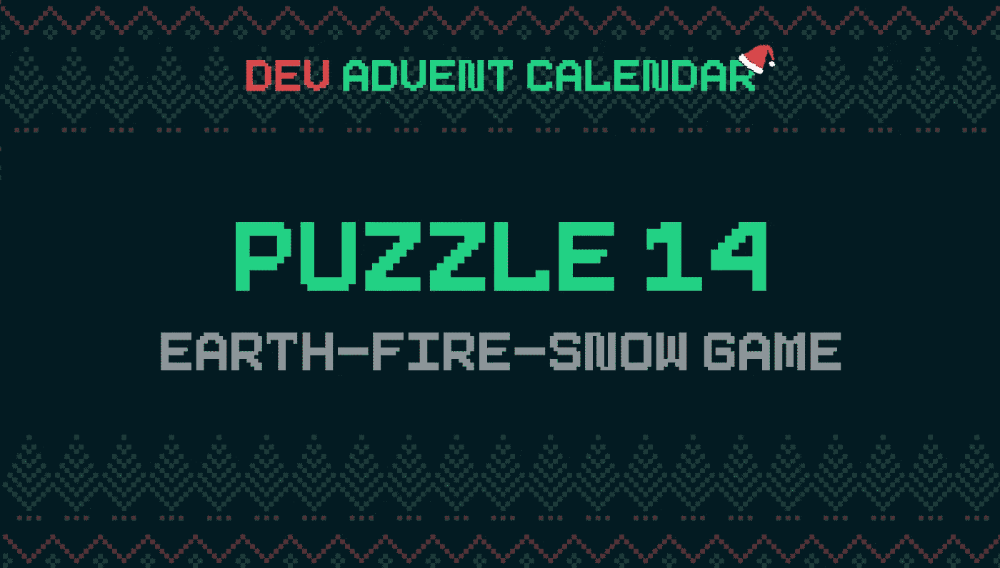
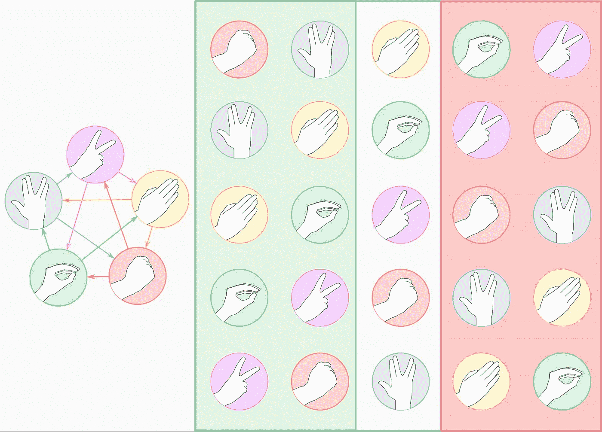

# 用 JavaScript 编写石头剪刀布的 7 种方法

> 原文：<https://betterprogramming.pub/7-ways-to-code-rock-paper-scissors-in-javascript-4189a5e7e535>

## 因为即使是一个简单的问题也能教会很多东西


由[马库斯·沃利斯](https://unsplash.com/@marcus_wallis?utm_source=medium&utm_medium=referral)在 [Unsplash](https://unsplash.com?utm_source=medium&utm_medium=referral) 上拍摄的照片

今天的谜题是 [Dev 降临节日历的第 14 号🎅](https://github.com/devadvent/puzzle-14)，是精灵版的石头剪刀布。虽然它是基于一个简单的游戏，但创建一个数字版本提出了一些有趣的问题。这是一个可以用不同方法解决的经典问题。有趣的是理解如何简化代码，使其可读，最重要的是创建一个可以随意扩展的版本。

# 谜题:土-火-雪游戏🌍🔥❄️又名石头剪刀布💎📜✂️



今天我有所不同。首先，我展示了我为竞赛提交的解决方案，然后我将报告我对我发现的各种备选方案的笔记。

让我们从代码开始:

处理这个问题的方式似乎有点奇怪。我决定不使用经典的`if...then...else`方法。我也不喜欢处理`switch`变体:网上有上千个这种类型的教程。然而，我确实发现了一个充满技巧的旧的 stackoverflow 线程。

这是一个有趣的建议，也是一个创造性解决方案的好例子。如果我们遵守游戏规则，我们会发现:

*   *土*熄灭*火* ( *石头*敲打*剪刀*)
*   *雪*盖*土* ( *纸*捶*石*)
*   *火*融*雪* ( *剪刀*击败*纸*)

如果我们把它们排成一行，我们会注意到一件有趣的事情:

```
Earth, Snow, Fire
Rock, Paper, Scissors
```

让我们以雪为例:雪打败了在他之前的元素，又被跟随他的元素打败。

我试着用一幅画来解释我自己，并玩了一个类似的游戏，但有更多的选择:石头-斯波克-布-蜥蜴-剪刀



作者图片

我将符号按顺序排列，为每个符号创建一个不同的数组。主符号在中间，击败所有在它之前的符号。相反，所有的符号都打败了他。

由于游戏的构建方式，数组元素的顺序总是相同的。这意味着一个构造良好的数组足以处理所有的规则。

我可以用类似下面这个的函数来表达这个概念:

这个功能不是我的包，是由[保罗·阿尔梅达](https://stackoverflow.com/users/1081569/paulo-almeida)设计的。他的想法是使用一个数的模来进一步推广代码。我也推荐阅读几年前的这篇文章:[负数的模](https://torstencurdt.com/tech/posts/modulo-of-negative-numbers/)。

# 用`if()`编码石头剪刀

这种推理并不是解决问题的唯一方法。指南和视频通常建议先简单后复杂。例如，Ania Kubów 制作的这个很长但做得很好的视频展示了 3 个经典解决方案

第一个解决方案，根据谜题的具体情况重新编写，大概是这样的:

我认为有可能更进一步，使代码更简单。我发现避免使用条件的代码可读性更强。即使只是从视觉的角度来看，我也更喜欢简化代码，将代码分割成更小的部分。

# 带`ifVal()`的密码石头剪刀

每个问题都可以分解成更小的部分。每一个重复的步骤都可以变成一个函数。该代码重复报告类似于以下内容的代码:

我可以把这个比特变成一个函数:

这样，我可以用更短、更易读的代码来管理所有石头剪刀布选项:

# 用`switch()`编码石头剪刀

Ania Kubów 提出的另一种方法是使用`switch`。这使得代码比之前的`if`序列更具可读性。

# 带`match()`的密码石头剪刀

我也可以改变这个例子。为此，我采纳了 Hajime Yamasaki Vukelic 的建议:

[](https://codeburst.io/alternative-to-javascripts-switch-statement-with-a-functional-twist-3f572787ba1c) [## 对 JavaScript 的 switch 语句进行了功能上的修改

### 通过 8 行简单的代码，我们得到了一个强大的、看起来很奇怪的 switch 语句的替代品，它包含了所有的…

codeburst.io](https://codeburst.io/alternative-to-javascripts-switch-statement-with-a-functional-twist-3f572787ba1c) 

我创建了`match()`函数:

然后我用它来管理规则和解决难题:

# 向裁判教授石头剪刀布的规则

到目前为止，我已经从一系列预定义和已知的规则开始着手解决这个问题。解决经典游戏功能就够了。但是我可以通过添加随意扩展规则的能力来让事情变得更有趣。

当然，第一个解决方案可以很容易地通过用规则修改数组来扩展。但是我想尝试一种不同的方法。我可以创建一个学习游戏规则的对象(在 JavaScript 中一切都是对象，甚至是函数),并有能力决定哪个玩家赢得了游戏。换句话说，我想为石头剪刀布创建一个简单的 AI 裁判。

我创建了`referee()`函数:

该功能应该能够学习规则并按需应用它:

我如何向裁判解释规则？嗯，有例子。例如，我可以说`learn`函数包含两个参数:第一个是获胜的符号，第二个是失败的符号。

显然，裁判必须有记忆力来保持他所学到的东西:

`learn()`法允许你教裁判规则。对于基本游戏，我得到:

这个物体作为裁判的记忆。我可以用它和`judge()`一起计算出两种符号组合中谁赢了:

如果我把所有的碎片连接起来，我会得到一个可以用于所有游戏的函数，类似于石头剪子布:

例如，我可以用以下方法解决这个难题:

或者经典版，比如:

# 使用 JavaScript 类实现石头剪刀布

显然，下一步是将函数转换成 JavaScript 类。概念大致相同，只是稍微改变了代码的语法:

我可以在我的解决方案中以类似的方式使用`Referee()`类:

嗯，就是这样。如我开头所说，用 JavaScript 做石头剪子布是一个简单的问题。嗯，就是这样。如我开头所说，使用 JavaScript for Sasso Carta Forbice 是一个简单的问题。然而，它对于学习更多关于 JavaScript 的许多方面是有用的。

感谢阅读！敬请关注更多内容。

***不要错过我的下一篇文章—报名参加我的*** [***中邮箱列表***](https://medium.com/subscribe/@el3um4s)

[](https://el3um4s.medium.com/membership) [## 通过我的推荐链接加入 Medium—Samuele

### 阅读萨缪尔的每一个故事(以及媒体上成千上万的其他作家)。不是中等会员？在这里加入一块…

el3um4s.medium.com](https://el3um4s.medium.com/membership) 

*原载于*[*https://blog.stranianelli.com*](https://blog.stranianelli.com/7-ways-to-code-rock-paper-scissors-in-javascript/)