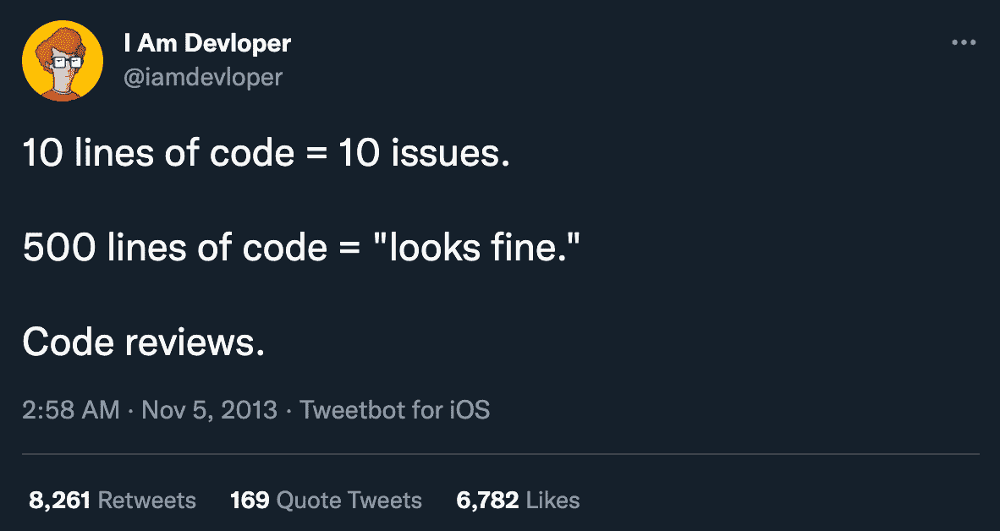
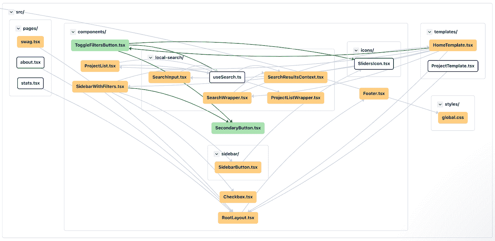

# 大幅减少代码审查时间的 7 种方法

> 原文：<https://betterprogramming.pub/7-ways-to-dramatically-reduce-your-time-in-code-review-febe05e9f38c>

## 代码审查可能是痛苦的，但也不一定如此

约翰·施诺布里奇在 [Unsplash](https://unsplash.com?utm_source=medium&utm_medium=referral) 上的照片

代码审查可能是痛苦的。软件工程师经常抱怨评审过程很慢，延迟了下游任务，并且当你在一个打开的拉式请求(PR)和下一个任务之间来回导航时，会导致上下文切换。代码审查也可能充满了吹毛求疵和吹毛求疵，这对每个参与的人来说都是一种糟糕的体验。

为了解决这个问题，一些工程师甚至建议我们完全摆脱拉请求和代码审查。虽然这可能适用于初创公司的小团队，但我不认为这是所有人的正确解决方案，尤其是企业级公司。

相反，对于代码作者和代码评审者来说，有很多方法可以让代码评审过程变得更好。让我们一起考虑其中的七个最佳实践。

# #1:保持较小的拉取请求

每个工程师都害怕审查修改了 1000 多行代码的 pull 请求。这些审查可能需要几个小时才能完成，通常最终发生的情况是审查者开始浏览代码，而不是仔细审查它。

【https://twitter.com/iamdevloper/status/397664295875805184】来源:

*解决方法是保持你的拉取请求较小。小的 PRs 更容易和更快地被评审，因为评审者不需要花费太多的时间来建立一个所有的变更如何一起工作的心智模型。也有更少的代码更改，这有望等同于更少的错误、更少的评论，以及作者和评审者之间更少的来回往返。*

*起初，保持你的 PRs 小似乎很难，但是如果你把工作分解成小任务并保持专注，这是可以做到的。不要在实现新功能或修复错误的同时进行大的重构。在代码中使用特性标志，这样你就可以将新特性的一小部分合并到主分支中，而不会出现在生产应用程序中。*

*保持你的 PRs 小。你的评论者会感激你的。*

# *#2:使用拉式请求模板*

*另一个烦恼是被要求在没有任何上下文的情况下检查一个拉请求。当一份公关没有任何解释就丢到你面前时，你经常会疑惑，“这份公关是干什么的？这解决了什么问题？这个有相关任务吗？为什么采取这种特殊的方法？”*

*一个[拉请求模板](https://levelup.gitconnected.com/managing-complexity-through-merge-request-templates-9a00cc9a5fb1)是一个小的、可配置的表单，您可以将其设置为每个新拉请求的默认文本。PR 模板提示代码作者为他们的 PR 提供相关的细节。通常情况下，PR 模板会要求您简要描述您所做的工作及其原因，任务单的链接，以及验证更改的测试计划。*

*好的 PR 模板通常还包括一个简短的清单，供代码作者查看，以确保他们没有遗漏任何基础知识。这个清单可能包括单元测试、文档、国际化、跨浏览器支持和可访问性等项目。*

*下面是我喜欢在所有回购中使用的拉动式请求模板示例:*

**

**拉式请求模板示例**

# *#3:实施响应时间 SLA*

*如果您发现拉动式请求未被审查的时间超过了您的期望，现在是一个很好的时机来设定团队对新拉动式请求的审查速度的期望。换句话说，在必须提货之前，采购订单可以存在的最长时间是多少？一个小时？两个小时？24 小时？你对这个问题的回答可能取决于你的团队的规模。对于来自您团队的内部拉动请求和来自其他团队的外部拉动请求，您可能会有不同的答案。*

*当选择响应时间 SLA(服务级别协议)时，您将希望找到正确的平衡。当你发布一个新的 PR 时，期望每个人都立即放下手头的工作来检查你的代码是不合理的，但是你也不希望 PR 连续几个小时都没有被检查。找到正确的平衡，让你的队友进入心流状态。他们应该能够编写自己的代码，然后在一天中的自然停止点审查 PRs。*

*就个人而言，我喜欢对内部团队 PRs 采用两小时响应时间 SLA，对外部团队 PRs 采用 24 小时响应时间 SLA。*

*不管你和你的队友做了什么决定，有一个团队协议可以让你们互相问责。如果每个人都同意一个特定的 SLA，而你的一个 pr 已经过了时间，你知道可以开始烦别人了。*

# *#4:培训初级和中级工程师*

*培训机会无处不在。指导经验不足的工程师不仅仅是教授他们正在使用的技术和语言。还包括教他们软技能，比如如何进行有效的代码审查。*

*告诉你的队友你在代码评审中寻找什么。帮助他们理解什么是重要的，什么是不重要的。教他们如何在他们的[代码评审评论](https://conventionalcomments.org)中有效地交流，比如在非阻塞建议前面加上“nit”*

*关于如何成为一个更有效的代码审查者，有很多很好的资源。谷歌的[代码审查开发者指南](https://google.github.io/eng-practices/review/)值得完整阅读。该指南对代码作者和代码评审者都有很好的建议。对于一个更厚脸皮的资源，[如何让你的代码审查员爱上你](https://mtlynch.io/code-review-love/)很容易成为开发人员创建拉请求的一些最好的(和有趣的)建议。*

# *#5:建立持续集成管道*

*当大部分注释都是诸如“缺少分号”或“这里似乎没有缩进”之类的东西时，代码审查就变得乏味了在代码评审期间，不要把时间花在代码格式化人员和代码移植人员可以帮你处理的事情上。让计算机自动处理琐碎的事情，这样你就可以专注于需要人工处理的重要事情。*

*对于 JavaScript 项目，为你的 repo 配置一个像[漂亮](https://prettier.io/)的格式化程序和一个像 [ESLint](https://eslint.org/) 的 linter 是很简单的。然后，您可以使用类似于 [Travis CI](https://travis-ci.org/) 、 [CircleCI](https://circleci.com/) 、 [GitHub Actions](https://github.com/features/actions) 或 [GitLab CI/CD](https://docs.gitlab.com/ee/ci/) 的工具为您的回购设置持续集成。*

*您的 CI 管道将为您运行这些格式化和林挺任务以及您的单元测试。如果 CI 管道在拉请求的任何一步失败，它将阻止该拉请求被合并。*

*现在您已经自动化了代码审查的几个重要部分，节省了您的时间。*

# *#6:使用拉动式请求审核应用程序*

*有时，不仅需要审查拉请求中的代码，还需要手动查看应用程序中的更改，以验证一切正常。对于安装步骤复杂的应用程序，下载别人的代码并在你的机器上本地运行可能需要五分钟到一个小时。真让人头疼！*

*[Pull request review apps](/how-to-create-pr-review-apps-with-render-fe5e78a073ae) 用于在创建新的 PR 时，自动将您的代码部署到短期测试环境中。这使得审阅者可以轻松地检查 UI 更改，而不必下载代码并在他们的机器上本地运行它。这不仅节省了时间，而且通过使它变得容易，它还促使评审者在他们的评审中更彻底。*

# *#7:生成图表来可视化您的代码变更*

*在 GitHub 或 GitLab 中查看代码时，文件通常按字母顺序显示。对于相对较小的 PRs，这可能不是问题。但是当一个 PR 中包含几十个文件时，有时将这些更改逻辑地组合在一起会很有帮助，这样您就可以看到它们在一个更大的画面中是如何组合在一起的。*

*[CodeSee Review Maps](https://www.codesee.io/code-reviews) 帮助您可视化哪些文件被更改，以及这些更改如何影响它们的上游和下游依赖关系。它们与 GitHub 集成，自动在你的 PR 上发布评论和图表。您甚至可以创建代码的交互式游览，以帮助指导您的代码审查人员。最重要的是，CodeSee 地图对开源组织及其公共存储库是免费的。*

**

**示例代码见地图**

# *结论:加速代码评审的最佳实践*

*总的来说，这里有七个技巧可以大大减少你的代码审查时间:*

1.  *保持较小的拉取请求。*
2.  *使用拉式请求模板提供审阅者需要的所有上下文。*
3.  *实施响应时间 SLA。*
4.  *对初级和中级工程师进行培训，让他们了解您在代码评审过程中寻找的关键内容。*
5.  *设置 CI 管道来运行 linters、formatters 和单元测试。*
6.  *使用拉式请求审查应用程序，以便您可以轻松检查 UI 更改。*
7.  *使用类似 CodeSee Review Maps 的工具生成图表来可视化您的代码更改。*

*感谢您的阅读，祝您编码愉快！*