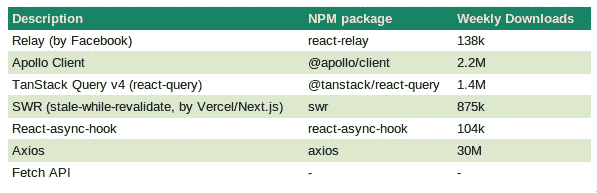
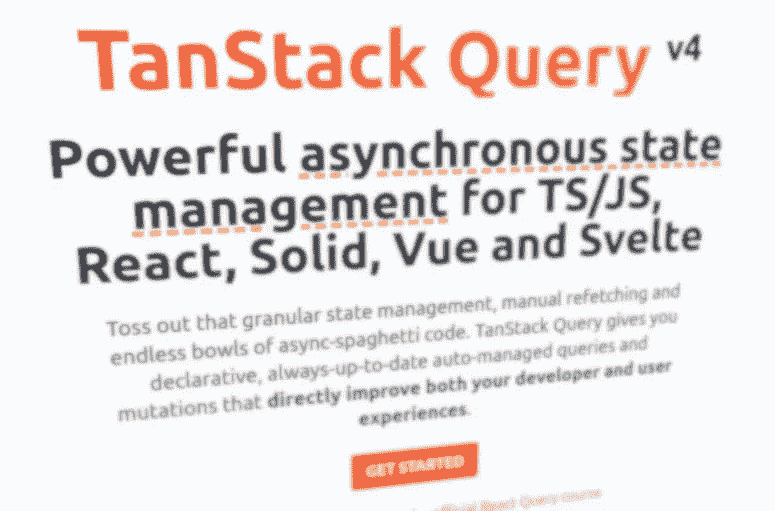
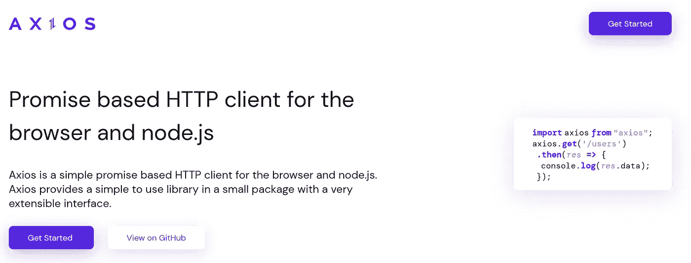

# 在 React 应用程序中获取数据的 7 种方法

> 原文：<https://betterprogramming.pub/7-ways-to-fetch-data-in-react-applications-11fb03c6f6e0>

## 如果没有合适的工具，数据获取和缓存很快就会变得繁琐和复杂

克里斯·安德拉沃斯在 [Unsplash](https://unsplash.com?utm_source=medium&utm_medium=referral) 上的照片

# 介绍

我们的 React 应用程序通常用于呈现数据集。创建组件并设计它们的样式是故事的一部分。但是我们的数据需要来自某个地方。在许多情况下，我们从 API 中获取数据——无论是我们自己的 API 还是第三方的 API。

这种数据获取有许多方面:缓存数据、错误处理、验证请求和重新获取陈旧数据，等等。

在过去几年中，许多解决方案似乎可以帮助我们完成上述任务:

我们将看到的七种流行工具。

让我们简要回顾一下这七个流行的工具，用一些样板代码展示每个解决方案在实践中是如何实现的。

你可以在我的 [**GitLab 资源库**](https://gitlab.com/gvanderput/gerard-fetching-methods) 中找到工作示例(每个示例都是不同的分支)。

> 注意:我们按照复杂程度的顺序来回顾它们。我们从一些更复杂和完整的工具开始，以更简单的工具结束。还要注意，我们完全忽略了代码示例中的错误处理，因此我们可以专注于核心功能。

照片由[马頔·索罗明](https://unsplash.com/es/@solomin_d?utm_source=medium&utm_medium=referral)在 [Unsplash](https://unsplash.com?utm_source=medium&utm_medium=referral) 上拍摄

# 1.继电器

Relay (第二个版本被称为“Relay Modern”)是一个高级框架，用于使用 React 和 GraphQL 构建数据驱动的应用程序，由脸书创建。

在最初的试验和实验之后，Relay Modern 于 2017 年 4 月 18 日[发布](https://engineering.fb.com/2017/04/18/web/relay-modern-simpler-faster-more-extensible/)，此前它已经由 [Greg Hurell](https://twitter.com/wincent) 和 [Joe Savona](https://twitter.com/en_js?lang=en) 以及其他几个人开发并重新组装。葛瑞格在他的部落格上写了一篇关于这个发展的背景故事。

这不是胆小的人的工具。在开始之前，它需要相当多的样板代码和设置。即使这些都到位了，如果你对此知之甚少，你还会留下许多问题和挑战。

也就是说，它非常强大，性能卓越。一个明显的例子是:Facebook.com 使用 Relay(以及自 2021 年以来对开发者更友好的[中继挂钩](https://relay.dev/blog/2021/03/09/introducing-relay-hooks/) [)。](https://developers.facebook.com/blog/post/2021/03/09/introducing-relay-hooks-improved-react-apis-relay/)

要开始，您需要定义一个通用的 fetch 函数，即所谓的中继环境，并且您需要运行中继编译器(最好是作为开发期间的监视进程)。GraphQL 模式也需要存储在您的存储库中(`[get-graphql-schema](https://www.npmjs.com/package/get-graphql-schema)`可能会派上用场)。

中继编译器在开发过程中监视变化。

# 2.阿波罗客户端

JavaScript 丛林中最难对付的动物的另一个有力竞争者是[Apollo Client](https://www.apollographql.com/docs/react/):*一个全面的 JavaScript 状态管理库，使您能够使用 GraphQL* 管理本地和远程数据。

在很小程度上，它与 Relay 相当(但要知道，也有很大的不同)。

这是我自己经常使用的一个库。对我来说，这个库的关键是它很好地完成了它的工作，并且高度可定制，但是你必须小心缓存策略。默认情况下，缓存似乎工作得很好——老实说，确实如此。但是一旦您的应用程序开始增长，并且您需要诸如分页或数据过滤之类的功能(例如，使用不同的变量多次运行相同的查询)，您可能会遇到必须定制缓存功能的情况。维持这种逻辑很快就变得相当困难。

与接力赛相比，它更容易准备和进行。您定义了一个客户端，通过一个专用的提供者使该客户端可用，然后您就可以开始工作了。但是不要低估在你满意之前你必须为定制你的设置付出的努力。

# 3.传递查询 v4(反应查询)

> 注意:TanStack 查询以前叫做`*react-query*`。他们[在 2022 年 7 月将](https://twitter.com/tannerlinsley/status/1549785943837515776)更名为 TanStack Query([来源](https://tanstack.com/blog/announcing-tanstack-query-v4))，并且他们很快就会有几个框架的适配器，比如 Vue、Svelte 和 Solid。在撰写本文时，唯一完成的适配器是 React 的一个实现，方便地称为`*React Query*`。

在我们转向不太复杂的库和工具之前，我们可以看看游戏中的另一个大玩家: [TanStack Query](https://tanstack.com/query/v4/docs/overview) 。微软、沃尔沃、易贝和优步等公司都使用它，如果我们忽略它，那就太愚蠢了。

它开箱即用，但高度可配置，并具有许多功能，如支持窗口焦点的重新提取、分页、预取、滚动恢复等等。

它需要少量的样板代码来运行。同样，就像我们刚刚看到的 Apollo Client 一样，我们需要创建一个客户端，让它对提供者可用，并且我们可以开始使用可用的钩子:

# 4.SWR

不如 Apollo Client 和 TanStack Query 流行，但绝对不是一个可以忽略的包:Vercel 的 [SWR](https://swr.vercel.app) (Vercel 是 Next.js 的创建者)。

与我们已经看过的其他三种解决方案相比，SWR 是最容易开始使用的。您只需导入并使用`useSWR`钩子通过自定义的、用户定义的 fetch 函数获取数据(在本例中我们使用的是本地 Fetch API):

不要被这一切的简单所迷惑。SWR 提供的钩子功能强大，支持分页、突变、预取和 SSR(服务器端呈现)。

# 5.反应异步挂钩

React-async-hook 是由 [Sébastien Lorber](https://twitter.com/sebastienlorber) (时事通讯`[thisweekinreact.com](https://thisweekinreact.com)`的作者)创建的一个微型库，它没有我们已经看到的功能更全的库使用得多。也就是说，比较它们是不公平的(主要的论点是 react-async-hook 没有内置的缓存支持——从设计上来说)。

[自述文件](https://github.com/slorber/react-async-hook)的第一行写道:

> "这个小小的图书馆只做一件事，而且做得很好."

尽管 readme 文件列出了几个特性，但归结起来就是:这个库非常擅长获取数据(使用提供的`useAsync`钩子)。

您可以取消请求、触发重新提取、处理突变和竞争情况，等等。如您所见，这完全取决于请求获取数据。作者还认为库功能是完整的，这意味着没有积极的开发(改变实际代码的最近一次提交是在 2021 年 9 月[)。](https://github.com/slorber/react-async-hook/commit/51a02e20df0b0e91d550dd8f599405f00a2a06f2)

但是考虑到偶尔对 readme 文件的小规模提交，Sébastien 似乎会密切关注它。

类似于 SWR，使用 react-async-hook 很容易。代码如下:

# 6.Axios

每周下载量超过 3000 万次。)，我们可以有把握地得出结论，Axios 是一个功能强大的小工具，它的工作做得非常好。许多流行的库都依赖 Axios。

> " Axios 是一个简单的基于 promise 的 HTTP 客户端，用于浏览器和 node.js . "

换句话说，我们可以用它来(高度)配置和发出 HTTP 请求。它与我们上面看到的功能更全的库配合得很好，这些库要求我们提供自己的获取功能(比如 TanStack 查询和 SWR)。如果您需要对 HTTP 请求进行细粒度的控制，这是绝对必要的。

如果您已经有一段时间了，您可能还记得使用 jQuery 的`$.ajax()`函数来发出异步的" [Ajax](https://en.wikipedia.org/wiki/Ajax_(programming)) "请求是很常见的。在某种程度上，我们可以将 Axios 与 jQuery 的`ajax()`函数进行比较(但我不认为我对 Axios 的这种说法公正)。

请注意，Axios 是非常原始和裸露的。对于 React 应用程序中的数据获取，它不是一个成熟的解决方案。但是它可以补充像 TanStack Query 和 SWR 这样的库，这样你就有了一个完整的数据流解决方案。

假设您是 React 新手，对数据获取没有太多经验。在这种情况下，我建议在使用更复杂的功能之前，先试用一下 Axios(或者 Fetch API，见下一章),以便更好地理解正在发生的事情。

用 Axios 获取数据的一个非常简单的例子:

# 7.获取 API

最后但同样重要的是，我们应该提到[获取 API](https://developer.mozilla.org/en-US/docs/Web/API/Fetch_API) ，几乎所有主流浏览器都支持它。随着 2022 年 4 月 Node.js 18 的发布，默认情况下会启用一个全局`fetch`功能(尽管他们在[公告](https://nodejs.org/en/blog/announcements/v18-release-announce/)中称之为实验性功能)，用于 Node.js 驱动的后端环境。

Fetch API 是发出 HTTP 请求的现代答案。但是要记住它是一个相当低级的 API。你可以用它提出请求，但仅此而已。对于您的应用程序来说，这不是一个完整的解决方案(请注意在这方面与 Axios 的相似性)。

所以，Fetch API 和 Axios 在很多方面都很相似。注意，如果您的应用程序需要向后兼容旧的浏览器，建议使用 Axios(或者 Fetch API 的 polyfill)。

# 最后的话

对于大多数应用程序来说，从服务器获取数据并拥有本地数据(状态)和缓存策略是必不可少的。幸运的是，多年来已经开发出了几种解决方案，为我们省去了许多麻烦。

我写了一篇关于你应该知道的七个流行工具和库的短文。但是，如果您想成为一名优秀的(React)开发人员，您应该首先致力于很好地理解数据获取和缓存的“幕后”情况。

记住，你可以在我的 [**GitLab 资源库**](https://gitlab.com/gvanderput/gerard-fetching-methods) 中找到所有工作示例(每个示例都是不同的分支)。

感谢您的宝贵时间！

杰勒德