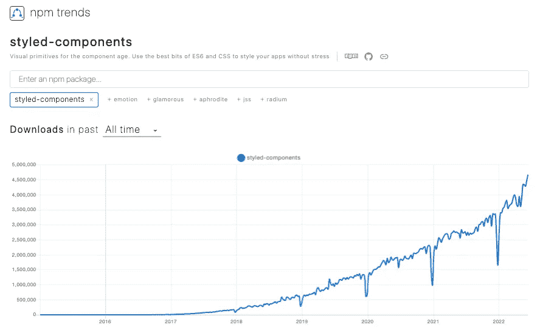
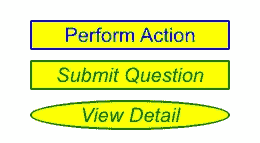
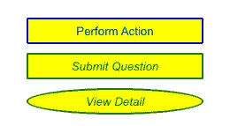
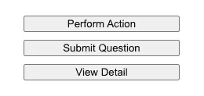
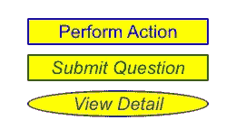

# 使用样式组件继承样式的 7 种方法

> 原文：<https://betterprogramming.pub/7-ways-to-inherit-styles-using-styled-components-69debaad97e3>

## 深入了解样式组件编码技术



作者图片

是一个流行的 React 应用程序风格库，每周下载量超过 400 万次。它采用 CSS-in-JS 方法，将每个 JavaScript 组件与其所有的 CSS 规则和依赖项捆绑在一起。结合代码分割，它只加载最少的必要代码。

在`styled-components`中，CSS 样式被写成自定义的 React 组件。在编译期间，很容易跟踪哪些组件是未使用的或未定义的。它通过比较类名或其他方式来提高代码的可管理性。因为它是 JavaScript 中的 CSS，所以它支持具有编程能力的动态样式。

在之前的一篇文章中，我们已经介绍了什么是`styled-components`以及如何使用它。我们已经使用`styled-components`很多年了，并且经常从现有的组件中创建扩展的组件。在本文中，我们将探讨如何使用样式化组件来继承/共享样式。

*   [在父级配置共享样式](#8411)
*   [为应用程序创建全局样式](#af15)
*   [使用扩展样式组件](#f5ce)
*   [使用合成的 CSS 道具](#6eec)
*   [使用插值函数计算样式值](#56a7)
*   [使用插值函数计算 CSS 属性](#07f8)
*   [用样式对象创建样式组件](#8408)

# 在 Create React 应用程序中设置样式组件

我们使用[创建 React App](/an-in-depth-guide-for-create-react-app-5-cra-5-b94b03c233f2) 作为探索`styled-components`的基础。以下命令创建一个 React 项目:

```
% npx create-react-app react-styled-components
% cd react-styled-components
```

设置`styled-components`:

```
npm i styled-components
```

`styled-components`成为`package.json`中`[dependencies](/package-jsons-dependencies-in-depth-a1f0637a3129)`的一部分:

我们修改`src/App.js`来使用`styled-components`。

*   在第 1 行，`styled`是从`styled-components`导入的。`styled`是默认的导出，用于创建`styled.tagname`助手方法，将样式从 JavaScript 转换为实际的 CSS 规则。
*   在第 3–8 行，样式化的组件`Container`扩展了`div`的样式。它包含了`flex`布局的 CSS 属性。
*   在第 10–23 行，样式化组件`BlueItem`扩展了`div`的样式。它包含蓝色组件的 CSS 属性。
*   在第 25–38 行，样式化组件`GreenItem`扩展了`div`的样式。它包含绿色组件的 CSS 属性。
*   在第 40–53 行，样式化组件`OvalItem`扩展了`div`的样式。它包含 oval 组件的 CSS 属性。
*   这些样式化的组件用于构建 React 应用程序，位于第 57–61 行。
*   执行`npm start`，我们在浏览器中看到如下 UI。



作者图片

代码有效。但是，`BlueItem`、`GreenItem`和`OvalItem`之间有许多重复的属性。

我们应该努力继承/分享相似的风格。

# 在父级配置共享样式

默认情况下，或者通过将值设置为`inherit`，一些 CSS 属性可以被子元素继承。[该 CSS 属性列表](https://www.w3.org/TR/CSS21/propidx.html)显示默认情况下会继承以下属性:`azimuth`、`border-collapse`、`border-spacing`、 `caption-side`、`color`、`cursor`、`direction`、`elevation`、`empty-cells`、`font-family`、`font-size`、`font-style`、`font-variant`、`font-weight`、`font`、`letter-spacing`、`line-height`、`list-style-image`、`list-style-position`、`list-style-type`、`list-style`、`orphans`、`orphans`

在我们复制的属性中，`font`属性是默认继承的。它可以向上移动到父节点`Container`，以节省几行代码(下面代码中的第 6 行):

执行`npm start`，有效。

现在，我们修改这些条目，从`button`扩展，而不是`div`(下面代码中的第 1、15 和 29 行):

执行`npm start`。不再继承`font`属性。



作者图片

这是因为大多数表单元素，如`button`、`input`、`textarea`和`select`，默认情况下不继承`font*`属性。

幸运的是，有一个`as`属性可以呈现一个样式化的组件，就像它是指定的元素一样。如果我们在下面代码的第 56、57 和 58 行指定`button` `as` `div`，它将正常工作:

如果没有`as`属性，我们必须显式地将`font`属性设置为`inherit`。

下面的代码也可以，在第 12、23 和 34 行将`font`属性设置为`inherit`。同样，对于一个按钮，不需要指定这些属性:`display`、`align-items`、`justify-content`和`box-sizing`。

# 为应用程序创建全局样式

有一个助手功能`createGlobalStyle`，可以为整个 app 创建最顶层的共享样式。

这里是`src/App.js`:

*   在第 1 行，`createGlobalStyle`和`styled`一起被导入。
*   在第 52–54 行，`GlobalStyle`是用助手函数`createGlobalStyle`生成的。全局上，`font`设置为`20px Arial`。
*   在第 58 行，为应用程序设置了`GlobalStyle`。
*   执行`npm start`，有效。

如果我们从`button`开始修改扩展项，所有的问题和解决方法都和在父级配置共享样式一样。唯一的区别是 global 是整个应用程序的最高父级。

# **使用扩展样式的组件**

对于我们的例子，三个项目彼此略有不同。我们可以从现有的扩展新的，并且只指定变化。

这里是`src/App.js`:

*   在第 21–25 行，样式化组件`GreenItem`用附加属性扩展了`BlueItem`。
*   在第 27–29 行，样式化的组件`OvalItem`，用一个附加属性扩展了`GreenItem`。
*   执行`npm start`，它起作用了。

为了更好的设计，我们应该定义一个`BaseItem`，它只包含常见的样式。然后，`BlueItem`、`GreenItem`、`OvalItem`从`BaseItem`开始延伸。

我们没有以“正确的方式”做这件事有两个原因:

1.  展示子样式组件可以覆盖基本样式。
2.  用更少的组件保存一些代码行。

# 使用合成的 CSS 道具

我们可以组合`css`道具来实现相同的风格，而不是扩展样式化的组件。有一个助手函数`css`，它通过插值从[模板文字](/manipulating-javascript-strings-using-template-literals-f7070412099f)生成 CSS 属性。

这里是`src/App.js`:

*   在第 1 行，`css`和`styled`一起被导入。
*   在第 10–19 行，css 模板文本`blueItem`生成在第 34 行使用的 CSS 属性。
*   在第 21–25 行，css 模板文本`greenItem`生成额外的 CSS 属性。`blueItem`和`greenItem`在第 35 行组合使用。
*   在第 27–29 行，css 模板文本`ovalItem`生成额外的 CSS 属性。`blueItem`、`greenItem`和`ovalItem`在第 36 行组成并使用。
*   执行`npm start`，它不能正常工作。



作者图片

发生了什么事？

`css`道具不是`button`的属性。为了让它工作，需要使用`[babel-plugin-styled-components](https://github.com/styled-components/babel-plugin-styled-components)`将任何带有`css`的元素转换成样式化的组件。

`styled-components`安装后，`babel-plugin-styled-components`和`[babel-plugin-macros](https://github.com/kentcdodds/babel-plugin-macros)`在`package-lock.json`中自带。

我们需要做的就是从宏目录中导入项目:

```
import styled, { css, keyframes } from 'styled-components**/macro**';
```

想用`babel-plugin-styled-components`试试另一种解决方案吗？

执行`npm run eject`，将 Babel 插件(下面代码中的第 5 行)添加到弹出的`package.json`。

无论哪种方式，它都像预期的那样工作。


作者图片

或者，可以在模板文字中完成合成(下面代码中的第 22 行和第 29 行):

# 使用插值函数计算样式值

我们可以传递一个函数来插入样式化组件的模板文本，并用它来计算样式值。

有多种方法来定义插值属性。下面是一个将道具设置为`fontStyle`、`color`和`borderRadius`的例子:

*   在第 10–19 行，样式化的组件`Item`使用道具`fontStyle`、 `color`和`borderRadius`。`font-style`(第 14 行)`color`(第 15 行)`border`(第 17 行)`border-radius`(第 18 行)根据道具调整数值。
*   执行`npm start`，工作。

下面是一个将道具设置为`itemType`的例子:

*   在第 10–21 行，样式组件`Item`使用道具`itemType`。`font-style`(第 14-25 行)`color`(第 16 行)`border`(第 18-19 行)`border-radius`(第 20 行)根据`itemType`调整数值。
*   执行`npm start`，有效。

# 使用插值函数计算 CSS 属性

在上面的代码中，我们对`color`进行了如下配置:

如果我们想让`ovalItem`成为`purple`呢？多重三元运算会使代码难以阅读。

助手函数`css`，可以用来计算 CSS 道具。

这里是`src/App.js`:

*   在第 1 行，`css`和`styled`一起被导入。

我们没有使用函数来生成每个属性值，而是使用它来计算 CSS 属性(第 17–22 行、第 24–29 行和第 31–36 行)。

执行`npm start`，我们会在浏览器中看到如下界面。



作者图片

或者，可以使用`css`助手在外部定义`interpolate`函数(下面代码中的第 10–33 行)。

# 使用样式对象创建样式组件

`styled-components`可选地支持将 CSS 写成 JavaScript 对象，而不是字符串。这使得操纵对象变得简单而有用。

这里是`src/App.js`:

*   在第 10–19 行，定义了样式化对象`blueItemObject`。
*   在第 21 行，样式化的组件`BlueItem`是从`blueItemObject`创建的。
*   在第 23–28 行，样式化的对象`greenItemObject`由`blueItemObject`和附加道具定义。
*   在第 30 行，样式化的组件`GreenItem`是从`greenItemObject`创建的。
*   在第 32–37 行，样式化的对象`ovalItemObject`由`greenItemObject`和附加道具定义。
*   在第 39 行，样式化的组件`OvalItem`是从`ovalItemObject`创建的。
*   执行`npm start`，工作正常。

# 结论

`styled-components`是一个流行的库，用于设计 React 应用程序。它被 React 项目广泛采用。通常，需要创建从现有组件扩展而来的组件。我们已经探讨了如何使用样式化组件继承/共享样式的七种方式。

感谢阅读。

希望有些方法对你的项目有用。

如果你有兴趣，看看[其他风格的组件文章](https://jenniferfubook.medium.com/jennifer-fus-web-development-publications-1a887e4454af#266e)。