# 让你的新 Python 技能更上一层楼的 7 种方法

> 原文：<https://betterprogramming.pub/7-ways-to-take-your-new-python-skills-to-the-next-level-1698335844bd>

## 将把你推向正确方向的项目


照片由 [Unsplash](https://unsplash.com?utm_source=medium&utm_medium=referral) 上的[尼克·费因斯](https://unsplash.com/@jannerboy62?utm_source=medium&utm_medium=referral)拍摄

*免责声明:本文中没有链接是附属链接*

在我尝试学习 Python 的最初几次，我不知道如何使用我的新技能。因此，他们慢慢地死去了。2019 年我能够投入更多的时间从头开始学习 Python。这一次我能够看到这种新语言的潜力。

很难看出你如何能很好地运用你的新知识。

所以，你可以拆分单词或者从列表中选择一个项目…太好了，现在你可以用它来做什么呢？

这些是你可能会问自己的问题，但是当你开始做项目时，答案会自动出现，而不是试图在一些随机的事情上使用你的技能。

**今天，我们将看看您可以使用新获得的 Python 知识的七种方式。**

1.  编码挑战
2.  数据和统计
3.  Web 开发
4.  图形用户界面(GUI)
5.  实用管道开发，Python 脚本
6.  机器学习
7.  网页抓取和网页自动化

# 1.编码挑战

如果你在谷歌上搜索“Python 挑战”，有很多页面可以让你挑战自己。你不仅可以使用你的 Python 技能，还可以提高你解决问题的技能——这比你的 Python 技能更重要。

有许多方法可以进一步发展你的技能。编程的很大一部分是解决问题，编码挑战会训练你。你不仅要练习解决问题，还要让代码运行起来。

## 代码战争

如果你在 [codewars](https://www.codewars.com/) 创建一个账号，你就可以浏览各种挑战。

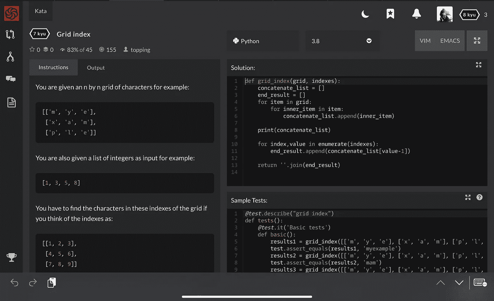

codewars 截图，作者

## Python 测试

如果您希望测试您的一般 Python 知识，包括理论，请看一下[the Python quick](https://www.thepythonquiz.com)。

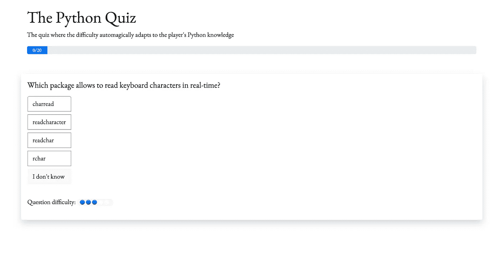

在 Python 测试中，你将面临代码和理论的挑战。(作者截图)

输入答案后，系统会提示您正确的答案、主题信息和进一步阅读的资源。

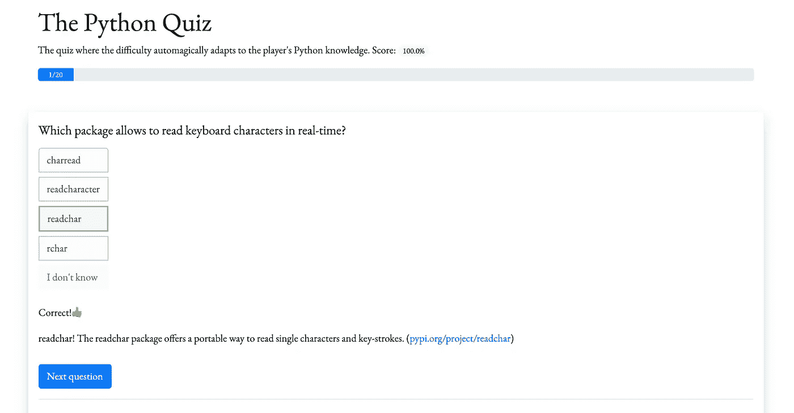

无论对错，你都有机会进一步了解该主题，作者截图

## 假(或真)编码工作面试

另一种测试你技能的方法，也是我在过去一个月里越来越喜欢的方法，是和编程面试或模拟面试一起写代码。YouTube 上有很多视频带你浏览面试，问题也很棒。你的大脑会感谢你的。

让我们看看下面的例子:

[如何:在谷歌工作——示例编码/工程面试](https://www.youtube.com/watch?v=XKu_SEDAykw&app=desktop)

**他们在视频里问的是:**

给定一个`list`和一个`sum_number`，检查列表中的两个项目加在一起是否等于`sum_number`。

```
assert func([1,2,3,4] , 7) == True
assert func([1,1,1,1] , 9) == False
```

以下是我在观看解决方案之前的思考过程:

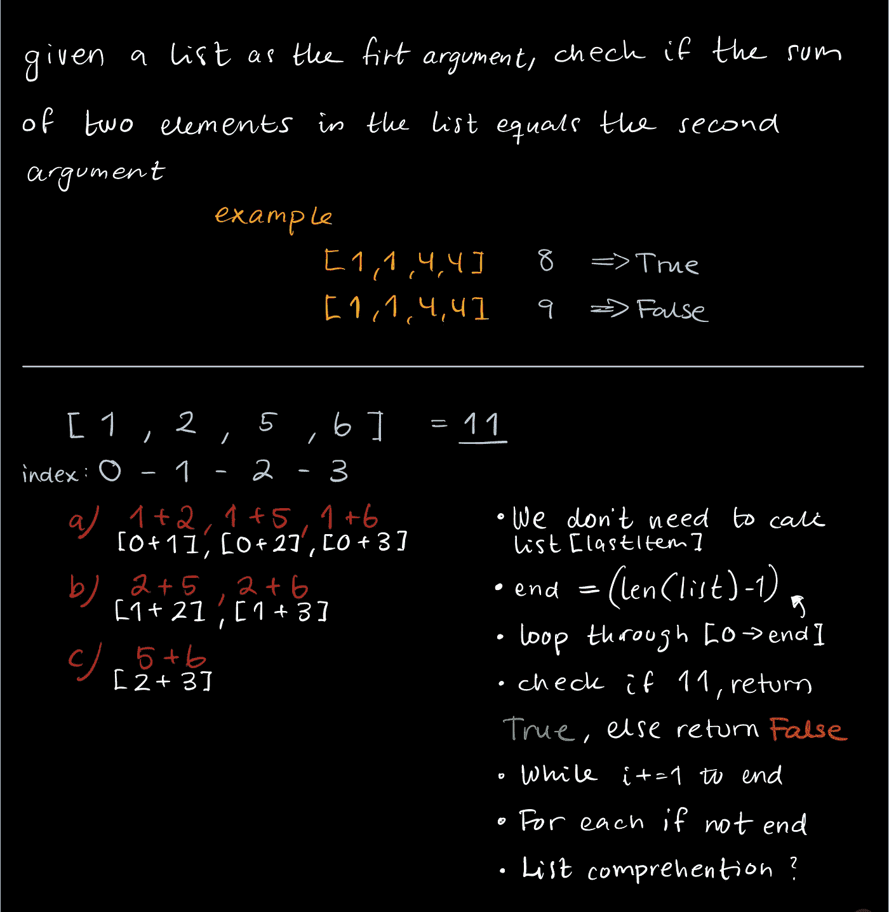

这是我的代码:

然后看完视频就觉得自己是个彻头彻尾的傻逼，学点东西。

即使谷歌工程师用的是 C++，我也是这样把它转移到 Python 上的:

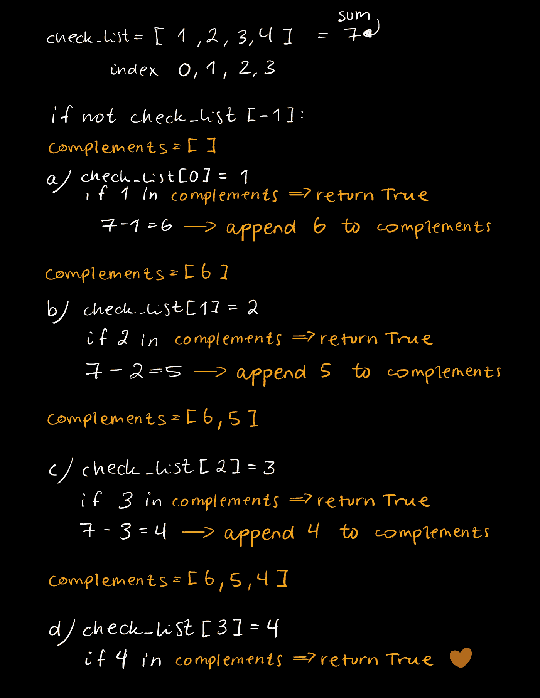

代码是:

解决一个问题总有几种方法。重要的部分是考虑如何解决它，并最终将其添加到代码中。

Clément Mihailescu 在他的 YouTube 频道上有几个带有虚假采访的视频，它们非常有趣。跟随他们中的一些人。我喜欢他用蒂姆和第二线程做的那些。

# 2.数据分析

Python 是数据科学家的流行语言。难怪人们喜欢它，当我们有这样一个工具箱。

如果你想开始从事数据科学，看看 [Jupyter 笔记本](https://jupyter.org)。最简单的入门方法是安装 [Anaconda](https://www.anaconda.com) 。您可以从 Anaconda 启动器中启动 Jupyter 以及其他各种工具。

您想了解的其他有趣的图书馆有:

*   [matplotlib](https://matplotlib.org)
*   [seaborn](http://seaborn.pydata.org/index.html)
*   [NumPy](https://numpy.org)
*   [熊猫](https://pandas.pydata.org)

使用 Jupyter，您可以快速可视化您的数据。让我们看一个简单的例子，我们有两个孩子的一些数据，亨利和安吉拉。如果你有孩子，应该很容易认出谁是长子。

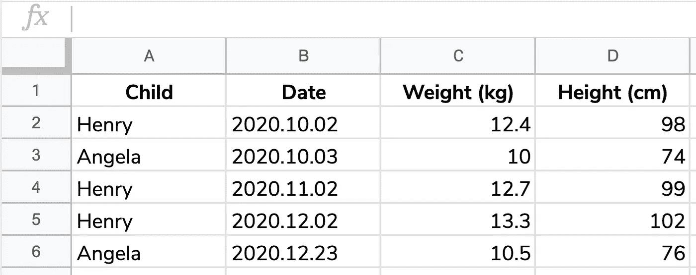

初始干净数据

此表导出为 CSV 文件，我们将用于进一步开发:

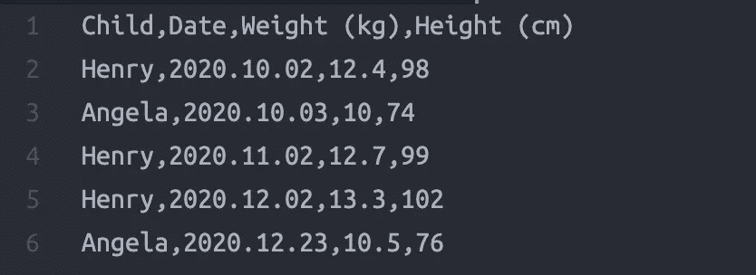

数据的 CSV 表示

通过熊猫，我们可以利用这些数据:

```
import pandas as pddata = pd.read_csv('child_data.csv')data.head()
```

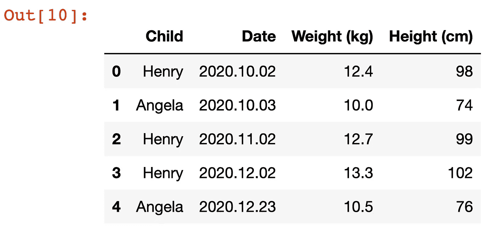

我们 CSV 文件中的所有数据

如果我们只想看到亨利的数据，我们可以使用熊猫的内置过滤器。

```
import pandas as pddata = pd.read_csv('child_data.csv')
data.loc[data['Child'] == 'Henry']
```

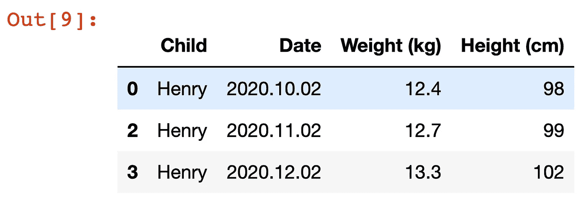

按孩子排序的数据，亨利

## 视觉表现

如果我们将 matplotlib 添加到这个组合中，我们就有了多种选择。我想看看代表亨利体重数据的图表。

```
import pandas as pd
import matplotlib.pyplot as pltdata = pd.read_csv('child_data.csv')henry_sort = data.loc[data['Child'] == 'Henry']
henry_dates_x, henry_weight_y = henry_sort['Date'] , henry_sort['Weight (kg)']plt.plot(henry_dates_x , henry_weight_y)
plt.suptitle('Henry\'s Weight' , fontsize=20)
plt.xlabel('DATE', fontsize=12)
plt.ylabel('Weight (kg)', fontsize=12)
```

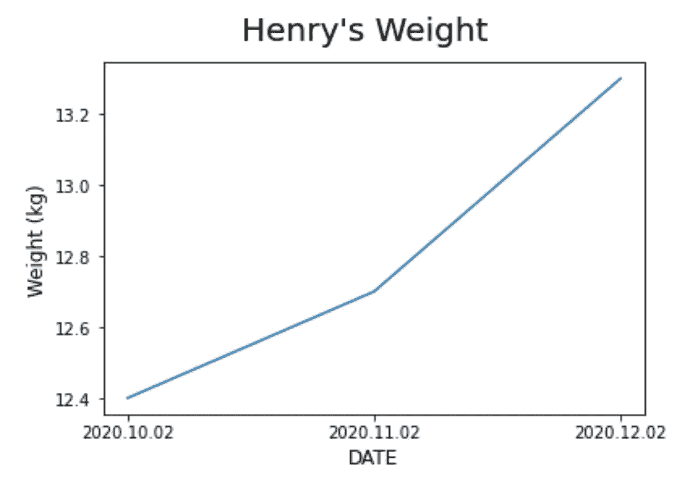

这是熊猫和 matplotlib 用法的一个最简单的例子。阅读文档以更好地理解可能性。

# 3.Web 开发

Python 也可以用于 web 开发。人们可能会想到 CSS、JavaScript 和 HTML，但是有几种方法可以使用 Python 进行 web 开发。

Instagram、Pinterest、国家地理都用 Django。( [DjangoProject](https://www.djangoproject.com/start/overview/)


照片由来自 [Pexels](https://www.pexels.com/photo/information-sign-on-shelf-251225/?utm_content=attributionCopyText&utm_medium=referral&utm_source=pexels) 的 [Tranmautritam](https://www.pexels.com/@tranmautritam?utm_content=attributionCopyText&utm_medium=referral&utm_source=pexels) 拍摄

您想了解的主要框架是 Django、Flask 和 Pyramid:

*   姜戈
*   [烧瓶](https://flask.palletsprojects.com/en/1.1.x/)
*   [金字塔](https://trypyramid.com/)

如果你想更深入地研究这些框架，我推荐你去看看科里·斯查费的 YouTube 频道，那里有关于 Flask 和 Django 的系列教程。

# 4.创建图形用户界面

可能你学 Python 的时候短暂接触过 [Tkinter](https://wiki.python.org/moin/TkInter) 。Tkinter 是 Python 的标配。您可以通过导入立即开始使用它。

```
from tkinter import *window = Tk()window.title('World\'s Best Window Title')lbl = Label(window, text='Watch out for the button below!')
btn = Button(window, text='Press Me')lbl.pack()
btn.pack()window.mainloop()
```

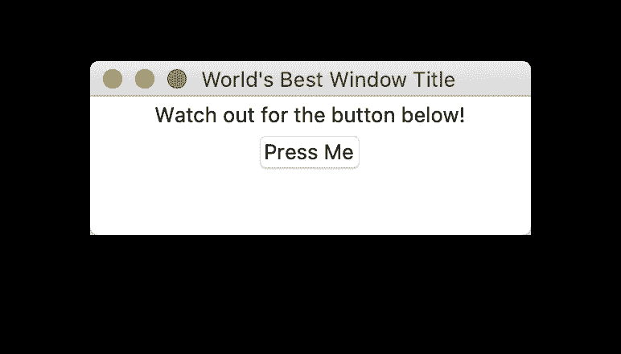

如果您想尝试使用其他库来用 Python 创建 GUI，这里有一些选项:

*   [基维](https://kivy.org/#home)
*   [PyQt](https://www.riverbankcomputing.com/software/pyqt/)
*   PySimpleGUI
*   [WXPython](https://www.wxpython.org)

# 5.Python 脚本帮助您的管道

如果你关注我，你可能已经读过我的一些实用 Python 故事，比如“[启动你的日常工作](https://medium.com/better-programming/how-to-use-python-to-power-up-your-day-job-c6cd835a7c92)”或者“[在你的墙上挂照片](https://medium.com/better-programming/use-python-to-hang-your-picture-frames-on-your-wall-469123becd5b)”

Python 不一定要宏大厚重。它可以用来帮助自动化您的任务。创建小代码片段来帮助你完成某些任务通常被称为*脚本*。

想象一下，如果你能够在一个小时内将 100 小时的工作量减少到 10 小时，你将为你的工作场所增加多少价值。你刚减了 89 小时的工作。那是两个多星期。跑去跟老板说(或者不去，花 89 个小时多读点 Python 教程)。

典型的任务包括一些文件或文件夹处理、电子表格工作、电子邮件或输入输出。确保你玩的是:

*   [路径库](https://docs.python.org/3/library/pathlib.html)
*   [操作系统](https://docs.python.org/3/library/os.html)

习惯使用文件和文件夹。

一些服务提供了 API，因此您可以使用它们的系统创建程序。他们可以打开一个充满可能性的新世界。例如，你可以使用谷歌的 API 来处理谷歌表单。

其他有趣的 API:

*   [Spotify](https://spotipy.readthedocs.io/en/2.16.0/)(Spotify)
*   [像素](https://www.pexels.com/api/)

不要忘记，很多软件已经集成了 Python 支持。我正在使用 Autodesk 的软件，在我们的管道中我已经使用 Python 很多年了。

想象一下可能性…


照片由 [Pixabay](https://www.pexels.com/@pixabay?utm_content=attributionCopyText&utm_medium=referral&utm_source=pexels) 从[像素](https://www.pexels.com/photo/architecture-black-and-white-challenge-chance-277593/?utm_content=attributionCopyText&utm_medium=referral&utm_source=pexels)拍摄

# 6.机器学习

你每天都在使用实现了机器学习的产品。你的垃圾邮件文件夹很可能是机器学习运行的。

> "机器学习是对通过经验自动改进的计算机算法的研究."—维基百科

训练数据用于教会算法自己做出预测或决策。

在讨论 Python 的时候，机器学习永远是一个热门话题。你可能已经看过的一些有趣的项目都与人脸识别或车牌识别有关。

[真蟒蛇——人脸识别](https://realpython.com/face-recognition-with-python/)

[车牌识别](https://medium.com/programming-fever/license-plate-recognition-using-opencv-python-7611f85cdd6c)通过[硒](https://medium.com/u/f3e356f23fea#introduction)

使用 web 自动化时，您还需要一个 web 驱动程序。以下是一些最流行的浏览器的 web 驱动程序链接:

*   [谷歌浏览器](https://sites.google.com/a/chromium.org/chromedriver/downloads)
*   [MS 边缘](https://developer.microsoft.com/en-us/microsoft-edge/tools/webdriver/)
*   [火狐](https://github.com/mozilla/geckodriver/releases)
*   [狩猎之旅](https://webkit.org/blog/6900/webdriver-support-in-safari-10/)
*   [戏曲](https://github.com/operasoftware/operachromiumdriver)

有大量关于 web 自动化的教程。我建议通过蒂姆的视频来了解一下[技术，让你开始学习](https://www.youtube.com/watch?v=Xjv1sY630Uc&list=PLzMcBGfZo4-n40rB1XaJ0ak1bemvlqumQ)

# 最后的想法

当你学习一门新的语言时，你才刚刚开始你的旅程。事实是，你没有学会一门语言——你学会了基础，并被给予了更深理解的垫脚石。你知道如何说你的母语，但你不知道所有的单词，也不知道所有的语法。但是，你每天都用它来完成任务。

当你拥有了这个基础，你就能够开始你的旅程。现在，你要学习的下一个技能是寻找机会。我能用这种语言做什么？我能怎么做呢？很难找到能利用你的新技能的项目。

我希望这篇文章能够把你推向正确的方向。当你使用语言并在此基础上发展时，语言会变得更有趣。所以，拿起咖啡和键盘，开始吧。