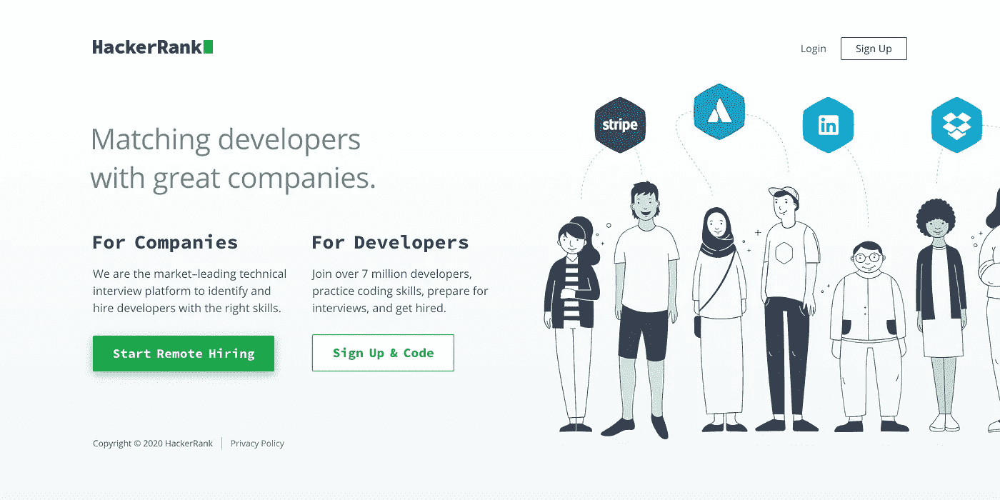
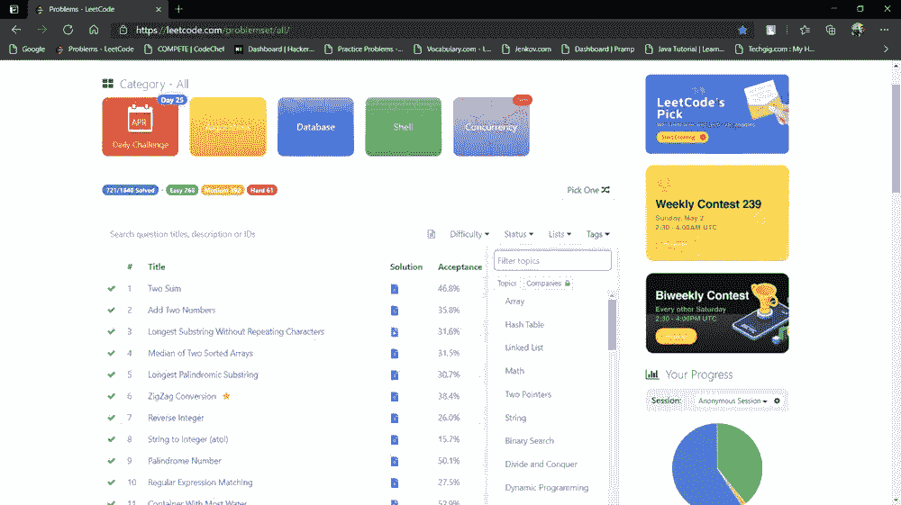
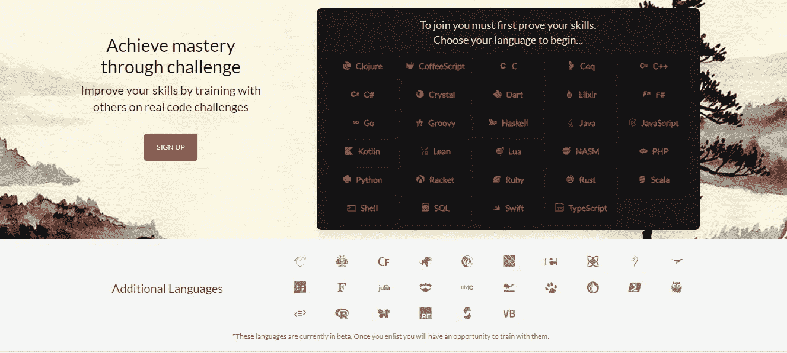
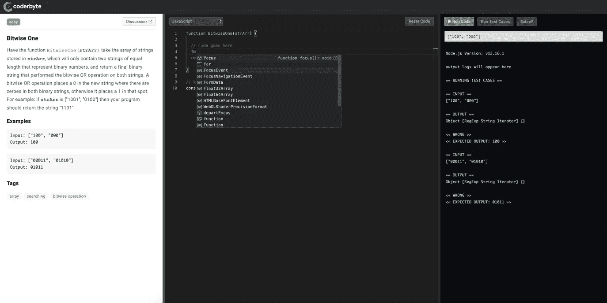
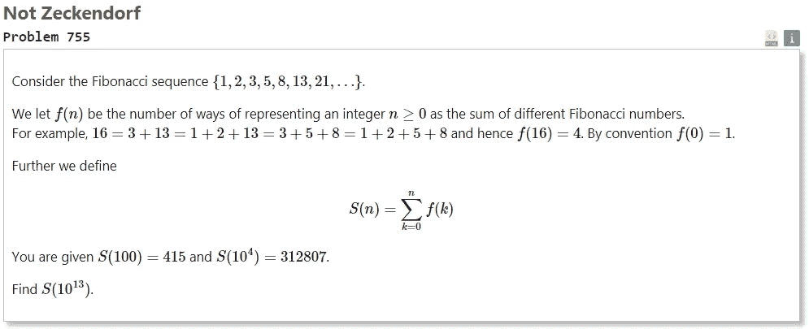
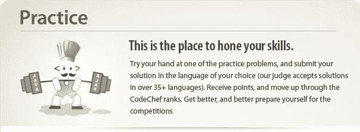
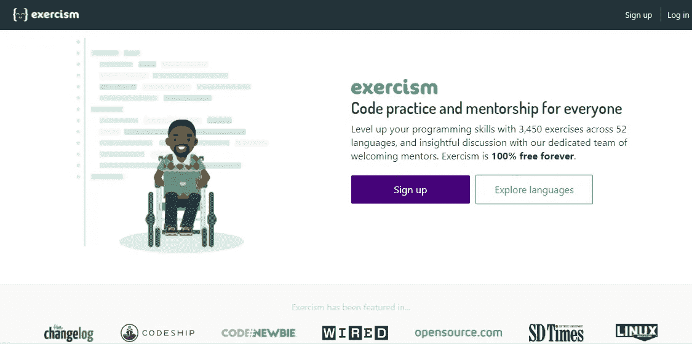

# 帮助你破解下一次编码面试的 7 个网站

> 原文：<https://betterprogramming.pub/7-websites-to-help-crack-your-next-coding-interview-af3f17ad8d92>

## 通过实践来学习、训练和提高自己

照片由 [Pexels](https://www.pexels.com/photo/man-using-3-computers-4974914/?utm_content=attributionCopyText&utm_medium=referral&utm_source=pexels) 的 [olia danilevich](https://www.pexels.com/@olia-danilevich?utm_content=attributionCopyText&utm_medium=referral&utm_source=pexels) 拍摄。

面试前温习一下我们的技能是非常重要的，因为我们需要再次回忆基础知识。无论您是编程初学者还是专业人士，这些网站都将帮助您将编程提升到一个新的水平。挑战将帮助你成长，并在成长的过程中学习新的算法和概念。

下面是我希望在第一次面试前就知道的编码挑战网站列表。

# 1.黑客银行

来源:[黑客排名](https://www.hackerrank.com/dashboard)

近 700 万开发人员使用 HackerRank 来练习不同挑战的编码。这是练习你的软件技能，准备面试，或者简单地复习你的技能的最好的网站之一。

你可以练习不同的技能，比如数据结构、算法、C、Python、AI、数据库、C++、Java、函数式编程等等。甚至可以参加各种域的 HackerRank 认证考试。你也可以提交面试申请，解决基于公司的挑战，申请工作。

# 2.LeetCode

来源: [LeetCode](https://leetcode.com/)

[LeetCode](https://leetcode.com/) 有超过 1950 个问题库供练习。这对你的技术面试很有帮助。它支持 14 种不同的语言，并有一个在线讨论社区。除了竞赛和挑战，它还将帮助企业发现像你这样的顶尖技术人才。您还可以在线解决[问题](https://leetcode.com/problems/two-sum/)，并根据您运行代码所花费的时间获得解决方案的统计数据。

# 3.代码战争

来源: [Codewars](https://www.codewars.com/)

Codewars 支持许多不同的语言，如 Swift、Ruby、Scala、Shell、JavaScript、Kotlin、CoffeeScript、Perl、Python、C++、Java 等等。这是一个教育委员会，在这里你可以解决不同的在线挑战，他们称之为“卡塔斯”看看[这个例子](https://www.codewars.com/kata/latest/my-languages)。它将基本上训练你的软件工程技能，你可以成为这方面的大师。

# 4.Coderbyte

来源: [Coderbyte](https://coderbyte.com/)

Coderbyte 有 300 万个解决方案，你可以从中学习。它将通过解决挑战和一些[入门课程](https://coderbyte.com/#courses)和[面试工具包](https://coderbyte.com/#interviewKits)为你的面试做准备。你可以通过 300 多个挑战来提高你的前端、后端、算法和数据库技能。你可以看看其他人的解决方案，并从中受益。

# 5.欧拉项目

作者截图。

[欧拉项目](https://projecteuler.net/about)主要挑战数学和计算机编程。如果你渴望解决数学问题并学习课程之外的知识，这个网站就是为你准备的。数据科学家需要良好的数学基础，因此这将对他们有所帮助。看看这个你可以尝试解决的挑战的例子。请记住，您需要在自己的计算机上解决它，并为网站提供解决方案，因为您无法在他们的网站上编码。

# 6.厨师长

来源:[厨师长](https://www.codechef.com/)

CodeChef 是一个面向全球开发者的编程社区。它每个月都有不同的挑战，如果你排名接近榜首，你可以获得金钱奖励。你会遇到成百上千的挑战，你可以在他们的[在线编辑器](https://www.codechef.com/ide?itm_medium=navmenu&itm_campaign=ide)中编写代码。除了挑战，它还有[论坛讨论](https://discuss.codechef.com/?itm_medium=navmenu&itm_campaign=discuss)和教程来帮助你编程。

# 7.练习 10

来源:[练习](https://exercism.io/)

[exercisem](https://exercism.io/)与其他网站不同，因为它有一位导师来审核你的作品。你所要做的就是从 52 种不同语言的 3450 个问题中选择一个问题，在你的电脑上为它编写代码，然后上传。上传后导师会对你的作品进行评论。这样，你将解锁不同的挑战和练习。这是一个免费的开源编码平台，有真正的导师来指导你。

# 结论

这些网站将帮助你赢得面试。其中一些是免费的，而另一些则有高级功能。我根据个人经验推荐了这些网站。现在，轮到你找出最适合你的了。

这里有一些其他的编码挑战网站供你参考:

*   [TopCoder](https://www.topcoder.com/)
*   [SPOJ](https://www.spoj.com/)
*   [代码评估](https://www.crunchbase.com/organization/codeeval)
*   [CodeForces](https://codeforces.com/)
*   [黑客地球](https://www.hackerearth.com/)
*   [编码名称](https://www.codingame.com/start)

希望其中一些能帮到你。

# 你可能会发现这篇文章很有用

 [## 提高开发人员效率的 12 个最佳 Chrome 扩展

### 每个开发人员都应该考虑使用这些

better 编程. pub](/the-12-best-chrome-extensions-for-developer-productivity-4c60ec613840)