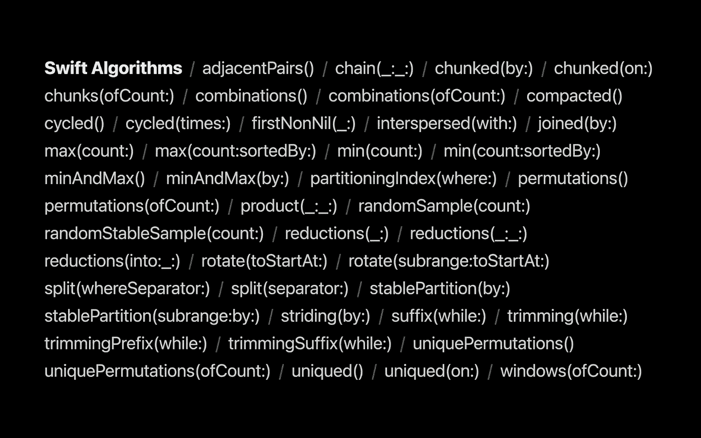
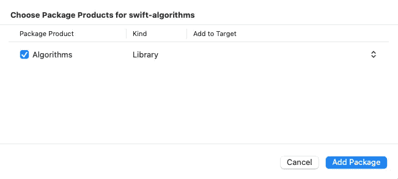
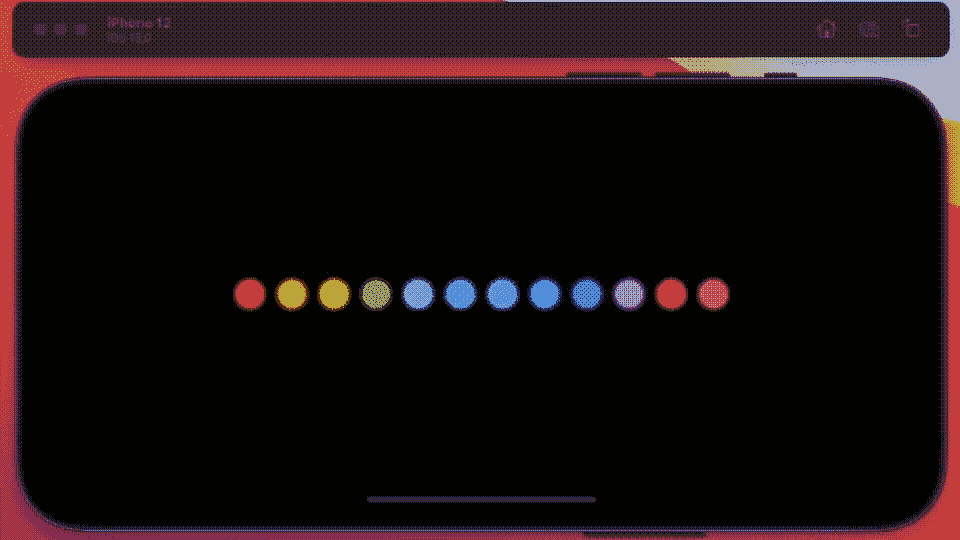
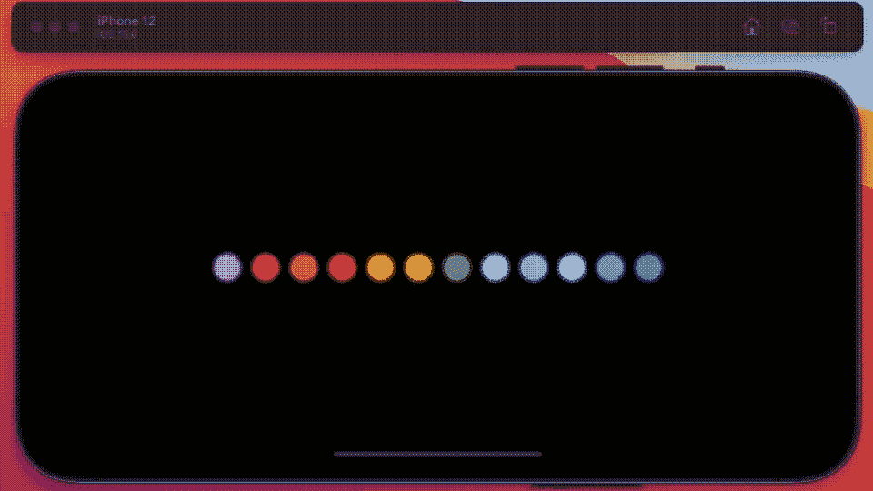
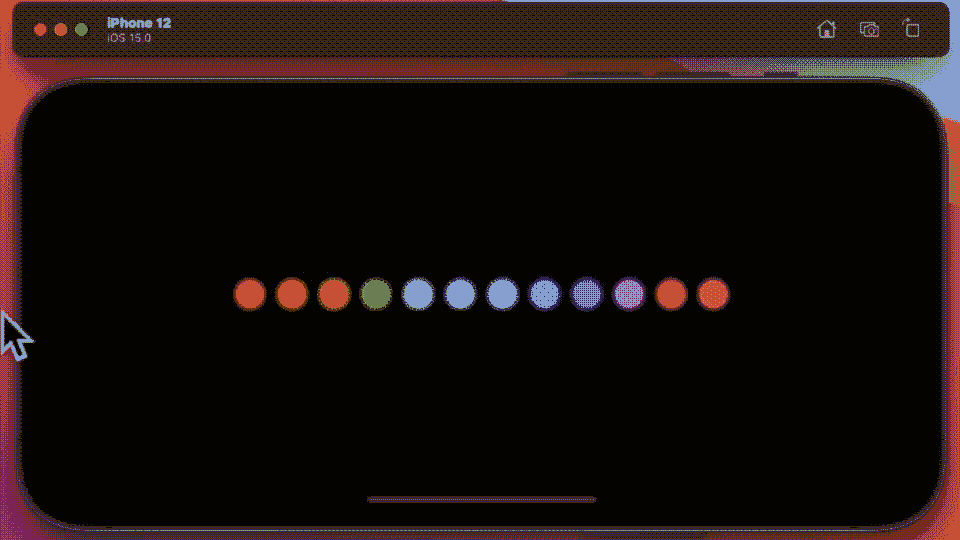
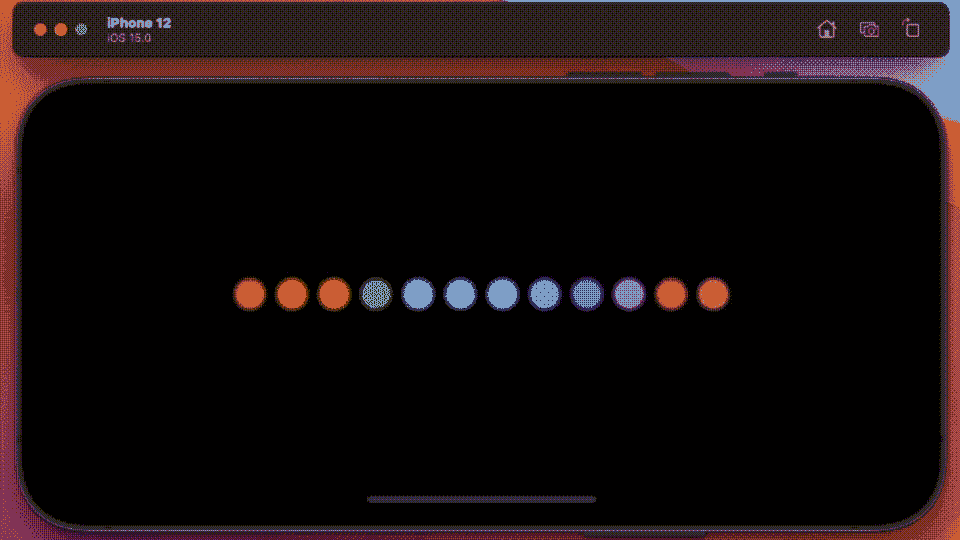
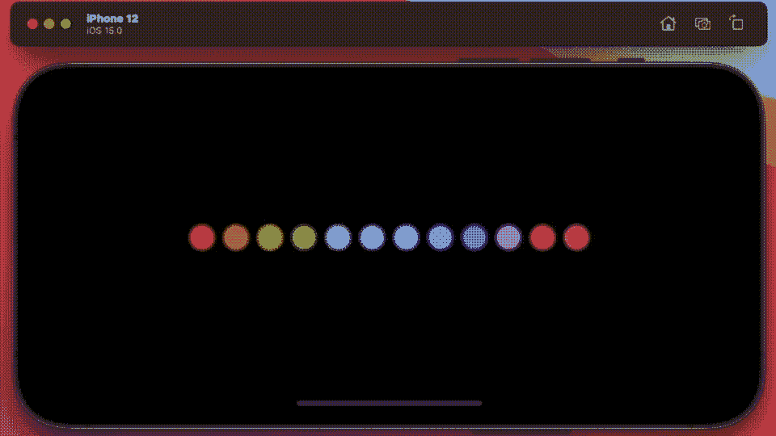
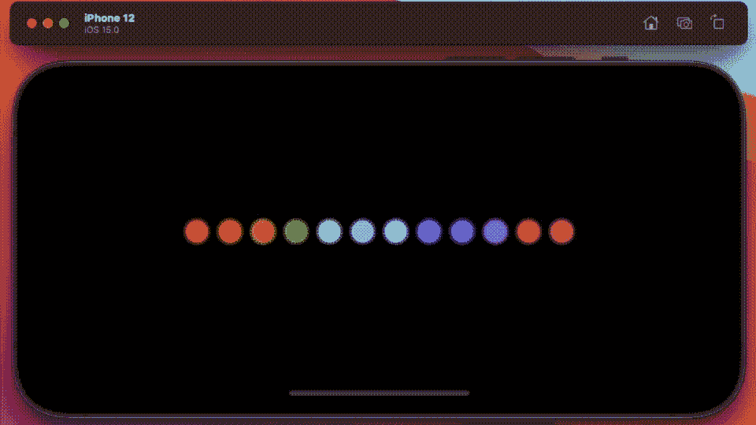
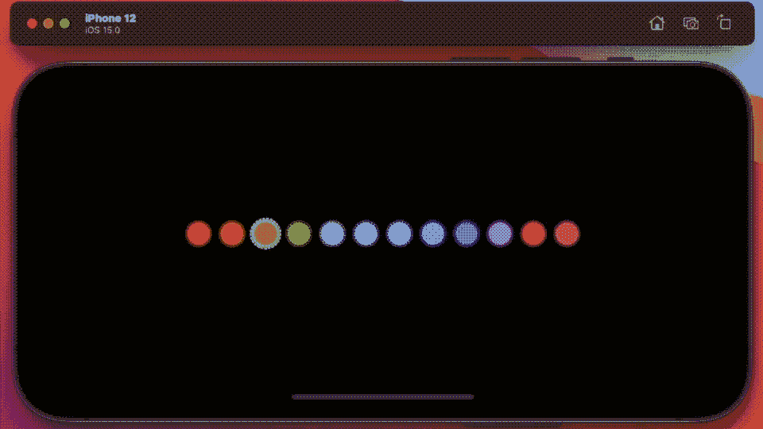

# 为 Swift 标准库指定的 8 种算法

> 原文：<https://betterprogramming.pub/8-algorithms-destined-for-the-standard-library-in-swift-d5a407ae625a>

## 未来可能应用于 Swift X 的 X 算法



WWDC2021 关于算法和集合的演讲截图

WWDC2021 [发布会](https://developer.apple.com/videos/play/wwdc2021/10256/)苹果分享了未来的预览——对于这样一个神秘的公司来说，这是一个不寻常的举动。和我一起探索他们所说的，并为自己尝试一些新的编码想法。在本文中，我想介绍八种算法，它们肯定会在未来的版本中成为 Swift 的标准库——和我一起参观一下吧。

我们从`import Algorithms`开始。Xcode 不喜欢的代码，需要提示才能更努力地尝试，返回这个弹出窗口，假设你告诉它这样做。


点击添加包，超过这个窗口就会弹出，确认你的决定。



好的，让我们开始吧，通过创建一个模板，我们可以用它来可视化正在发生的事情。

好，现在如果你运行这个——它看起来会像这样:


你现在看到的是 12 个圆圈，它们的颜色在一个单独的阵列中，还有一个旗帜阵列，指示它们应该有什么样的轮廓，黑色还是白色。

目前，我使用一个定时器在它们之间切换，这个定时器基本上是打开它们，然后关闭它们。我还没有使用您在这段代码中看到的任何更改函数。

# 更简单的循环

现在这里有另一种方法来做同样的事情(几乎):

```
let settings = [true, false]
for (colorx, choose) in product(colors, settings) {
  changeX(objects: [colorx], stat: choose)
}
```

这段代码相当于两个循环——一个在另一个里面。我通过双击圆圈来启动它。您将代码放在带有 B1 代码注释的背景循环中。



这肯定比嵌套数组更容易阅读，在我们的示例中先显示白色，然后显示黑色。我在后台线程上运行代码的唯一原因是，我想在循环之间延迟它的执行，以便您可以看到正在发生什么。

# 旋转我们的颜色阵列

```
colors.rotate(toStartAt: 1)
```

这在另一方面是完全不同的。这个代码需要放在计时器下面(所以在代码 A1 下面),它将旋转颜色数组的元素。迪斯科效果！是的，仅仅一行代码就做到了这一点！



# 选择数组的 X 个元素

```
for window in colors.windows(ofCount: 4) {
  change(objects: window, stat: true)
  change(objects: window, stat: false)
}
```

这段代码将选择 4 个圆，翻转它们，然后关闭——只移动一个圆，做同样的事情。注意它们是重叠的…它在 B1 代码标签下，事实上我展示的所有其他片段也是如此。

我将再次通过双击来触发它——事实上，我演示的所有例程也将从这一点开始使用这个手势。



# 从数组中恰好选择两个元素

```
for window in colors.adjacentPairs() {
  change(objects: [window.0,window.1], stat: true)
  change(objects: [window.0,window.1], stat: false)
}
```

这实际上和以前是一样的，只是这次它只选择了两个，并且没有返回一个数组——而是返回给我一个元组。代码和输出看起来几乎是一样的(很明显你每次选择的内容更少)——所以我就不贴这个的动画 GIF 了。

## 选择数组的 Y 元素

我使用了一个不同的字母，因为这段代码选择的元素没有重叠，就像他们所说的块一样。

```
for chunk in colors.chunks(ofCount: 3) {
  change(objects: chunk, stat: true)
  change(objects: chunk, stat: false)
}
```

它看起来像下面——仔细看，它走得很快。



## 大步穿过阵列

当然，您可以在 swift 中轻松地做到这一点，但是下面的代码难道不简单得令人愉快吗？

```
for loop in colors.striding(by: 2) {
  change(objects: [loop], stat: true)
  change(objects: [loop], stat: false)
}
```

它看起来像这样——不，它不像。我添加了第二个循环和这个简短的例程来让交替的圆圈进入画面。

```
func rnc(color:Color) -> Color {
  let found = colors.firstIndex(of: color)!
  return colors[found + 1]
}
```



# 阵列中元素的排列

bon——如果你还在这里，你已经做得很好了——这个花了一分钟构建，然后永远运行。

排列返回集合元素的所有不同排列的序列。我应该承认，用了十秒钟甚至更长的时间来构建这个数组，这个数组在这段代码中缓慢地运行。仔细观察它——它以不同的顺序显示圆圈。

```
for newColors in colors.permutations() {
  for newColor in newColors {
    let foo = colors.firstIndex(of: newColor)
      changeV(index:foo!, stat: true)
      changeV(index:foo!, stat: false)
    }
}
```



同样，我在动画 GIF 中作弊了，因为它很难看到，它显示的代码将圆圈分成四组，每组 3 个元素。我还加快了视频的速度——生成视频的实际代码也使用了链式算法，在试图显示它们之前将排列集合粘在一起。

代码如下所示:

```
let react1 = colors[0..<3].permutations()
let react2 = colors[3..<6].permutations()
let reactA = chain(react1,react2)
```

# 数组中元素的组合

最后—这里有四个元素的组合，按顺序选择，代码如下所示:

```
for newColors in colors.combinations(ofCount: 4) {
  for newColor in newColors {
    let foo = colors.firstIndex(of: newColor)
      changeV(index:foo!, stat: true)
      changeV(index:foo!, stat: false)
  }
}
```

产生这个输出，再次仔细观察，它不是很清楚发生了什么，这个算法和之前的一样，最终不适用于这种演示。这个序列也没有在 GIF 中结束——它太长了。



所有这些让我对一些强大的抽象概念有了一个迷人的了解，我认为所有这些都将及时进入 Swift 库。