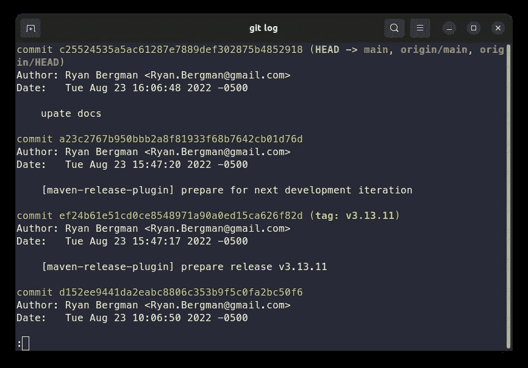
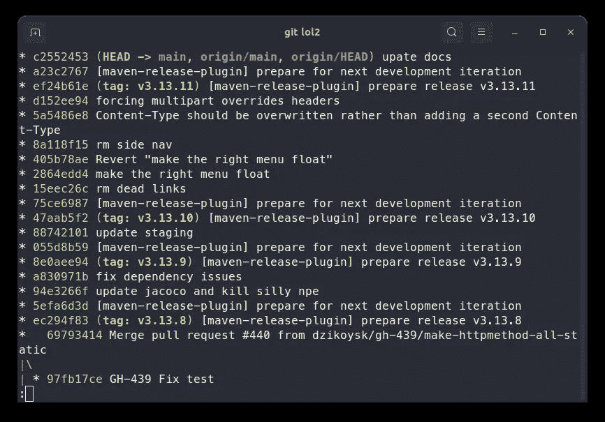
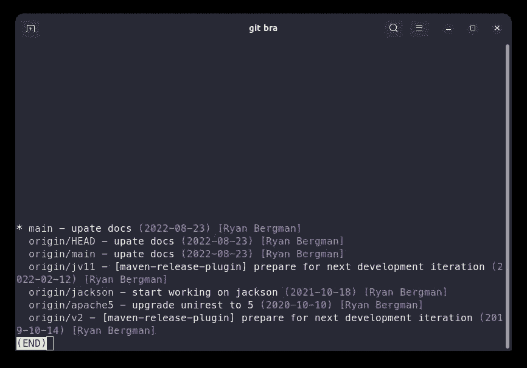
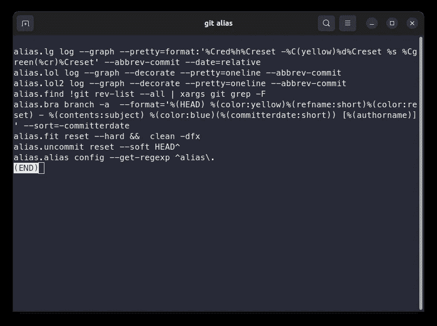
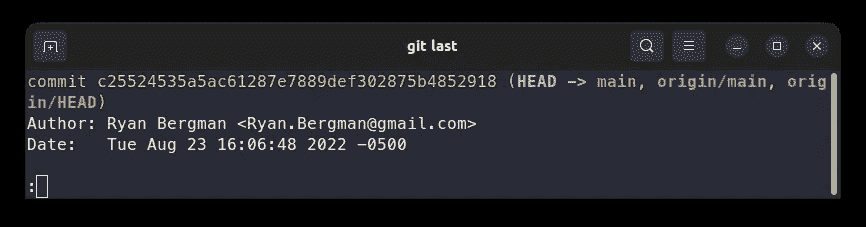

# 8 个惊人的别名让你用 Git 更有效率

> 原文：<https://betterprogramming.pub/8-amazing-aliases-to-make-you-more-productive-with-git-3be35d1b7e51>

## 打字少，发展快。通过 git 别名的力量


照片由[罗曼·辛克维奇·🇺🇦](https://unsplash.com/@synkevych?utm_source=unsplash&utm_medium=referral&utm_content=creditCopyText)在 [Unsplash](https://unsplash.com/s/photos/git?utm_source=unsplash&utm_medium=referral&utm_content=creditCopyText) 拍摄

您每天都在使用 git，因此应该能够高效地使用它。提高效率的一个好方法是减少打字的工作量。这就是别名发挥作用的地方。shell 命令的别名很常见，git 也是如此。

您可以按照通常的 Linux 方式为 git 创建一个别名，但是 git 有自己的方法。您也可以在 Windows 上使用别名。

# 如何创建 Git 别名

执行以下命令创建别名:

```
git config --global alias.alias_name git_command
```

要运行外部程序或带有 git 别名的连接命令，只需在命令前加上感叹号:

```
git config --global alias.visual '!gitk'
```

这里使用单引号很重要。[感叹号本身是一个 shell 命令](https://unix.stackexchange.com/questions/3747/understanding-the-exclamation-mark-in-bash)，它重复您使用的最后一个命令。使用单引号可以防止 shell 执行引号内的任何命令。

就是这样！现在让我们看看一些有用的别名。

# 化名

## 1.缩写——常见的疑点

缩短长命令是显而易见的。事实上，这是文档中提到的第一件事。你可以只输入`git ci`，而不是输入`git commit`。保存了四封信。以下是文档中不言自明的别名:

```
git config --global alias.co checkout
git config --global alias.br branch
git config --global alias.ci commit
git config --global alias.st status
```

## 2.更好的 git 日志

`git log`显示所有提交到存储库的内容。默认情况下，它非常冗长且不清楚。



git 日志的默认输出。

使用下面的别名，看起来会更好。

```
git config --global alias.lol "log --graph --decorate --pretty=oneline --abbrev-commit"s
```

嗯，那省了一些打字的时间，不是吗？结果如下:



git lol——更好的 git 日志。

## 3.列出所有分支

此别名为您提供了所有本地和远程分支机构的完整列表:

```
git config --global alias.bra "branch -a  --format='%(HEAD) %(color:yellow)%(refname:short)%(color:reset) - %(contents:subject) %(color:blue)(%(committerdate:short)) [%(authorname)]' --sort=-committerdate"
```

看起来像这样:



## 4.去他的

有时你意识到你目前的工作没有任何结果，所以你可能会决定全部撤销。这个别名可以帮助您重置一切并删除未被跟踪的文件。

```
git config --global alias.fit '!git reset --hard && git clean -fdx'
```

## 5.取消提交

承诺得太快了？除非您没有提交，否则以下别名会有所帮助。它删除提交，但保留更改。

```
git config --global alias.uncommit 'reset --soft HEAD^'
```

## 6.一次添加并提交

这将添加所有更改并打开提交消息对话框:

```
git config --global alias.ac '!git add -A && git commit
```

## 7.一个别名来统治他们所有人

忘记您创建了哪个别名？有一个别名，如下所示:

```
git config --global alias.alias "config --get-regexp ^alias\."
```



## 8.查看最后一次提交

如果你只是想知道最近发生了什么，这就方便了。

```
git config --global alias.last "log -1 HEAD"
```



# 概述

Git 别名帮助你在少打字的同时掌握 git。查看 Pro Git 中别名的 c[hapter；免费的！](https://git-scm.com/book/en/v2/Git-Basics-Git-Aliases)

你有没有一个我没提到的很酷的别名？请写在评论里！

从 git 中获得更多的另一种方法是钩子。[你可能也会发现我关于 commit-msg](/your-git-commit-history-should-read-like-a-history-book-heres-how-7f44d5df1801) 钩子的文章很有趣。

大喊到[unirest-Java](https://github.com/Kong/unirest-java)；这是我在截图中使用的存储库。

感谢您的宝贵时间！

```
**Want to Connect?**Subscribe to my newsletter so you never miss a new post:
[https://verbosemode.dev/subscribe](https://verbosemode.dev/subscribe).
```