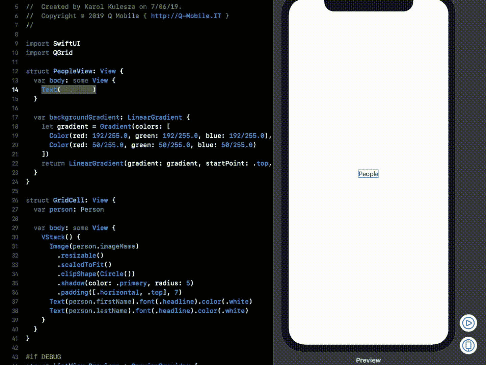
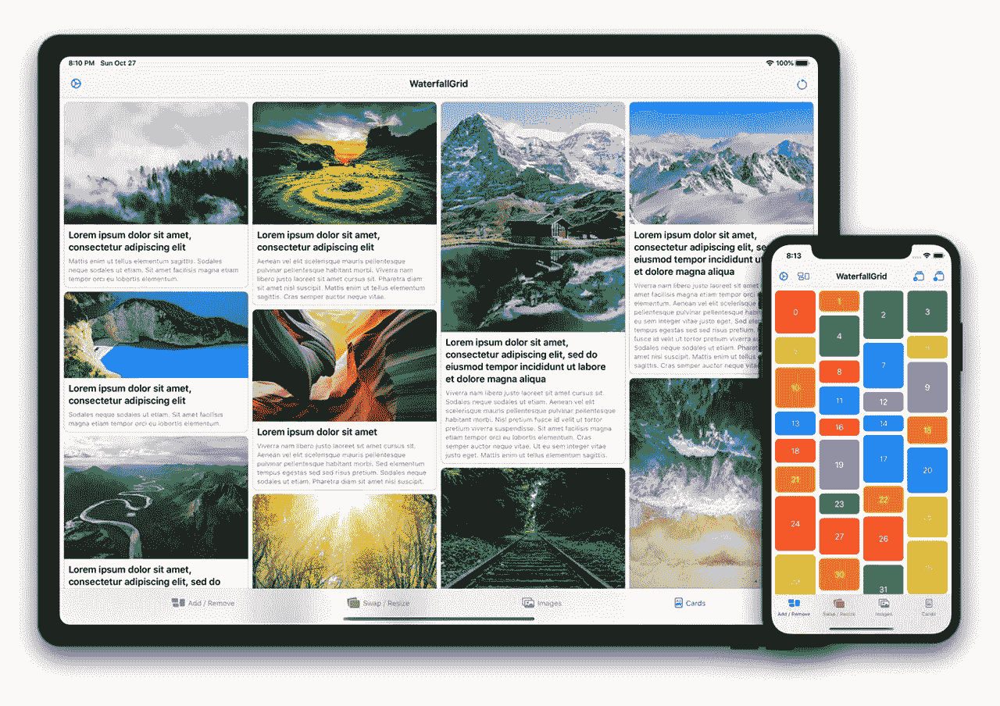
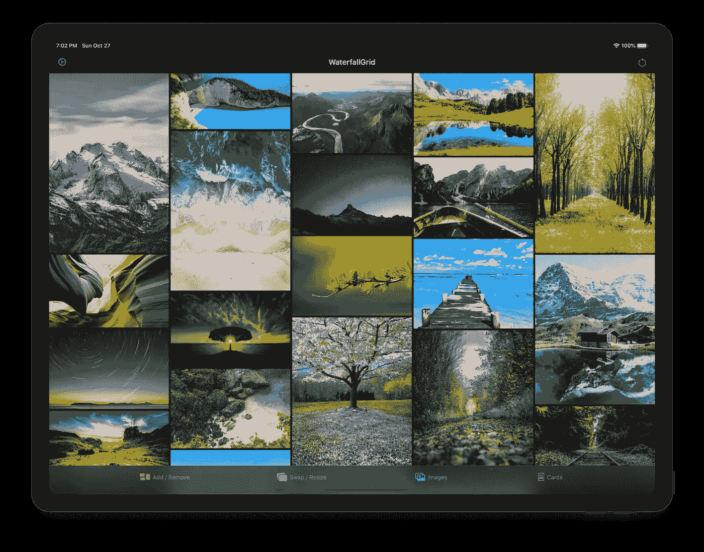
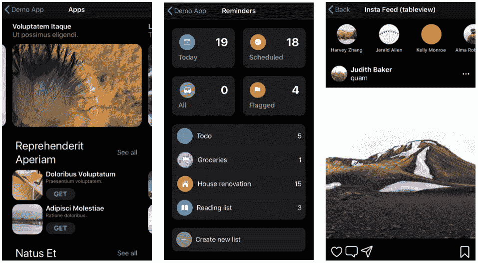
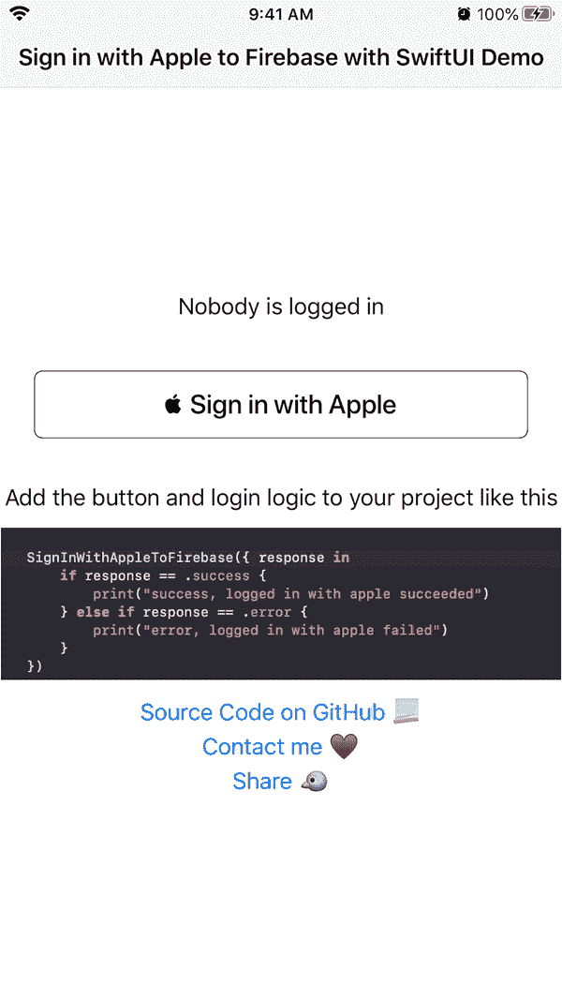
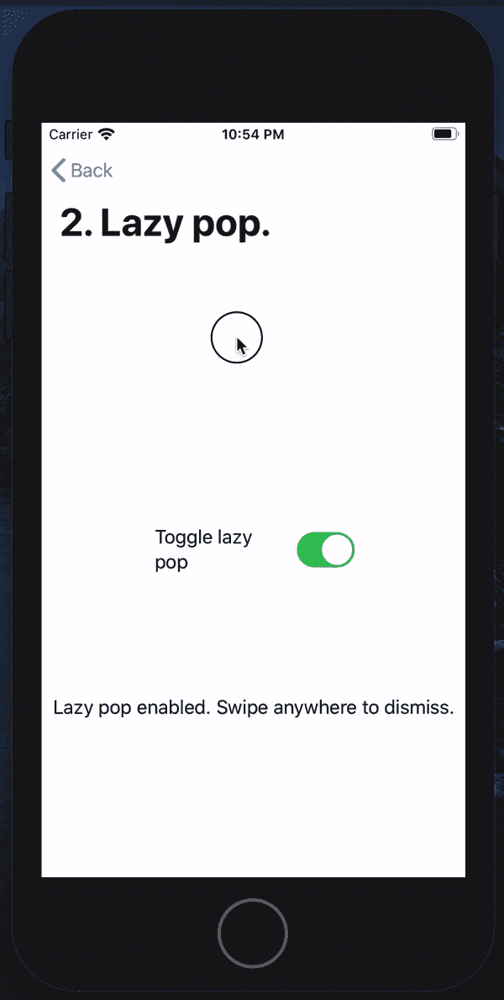

# 在您的下一个项目中使用的 8 个惊人的 SwiftUI 库

> 原文：<https://betterprogramming.pub/8-amazing-swiftui-libraries-to-use-in-your-next-project-52efaf211143>

## 这些库可以帮助您填补下一个基于 SwiftUI 的 iOS 应用程序的空白

丹·迪莫克在 [Unsplash](https://unsplash.com?utm_source=medium&utm_medium=referral) 上拍摄的照片

苹果最新的框架， [SwiftUI](https://developer.apple.com/xcode/swiftui/) ，已经席卷了 iOS 开发世界。

我讨论了七个很棒的开源项目，并从中获得了灵感:

 [## 7 个了不起的开源 SwiftUI 项目给你灵感

### 无论你是刚刚学习 SwiftUI 还是想要探索一些代码库，这些项目都可以帮你解决问题

medium.com](https://medium.com/better-programming/7-awesome-open-source-swiftui-projects-to-inspire-you-aff778e5d413) 

如果你已经开始使用它或者在你的爱好项目中使用它，这八个库可以帮助你提高你的水平。

大多数库都可以通过 [Swift 包管理器](https://swift.org/package-manager/)获得。

# 1.QGrid

[QGrid](https://github.com/Q-Mobile/QGrid) 是缺失的 SwiftUI 集合视图。它使用与 SwiftUI 的列表视图相同的方法，根据识别数据的底层集合按需计算其单元格。

 [## Q-Mobile/QGrid

### 注意]如果你想看看 QGrid 的运行情况，可以看看这个 QDesigner 早期 alpha 版本的演示:如果你想…

github.com](https://github.com/Q-Mobile/QGrid) 

# 2.SwiftUIX:标准 SwiftUI 库的扩展

[SwiftUIX](https://github.com/SwiftUIX/SwiftUIX) 试图填补仍处于萌芽状态的 SwiftUI 框架的空白，提供一套广泛的组件、扩展和实用程序来补充标准库。

 [## SwiftUIX/SwiftUIX

### SwiftUIX 试图填补仍处于萌芽阶段的 SwiftUI 框架的空白，提供一套广泛的组件…

github.com](https://github.com/SwiftUIX/SwiftUIX) 

您可以在此处找到文档:

 [## SwiftUIX/SwiftUIX

### 标准 SwiftUI 库的扩展。通过在…上创建帐户，为 SwiftUIX/SwiftUIX 开发做出贡献

github.com](https://github.com/SwiftUIX/SwiftUIX/wiki) 

# 3.SwiftUICharts

这是我最喜欢的图书馆之一。一个 [Swift 包](https://github.com/AppPear/ChartView)用于毫不费力地显示图表。

它支持:

*   折线图
*   条形图
*   饼图

 [## 应用程序视图/图表视图

### 轻松显示图表的快捷软件包。它支持:需要 iOS 13 和 xCode 11！在 xCode 中到达文件->…

github.com](https://github.com/AppPear/ChartView) 

# 4.瀑布网格

SwiftUI 的[瀑布网格布局视图](https://github.com/paololeonardi/WaterfallGrid)。

特点:

*   不规则的内容网格。
*   每个设备方向的列数是不同的。
*   可自定义间距和网格填充。
*   水平或垂直滚动方向。
*   项目更新可以是动画。

 [## paololeonardi/瀑布网格

### SwiftUI 的瀑布网格布局视图。iOS 13.0+/MAC OS 10.15+/tvOS 13.0+/watch OS 6.0+Xcode 11.0+Swift 5.1+…

github.com](https://github.com/paololeonardi/WaterfallGrid) 

# 5.同心入职

[iOS 库](https://github.com/exyte/ConcentricOnboarding)用于带有用 SwiftUI 编写的点击动作的漫游或入职流程。

 [## exyte/ConcentricOnboarding

### iOS 库，用于使用 SwiftUI 编写的带有 tap 操作的演练或入职流程。我们是一家开发机构…

github.com](https://github.com/exyte/ConcentricOnboarding) 

# 6.快速旭日图

Sunburst Diagram 是一个用 SwiftUI 编写的库，可以在给定一个对象树的情况下轻松地绘制图表。类似于环形图、旭日图和多级饼图。

特点:

*   使用节点对象树进行配置。
*   节点显示可选标签(图像和文本)。
*   动态更新的反应式用户界面。
*   可以选择为节点配置一个值(四种不同的渲染模式)。
*   无限层数(圈数)支持。
*   用于配置弧线的边距、大小、排序和初始位置的选项。
*   用于折叠特定层以外的弧的选项。
*   能够选择一个节点，并集中在一个节点上，以查看更多的细节或禁用选择。
*   要显示的最大响铃次数选项。

 [## lludo/SwiftSunburstDiagram

### Sunburst diagram 是一个用 SwiftUI 编写的库，可以在给定一个对象树的情况下轻松呈现图表。类似于戒指…

github.com](https://github.com/lludo/SwiftSunburstDiagram) 

# 7.ASCollectionView

`UICollectionView`和`UITableView`的 [SwiftUI 实现](https://github.com/apptekstudios/ASCollectionView)。以下是它的一些有用特性:

*   支撑预压和`onAppear` / `onDisappear`。
*   支持单元格选择，自动支持 SwiftUI 编辑模式。
*   支持自动调整单元格大小。
*   支持移除`ASTableView`的分离器。
*   支持新款`UICollectionViewCompositionalLayout`，以及任何其他`UICollectionViewLayout`。

 [## apptekstudios/ASCollectionView

### UICollectionView & UITableView 的 SwiftUI 实现。这里是它的一些有用的功能:支持预加载和…

github.com](https://github.com/apptekstudios/ASCollectionView) 

# 8.自定义 SwiftUI 滑块和轨道

这个[包](https://github.com/SwiftUIExtensions/Sliders)允许你为 iOS、macOS 和 Mac Catalyst 构建高度可定制的滑块和轨道。

特点:

*   使用合成构建您自己的滑块和轨道。
*   高度可定制。
*   水平和垂直样式。
*   范围和 XY 值。
*   上下量程拇指大小不同。

 [## SwiftUIExtensions/滑块

### 此软件包允许您为 iOS、macOS 和 Mac Catalyst 构建高度可定制的滑块和轨道。构建您自己的…

github.com](https://github.com/SwiftUIExtensions/Sliders) 

# 9.使用 Apple Firebase 登录

这个[库](https://github.com/joehinkle11/Login-with-Apple-Firebase-SwiftUI)是一个 SwiftUI 组件，用于处理与 Apple to Firebase 的登录，并详细说明如何将其集成到您的项目中。

 [## Joe hinkle 11/使用-Apple-Firebase-SwiftUI 登录

### SwiftUI 组件，处理从 Apple 登录到 Firebase-Joe linkle 11/log in-with-Apple-Firebase-swift ui

github.com~~](https://github.com/joehinkle11/Login-with-Apple-Firebase-SwiftUI) 

# 10.懒惰的流行音乐

在屏幕的任何部分滑动会启动一个可中断的弹出动画到之前的视图。

您也可以在 App Store 上试用演示！

 [## Lazy Pop SwiftUI 演示

### 我做了一个 SwiftUI 组件，让你可以拖动到任何地方来关闭视图。这个应用程序可以让你演示这个功能，并…

apps.apple.com](https://apps.apple.com/us/app/lazy-pop-swiftui-demo/id1490371801)  [## joehinkle11/Lazy-Pop-SwiftUI

### 在屏幕的任何部分滑动会启动一个可中断的弹出动画到之前的视图。分叉自…

github.com](https://github.com/joehinkle11/Lazy-Pop-SwiftUI) 

# 结论

SwiftUI 会一直存在。

我希望你喜欢这些库，并将它们融入到你的项目中，同时感谢作者。