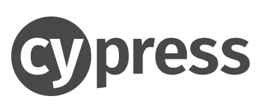
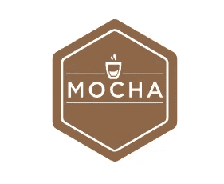
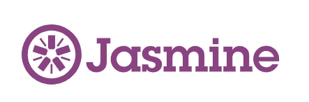
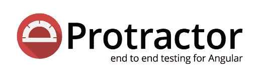
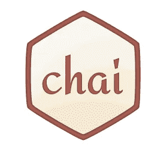
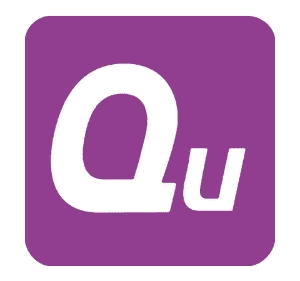

# 8 个非常棒的 JavaScript 测试库

> 原文：<https://betterprogramming.pub/8-awesome-javascript-testing-libraries-43e09141fdc2>

## Cypress、Jest、TestCafe 等等

潘卡杰·帕特尔在 [Unsplash](https://unsplash.com?utm_source=medium&utm_medium=referral) 上的照片

测试代码是任何大型公司或项目的强制性操作，如今每个开发人员都应该能够并愿意编写测试，从单元测试到集成测试，再到端到端测试。

你猜怎么着:测试代码甚至会很有趣！嗯，算是吧…如果你手头有合适的工具。

下面的集合向您展示了一些最流行的 JavaScript 测试库。也许你已经在使用其中的一些了，但是如果没有，那绝对是时候开始使用了。

# 柏树

[Cypress](https://github.com/cypress-io/cypress) 是目前市场上最好的端到端测试解决方案之一。它可以用于在浏览器中运行的任何东西，许多开发人员只是喜欢用它进行测试，即使他们不喜欢测试。最棒的是在你的浏览器中弹出的用户界面，使得测试你的代码 e2e 变得非常容易和愉快。

## 主要特点:

*   专为开发人员和 QA 工程师打造
*   开源项目
*   没有硒的新建筑
*   时间旅行特征
*   出色的可调试性
*   实时重新加载
*   自动等待

# 摩卡

谈到 JavaScript 测试，Mocha 是最流行的框架之一。这是一个独立的开源项目，也是 npm 上最依赖的模块(这意味着许多许多其他包依赖于它)。

Mocha 简单、灵活，适用于 Node.js 和浏览器。它消除了测试异步代码的麻烦。

## 主要特点:

*   在浏览器中运行
*   简单异步支持
*   测试覆盖报告
*   字符串差异支持
*   适用于任何断言库
*   配置文件支持

# 茉莉

Jasmine 是另一个伟大的测试框架。就像 Mocha 一样，它是为浏览器和 Node.js 构建的。Jasmine 使用行为驱动开发(BDD)的概念，不依赖于任何特定的 JavaScript 框架。

## 主要特点:

*   低开销(核心中没有外部依赖性)
*   测试-开箱即用
*   支持浏览器和 Node.js
*   良好的文档

# 玩笑

Jest 是由脸书创建的(是的，是创建 React 的同一批人…)，被广泛用于测试 JavaScript 代码。图书馆在 GitHub 上有 30000 颗星，回购积极维护。Jest 是一个全面的测试解决方案，通常适用于大多数使用 JavaScript 的项目。

## 主要特点:

*   大多数项目不需要配置
*   快照测试
*   在自己的进程上运行的独立测试
*   有据可查的优秀 API
*   代码覆盖报告集成
*   使用集成的自定义解析器轻松模仿

# 量角器

[量角器](https://github.com/angular/protractor)为角度应用提供端到端测试。这是一个建立在 WebDriverJs 之上的 Node.js 程序，它在模拟真实用户的真实浏览器中对应用程序进行测试。

## 主要特点:

*   本机事件和浏览器特定的驱动程序
*   支持特定角度定位器策略
*   添加自动等待和睡眠步骤

## 测试咖啡馆

[TestCafe](https://github.com/DevExpress/testcafe) 是一款使用 Node.js 构建的端到端测试工具，运行在 Windows、macOS、Linux 上，支持移动、桌面、远程，甚至云浏览器。这是一个开源项目，可以通过插件定制，用于报告、集成其他工具、从 ide 启动测试等等。

## 主要特点:

*   测试可以用 JavaScript 或 TypeScript 编写
*   没有手动超时— TestCafe 等待页面重新加载
*   代码更改会立即反映出来
*   TestCafe 可以识别 JavaScript 错误
*   test cafe Studio——一个完整的测试 IDE

# 柴

[Chai](https://github.com/chaijs/chai) 是一个很棒的用于浏览器和 Node.js 的 BDD/测试驱动开发(TDD)断言库，可以很容易地与测试框架配对，比如 Mocha(顺便说一下，这是一个非常常见的配对)。Chai 本身并不是一个测试框架，而是在测试设置中添加了像 Node 内置的`assert` 这样的断言。

## 主要特点:

*   添加了许多断言
*   可以通过插件定制
*   与测试框架配合良好
*   开源项目

# 库奈特

QUnit 是一个强大的 JavaScript 测试框架，用于编写单元测试。例如，jQuery 使用它，但是它可以在客户端或服务器端处理大多数 JavaScript 代码。QUnit 的一个很好的用例是回归测试，在这种情况下，当出现 bug 时编写测试，以便事后修复它们，并密切关注导致这些 bug 的代码。

## 主要特点:

*   Node.js 支持
*   回归测试
*   单元测试
*   大约从 jQuery 开始，但是独立运行

# 结论

这份清单远非完整。肯定有其他很棒的工具、库和框架可以取代上面的例子。

例如，像 Chai 这样的断言库经常被集成到 Cypress 或 Jest 这样的解决方案中，所以你不再需要一个独立的解决方案。然而，Chai 仍然在许多项目中使用，所以了解一下它不会有什么坏处。