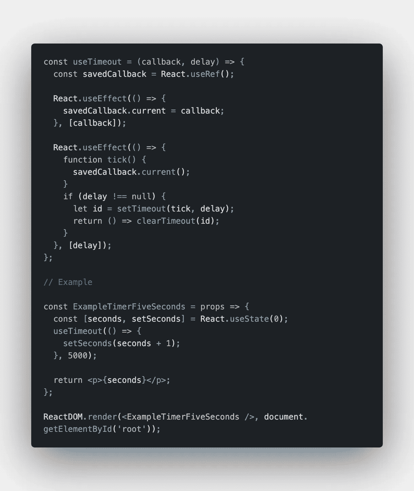
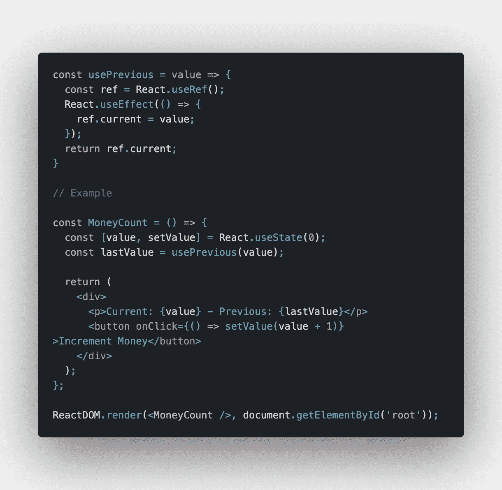
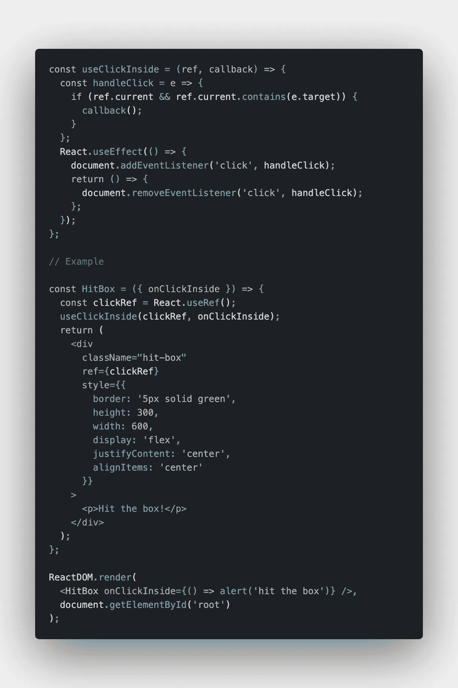
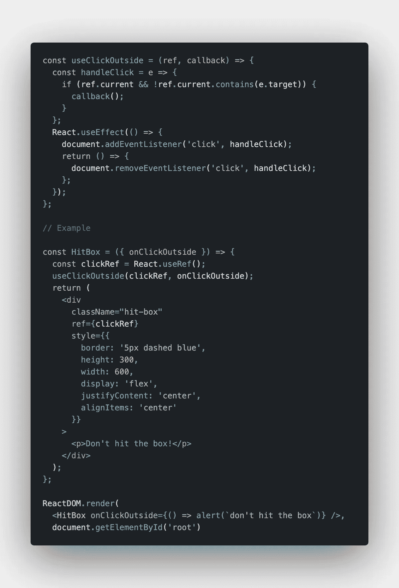
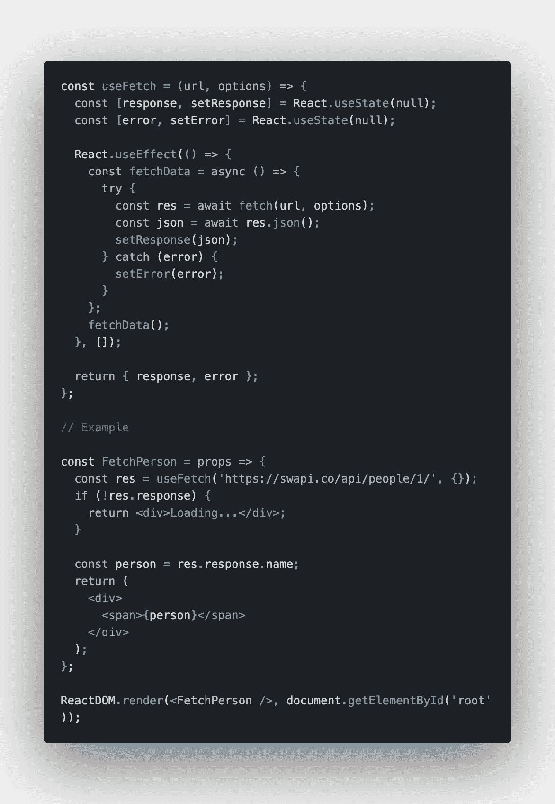
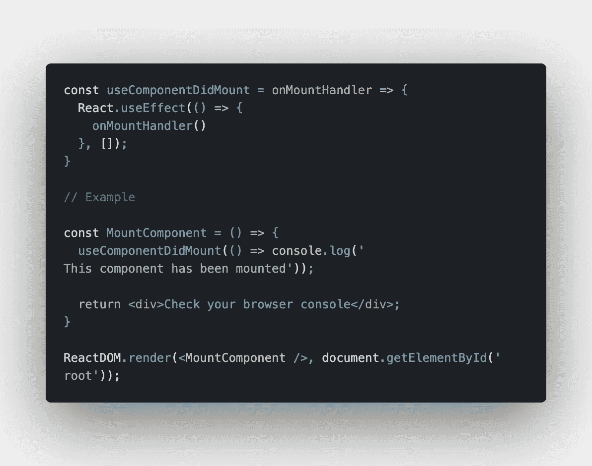
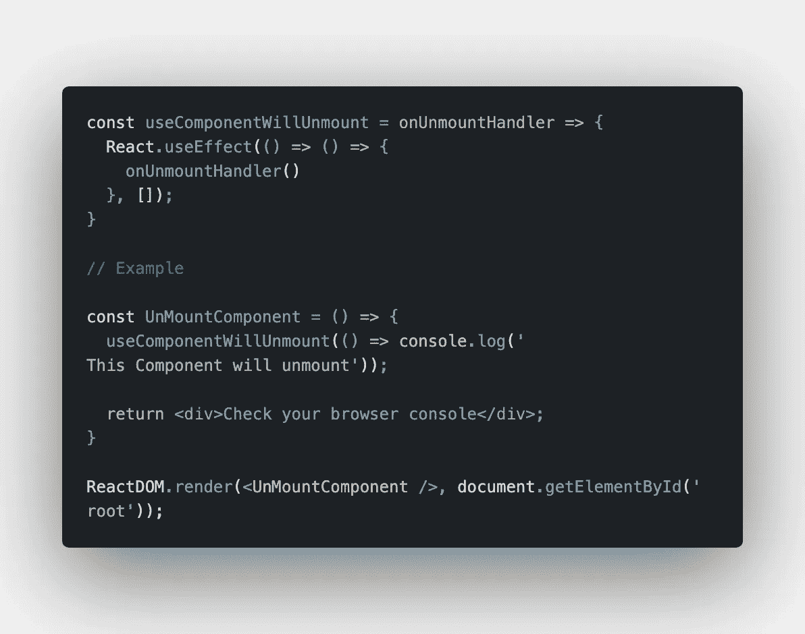

# 8 个牛逼的反应钩

> 原文：<https://betterprogramming.pub/8-awesome-react-hooks-2cb31aed4f3d>

## usePrevious、useTimeout 等等

科尔顿·迪安·马歇尔在 [Unsplash](https://unsplash.com/s/photos/patterns?utm_source=unsplash&utm_medium=referral&utm_content=creditCopyText) 上的照片

这篇文章最初发表在智能编码器上。

React.js 是目前最受前端开发者欢迎的 JavaScript 库。由脸书发明，但作为一个开源项目，它被全世界的开发者和公司使用。

React 真正改变了我们构建单页面应用程序的方式——它最伟大的特性之一就是钩子。钩子是去年引入的，它使我们能够在处理状态时使用功能组件而不是基于类的组件。除了内置挂钩，React 还为我们提供了实现自定义挂钩的方法。

这里是一些我最喜欢的定制钩子及其实现的例子，你也可以在你的应用程序和项目中使用它们。

# 使用超时

有了这个钩子，我们可以使用声明性的方法实现`setTimeout`。首先，我们创建一个带有回调和延迟的定制钩子。然后我们使用`useRef`钩子为回调函数创建一个 *ref* 。最后，我们两次使用`useEffect`。一次用于记住最后一次回调，一次用于设置超时和清理。

该示例显示了计时器的实现:

# 使用以前的

这是我们可以在应用程序中使用的另一个很棒的定制钩子。有了它，我们可以存储道具或者之前的状态。首先，我们创建一个接受值的定制钩子。然后我们使用`useRef`钩子为这个值创建一个`ref`。最后，我们用`useEffect`来记住最新的值。

该示例显示了计数器的实现。

# 使用单击内部

如果您需要处理点击包装组件内部的事件，那么`useClickInside`钩子是您的正确选择。首先，我们创建一个定制钩子，它接受一个 *ref* 和一个回调来处理 click 事件。然后我们利用`useEffect`来添加和清理点击事件。最后，我们使用`useRef`为被点击的组件创建一个*引用*，并将其传递给`useClickInside`钩子。

# 使用单击外部

`useClickOutside`钩子与`useClickInside`钩子非常相似，但是它负责点击被包装组件的外部，而不是内部。因此，我们再次创建一个定制钩子，它接受一个 *ref* 和一个回调来处理 click 事件。然后我们利用`useEffect`来追加和清理点击事件。最后，我们使用`useRef`为组件创建一个*引用*，并将其传递给`useClickOutside`钩子。

# 使用 Fetch

`useFetch`钩子可以用来以声明的方式实现`fetch`。首先，我们使用`useState`来初始化响应和错误状态变量。然后我们使用`useEffect`异步调用 fetch 并更新状态。最后，我们返回一个包含响应/错误变量的对象。

该示例显示了一种从 Star Wars API 获取角色并呈现其名称的方法:

# 使用间隔

如果你想以声明的方式实现`setInterval`，你可以使用这个叫做`useInterval`的钩子。

首先，我们必须创建一个接受回调和延迟的定制钩子。然后我们使用`useRef`为回调创建一个`ref`。最后，我们使用`useEffect`来记住最近的回调，并设置间隔和清理。

该示例显示了一个自定义`ResourceCounter`的实现，例如，它可以在浏览器游戏中使用。

## useComponentDidMount

这个钩子是一个小例子，展示了如何在组件安装后立即执行回调。对于第二个参数，我们简单地使用带有空数组的`useEffect`,一旦组件被安装，就执行所提供的回调。

# useComponentWillUnmount

`useComponentWillUnmount`类似于上面的例子，但是一旦组件被卸载就会执行回调。因此，我们再次使用`useEffect`,将一个空数组作为第二个参数，在清理之前执行所提供的回调

这些是我最喜欢的自定义 React 挂钩的例子，你可以在你的应用程序中使用。