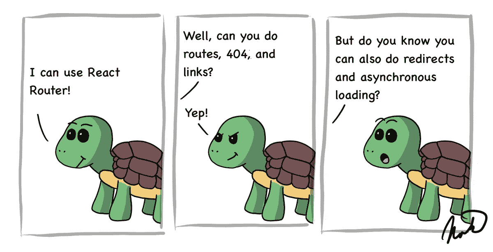
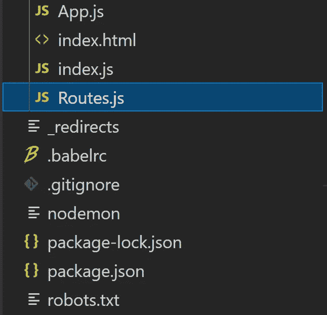
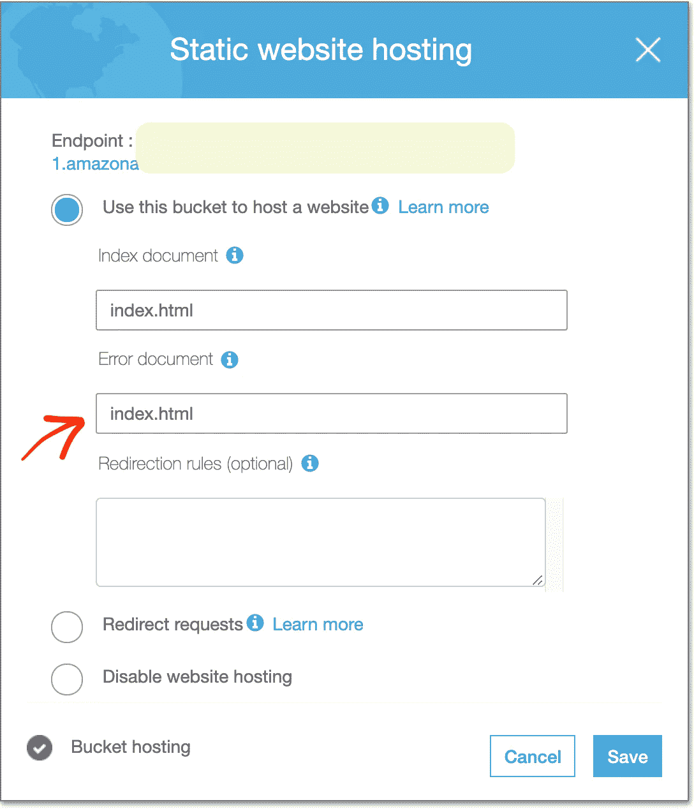
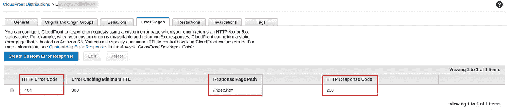

# 8 个基本和高级 React 路由器提示

> 原文：<https://betterprogramming.pub/8-basic-and-advanced-react-router-tips-6993ece8f57a>

## 路由、404、链接、重定向、异步加载等等



图片由作者提供。

许多人认为 React 是构建 web 应用程序的最佳 JavaScript 框架。你需要掌握的基础知识之一是反应路由。

[React Router](https://reactrouter.com/) 允许您的 web 应用程序被组织成不同 URL 上的页面，就像您习惯于互联网上的任何其他页面一样。因为 React 只是一个很大的 JavaScript 脚本，所以当用户单击一个链接时，所有页面都会立即加载并显示出来。

我将介绍基础知识以及一些高级技巧，包括 404 页面、重定向、异步页面和站点地图。我用这些技术建立了我所有的网站，包括 [7urtle](https://www.7urtle.com/) 。

# React 路由器简介

React routes 使用包`react-router-dom`，所以从安装它开始:

```
npm i -D react-router-dom
```

因为我更喜欢函数式编程，所以我也在使用我的来自 7urtle 的@7urtle/lambda 库，让我的代码更优雅。您可以重写这些示例，或者使用以下代码安装该库:

```
npm i -D @7urtle/lambda
```

我只会在这里用几次图书馆，所以不用担心。

然后在你的`index.js`旁边创建`Routes.js`:



这个文件将保存您的`Route`配置。包含两页的路由如下所示:

配置是通过`Switch`父标签下的`children`标签完成的。

`Route`标签包含您的所有路线:

*   `exact`参数确保只使用精确匹配。
*   `path`参数包含页面的地址。
*   然后`component`保存 React 页面本身。

对于一个 404 页面，只需定义`Route`而不需要任何将所有剩余请求发送到那里的路径。路由器从顶部开始依次检查所有路由，并使用找到的第一个匹配项。这意味着您的 404 需要在所有其他路由和重定向之后出现。

# App.js 中的 React 路由器

然后必须在您的`App.js`中使用`Router`组件，如下所示:

注意`Router`部分使用了我们在之前的文件中定义的`Routes`。这就是路由发生的方式。

`Routes`将只影响`Routes`标签的区域。T2 和周围的任何其他 JSX 都没有受到影响。这样，您可以在路由器上独立定义保持不变的菜单或页眉和页脚。

## 路由器基本名称

> "所有位置的基本 URL。如果您的应用程序是由服务器上的子目录提供的，您需要将其设置为该子目录。格式正确的 basename 应该有一个前导斜杠，但没有尾随斜杠。— [反应路由器的文件](https://reactrouter.com/web/api/BrowserRouter)

当我的 React 应用程序可以从某个子目录中使用时，我总是将这段代码与`getBasename`函数一起使用。这将很好地定义正确的基本名。但是，如果您想要依赖于使用子目录路径的一些更复杂的路由，您可能想要进一步编辑它。

在你的情况下，你可能根本不需要这个。干脆删了，看看东西还能用吗。

# 反应路由器页面

您可以像定义任何其他组件一样定义页面，因为它只不过是另一个组件。唯一的区别是 React Router 基于 URL 管理`Route`组件的可见性。这是一个页面示例:

同样的，你可以定义任何其他的页面或者你的 404 页面。

页面根据`Routes.js`中使用的路径显示，页面组件代替`App.js`中的`Routes`组件显示。

# 滚动长页面

你会发现的一个挑战是，如果你滚动一个页面并重新打开它，用户将返回到滚动的位置，而不是顶部。如果您想确保页面在打开时总是滚动到顶部，只需创建一个父`Page`组件，如下所示:

我们简单地使用 React 的`useEffect`来触发即时滚动到顶部。

您还可以使用它来实现应该在每个页面上发生的任何其他行为，或者添加任何标签来装饰页面(如本例中的`main`标签)。

然后通过添加标签作为父标签，在所有需要的页面中使用这个`Page`,就像这个 404 页面的例子:

# 对页面的路由器链接做出反应

使用`Link`组件链接到组件页面很简单。我们可以从 404 页面添加一个返回主页的链接:

`Link`标签非常简单，只需要与您从`Routes.js`开始的路线相匹配的`to`参数。

# React 路由器重定向路由

您可能希望在您的应用程序中定义一些标准重定向，例如，总是将根路径`/`重定向到您的登录页面`/login`。您可以通过在您的`Routes.js`中添加一个`Redirect`组件来实现。

在`Redirect`标签中，参数`from`和`to`都是路径。确保你的重定向定义高于你的 404 路由。

# React 路由器重定向自代码

您可能还希望以编程方式从您的代码重定向到某个页面。您可以通过在组件中使用`useHistory`来做到这一点。

在这个例子中，我们使用`useEffect`来观察身份验证状态的变化，如果用户通过了身份验证，页面就会触发到`/sub-page`的重定向。您的路径应该再次与您在`Routes.js`中的路径相匹配。

# React 路由异步页面加载

React 只是一个很大的 JavaScript 脚本，所以所有页面总是加载您的第一页请求，然后链接立即工作，而不是对每个页面发出服务器请求。

如果想让初始请求更小更快，可以异步加载一些页面。我在@7urtle/lambda 上的[学习页面](https://www.7urtle.com/javascript-functional-programming-advantages)中使用了这种技术。你可以在那里测试一下，它还是相当快的。当然，页面只加载一次，所以所有后续访问都是即时的。

您将需要一个名为`react-loadable`的新包:

```
npm i -D react-loadable
```

要使页面异步加载，请将此定义添加到`Routes.js`:

注意常量`AsyncPages`，我用`loadable`函数在这里放置了`myAsyncSubPage`定义。

然后我在`Route`标签中以常规方式调用它。没有变化。

我们还需要定义的一件事是在系统从您的服务器加载页面时显示加载信息的`LoadingPage`组件。您可以像这样创建它:

这再简单不过了。

# React 路由器站点地图

我建议为你的网站维护一个站点地图。这对搜索引擎有好处，因为谷歌现在可以抓取 React 页面，而且它还可以帮助你管理你的网站。

我所做的是在`Routes.js`中定义一个`SiteMap`对象:

您可以看到，它定义了链接所需的所有信息，并使用了`Route`组件中的路径。

然后，我在自己的`Link7urtle`组件中利用`SiteMap`:

在您自己的组件中，`Link7urtle`只是用作:

你可以看到我们简单地将`SiteMap.HomePage`传递给`Link7urtle`，一切都自动发生(或者我们也可以手动定义任何参数)。

你的网站也要维护`sitemap.xml`和`robots.txt`。我手动维护这些，并确保它们与我的`Routes.js`对齐。这是我的`sitemap.xml`:

请注意，您总是需要使用完整的 URL，包括正确的协议。

然后我的`robots.txt`就这样链接到它:

对于`Sitemap`，再次使用完整的 URL。

# 使用 Netlify、AWS 和其他服务对路由做出反应

这就是 React Router 本身，但是当您将新应用程序部署到生产环境中时，您可能很快就会发现，简单地调用应用程序的任何子页都可能不起作用。

当您从根目录开始时，路由将始终工作，因为路由器不调用您的服务器来导航，而是使用浏览器历史功能。所以对于大多数提供商来说，如果你调用你网站的任何 URL，它都会失败。

通常的解决方案是确保所有的服务器请求总是被传递给索引。这个问题的解决方案总是取决于您正在使用的特定服务。

## 反应路由器与网络效率

例如，如果您在 Netlify 上将 React 应用程序部署为无服务器，您需要在应用程序的根目录下添加一个`_redirects`文件:

现在一切都应该按照你期望的方式工作，你的路线将得到充分的支持。

## S3 亚马逊网络服务反应路由器

如果你想通过 S3 使用亚马逊网络服务进行无服务器交付，也会出现同样的情况。我正在使用堆栈溢出的解决方案。

您可以将`index.html`放入错误文件框。去你的桶(实际有代码的那个——不是你用来重定向的那个)- >属性- >静态网站托管。



## 亚马逊网络服务 CloudFront 的 React 路由器

如果你正在使用 Amazon Web Services CloudFront，请遵循 Stack Overflow 的建议。

在 CloudFront 发行版中创建一个[自定义错误页面(AWS Docs)](https://docs.aws.amazon.com/AmazonCloudFront/latest/DeveloperGuide/custom-error-pages.html) ，将 404 错误路由到`index.html`，并返回一个 200 响应代码。这样，您的应用程序将处理路由。



# 结论

React 路由器非常强大，我在 React 内置的所有 web 应用程序中都使用了它。在这篇文章中，我透露了我在 [7urtle](http://www.7urtle.com) 上使用的设置的所有秘密。你可以看到它实时工作，包括一些异步加载。

如果你最终使用了我的解决方案，请让我知道，如果你成功了，或者如果你有任何问题需要帮助，请在评论中发表。

查看我的[网站](https://www.meet-martin.com)了解更多详情。