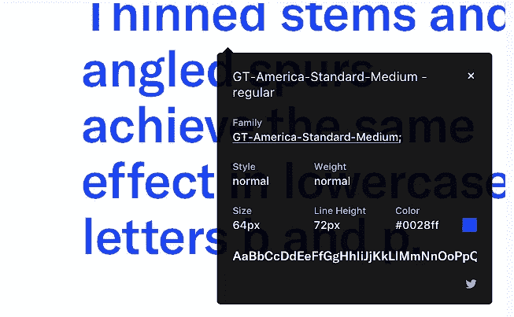
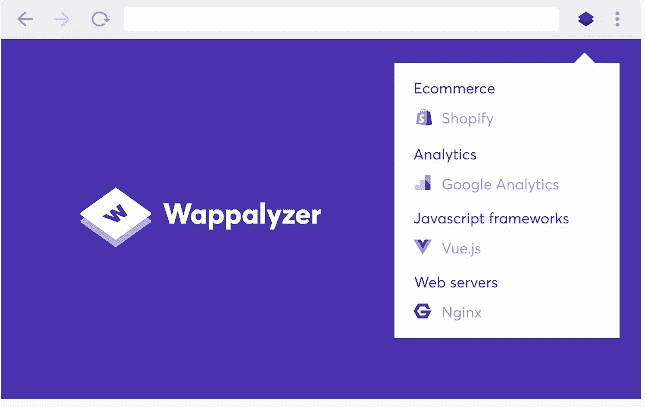
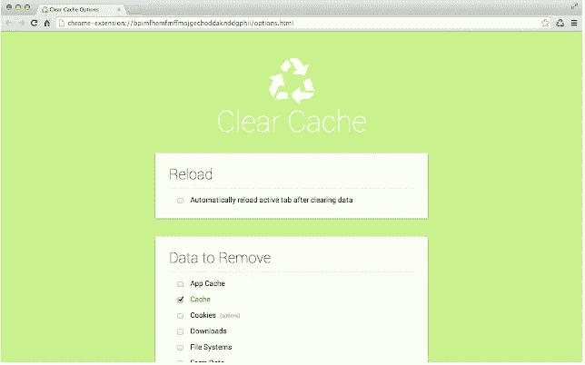
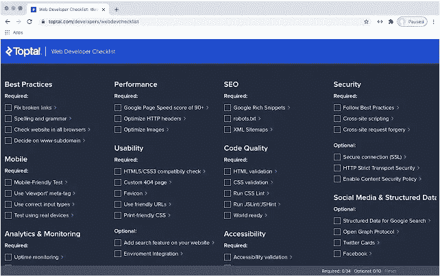
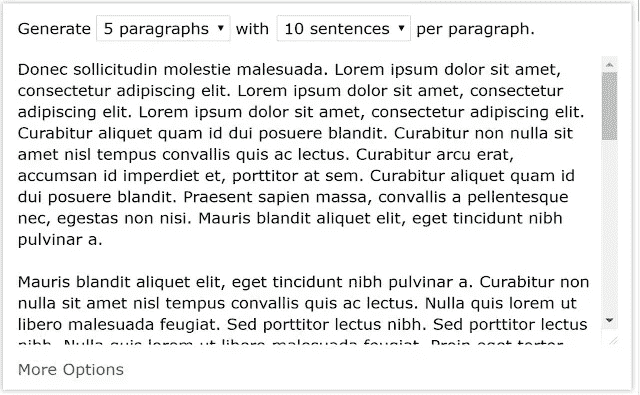
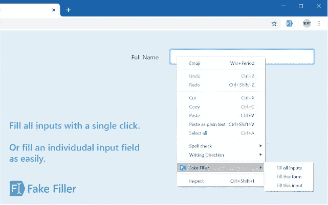

# 8 个 Chrome 扩展添加到您的日常生活中

> 原文：<https://betterprogramming.pub/8-chrome-extensions-to-add-to-your-day-to-day-life-6a2e20a1da49>

## 对 web 开发人员有用的扩展

布鲁克·卡吉尔在 [Unsplash](https://unsplash.com?utm_source=medium&utm_medium=referral) 上的照片

作为 web 开发人员，我们不想在重复的任务上浪费太多时间。我们希望建立和运输的网站很快。我们讨厌做无聊的家务。工具和技术可以使我们的工作更容易。

作为开发人员，我们一直在寻找不同种类的工具。我们正在寻找快捷键、扩展和软件，让我们的生活更轻松。

Chrome 浏览器是我们今天使用的工具之一。在 Chrome 浏览器的顶部，也有一些扩展让我们的工作变得更加容易。这里有八个扩展，我希望在我的开发生涯中早点知道。

# 1.什么字体

图片来自 [WhatFont 扩展](https://chrome.google.com/webstore/detail/whatfont/jabopobgcpjmedljpbcaablpmlmfcogm?hl=en)

WhatFont 拥有超过百万的用户。这个扩展提供了识别网页字体最简单快捷的方法。只需将鼠标悬停在文本上，就可以确定正在使用的 web 字体类型。

它不仅能识别网络字体，还能帮助你发现什么样的服务被用来提供网络字体。它还支持 Google 字体 API 和 Typekit。

当你点击 WhatFont 扩展图标并开始悬停在文本上时。字体的名称显示在下面。可以分析的网页源的数量没有限制。您可以分析任意数量的网页。

一旦你点击一个字母，你将得到关于这个字母的详细信息，比如字体系列、字体大小和粗细。除此之外，还有字体颜色的细节。

这个扩展还会给你一个下载链接来下载字体。由于这个选项，字体变得很容易下载。它让你有可能打开尽可能多的盒子，这样你就可以分析许多文本。

# 2.瓦帕里斯

照片来自 [Wappalyzer 扩展](https://chrome.google.com/webstore/detail/wappalyzer/gppongmhjkpfnbhagpmjfkannfbllamg?hl=en)

Wappalyzer 是一个拥有超过一百万用户的扩展。这个扩展可以在不同方面帮助你。这个工具帮助你分析不同的网站如何使用不同的技术。

作为一名 web 开发人员，这个扩展可能会彻底改变你的职业生涯。它会告诉你在竞争对手的网站上使用了什么样的网络技术。

它易于使用，并提供准确的信息。Wappalyzer 不仅仅是一个帧检测器。它有一千多项技术，这些技术有十几个类别。

这些类别包括编程语言、支付处理器和不同类型的分析。你也可以分析正在使用什么样的营销工具。

这个扩展有一个伟大的支持团队。即使您没有连接到互联网，您仍然可以使用此扩展。Wappalyzer 不会以任何方式降低您的计算机速度。

# 3.清除缓存

图片来自[清除缓存扩展](https://chrome.google.com/webstore/detail/clear-cache/cppjkneekbjaeellbfkmgnhonkkjfpdn?hl=en)

[Clear Cache](https://chrome.google.com/webstore/detail/clear-cache/cppjkneekbjaeellbfkmgnhonkkjfpdn?hl=en) 拥有超过 90 万用户。对于不同类型的开发人员来说，这是一个有用的扩展。当我们作为 web 开发人员在创建网站的过程中，我们对代码进行了更改，我们需要在浏览器中快速看到这些更改。

在这种情况下，清除缓存可能对我们有用。如果可以清除缓存，浏览器将加载代码的更新版本。有了这个扩展，你只需点击一个按钮就可以清除缓存。

使用起来很简单。如果您使用这个扩展，您可以在没有弹出窗口、对话框或任何其他干扰的情况下清除缓存。您也可以指定时间段。就好像您想清除上个小时、上个星期或上个月的缓存一样。

它还让你可以选择清除 cookies、应用缓存、下载、历史、密码、本地存储和插件数据。

# 4.Web 开发人员清单

图片来自[网络开发者清单扩展](https://chrome.google.com/webstore/detail/web-developer-checklist/iahamcpedabephpcgkeikbclmaljebjp?hl=en)

Web 开发者清单拥有超过 40k 用户。每次，在发布一个网页之前，web 开发人员都必须仔细寻找不同的东西。在发布网页的整个过程中涉及大量的人工验证。

所有的网站开发者都必须维护一个清单。这个清单确保了 web 开发人员在做出最终确认之前已经检查和验证了所有的东西。

这个扩展为我们提供了一个预先构建的清单。如果您是一名 web 开发人员，并且不想独自保留一份清单，您可以使用这个扩展。该扩展分析网站的任何侵权行为，以获得最佳实践。

如果你的网页有问题。web 开发人员清单有助于您轻松发现此类问题。当你安装这个 Chrome 扩展时，你会在工具栏上看到一个代码图标。

如果打开新创建的网页，可以选择该扩展名。之后，屏幕上会出现一个弹出窗口。该弹出窗口将包含您在进行最后一次推送之前需要完成的所有最佳实践。

这些最佳实践主要包括移动设备、可用性、可访问性、SEO 和各种其他方面。

# 5.窗口大小调整器

图片来自[窗口缩放扩展](https://chrome.google.com/webstore/detail/window-resizer/kkelicaakdanhinjdeammmilcgefonfh?hl=en)

[窗口缩放器](https://chrome.google.com/webstore/detail/window-resizer/kkelicaakdanhinjdeammmilcgefonfh?hl=en)拥有超过 70 万用户。如果你是一个网页开发人员，总是很难调整你的窗口，这个扩展是为你做的。这个扩展帮助你调整浏览器的大小。

它有多种屏幕分辨率。这个工具对所有必须测试他们设计的开发人员都很有用。在这个 web 扩展的帮助下，开发者可以在不同类型的屏幕分辨率下完成他们的测试。

使用此扩展时屏幕上出现的列表可以完全自定义。您可以随意添加、删除或排序。如果您对预定义的窗口大小不满意。您可以调整宽度和高度。

在弹出窗口中，有一个选项可以手动输入您想要的高度和宽度。这个扩展也可以给你不同屏幕尺寸的正确 HTML 定位。

测试网站对不同屏幕尺寸(包括从桌面到移动屏幕)的响应能力的 web 开发人员可以使用这个工具。如果您愿意，还可以为这个扩展建议新的特性。扩展背后的团队很有帮助，也很关心新特性。

# 6.CSSViewer

图片来自 [CSSViewer 扩展](https://chrome.google.com/webstore/detail/cssviewer/ggfgijbpiheegefliciemofobhmofgce?hl=en)

CSSViewer 拥有超过 10 万用户。顾名思义，这个扩展帮助您处理 CSS 属性。无论你把光标放在哪里，这个扩展都会显示 CSS 属性。

如果你想使用 CSS 查看器，你需要点击工具栏上的图标。之后，你需要将鼠标悬停在屏幕上的一个项目上。当您开始将鼠标悬停在您想要检查的元素上时，这将向您显示所有 CSS 属性。

要正确使用 CSSViewer，您需要一些权限。这些权限包括访问网站数据和历史记录。CSSViewer 不会收集或传输您的数据给任何第三方。

# 7.Lorem Ipsum 生成器

图片来自 [Lorem Ipsum 生成器(默认文本)扩展](https://chrome.google.com/webstore/detail/lorem-ipsum-generator-def/mcdcbjjoakogbcopinefncmkcamnfkdb?hl=en)

[Lorem Ipsum Generator(默认文本)](https://chrome.google.com/webstore/detail/lorem-ipsum-generator-def/mcdcbjjoakogbcopinefncmkcamnfkdb?hl=en)拥有超过 30k 用户。它提供了一种快速创建默认文本或帮助生成 lorem ipsum 的方法。这个 chrome 扩展也可以定制。

如果你正在设计一个网站，你需要一些文本来填充你网站上的某些地方。您可以使用这个扩展来传递默认文本。这个默认文本可以补充你的伟大设计。

当您安装这个扩展时，当前的默认设置已经过优化，您可以轻松地开始生成文本。如果这些默认设置不能满足您的需要，您还可以自定义一些设置，以您想要的方式生成文本。

所有短语都是随机生成的，以模拟真实的开发环境。此扩展将请求存储保存首选项的权限。复制到剪贴板的选项也是可用的。

# 8.假填充物

图片来自[假灌装机分机](https://chrome.google.com/webstore/detail/fake-filler/bnjjngeaknajbdcgpfkgnonkmififhfo?hl=en)

[假填充](https://chrome.google.com/webstore/detail/fake-filler/bnjjngeaknajbdcgpfkgnonkmififhfo?hl=en)拥有超过 10 万用户。这个扩展是一个表单填充程序。当你制作一个网站时，你需要填写不同类型的表格。假填充器会帮你用假数据填充网页上输入的所有数据。

这个假数据是随机生成的。如果您是一名花费大量时间填写这些类型的表单的测试人员，这个扩展可以通过填写所有这些表单来帮助您提高工作效率。

消除为不同表单手动输入数据的需要。你需要做零配置来使用这个 Chrome 扩展。它将填写整个条目，如电子邮件，姓名，电话号码等。

你也可以定制这个 Chrome 扩展中所有可用的字段。这个扩展将自动忽略验证码和只读字段。

# 想联系作者？

[加入人们的社区，欣赏与科技相关的文章。我们讨论最新的技术和独特的见解。](https://codertoentrepreneurs.substack.com)