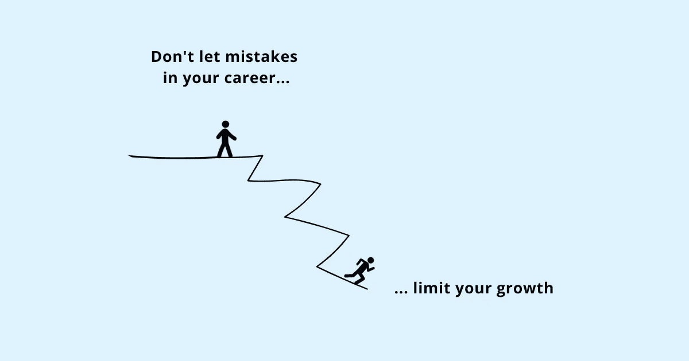

# 不惜一切代价避免的 8 个限制职业发展的常见错误

> 原文：<https://betterprogramming.pub/8-common-career-limiting-mistakes-to-avoid-at-all-costs-6d7960f4edae>

## 不是你说的每件事都会引人注目。但是除非你也愿意冒险表达你的观点，否则你不会有所作为

在你的职业生涯中，每向前迈一步，你会后退多少步？你是否积极承认并关注限制你职业生涯的错误？

那些在工作中取得成功的人并没有特殊的技能和能力。他们并不比别人更聪明或更有才华。让他们脱颖而出的是他们在每一步中做出的小决定——他们如何表现并给别人留下印象，他们如何处理工作中的挑战性情况，以及他们如何掌控自己的成长而不是责怪他人。

这些小事情可能看起来微不足道，但不断重复，它们会成为你职业成功的重要组成部分。

如果你因自己的成长与努力不一致而感到沮丧，请找出你正在犯的限制职业发展的错误。

# 1.太骄傲而不愿寻求帮助

当你陷入工作困境或者发现事情很难做的时候，你会怎么做？

认为[寻求帮助](https://www.techtello.com/how-to-ask-for-help/)会让你显得无能可以阻止你向别人伸出援手。你的自负可能会妨碍你。

当你需要支持时拒绝寻求支持会让你慢下来。让一个问题悬而未决太久会让一个小问题变成一个大问题。将自我置于进步之上是很多人都会犯的限制职业生涯的错误。

当你需要帮助的时候寻求帮助并不会让你变得无能，这只是表明你意识到了自己的局限性。工作上的成功不是“单干”它需要他人的支持。

> 无畏的付出已经够难了，无畏的接受更难。
> 
> 但是在这种交换中隐藏着最困难的事情:
> 
> 去问问。毫无羞耻。
> 
> 接受人们提供的帮助。
> 
> 不要强迫他们。
> 
> 只是为了让他们。
> 
> ―阿曼达·帕尔默

# 2.将工作置于关系之上

为了节省时间，你经常在办公桌上吃午饭吗？比起反馈讨论，你会优先考虑开发新功能吗？你是否从一个会议赶到另一个会议，而没有停下来与人交流？

把工作放在首位，而不是去了解你的同事，出去玩，和他们一起度过一些有趣的时光，这是一个严重的职业限制错误。

即使你把醒着的每一分钟都用来工作，你的工作也不会完成。总会有别的事情——另一项任务或另一个问题会吸引你的注意力。

没有人会记得你解决一个问题花了多少时间。但是他们会记得你是如何与他们联系的。由于工作中的大量时间都花在了与他人的合作上，所以与人建立关系有助于更容易地完成工作。

你不必特意去建立有意义的联系。寻找小机会——在会议间隙与人聊天，休息一会儿，利用这段时间与人交流，或者在喝咖啡的时候与他人交谈。

了解工作之外的其他人不仅会让工作更有意义，还会为你打开新的机会。当其他人[信任你的时候，他们更愿意和你一起工作。](https://www.techtello.com/leading-with-trust/)

# 3.保持安静

你开会时保持沉默吗？假设你没有什么有意义的话要说，或者说出来会让你看起来很蠢，你会犹豫要不要分享你的观点？

把要说的话留给自己是安全的，但也限制了你的职业生涯。除非别人知道你的想法，否则你不能被委以更高层次的责任。说服别人接受你的想法并让别人听到你的想法是一项伟大的领导技能。

一开始说出来很吓人。但是就像其他技能一样，它只会随着实践和经验而变得更好。毫不犹豫地说出你要说的话，不用担心别人会怎么想。

畅所欲言给了你发言权。别人可以用那种声音来识别你。他们能认识到你是一个有自己想法和观点的人。不是你说的每件事都会引人注目。但是除非你也愿意冒险表达你的观点，否则你不会有所作为。

# 4.对一切都说好

你对你遇到的每件事都说好吗？你认为额外努力工作会让你看起来很好吗？

认为通过你工作的时间来认可你是一个神话。工作不再关乎数量，而是你投入时间的质量。

在工作中得到认可的人并不是最忙的。他们以用更少的时间做更多的事情而闻名。富有成效，聪明地工作，做很少的事情，并把它们做好，比努力工作更有价值。

对所有事情说“是”会限制你的职业生涯。忙于无关紧要的活动会让你失去重要的机会。长时间工作的副作用——精疲力尽和筋疲力尽——不容小觑。它们不仅限制了你的职业生涯，还对你的心理健康和个人幸福有害。

不要对每件事都说“是”,而是要抬起头来，认清什么是值得你花时间去做的。你的优势是什么，如何利用这些优势产生最大的影响？

> 说不容易，说是容易。不就是对一件事说不。对一千件事情说是就是不。不，是精密仪器，外科医生的手术刀，聚焦于一点的激光束。是的是一个钝器，一根棍棒，一张无所不包的渔人网。不具体。是的是将军——杰森·弗里德

# 5.专注于做好人

你试图向别人证明你有多聪明吗？你评价一切都是为了提高你的自尊吗？

当你专注于“变得优秀”时，你更少关心学习，更多关心证明。你的自我价值感与特定的结果联系在一起。你没有接受挑战和培养新技能，而是稳扎稳打，做一些对你来说相对容易、让你看起来不错的事情。

做任何事情都以表现出有能力和才华为目标，这是一个很难看到的职业限制错误。除非你是一个有自我意识的人，否则你可能不会注意到驱动你决策过程的思维过程。

与其努力变得优秀，不如专注于[变得更好](https://www.techtello.com/fixed-mindset-vs-growth-mindset/)——尽你所能成为最有能力的人，而不是证明你已经是了。

当你试图变得更好时，你会更少地关注于实现某个结果，而更多地关注于提高你的技能和能力。这是关于重新设定期望值，使之与你正在取得的进步保持一致。你每天进步了多少？什么策略在起作用？你需要实施什么解决方案来克服意想不到的障碍和挑战？

海蒂·格兰特解释说:“当你追求优秀的目标时，你很容易成为自我实现的悲剧预言的受害者——相信你没有所需要的，你停止尝试，这注定你会失败。这当然只会强化(错误的)信念，即你一开始就不具备所需的条件。”

她提倡变得更好—

> 当我们追求精通(变得更好)的目标时，我们不太可能将我们的困难和糟糕的表现归咎于缺乏能力，因为那没有意义。我当然缺乏能力——我还没有掌握这个！相反，我们寻找其他更可控的原因。我是否为学习这些材料付出了足够的努力？我应该使用不同的策略吗？我应该向专家求助吗？当人们在追求变得更好的目标时陷入困境，他们不会像乐观者那样沮丧和无助——他们会采取行动

# 6.太害怕站出来

你担心陈述一个矛盾的观点会让你看起来很糟糕吗？即使你不同意这个决定，你还是倾向于支持大多数人吗？

融入而不是突出可能感觉安全，但是做其他人都在做的事情会导致平庸。与他人意见相左会让你在一段时间内不受欢迎，但从长远来看，这些意见相左的积极影响会让你赢得信任和尊重。

> 领导者的真正标志是愿意坚持大胆的行动路线——非传统的商业战略、独特的产品开发路线图、有争议的营销活动——即使世界上的其他人都想知道为什么你不与现状同步前进。换句话说，真正的领导者乐于曲折前进，而其他人则乐于曲折前进。他们明白，在一个高度竞争和不间断破坏的时代，从人群中脱颖而出的唯一方法是代表一些特别的东西——比尔·泰勒

不要因为做别人都在做的事情而限制了你的职业生涯。练习用你独特的想法和观点站出来的勇气。

# 7.以消极的观点开始

你是否有不断抱怨或者把一个完美的结果变成一个不令人满意的结果的倾向？你对挑战和挫折持消极态度吗？

你愤世嫉俗、悲观和失败主义的行为不仅会耗尽你的情绪，还会影响你周围的人。一旦他们陷入你的消极中，就会影响他们的工作效率。

不断抱怨和痛苦是一个限制职业生涯的大错误。你可能会认为你只是通过分享你的担忧和可能出错的地方来保持谨慎，但你的负能量对他人有着如此毁灭性的影响，以至于让他们怨恨你。

不要做一个问题装腔作势的人，而要做一个解决方案的提供者。与其抱怨，不如承担责任。不要只谈论什么可能出错，也要分享什么可能有效。当别人将你视为解决方案的一部分，而不是一个问题时，这改变了他们的视角。

# 8.保持低调

你认为仅仅做好工作就能得到你应得的认可吗？你认为你的工作会自己说话，别人会看到你的才华和能力吗？

在把职业生涯交给别人的时候，低着头专注于做出自己最好的作品是一个很大的错误。

努力工作和正确技能的结合对于在工作中脱颖而出很重要，但这往往还不够。在当今快节奏的工作环境中，别人看不到你。你必须让自己引人注目。

不要贬低你的成就，把它们公开给每个人看。不要对赞美或恭维不屑一顾，带着感激之情承认并接受你真正应得的。无情的为自己主张。谈论你的优势和你带来的东西并不是吹牛。确保别人理解你的价值是必要的。

# 摘要

1.  不要让你的自负阻碍了你取得有意义的进步。需要的时候寻求帮助。这并不反映你的能力，而是让你成为一个高度自我意识的人。
2.  做好工作，但也要花时间建立关系。与他人联系会带来满足感，也会带来新的机会。
3.  不要害怕表达你的观点。即使你有最好的想法也没关系。重要的是你是否分享它们。
4.  不要对每件事都说是，优先考虑影响和价值创造。
5.  专注于学习，而不是证明你的聪明和智慧。
6.  当你不同意别人的意见时，要说出来。不要随波逐流，要有勇气脱颖而出。
7.  消极导致怨恨。与其带来问题，不如用解决方案来引导。
8.  做伟大的工作，但不要让自己隐形。偶尔吹嘘一下自己是必要的。

在 Twitter 上关注我，了解更多故事。

*这个故事最初发表于*[*【https://www.techtello.com】*](https://www.techtello.com/career-limiting-mistakes/)*。*