# Javascript 中的 8 种常见数据结构

> 原文：<https://betterprogramming.pub/8-common-data-structures-in-javascript-3d3537e69a27>

## 更好地了解数据结构是如何工作的

这听起来熟悉吗:“我通过完成兼职课程开始前端开发”

你可能希望提高你的计算机科学基础知识，尤其是数据结构和算法。今天我们将讨论一些常见的数据结构，并用 JavaScript 实现它们。

希望这篇文章能补充你的技能！

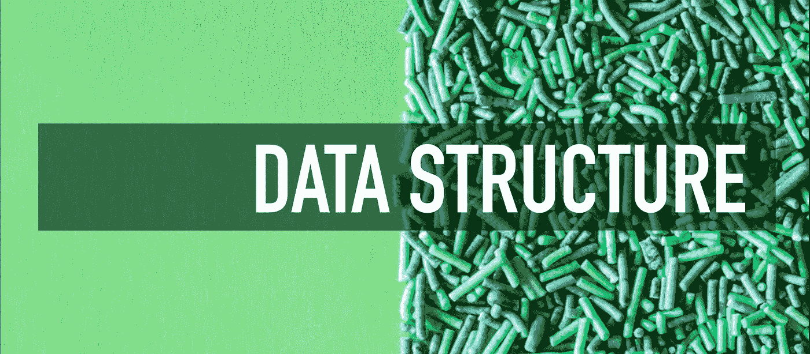

## **1。堆栈**

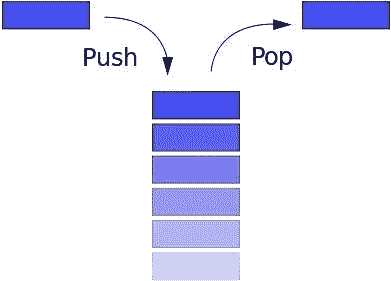

堆栈遵循后进先出的原则。如果你叠书，最上面的书会比最下面的先拿走。或者当您浏览互联网时，后退按钮会将您带到最近浏览的页面。

Stack 有这些常用的方法:

*   `push`:输入新元素
*   `pop`:移除顶部元素，返回移除的元素
*   `peek`:返回顶层元素
*   `length`:返回堆栈中元素的个数

Javascript 中的数组具有栈的属性，但是我们通过使用`function Stack()`从零开始构造一个栈

```
function Stack() {
this.count = 0;
  this.storage = {};

  this.push = function (value) {
    this.storage[this.count] = value;
    this.count++;
  }

  this.pop = function () {
    if (this.count === 0) {
      return undefined;
    }
    this.count--;
    var result = this.storage[this.count];
    delete this.storage[this.count];
    return result;
  }

  this.peek = function () {
    return this.storage[this.count - 1];
  }

  this.size = function () {
    return this.count;
  }
}
```

## **2。队列**

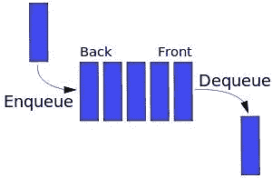

队列类似于堆栈。唯一的区别是队列使用 FIFO 原则(先进先出)。换句话说，当你排队等车时，总是第一个上车。

队列有以下方法:

*   `enqueue`:进入队列，在末尾增加一个元素
*   `dequeue`:离开队列，移除前面的元素并返回
*   `front`:获取第一个元素
*   `isEmpty`:判断队列是否为空
*   `size`:获取队列中元素的数量

JavaScript 中的数组具有队列的一些属性，所以我们可以用数组来构造一个队列的例子:

```
function Queue() {
  var collection = [];
  this.print = function () {
    console.log(collection);
  }
  this.enqueue = function (element) {
    collection.push(element);
  }
  this.dequeue = function () {
    return collection.shift();
  }
  this.front = function () {
    return collection[0];
  }

  this.isEmpty = function () {
    return collection.length === 0;
  }
  this.size = function () {
    return collection.length;
  }
}
```

## **优先队列**

队列有另一个高级版本。为每个元素分配优先级，它将根据优先级进行排序:

```
function PriorityQueue() {

  ...

  this.enqueue = function (element) {
    if (this.isEmpty()) {
      collection.push(element);
    } else {
      var added = false;
      for (var i = 0; i < collection.length; i++) {
        if (element[1] < collection[i][1]) {
          collection.splice(i, 0, element);
          added = true;
          break;
        }
      }
      if (!added) {
        collection.push(element);
      }
    }
  }
}
```

测试它:

```
var pQ = new PriorityQueue();
pQ.enqueue([ gannicus , 3]);
pQ.enqueue([ spartacus , 1]);
pQ.enqueue([ crixus , 2]);
pQ.enqueue([ oenomaus , 4]);
pQ.print();
```

结果:

```
[
  [  spartacus , 1 ],
  [  crixus , 2 ],
  [  gannicus , 3 ],
  [  oenomaus , 4 ]
]
```

## **3。链表**


从字面上看，链表是一个链式的数据结构，每个节点由两条信息组成:该节点的数据和指向下一个节点的指针。链表和传统数组都是串行存储的线性数据结构。当然，他们也有不同之处:

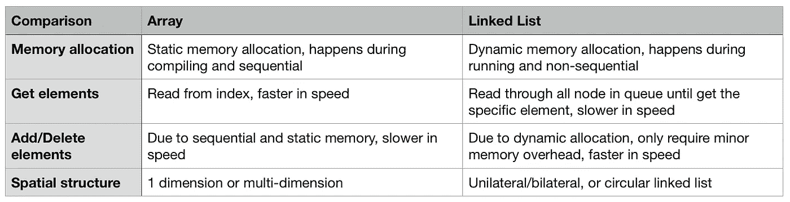

单向链表通常有以下方法:

*   `size`:返回节点数
*   `head`:返回头部元素
*   `add`:在尾部添加另一个节点
*   `remove`:删除某个节点
*   `indexOf`:返回一个节点的索引
*   `elementAt`:返回索引的节点
*   `addAt`:在特定索引处插入一个节点
*   `removeAt`:删除特定索引处的节点

```
/** Node in the linked list **/
function Node(element) {  
    // Data in the node
    this.element = element;  
    // Pointer to the next node 
    this.next = null;
}
    function LinkedList() {  
        var length = 0;  
        var head = null;  
        this.size = function () {    
            return length;  
        }  
        this.head = function () {    
            return head;  
        }  
        this.add = function (element) {    
            var node = new Node(element);    
            if (head == null) {      
                head = node;    
            } else {      
                var currentNode = head;      
                while (currentNode.next) {        
                    currentNode = currentNode.next;      
                }      
                currentNode.next = node;    
            }    
            length++;  
        }  
        this.remove = function (element) {    
            var currentNode = head;    
            var previousNode;    
            if (currentNode.element === element) {      
                head = currentNode.next;    
            } else {      
                while (currentNode.element !== element) {        
                    previousNode = currentNode;        
                    currentNode = currentNode.next;      
                }      
                previousNode.next = currentNode.next;    
            }    
            length--;  
        }  
        this.isEmpty = function () {    
            return length === 0;  
        }  
        this.indexOf = function (element) {    
            var currentNode = head;    
            var index = -1;    
            while (currentNode) {      
                index++;      
                if (currentNode.element === element) {        
                    return index;      
                }      
                currentNode = currentNode.next;    
            }    
            return -1;  
        }  
        this.elementAt = function (index) {    
            var currentNode = head;    
            var count = 0;    
            while (count < index) {      
                count++;      
                currentNode = currentNode.next;    
            }    
            return currentNode.element;  
        }  
        this.addAt = function (index, element) {    
            var node = new Node(element);    
            var currentNode = head;    
            var previousNode;    
            var currentIndex = 0;    
            if (index > length) {      
                return false;    
            }    
            if (index === 0) {      
                node.next = currentNode;      
                head = node;    
            } else {      
                while (currentIndex < index) {        
                    currentIndex++;        
                    previousNode = currentNode;        
                    currentNode = currentNode.next;      
                }      
                node.next = currentNode;      
                previousNode.next = node;    
            }    
            length++;  
        }  
        this.removeAt = function (index) {    
            var currentNode = head;    
            var previousNode;    
            var currentIndex = 0;    
            if (index < 0 || index >= length) {      
                return null;    
            }    
            if (index === 0) {      
                head = currentIndex.next;    
            } else {      
                while (currentIndex < index) {        
                    currentIndex++;        
                    previousNode = currentNode;        
                    currentNode = currentNode.next;      
                }      
                previousNode.next = currentNode.next;    
            }    
            length--;    
            return currentNode.element;  
        }
    }
```

## **4。设置**

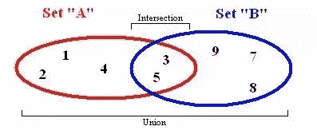

集合是数学中的一个基本概念:定义明确的不同对象的集合。ES6 引入了集合的概念，集合与数组有一定程度的相似性。但是，集合不允许重复元素，并且不被索引。

典型的集合有如下方法:

*   `values`:返回集合中的所有元素
*   `size`:返回元素个数
*   `has`:判断一个元素是否存在
*   `add`:将元素插入集合
*   `remove`:从集合中删除元素
*   `union`:返回两个集合的交集
*   `difference`:返回两套的差额
*   `subset`:判断某个集合是否是另一个集合的子集

为了区分 ES6 中的`set`,我们在下面的示例中声明为`MySet`:

```
function MySet() {  
    var collection = [];  
    this.has = function (element) {    
        return (collection.indexOf(element) !== -1);  
    }  
    this.values = function () {    
        return collection;  
    }  
    this.size = function () {    
        return collection.length;  
    }  
    this.add = function (element) {    
        if (!this.has(element)) {      
            collection.push(element);      
            return true;    
        }    
        return false;  
    }  
    this.remove = function (element) {    
        if (this.has(element)) {      
            index = collection.indexOf(element);      
            collection.splice(index, 1);      
            return true;    
        }    
        return false;  
    }  
    this.union = function (otherSet) {    
        var unionSet = new MySet();    
        var firstSet = this.values();    
        var secondSet = otherSet.values();    
        firstSet.forEach(function (e) {      
            unionSet.add(e);    
        });    
        secondSet.forEach(function (e) {      
            unionSet.add(e);    
        });    
        return unionSet;  }  
        this.intersection = function (otherSet) {    
            var intersectionSet = new MySet();    
            var firstSet = this.values();    
            firstSet.forEach(function (e) {      
                if (otherSet.has(e)) {        
                    intersectionSet.add(e);      
                }    
            });    
            return intersectionSet;  
        }  
        this.difference = function (otherSet) {    
            var differenceSet = new MySet();    
            var firstSet = this.values();    
            firstSet.forEach(function (e) {      
                if (!otherSet.has(e)) {        
                    differenceSet.add(e);      
                }    
            });    
            return differenceSet;  
        }  
        this.subset = function (otherSet) {    
            var firstSet = this.values();    
            return firstSet.every(function (value) {      
                return otherSet.has(value);    
            });  
        }
    }
```

## **5。Hast 表**

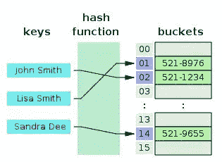

哈希表是一种键值数据结构。由于通过键查询一个值的速度非常快，所以它通常用于地图、字典或对象数据结构中。如上图所示，哈希表使用一个`hash function`将键转换成一列数字，这些数字作为对应键的值。用 key 取值速度极快，时间复杂度可以达到 O(1)。相同的键必须返回相同的值，这是哈希函数的基础。

哈希表有以下方法:

*   `add`:添加一个键值对
*   `remove`:删除键值对
*   `lookup`:使用键查找相应的值

Javascript 中简化哈希表的示例:

```
function hash(string, max) {
  var hash = 0;
  for (var i = 0; i < string.length; i++) {
    hash += string.charCodeAt(i);
  }
  return hash % max;
}

function HashTable() {
  let storage = [];
  const storageLimit = 4;

  this.add = function (key, value) {
    var index = hash(key, storageLimit);
    if (storage[index] === undefined) {
      storage[index] = [
        [key, value]
      ];
    } else {
      var inserted = false;
      for (var i = 0; i < storage[index].length; i++) {
        if (storage[index][i][0] === key) {
          storage[index][i][1] = value;
          inserted = true;
        }
      }
      if (inserted === false) {
        storage[index].push([key, value]);
      }
    }
  }

  this.remove = function (key) {
    var index = hash(key, storageLimit);
    if (storage[index].length === 1 && storage[index][0][0] === key) {
      delete storage[index];
    } else {
      for (var i = 0; i < storage[index]; i++) {
        if (storage[index][i][0] === key) {
          delete storage[index][i];
        }
      }
    }
  }

  this.lookup = function (key) {
    var index = hash(key, storageLimit);
    if (storage[index] === undefined) {
      return undefined;
    } else {
      for (var i = 0; i < storage[index].length; i++) {
        if (storage[index][i][0] === key) {
          return storage[index][i][1];
        }
      }
    }
  }
}
```

## 6。树

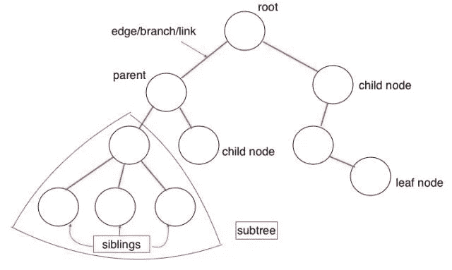

树形数据结构是一种多层结构。与数组、堆栈和队列相比，它也是一种非线性数据结构。这种结构在插入和搜索操作中非常高效。让我们来看看树数据结构的一些概念:

*   `root`:树的根节点，根没有父节点
*   `parent node`:上层的直接节点，只有一个
*   `child node`:下级的直接节点，可以有多个
*   `siblings`:共享同一个父节点
*   `leaf`:无子节点
*   `Edge`:节点间的分支或链接
*   `Path`:从起始节点到目标节点的边
*   `Height of Node`:特定节点到叶节点的最长路径的边数
*   `Height of Tree`:根节点到叶节点的最长路径的边数
*   `Depth of Node`:从根节点到特定节点的边数
*   `Degree of Node`:子节点数

这里有一个二叉查找树的例子。每个节点最多有两个节点，左边的节点小于当前节点，右边的节点大于当前节点:

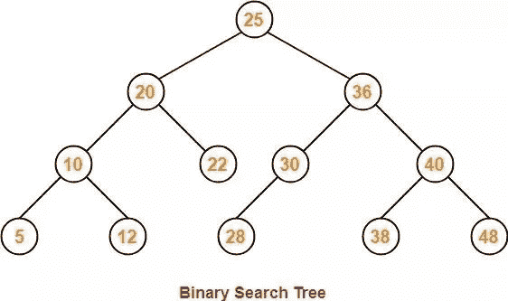

二叉查找树的常用方法:

*   `add`:在树中插入一个节点
*   `findMin`:获取最小节点
*   `findMax`:获取最大节点
*   `find`:搜索特定节点
*   `isPresent`:判断某个节点的存在
*   `remove`:从树中删除一个节点

JavaScript 中的示例:

```
class Node {
  constructor(data, left = null, right = null) {
    this.data = data;
    this.left = left;
    this.right = right;
  }
}

class BST {
  constructor() {
    this.root = null;
  }

  add(data) {
    const node = this.root;
    if (node === null) {
      this.root = new Node(data);
      return;
    } else {
      const searchTree = function (node) {
        if (data < node.data) {
          if (node.left === null) {
            node.left = new Node(data);
            return;
          } else if (node.left !== null) {
            return searchTree(node.left);
          }
        } else if (data > node.data) {
          if (node.right === null) {
            node.right = new Node(data);
            return;
          } else if (node.right !== null) {
            return searchTree(node.right);
          }
        } else {
          return null;
        }
      };
      return searchTree(node);
    }
  }

  findMin() {
    let current = this.root;
    while (current.left !== null) {
      current = current.left;
    }
    return current.data;
  }

  findMax() {
    let current = this.root;
    while (current.right !== null) {
      current = current.right;
    }
    return current.data;
  }

  find(data) {
    let current = this.root;
    while (current.data !== data) {
      if (data < current.data) {
        current = current.left
      } else {
        current = current.right;
      }
      if (current === null) {
        return null;
      }
    }
    return current;
  }

  isPresent(data) {
    let current = this.root;
    while (current) {
      if (data === current.data) {
        return true;
      }
      if (data < current.data) {
        current = current.left;
      } else {
        current = current.right;
      }
    }
    return false;
  }

  remove(data) {
    const removeNode = function (node, data) {
      if (node == null) {
        return null;
      }
      if (data == node.data) {
        // no child node
        if (node.left == null && node.right == null) {
          return null;
        }
        // no left node
        if (node.left == null) {
          return node.right;
        }
        // no right node
        if (node.right == null) {
          return node.left;
        }
        // has 2 child nodes
        var tempNode = node.right;
        while (tempNode.left !== null) {
          tempNode = tempNode.left;
        }
        node.data = tempNode.data;
        node.right = removeNode(node.right, tempNode.data);
        return node;
      } else if (data < node.data) {
        node.left = removeNode(node.left, data);
        return node;
      } else {
        node.right = removeNode(node.right, data);
        return node;
      }
    }
    this.root = removeNode(this.root, data);
  }
}
```

测试它:

```
const bst = new BST();
bst.add(4);
bst.add(2);
bst.add(6);
bst.add(1);
bst.add(3);
bst.add(5);
bst.add(7);
bst.remove(4);
console.log(bst.findMin());
console.log(bst.findMax());
bst.remove(7);
console.log(bst.findMax());
console.log(bst.isPresent(4));
```

结果:

```
1
7
6
false
```

## **7。Trie** (读作“尝试”)

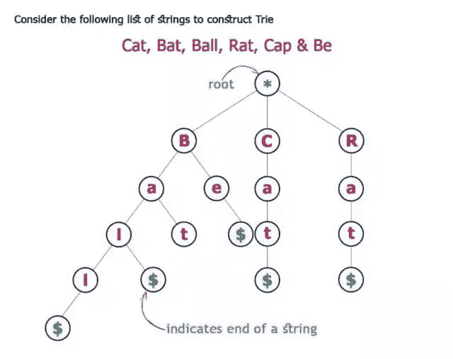

Trie 或“前缀树”也是一种搜索树。Trie 逐步存储数据—树中的每个节点代表一个步骤。Trie 用于存储词汇，因此可以快速搜索，特别是对于自动完成的功能。

Trie 中的每个节点都有一个字母表，跟随分支可以组成一个完整的单词。它还包括一个布尔指示器，用于显示这是否是最后一个字母表。

Trie 有以下方法:

*   `add`:将单词插入字典树
*   `isWord`:判断树是否由某个单词组成
*   `print`:返回树中的所有单词

```
/** Node in Trie **/
function Node() {  
    this.keys = new Map();  
    this.end = false;  
    this.setEnd = function () {    
        this.end = true;  
    };  
    this.isEnd = function () {    
        return this.end;  
    }
}

function Trie() {  
        this.root = new Node();  
        this.add = function (input, node = this.root) {    
            if (input.length === 0) {     
                node.setEnd();      
                return;    
            } else if (!node.keys.has(input[0])) {      
                node.keys.set(input[0], new Node());      
                return this.add(input.substr(1), node.keys.get(input[0]));    
            } else {      
                return this.add(input.substr(1), node.keys.get(input[0]));    
            }  
        }  
        this.isWord = function (word) {    
            let node = this.root;    
            while (word.length > 1) {      
                if (!node.keys.has(word[0])) {        
                    return false;      
                } else {        
                    node = node.keys.get(word[0]);       
                    word = word.substr(1);      
                }    
            }    
            return (node.keys.has(word) && node.keys.get(word).isEnd()) ? true : false;  
        }  
            this.print = function () {    
                let words = new Array();    
                let search = function (node = this.root, string) {      
                    if (node.keys.size != 0) {        
                        for (let letter of node.keys.keys()) {          
                            search(node.keys.get(letter), string.concat(letter));        
                        }        
                        if (node.isEnd()) {          
                            words.push(string);        
                        }      
                    } else {        
                        string.length > 0 ? words.push(string) : undefined;        
                        return;      
                    }    
                };    
                search(this.root, new String());    
                return words.length > 0 ? words : null;  
    }
}
```

## **8。图表**

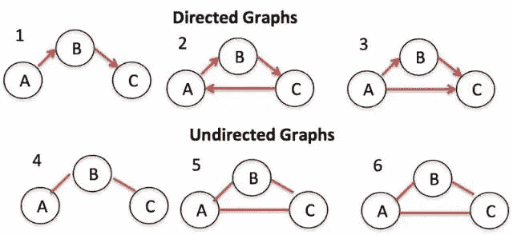

图，有时被称为网络，是指具有链接(或边)的节点集。它可以进一步分为两组(即有向图和无向图)，根据链接是否有方向。Graph 在我们的生活中应用广泛——在导航 app 中计算最佳路线，或者在社交媒体中向好友推荐，举两个例子。

图表有两种显示方式:

**邻接表**

在这个方法中，我们在左边列出所有可能的节点，在右边显示连接的节点。

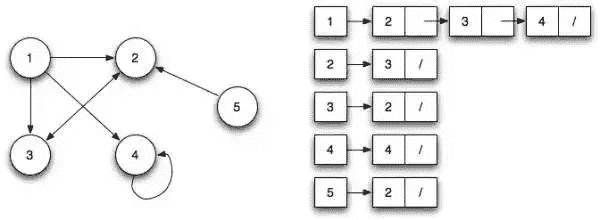

**邻接矩阵**

邻接矩阵显示行和列中的节点，行和列的交叉点解释节点之间的关系，0 表示不链接，1 表示链接，> 1 表示不同的权重。

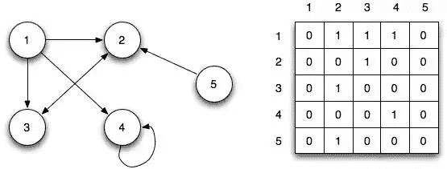

要查询图中的节点，必须用呼吸优先搜索(BFS)法或深度优先搜索(DFS)法搜索整个树形网络。

让我们看一个 Javascript 中的 BFS 的例子:

```
function bfs(graph, root) {
  var nodesLen = {};
  for (var i = 0; i < graph.length; i++) {
    nodesLen[i] = Infinity;
  }
  nodesLen[root] = 0;
  var queue = [root];
  var current;
  while (queue.length != 0) {
    current = queue.shift();

    var curConnected = graph[current];
    var neighborIdx = [];
    var idx = curConnected.indexOf(1);
    while (idx != -1) {
      neighborIdx.push(idx);
      idx = curConnected.indexOf(1, idx + 1);
    }
    for (var j = 0; j < neighborIdx.length; j++) {
      if (nodesLen[neighborIdx[j]] == Infinity) {
        nodesLen[neighborIdx[j]] = nodesLen[current] + 1;
        queue.push(neighborIdx[j]);
      }
    }
  }
  return nodesLen;
}
```

测试它:

```
var graph = [
  [0, 1, 1, 1, 0],
  [0, 0, 1, 0, 0],
  [1, 1, 0, 0, 0],
  [0, 0, 0, 1, 0],
  [0, 1, 0, 0, 0]
];
console.log(bfs(graph, 1));
```

结果:

```
{
  0: 2,
  1: 0,
  2: 1,
  3: 3,
  4: Infinity
}
```

就这样——我们已经介绍了所有常见的数据结构，并给出了 JavaScript 示例。这应该会让你更好地了解数据结构在计算机中是如何工作的。编码快乐！