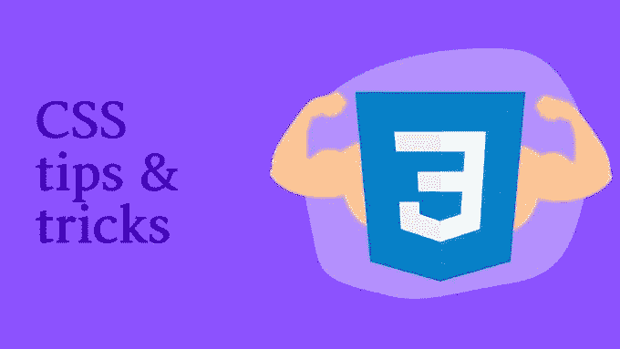
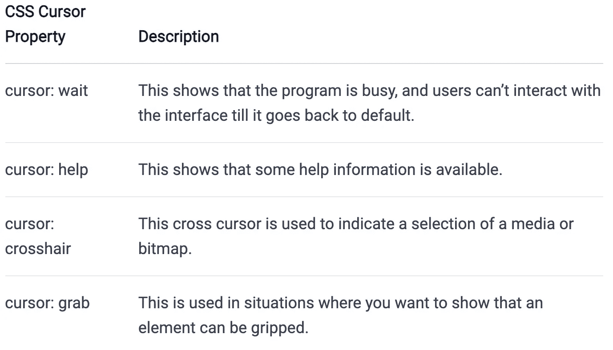
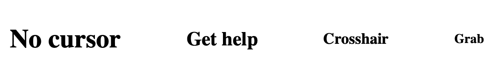
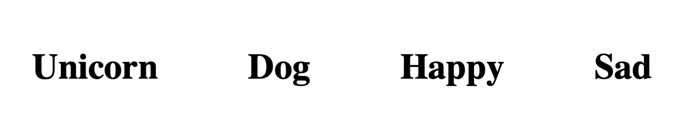
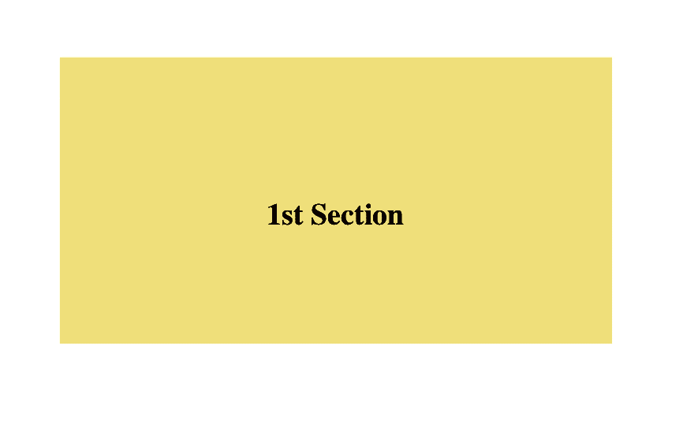
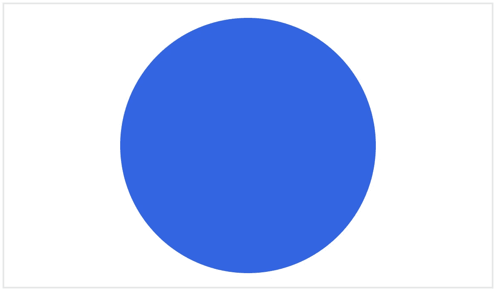
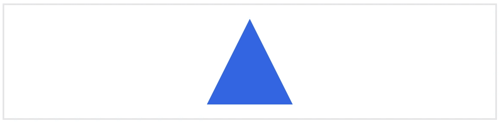
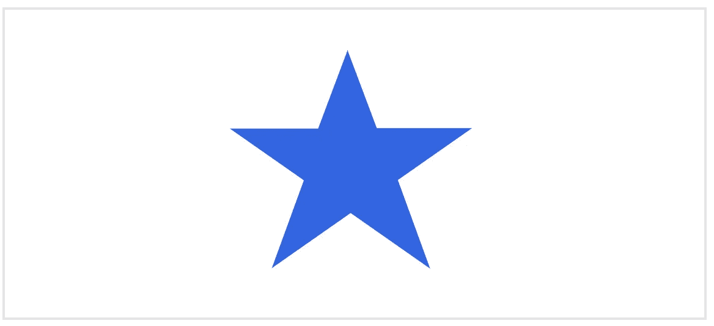
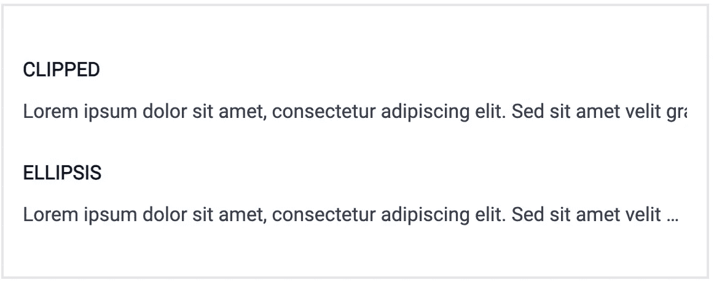
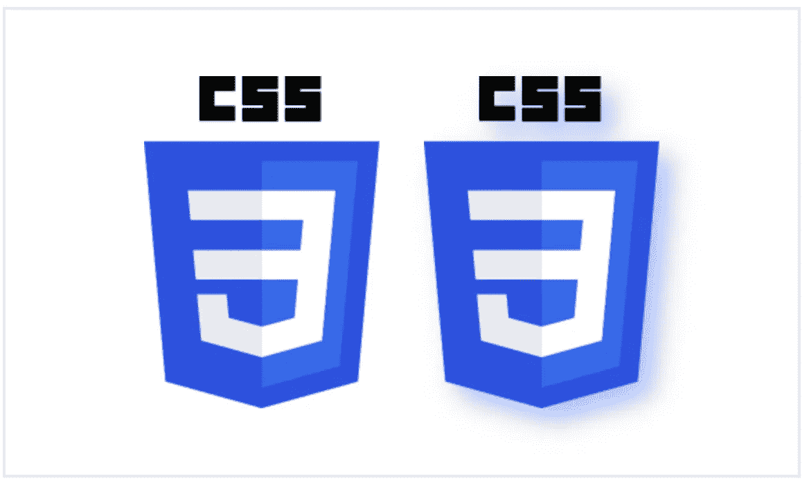

# 让你惊叹的 8 个 CSS 技巧和窍门

> 原文：<https://betterprogramming.pub/8-css-tips-and-tricks-to-wow-you-3629175dd6e2>

## 学习 CSS 的酷东西

## CSS 有成千上万的秘密——让我们探索几个很酷的秘密



作者图片

如果你认为 CSS 只是用来“美化”一个网站，给文本添加一些颜色，或者简单地制作酷的跳跃动画，那么你可能需要重新思考所有 CSS 的能力。已经厌倦了使用和搜索“如何在 CSS 中实现 X 或 Y？”还是只想知道 CSS 的实际威力？这篇文章将告诉你所有你需要知道的关于 CSS 特性的一些很棒的技巧和窍门。它着重于解释一些隐藏的但是有价值的事情，你可以用层叠样式表(CSS)来做。

整篇文章将依次涵盖以下主题:

```
1\. [Cursors](#6ca2)
2\. [CSS Smooth Scrolling](#f6d4)
3\. [CSS Shapes](#8da6)
4\. [Truncate Text With CSS](#ea1f)
5\. [Center Align With Flexbox](#e379)
6\. [Make a Drop Shadow](#f0df)
7\. [Create a Typewriter Effect](#7a81)
8\. [Use CSS Custom Properties](#883c)
```

那么，你准备好发现一些有趣和可怕的技巧了吗？我们开始吧！

# 1.光标

CSS 附带了一些内置类型的[光标](https://developer.mozilla.org/en-US/docs/Web/CSS/cursor)来满足你的需求。它们支持多种条件，这取决于网站界面当前的状态。例如，在加载项目时，您可能需要加载状态光标。这告诉用户后台正在进行某项操作，他们需要等待获取操作完成。

## 如何添加光标？

当鼠标光标指向 web 界面上的任何元素时，cursor 属性帮助您设置鼠标光标。以下是一些可用的标准光标:



光标解释表

## 例子

让我们看看如何实现这一点和输出。

```
<div>
	<div class="demo-waiting">Waiting...</div>
	<div class="demo-help">Get help</div>
	<div class="demo-crosshair">Crosshair</div>
	<div class="demo-grab">Grab</div>
</div>
```

这定义了嵌套在 div 容器中的四个不同级别的标题。我们希望 CSS 中的每一个都有不同的光标值。我们是这样做的:

```
div.demo-waiting {
  cursor: wait;
}div.demo-help {
  cursor: help;
}div.demo-crosshair {
    cursor: crosshair;
}div.demo-grab {
    cursor: grab;
}
```

结果如下:



悬停在元素上时更改光标

## 添加自定义表情符号和图像光标！

想进一步自定义默认光标吗？有了 CSS，你可以用你最喜欢的图片或者表情符号代替那个无聊的光标！让我们制作以下演示来说明这一点:



更改光标以使用图像作为光标

看起来很酷，对吧？下面是这个例子的 CSS 代码:

```
.happy {
	cursor: url("https://s3-us-west-2.amazonaws.com/s.cdpn.io/9632/happy.png"), auto;
}

.sad { 
	cursor: url("https://s3-us-west-2.amazonaws.com/s.cdpn.io/9632/sad.png"), auto;
}
```

正如你所看到的，我们只需要使用带有两个参数的`url()`函数:第一个参数是表情符号或图像的链接(支持 SVG 和 png)，如果这不起作用，它将返回到系统光标的自动模式。在[官方文件](https://developer.mozilla.org/en-US/docs/Web/CSS/CSS_Basic_User_Interface/Using_URL_values_for_the_cursor_property)上了解更多信息。

# 2.CSS 平滑滚动

CSS 中的[平滑滚动特性](https://developer.mozilla.org/en-US/docs/Web/CSS/scroll-behavior)允许我们设置滚动被触发时滚动框的行为。它有两个简单的属性:自动和平滑。当设置为自动时，你会看到滚动框会立即滚动，而当设置为平滑时，它会使用由用户平台决定的计时功能平滑滚动。

## 示例:

这里最好的例子是当我们需要滚动到网页的特定部分时。

```
<div class="scroll-container">
  <h3 class="scroll-page scroll-page-1">1st Section</h3>
  <h3 class="scroll-page scroll-page-2">2nd Section</h3>
  <h3 class="scroll-page scroll-page-3">3rd Section</h3>
</div>
```

我们创建了一个父元素`scroll-container`,它包含三个具有不同类名的子元素。

```
.scroll-container {
  width: 350px;
  height: 200px;
  overflow-y: scroll;
  scroll-behavior: smooth;
}.scroll-page {
  display: flex;
  align-items: center;
  justify-content: center;
  height: 100%;
}.scroll-page-1 {
	background: #f0de7a;
}.scroll-page-2 {
	background: #afe69a;
}.scroll-page-3 {
	background: #b8b7cd;
}
```

在`scroll-container`类中，我们添加了`scroll-behavior: smooth;`属性，让我们可以平滑地滚动下一个子元素:



平滑滚动演示

# 3.CSS 形状

如果你想做一个自定义或预定义的形状，你只需要写一些基本的 CSS！不管是圆形，三角形，甚至是星形！让我们来看看如何制作它们。

## 围成一个圈:

```
<div class="circle"></div>
```

对，就是这样！你只需要一个 div 元素，其他的都由 CSS 处理。

```
div.circle {
  width: 300px;
  height: 300px;
  background: #2762e9;
  border-radius: 50%;
}
```

重要的是，我们需要给它一个相等的宽度和高度值，然后使用`[border-radius](https://developer.mozilla.org/en-US/docs/Web/CSS/border-radius)`属性来完全圆化边界。这给了我们一个圈子:



用 HTML 和 CSS 生成的圆圈

## 做一个三角形:

```
div.triangle {
  width: 0;
  height: 0;
  border-left: 50px solid transparent;
  border-right: 50px solid transparent;
  border-bottom: 100px solid #2762e9;
}
```

HTML 需要一个 div，就像在一个圆中一样，但是这里有两点需要注意:首先，确保将宽度和高度都设置为零。这确保了我们的形状不会超过给定的边界长度。第二，给出单独的左右边界，确保边界值相等，以获得完美的三角形和透明的颜色。

如果您在那里添加任何其他颜色值，它将显示在正方形的修剪部分。无论你想要三角形是什么颜色，都可以添加到`border-bottom`中。

接下来我们会看到:



用 HTML 和 CSS 生成的三角形

## 打造明星:

有了一个 div，我们就可以使用 [CSS 伪类](https://developer.mozilla.org/en-US/docs/Web/CSS/Pseudo-classes)，比如`:before`和`:after`，从同一个元素中制作额外的星形。

对于第一个规则集，我们需要用透明颜色值定义星形的基色、`bottom-right`和`bottom-left`边框，就像三角形一样。为了确保你的星星是直立的，我们需要将形状旋转 25 度，我们用`rotate(35deg)`变换来完成。

`:before`伪类做星顶三角。确保您给`border-bottom`的颜色与您在父规则中给的颜色相同。我们需要从形状的其余部分自由移动它，以便我们可以给它自定义顶部和左侧对齐。这就是为什么`position: absolute`在这里很重要。

最后，是时候制作对角线形状了。这里，`:after`伪类会有所帮助。同样，确保位置设置为绝对，旋转值在-70 度左右。这会给你一个完美排列的星星，如下图所示:



用 HTML 和 CSS 生成的星形

# 4.用 CSS 截断文本

想象一下，如果你在一个容器中有很多文本，你想只显示它的前两行，而其余的文本应该用一个椭圆(…)或任何其他符号来剪裁。你怎么能这样做？嗯，这里我们需要[文本溢出](https://developer.mozilla.org/en-US/docs/Web/CSS/text-overflow) CSS 属性。假设我们想要这样的东西:



删节与省略行为

正如您所看到的，在“剪辑”的演示中，第一行在第二句中一旦文本超过一定宽度就会被截断。与“省略号”演示相同，但是这里我们使用了额外的省略号来表示有更多的文本。

在 HTML 中，我们只需要一个容器来保存这两个文本元素。检查我们如何用 CSS 的下面几行来剪辑多余的两行。

要做到这一点，我们需要三样东西。首先，我们设置整个容器元素的总宽度，即 100%，然后在这两段中，我们添加:

*   `[white-space: nowrap](https://developer.mozilla.org/en-US/docs/Web/CSS/white-space)`:这将折叠容器中所有可用的空白。
*   `[overflow: hidden](https://developer.mozilla.org/en-US/docs/Web/CSS/overflow)`:为了适合`padding-box`，它会剪辑里面的任何内容。这就是为什么我们可以截断文本。最后，我们可以使用两种类型的文本溢出属性，即 clip 和 ellipsis，来获得所需的输出。

# 5.与 Flexbox 居中对齐

在 CSS 中使用 [flexbox](https://developer.mozilla.org/en-US/docs/Glossary/Flexbox) 的一个经典问题是如何将里面的内容居中对齐。不管是垂直的，水平的，还是两者都有。让我们假设我们希望我们上面做的圆在网页上垂直和水平居中。


带伸缩的水平和垂直居中的圆

在这里，圆圈周围的边界向我们展示了整个网页的主体，我们将圆圈置于中心。

首先，我们需要父容器(在 HTML 中)来容纳圆圈，即 flex-container。在里面，我们用简单的 div 来画圆。使用 CSS，我们需要使用以下与 flexbox 相关的重要属性:

*   `display: flex;`这将父容器设置为 flexbox 布局。
*   `align-items: center;`这将设置伸缩子对象与横轴中心的对齐。
*   `justify-content: center;`设置伸缩子组件对准[主轴](https://developer.mozilla.org/en-US/docs/Glossary/Main_Axis)的中心。

在那之后，我们有了在本文之前使用过的普通 circle CSS 代码。现在，圆圈在垂直和水平方向都居中，我们可以看到，在任何屏幕尺寸上，它都保持居中。

居中，尤其是用 CSS 垂直居中内容，是一个非常吸引人的话题，所以我们写了一整篇文章。要了解更多，请阅读我们的[使用 CSS 垂直居中内容指南。](https://livecodestream.dev/post/all-the-ways-you-can-vertically-center-content-in-css/)

# 6.制作阴影

属性允许我们给图片添加背景阴影效果。这使用了 [CSS 过滤器](https://developer.mozilla.org/en-US/docs/Web/CSS/filter-function)属性。假设我们想用投影显示这张图像:



左边是原始图像，右边是带有阴影的图像

正如你在图像中看到的，我们在主图像后面有一个淡蓝色的阴影。这可以使用以下代码来完成:

```
img.demo-shadow {
    filter: drop-shadow(10px 10px 10px #A4BBFF);
}
```

只需一行 CSS 代码，您就可以在任何图像上产生投影效果。它接受以下语法:

```
drop-shadow(offset-x offset-y blur-radius color)
```

因此，在我们的代码中，我们给我们的图像的水平偏移，垂直偏移，模糊半径分别为 10px，以及浅蓝色的十六进制颜色代码。

# 7.创建打字机效果

在 CSS 的帮助下，在文本上创建一个简单的打字机效果是可能的。我们需要明确两件事:第一是文本应该被剪辑，第二是实际的打字机动画给我们提供了我们需要的整体效果。看起来是这样的:


很酷的打字机效果演示！

让我们看看这里每个代码行的含义:

1.  我们将整个文本与`body`标签上的 flexbox 居中对齐。
2.  接下来，在标题上，我们添加了`overflow: hidden`,以确保在动画完成之前，句子的其余字母不会出现。
3.  为了使效果更加真实，我们添加了一个光标，这是通过使用`border-right`属性实现的。
4.  使用`white-space`是为了使整个文本内容位于一行中，并且没有文本环绕其容器。
5.  接下来，我们设置动画。我们有其中的两个:打字机动画简单地在三秒钟内将文本的整个宽度从 0 改变到 100%,而另一个光标动画被添加到我们在第 3 点中制作的光标上。这运行了一秒钟，它的边框颜色从透明变成了`#FF8D8D`。

# 8.使用 CSS 自定义属性(变量)

有时我们需要一些 CSS 值在多个位置或元素中使用。这些值可以在整个文档或整个 web 项目中重用。

一个常见的例子是网站的品牌颜色。说是#120078。现在，我们需要将它应用到我们的链接标签、按钮、广告容器等。现在多个页面将具有相同的值。

因此，为了避免每次都使用它，并且更容易找到特定的固定值，我们使用 CSS 自定义属性。这里有一个简单的例子来展示这种情况:

```
:root {
  --brand-bg-color: #120078;
}a  {
  color: white;
  background-color: var(--brand-bg-color);
}.main-link {
  color: var(--brand-bg-color);
  padding: 3px;
}
```

`--brand-bg-color`是我们的 CSS 变量，定义在项目样式的根上。它的值等于#120078。这意味着，每当我们在任何链接、按钮等中需要这种特定的颜色时，我们可以简单地将其用作`var(--brand-bg-color)`,而不是到处手动定义它。当我们想改变颜色时，它很有帮助。我们简单地更新了`--brand-bg-color`的值，它反映了它所使用的每个元素！

# 结论

就是这样！这些都是前端开发人员在他们的代码中常用的东西。有时它是关于添加一个动画，而其他时候我们需要一个 CSS 纯艺术的阴影，如三角形和星形。

我希望这对你有用；一定要把你的想法加入到每一个 CSS 技巧中！

感谢阅读！