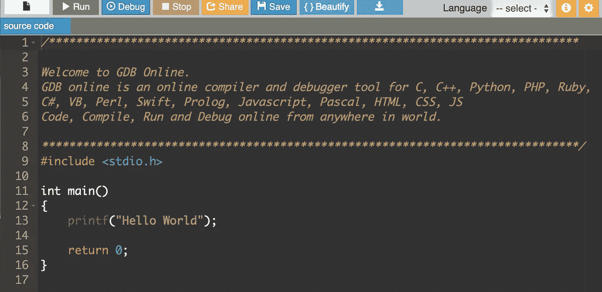
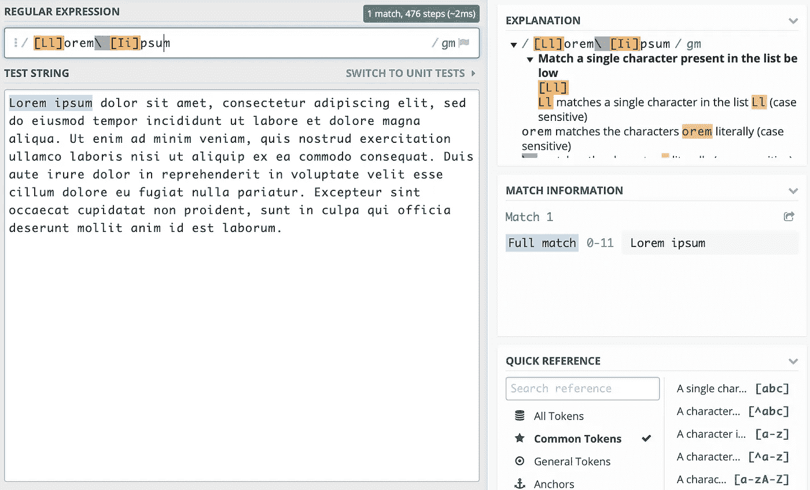
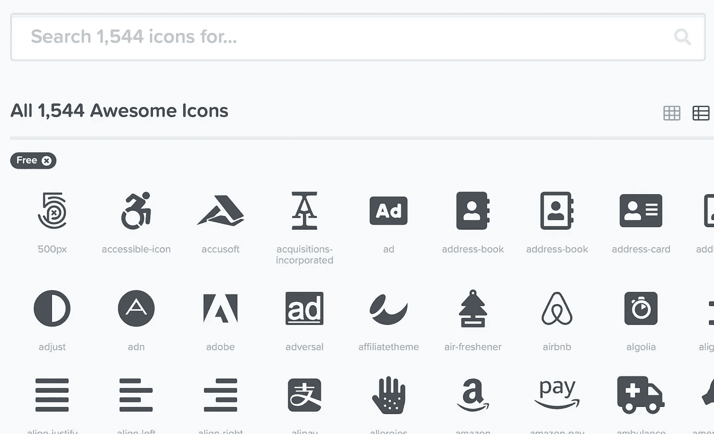
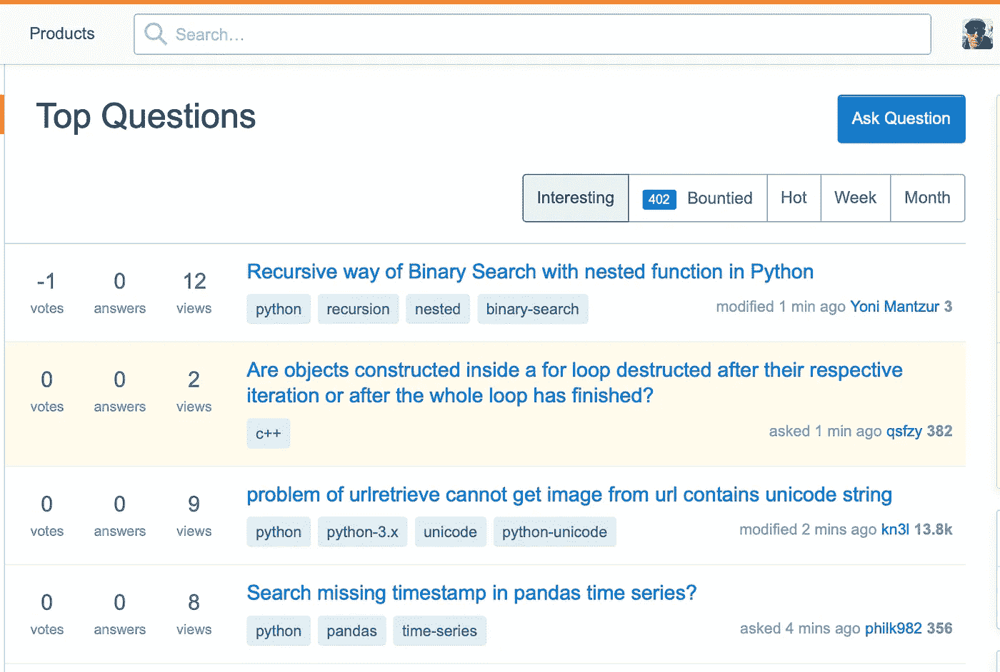
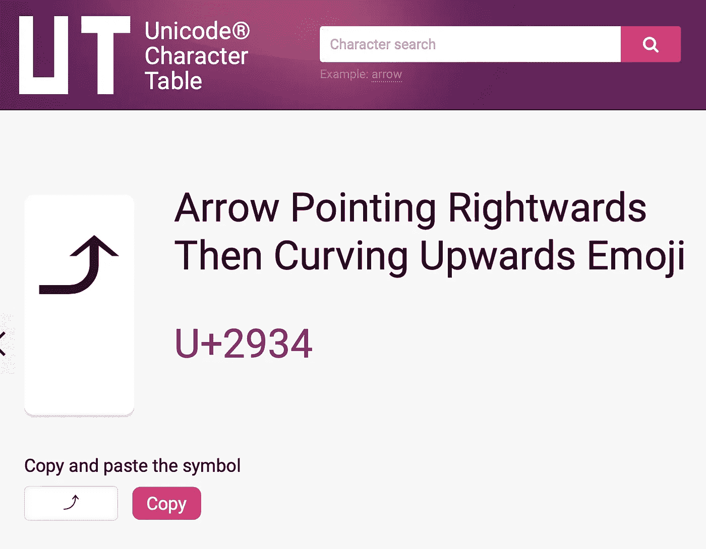
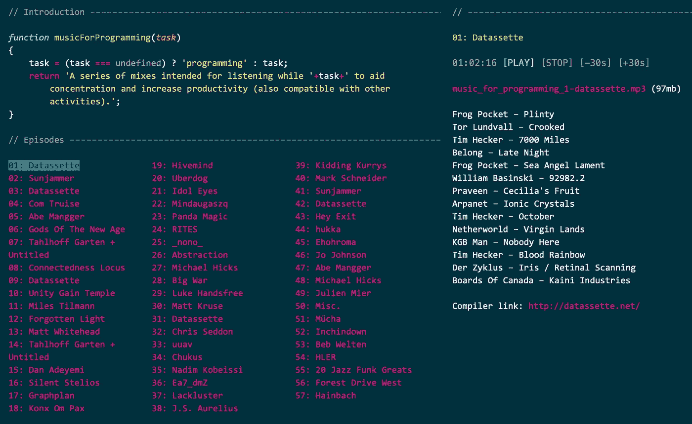

# 开发者必备的 8 款网络应用

> 原文：<https://betterprogramming.pub/8-essential-web-apps-for-developers-463ee6f4bd5a>

## 我日常工作流程中经常使用的网络应用

赫克托·马丁内斯在 [Unsplash](https://unsplash.com/s/photos/essential?utm_source=unsplash&utm_medium=referral&utm_content=creditCopyText) 上拍摄的照片

# 1.在线 GDB

[在线 GDB](https://www.onlinegdb.com) 是一个基于浏览器的编译器、解释器和调试器。它支持 20 种不同的语言，包括 C、C++、 [Python](https://www.python.org/) 、 [Ruby](https://www.ruby-lang.org/en/) 、C#、 [Swift](https://developer.apple.com/swift/) 和 JavaScript。

我发现它对于尝试简短的代码片段是非常宝贵的，没有启动 IDE 项目或终端会话的开销。

除了测试代码，这也是练习编程或探索一门新语言的好方法。

 [## GDB 在线调试器|编译器-代码，编译，运行，调试在线 C，C++

### 在线 GDB 是 C/C++的在线编译器和调试器。您可以使用 gdb online 编译、运行和调试代码。使用…

www.onlinegdb.com](https://www.onlinegdb.com) 

# 2.JSON 模式验证器

有许多在线的 JSON 验证工具，但是我发现 JSON 模式验证工具是最好的。我更喜欢它的原因是，它可以验证 JSON、JSON 模式，还可以根据用户定义的模式验证 JSON。

它还提供了大量预先存在的模式，可以根据这些模式来验证 JSON。我并不是每天都使用它，但是如果我在解析 JSON 文件时遇到问题，这是我解决问题的方法。

[https://www.jsonschemavalidator.net](https://www.jsonschemavalidator.net)

# 3.正则表达式 101

[这个应用](https://regex101.com)是探索[正则表达式](https://en.wikipedia.org/wiki/Regular_expression)的一个简单而聪明的方法！它允许粘贴任何文本，然后根据用户定义的正则表达式在该文本中查找匹配。

它不仅可以动态地找到匹配，还可以动态地解释正则表达式在做什么，包括当你输入错误时的错误。

 [## Regex101

### Regex101 允许你为 PHP、PCRE、Python、Golang 和…创建、调试、测试和解释你的表达式

regex101.com](https://regex101.com) 

# 4.字体真棒

Font Awesome 是一个在线图标目录，包含超过 1500 个免费图标。这些包括标准应用程序图标、品牌图标和其他有用的符号。

图标可以下载为 [OpenType](https://en.wikipedia.org/wiki/OpenType) 字体或 SVG 格式。在 web 应用程序中，可以使用图标标签通过 JavaScript 直接使用它们。

我发现字体牛逼在原型制作中特别有用，可以在正式设计完成之前快速将图标放入应用程序。

 [## 字体真棒

### 编辑描述

fontawesome.com](https://fontawesome.com) 

# 5.堆栈交换

如果我不得不选择*仅仅是* *一个*必要的web app，那将是[栈交换](https://stackexchange.com/)。

Stack Exchange 是一组问答网站，涵盖一系列主题。总的来说，它有超过 1100 万用户，这使它成为一个强大的资源。在编程专家网站 Stack Overflow 上，问题通常会在发布后几分钟内得到回答。

我学到了大量关于堆栈溢出的知识，它帮助我解决了许多现实世界中的问题。

如果你是一个初级或中级程序员，下次遇到困难时可以考虑去那里问问！如果你是高级的，也许*回答*一些问题。

[https://stackoverflow.com](https://stackoverflow.com/a/47497745/172218)

# 6.开源代码库

我感觉这个列表没有 [GitHub](https://github.com) 是不完整的！GitHub 是一个用于访问和管理 [Git](https://en.wikipedia.org/wiki/Git) 库的 web 服务。它还包括问题跟踪、wikis、项目发布和看板风格的项目板等特性。

通过 [GitHub pages](https://pages.github.com) ，它还提供基本的网站或博客托管。对我来说，GitHub 是管理、记录和发布软件项目所需的一切的一站式服务。

[https://github.com](https://pages.github.com)

# 7.Unicode 表

Unicode 表提供了一个庞大的可搜索的 Unicode 字符数据库。这包括音符、箭头、表情符号、货币、数学符号、汉字和任何其他可以想象的东西。

对于每个字符，都提供了一个可粘贴的版本以及 Unicode、HTML 和 CSS 代码。还提供了完整的 [UTF 编码](https://en.wikipedia.org/wiki/Unicode#UTF)细节。请注意，要在应用程序中显示这些字符，需要兼容的 Unicode 字体。

 [## Unicode 字符表

### Unicode 是一致编码符号的计算标准。它创建于 1991 年。这只是一张桌子，它…

unicode-table.com](https://unicode-table.com) 

# 8.用于编程的音乐

最后但同样重要的是，我一直最喜欢的网络应用之一，[音乐编程](https://musicforprogramming.net)！这提供了 50 多个音乐播放列表，旨在帮助集中注意力。

有证据表明音乐有助于集中注意力，我发现一些风格的音乐比其他的效果更好。我并不是每天都使用这个网站，但我确实认为它是一个有趣的资源。偶尔，这正是我需要专注的。

 [## musicForProgramming(" 57:Hainbach ")；

### 57:Hainbach-:-:--[播放] [停止][-30s][+30s]music _ for _ programming _ 57-Hainbach . MP3(85mb)地图和图解…

musicforprogramming.net](https://musicforprogramming.net) 

我希望这个列表有用。如果有人有其他重要的开发者网络应用，我很乐意在下面的评论中听到。