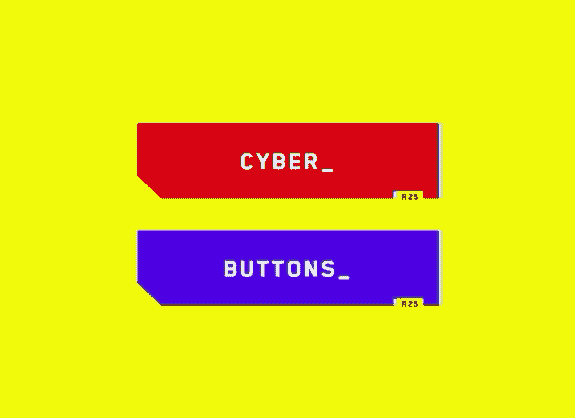
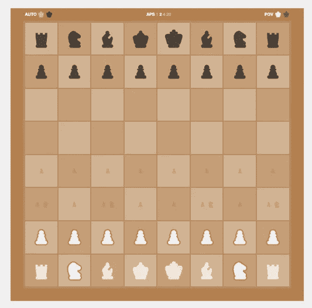
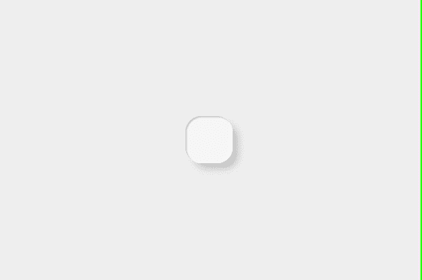
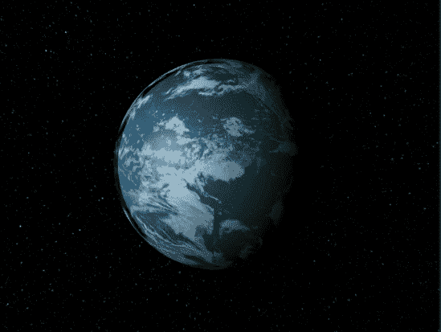
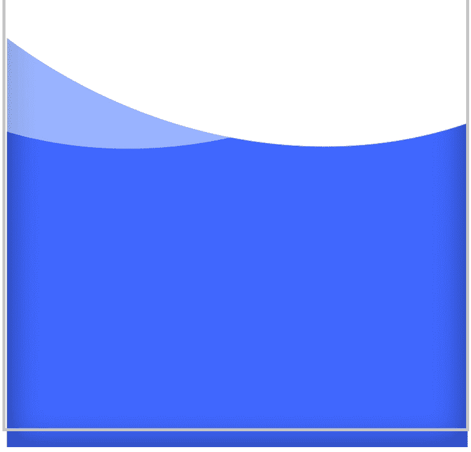

# 8 个前端编码的想法会启发你去编码

> 原文：<https://betterprogramming.pub/8-frontend-coding-ideas-that-will-inspire-you-to-code-7ed8481919fe>

## 从这些令人兴奋的编码想法中获得编码灵感

马丁·威尔纳在 [Unsplash](https://unsplash.com?utm_source=medium&utm_medium=referral) 上的照片。

掌握编程很难。没有捷径可走。它包括投入大量的工作(T4)。你将不得不尽可能频繁地编写代码来精通它。

将本文中的每个想法作为灵感的来源。选择一些让你对编码感兴趣的东西，然后继续构建它。使用你喜欢的任何工具或编程语言。我还会包括你通过建立每个想法将会学到什么。

事不宜迟，下面是今天的编码思路。

# 1.动画菜单标签栏

这是一个 60 FPS 的流体头，带有切换标签之间的动画。

您可以使用 CSS 动画或 JavaScript 来实现流畅的 60 FPS 动画。

[动画标签栏](https://codepen.io/abxlfazl/pen/VwKzaEm)由 [abxlfazl khxrshidi](https://codepen.io/abxlfazl) 制作。

## 通过构建动画菜单标签栏，您将学到什么

*   如何协调使用 HTML、CSS 和 JavaScript 重新创建菜单？
*   如何使用 SVG，CSS 动画，以及两者的结合。

# 2.赛博朋克 2077 主题按钮

漂亮的*赛博朋克*风格的按钮。注意悬停效果。尝试重新创建它。如果你不确定该怎么做，就去看看原文。

[纯 CSS 赛博朋克 2077 按钮😎](https://codepen.io/jh3y/pen/PoGbxLp) by [Jhey](https://codepen.io/jh3y) 。

## 通过构建赛博朋克 2077 按钮，您将了解到什么

*   如何使用 CSS 变量、关键帧和剪辑路径。
*   如何创建复杂的悬停动画？

# 3.带有棋子的棋盘

根据沃尔特·特维斯 1983 年的小说改编的迷你剧《女王的策略》大获成功后，人们对象棋的兴趣直线上升。如果你还没有看过，我强烈推荐你去看！

*加分:让棋盘互动起来。*

[便宜艾棋！杰克·阿尔博](https://codepen.io/jakealbaugh/pen/JjRGQPY)。

## 你将从搭建棋盘中学到什么

*   如何创建一个 8x8 的网格？尝试使用 [CSS 网格](https://css-tricks.com/snippets/css/complete-guide-grid/)来实现。
*   用 CSS 手工雕刻棋子。
*   额外收获:让它与 JavaScript 交互！

# 4.项目管理仪表板 UI

这是一个用于项目管理的仪表板。监控项目并与客户聊天。

[项目管理仪表板 UI](https://codepen.io/aybukeceylan/pen/OJRNbZp) 作者[艾布柯·塞兰](https://codepen.io/aybukeceylan)。

## 通过构建项目管理仪表板 UI，您将学到什么

*   用 CSS 和 HTML 构建干净的用户界面。
*   如何使用 WebSockets 创建聊天？

# 5.神经动画

> "新形态主义是网页元素、框架、屏幕等设计风格的现代迭代."— [GitHub](https://github.com/jvnaveenbabu/Neumorphism-Designs)

[neu morphism _ animation](https://codepen.io/ma_suwa/pen/eYdZVML)by[masu wa](https://codepen.io/ma_suwa)。

## 你将从构建神经形态动画中学到什么

*   如何用 CSS 和 HTML 创建流畅的动画？

# 6. **HTML 地球**

让我们再造地球！顺便问一下，当月亮从太阳前面经过时，你注意到它在地球表面的影子了吗？

[HTML Earth(用 LUME 制作)](https://codepen.io/trusktr/pen/dypwZNP) by [乔豌豆](https://codepen.io/trusktr)。

## 通过构建 HTML 地球，你将学到什么

*   如何使用 LUME 图书馆？根据 GitHub 的说法，LUME 是“一个简化从移动到桌面到 AR/VR 的任何设备的丰富和交互式 2D 或 3D 体验的工具包。”
*   如何用 HTML、CSS 和 JavaScript 创建 2D 和 3D 对象。

# **7。带动画的流体标签**

看看这美景。注意每次换标签时的小细节。

[塔巴尔](https://codepen.io/aaroniker/pen/rNMmZvq)由[亚伦·伊克尔](https://codepen.io/aaroniker)制作。

## 通过构建动画的流体选项卡，您将学到什么

*   60 FPS 动画的 CSS `transform`。
*   如何用 CSS 或 JavaScript 创建复杂的动画？看你的了！

# 8.一杯水

这让我想喝水。在你开始解决这个挑战之前先喝一口。

[一杯水](https://codepen.io/zanewesley/pen/gOwZQJG)由[赞卫斯理](https://codepen.io/zanewesley)提供。

## 你将从制造一杯水中学到什么

*   如何使用 CSS 创建流畅的 60FPS 动画？
*   如何使用 CSS `transform`和伪选择器？

# 结论

寻找更多的编码思路？永远不要耗尽编码的想法，永远不要。 [**在这里获得由我发起的一堆前端挑战**](https://gumroad.com/l/IuqKc/medium-45) **，-前 100 打 4.5 折。**

感谢阅读和快乐编码！