# 改进代码审查的 8 个 Git 技巧

> 原文：<https://betterprogramming.pub/8-git-tips-to-improve-code-reviewing-71cae7883d6f>

## 如何让`git diff`、`git log`和其他 git 命令成为我的代码审查仪式的一部分


代码审查不仅仅是拉…照片由 [Charles Deluvio](https://unsplash.com/@charlesdeluvio?utm_source=medium&utm_medium=referral) 在 [Unsplash](https://unsplash.com?utm_source=medium&utm_medium=referral) 上拍摄

过去几个月是代码审查的密集期。然而，与以前的代码审查高峰不同，我花了一点时间来找出如何让我的生活变得更简单。

本文中的示例使用了两个简单的 JSON 文件:

*   `beers.json` ( [来源](https://github.com/Al-un/beerworld/blob/develop/git/pr/beers.json))
*   `countries.json` ( [来源](https://github.com/Al-un/beerworld/blob/develop/git/pr/countries.json))

从`feature/update-countries`分支创建一个针对`master`分支的拉式请求，其中`countries.json`发生了变化:

模拟打字错误纠正😁

# 1.隔离评审存储库和工作存储库

在经历了多个 git 分支的不幸之后，我现在使用一个存储库的两个克隆来隔离开发活动和评审任务:`<the_repo>`和`<the_repo>-review`。如果需要更多的克隆，只需遵循`<the_repo>-<purpose>`语法。


[约尔根·哈兰](https://unsplash.com/@jhaland?utm_source=medium&utm_medium=referral)在 [Unsplash](https://unsplash.com?utm_source=medium&utm_medium=referral) 上拍摄的照片

有了这样的结构，我不担心弄乱了`[repo]-review`文件夹里的分支。也省了我很多`git stash`。藏东西很好，但当我疯狂地在多个分支之间跳跃时，它会变得很伤脑筋。

当审查代码时，我有时会在提交评论之前尝试或简单地起草更改，以确保我将编写的内容有意义。有了一个专门的评审库，我可以非常轻松地进行操作，而不用关心隐藏变更。

# 2.从远程更新分支而不签出

我越来越需要更新公共分支，`develop`或`master`，而不需要检查它。谢天谢地，代码很简单:

```
git fetch origin <branch>:<branch>
```

此语法假设分支可以快进。否则，需要结帐。例如，在一个特征分支被重定基础后，我的方法是使用下面的代码:

```
git checkout feature/update-countries
git fetch origin feature/update-countries
git reset --hard origin/feature/update-countries
```

文档链接:

*   `[git checkout](https://git-scm.com/docs/git-checkout)`
*   `[git fetch](https://git-scm.com/docs/git-fetch)`

# 3.正确列出来自拉取请求的所有更改

虽然 GitHub 和 GitLens VS 代码扩展提供了一个很好的界面来显示更改，但是知道如何在终端中显示更改不止一次地帮助了我。这一切都从下面的代码开始:

```
git diff master...# Equivalent after 2.30
git diff --merge-base master# Equivalent before 2.30:
git diff $(git merge-base master HEAD)
```

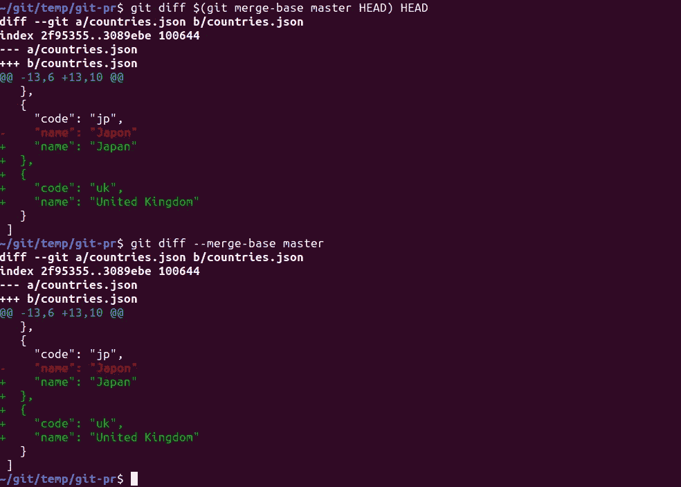

新旧语法提供相同的输出

为什么把`git diff`的命令复杂化？如果`master`分支收到了一些更新，一个简单的`git diff master`会列出所有的差异，而不仅仅是特性分支带来的差异。

让我们假设`master`收到了`beers.json`文件中的一些更新，而`feature/update-countries`分支没有修改它。结果如下:

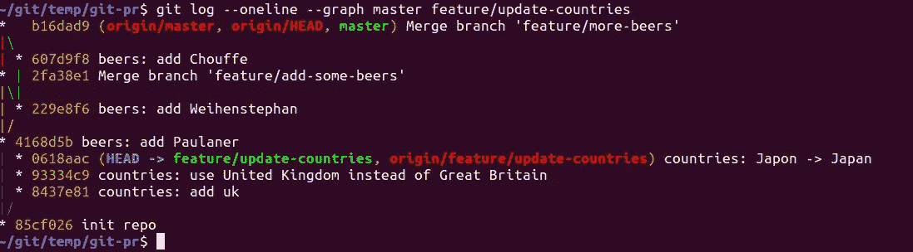

这模拟了在“功能/更新-国家”被合并之前，两个拉请求被合并到“主”中

如上所述，一个简单的`git diff master`返回所有的差异，如下所示:

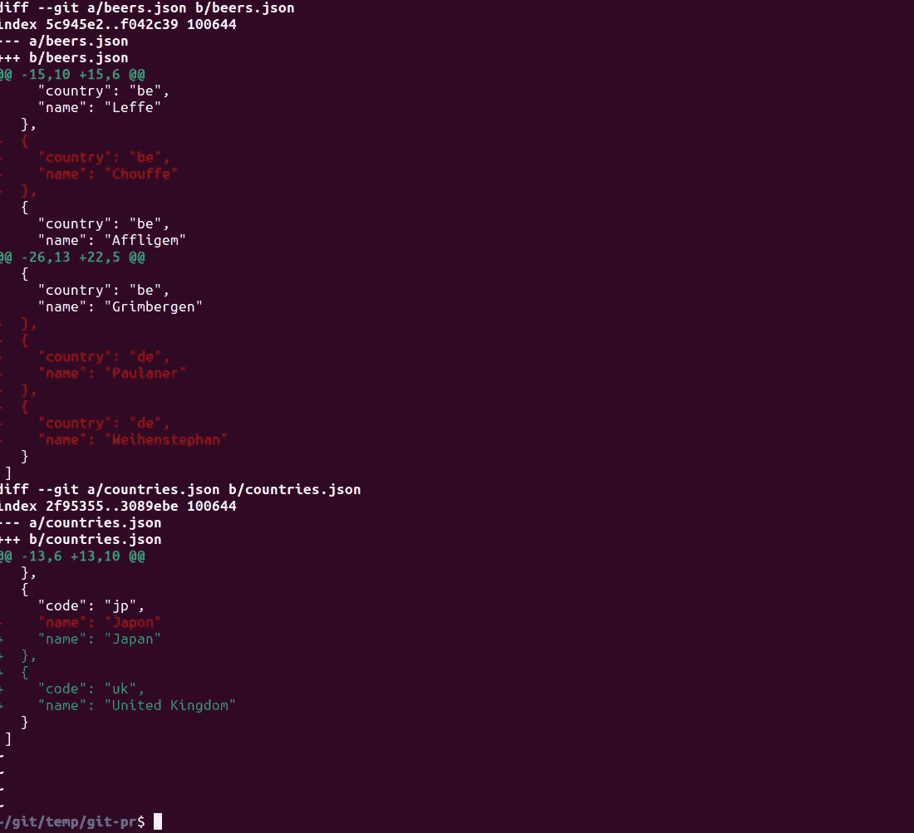

“beers.json”文件中的更改未被请求

因此需要`master...`范围或`--merge-base`选项。

作为一名前端开发人员，我的评论通常涵盖冗余文件模式，如下所示:

*   `src/components/some-folder/another-folder/Something.ts`
*   `src/components/some-folder/another-folder/Something.spec.ts`
*   `src/components/some-folder/another-folder/Something.stories.ts`

我发现显示组件及其相关文件的更改非常有用:

```
git diff master.. -- src/components/some-folder/**/*.ts
```

文档链接:

*   `[git diff](https://git-scm.com/docs/git-diff)`
*   `[git log](https://git-scm.com/docs/git-log)`

**注意:**我不使用`*git blame*`，因为 GitLens VS 代码扩展([主页](https://gitlens.amod.io/))提供了这个信息。请随意查看它的[文档页](https://git-scm.com/docs/git-blame)，因为它是一个有用的命令。

# 4.列出所有更改的文件

由于前面的技巧和`--name-status`选项([文档链接](https://git-scm.com/docs/git-diff#Documentation/git-diff.txt---name-status))，通过拉请求列出修改过的文件是小菜一碟，如下所示:

```
git diff --name-status master...
# OR
git diff --master-base --name-status master
```

VS Code terminal 中的这种列表非常方便，只需简单的 Ctrl+click / Cmd+click 就可以打开文件。这个命令通常是我代码审查仪式的第一步。

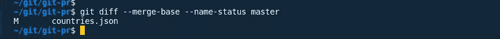

没有`--master-base` 或者没有`…`范围，`beers.json`也会出现，这不是期望的结果。

如果您想通过提交来分解它，您可以使用以下命令:

```
git log --oneline --name-status master..
```

如果没有`..`范围操作符，它将包含同时出现在`master`和`feature/update-countries`分支中的提交。

# 5.仅对添加和修改的文件执行 NPM 命令

为了进一步循环利用`git diff`命令，我当前的团队构建了一些神奇的命令，只对添加和修改的文件运行`npm run lint`，忽略删除的文件。非常感谢，团队！

```
git diff --name-status master... | awk '/^[A|M].*\.(js|ts)$/ {print $2}' | xargs npm run lint
```

用所需的扩展名列表替换`(js|ts)`。例如，对于 Vue.js 项目，扩展列表可能是`(js|ts|vue)`。

这个特别的命令是我们日常生活中的生命救星，因为我们正在更新我们的林挺规则。一些林挺规则需要复杂的操作，比如文件重命名，所以我们不喜欢一下子改变整个代码库，而是逐步发展。

我们确实有一些 CI 来自动检查它，但是在提交拉取请求之前进行本地检查并没有什么坏处。

# 6.用“Git Branch”删除多个分支

除了`git fetch origin --prune`删除远程删除分支的引用([文档链接](https://git-scm.com/docs/git-fetch#Documentation/git-fetch.txt---prune)，我喜欢保持本地分支的引用干净。

在审查了多个拉请求之后，删除所有分支很快就会变成一件麻烦的事情。在我的代码评审库中，我可以在大型评审会议后批量删除分支:

```
git branch --list <pattern> | xargs git branch -d
```

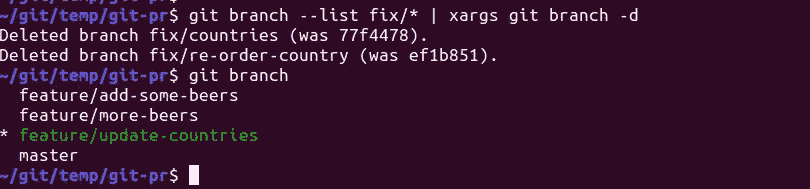

请注意，使用了“-d”。如果你使用“git branch -D ”,确保你知道你在做什么😨

羞耻区:现在我们来了解一下……嗯……从“不太聪明”的情况中学到的。

# 7.用“git rebase -i”修复过去的提交

当根据评审员的评论更新我的代码时，我……嗯……有时没有正确检查我是否纠正了所有的错误，所以很明显，我漏掉了一两个地方。

当然我可以用`git commit -m "oops, forgot here"`，但是不是很干净。因此，如果我能够承担得起(例如，尚未推送更改或重写历史的安全部分)，我更喜欢更正过去的提交。

如果只需要编辑最后一次提交，`git commit --amend`就足够了。编辑旧的提交需要一个交互式的 rebase。

例如，如果我想修改提交`e935a02`，它是`b6719a9`的子节点。

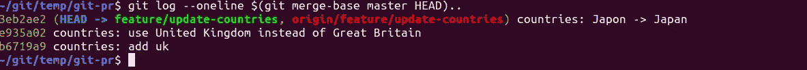

开始交互式重建基础。起点必须是您想要编辑的最早提交之前的提交*。*

```
git rebase -i b6719a9
```

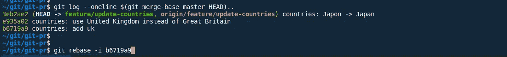

“git log”有助于找到交互式 rebase 的起点

出现从所提供的起点开始的提交列表，起点被排除在外，并且对于每个提交，必须定义一个动作。

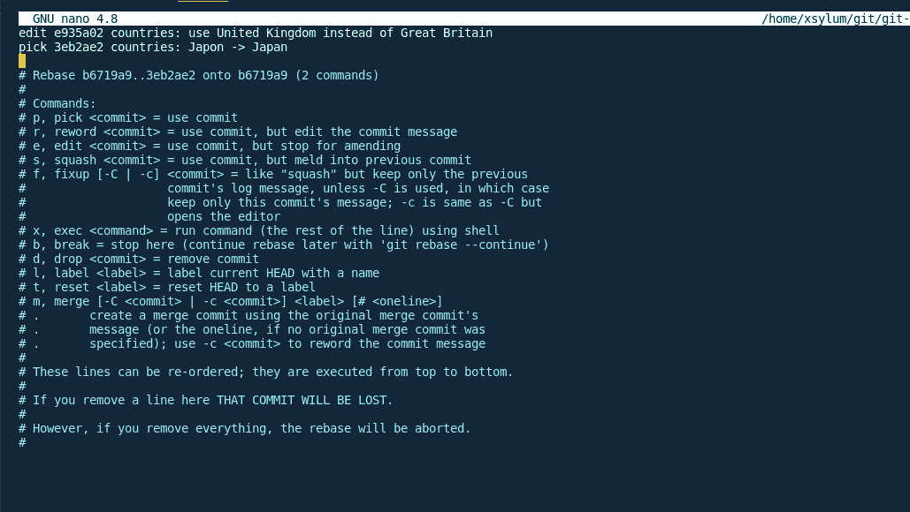

我选择只修改一个提交

重置将在提交`e935a02`时停止。可以进行更改，一旦完成，`git commit --amend`更新提交:


对于这个例子，我只是更改了提交消息，但是您可以自由地用更多的文件更改来修改提交

请注意，与任何重置基础一样，这将重写分支历史:

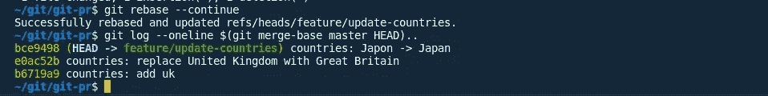

友情提示，以防万一:这绝对**不是**推荐给公共分支机构的。

# 8.使用“git cherry-pick”将提交从不正确的分支转移到正确的分支

不幸的是，这种事情发生得比我的自尊心所能承认的还要频繁😅。在分割我的工作存储库和我的评审存储库之前，忘记切换到正确的分支比它应该发生的更频繁。

例子:在`feature/update-countries`分支上工作，我修改了超出范围的`beers.json`。

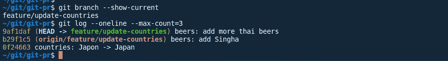

哇哦…

`git cherry-pick`结合`git log`可以帮助我们将最后两次提交转移到正确的分支:

```
# Back to master
git checkout master# Spawn a branch if necessary or checkout to the correct branch
git checkout -b fix/oops-the-beers# And save the day!
git log --reverse --pretty=%h --max-count=2 feature/update-countries | xargs git cherry-pick
```

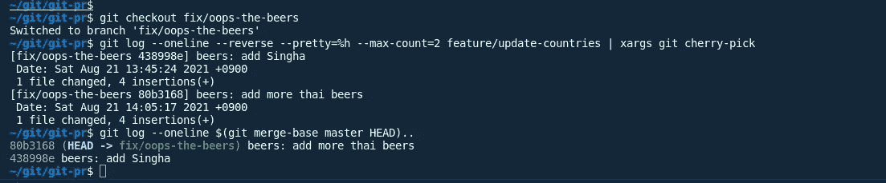

出于习惯，我留下了“- oneline”参数，但在这里没有必要

*   `--reverse`:樱桃采摘必须按照正确的顺序进行
*   `--max-count=2`:根据自己的情况调整号码。
*   `--pretty=%h`(或`--format=%h`):只需要提交散列

这个技巧只有在最后一个`N`提交必须被移动时才有效。`git log`有一个`--grep`选项，但是我强烈建议不要对不连续的提交使用这个技巧。

错误的提交现在可以从`feature/update-countries`分支中移除。请注意，这将影响分支历史！

```
git reset HEAD~2
# OR
git reset 0f34663
```

如果您确定可以放弃更改，请使用`git reset --hard`。

我希望这篇文章能以某种方式帮助你改善日常生活。至于最后两条建议，我希望你不要经常用到。

一些代码审查会议实际上可能变成一些悲惨的 git 事故，所以知道一些”(dirty？)招数”可以省去你很多麻烦。

感谢您阅读到目前为止，代码审查愉快！