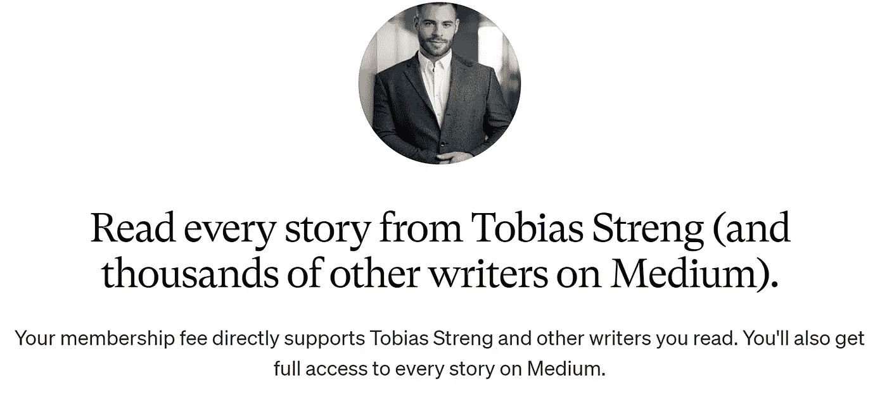

# 使用 C#编写可读代码的 8 条准则。网络 6

> 原文：<https://betterprogramming.pub/8-guidelines-to-write-readable-code-in-c-with-net-6-2cbf0bfe4a17>

## 使用这些技巧进一步改进您的 C#代码

詹姆斯·哈里逊在 [Unsplash](https://unsplash.com?utm_source=medium&utm_medium=referral) 上拍摄的照片

根据编码大师 [Robert C. Martin](http://cleancoder.com/) 的说法，干净的代码并没有被很好的定义，然而，干净代码的结果是非常清楚的。您确实希望代码像一本好书一样可读，易于维护，易于扩展。bug 应该很容易被发现，甚至可以通过设计来避免。一个干净的代码将保持高生产率，并保持低成本。

《干净的代码》一书中的一句话是这样的:

“干净的代码可以被其他开发者阅读和增强，而不是它的原作者。”(迪夫·托马斯谈清洁代码)

在我看来，这是干净代码最重要的一点。如果不仅你可以维护一个代码，而且任何其他开发人员，只要经验水平和你接近，代码就会自动满足干净代码的大部分要求。当然，它可能不是 100%干净，但足够干净，结果接近上面提到的那些。

# 可读代码

对于其他开发人员来说，维护您的代码应该非常容易阅读和理解。当你写任何一行代码时，你的目标应该是可读性。即使一行代码也足以让另一个开发人员困惑，他可能会浪费宝贵的时间去理解你的代码，这是你的错！

那么，是什么让代码对其他开发人员来说更具可读性呢？

在这篇文章中，我不会把重点放在《干净的代码》一书中提到的方法上，因为我可以推荐你自己检查一下。然而，我关注的是具体的指导方针，这是我从过去 8 年作为. NET 开发人员的经历中学到的。

这些准则应该使代码尽可能的简短和/或易读。它们不会取代任何干净编码的方法，但是它们是对[干净编码](https://amzn.to/3grqisQ)的补充。

# 的指导方针。NET 和 C#

让我们不要再浪费时间，直接跳到指导方针。这些是我和我的同事 Jan Donnermayer 在过去 8 年的编程中自己想出来的原则。

## **1。避免“Else”**

第一个原则是，简单地避免`else`。几乎每一次，你都在代码中使用`else`，这是很容易避免的，并使代码更具可读性。看看下面的例子:

避免 else 的例子

第一个例子也被称为早期回报。你应该清楚地陈述，你期望从代码的前几行中得到什么。

第二个例子展示了 C#中一种相当新的切换语句的方式，即所谓的[模式匹配](https://docs.microsoft.com/en-us/dotnet/csharp/fundamentals/functional/pattern-matching)。您可以清楚地看到当某个显式案例被传递时发生了什么，以及哪个函数正在处理该案例。这里还应用了另一个准则:为每个子逻辑创建一个额外的函数，这是很好的命名。

## **2。避免高圈复杂度**

这件事的另一个原则是，你也应该尽量避免更多的[圈复杂度](https://en.wikipedia.org/wiki/Cyclomatic_complexity)。这意味着，当某个特定状态出现时，您的方法应该具有尽可能少的可能被执行的辅助逻辑。例如，您可以通过实现类的接口并在每个类中实现独立的逻辑来实现这一点:

使用界面

## **3。避免过多的缩进层次**

在`avoid_else.cs`的例子中，你还可以看到另一个不同之处，那就是避免`else`的出现。在你的方法中避免一个缩进层次。使你的代码更易读的一个好的指导方针是，简单地避免太多的缩进层次。我发现，最多三到四级缩进是一个很好的规则。然而，这些应该是真正必要的缩进。

例如，你不应该把一个`if`子句放在另一个`if`子句中！实际上，如果可行的话，你应该在任何地方避免使用`if`子句。

我使用不止一个缩进层次的唯一情况是使用 Linq-Queries。下一个指南中会有更多关于这个主题的内容。

## **4。通过掌握** [**避免循环**](https://docs.microsoft.com/en-us/dotnet/csharp/programming-guide/concepts/linq/introduction-to-linq-queries)

您可能见过类似这样的代码:

用 Linq 查询替换循环

问自己一个问题:你的循环可以被 Linq-Query 替换吗？我向你保证 90%以上的情况都是这样！这可能是我个人的观点，但我认为一个好的 Linq-Query 比一个更大的 for-loop 更容易理解。

大多数情况下，当您使用 for 循环时，您希望将一个或多个可枚举变量转换为一个结果。Linq 拥有你需要的一切，可以对一个`IEnumerable<T>`应用检查、转换和动作。如果你还没有使用过 Linq，我强烈建议你现在就使用它！

在 Linq 中，你可以选择[查询语法或者](https://docs.microsoft.com/en-us/dotnet/csharp/programming-guide/concepts/linq/query-syntax-and-method-syntax-in-linq)方法语法。我个人更喜欢方法语法，不过你可以自由选择。在这里可以找到`IEnumerables` [的所有扩展方法。](https://docs.microsoft.com/en-us/dotnet/api/system.linq.enumerable?view=net-6.0)

## **5。提取并命名您的方法**

提取方法并给它们一个可读的名字也大大增加了可读性。

提取方法并给它们起个好名字

想象你在你的`Where()`或`Select()`方法中有一个比这个例子更复杂的逻辑。

如果你是这个函数的作者，你可能知道那里应该发生什么，但是另一个开发者可能很难理解。那么为什么不直接提取这个方法并给它一个好名字呢？意图变得清晰，下一个开发人员将知道这段代码应该做什么。

## **6。中断并缩进您的代码**

创建可读性更强的代码的另一种方法是正确地换行和缩进。Visual Studio 将帮助您完成大部分缩进，但是，它还远远不够完美。

一些好的经验法则，打破和缩进是:

*   **一行代码不能超过半个屏幕**。这使得阅读更容易，你可以在一个分屏中打开两个文件，而不会丢失一些代码。
*   **左括号和右括号的缩进级别应该匹配。我知道这要多花几秒钟的时间，但是在方法调用后去掉右括号会使阅读和编辑更容易。(参见第二个示例)**
*   **在点前或逗号后断开。**这样你可以删除整行代码来删除代码部分。
*   **每个 Lambda 函数获得一个新的缩进级别。**

在一点之前中断

中断参数并添加名称

顺便说一下，您的 IDE 将在这里为您完成这项工作。查看我关于 Visual Studio 和 VSCode 的[快捷方式和重构的文章。在那里，您将学习如何在 IDE 的帮助下快速重塑代码。](/leverage-your-coding-speed-to-the-maximum-with-visual-studio-vscode-shortcuts-and-refactorings-fcbed61b7540)

## 7。使用短语法

我承认，你可以争论，使用短语法是好是坏。然而，如果你已经习惯了，我认为它通过去除不必要的代码噪音提高了可读性。

C#不断更新，每年都有许多新特性加入。通常一个新版本会用一种更短的方式来编码你日常使用的东西。对于 C# 10，下面列出了其中一些:

*   短`if`:

短 If

*   空头支票:

短零点检查

*   在我看来，最具可读性的字符串插值:

字符串插值

*   [图案匹配](https://docs.microsoft.com/en-us/dotnet/csharp/fundamentals/functional/pattern-matching)。起初有点复杂，但最可读的案例区分机制:

模式匹配

*   表情体。最适合单行函数或属性:

表达体

*   记录类型。最适合[普通旧类对象](https://en.wikipedia.org/wiki/Plain_old_CLR_object):

记录类型

这个列表包含了一些我日常使用的简短语法。正如我提到的，这代表了我的个人观点。你们中的一些人一开始可能会觉得很难读，但是根据我的经验，当字符较少时，阅读会变得更容易。

## **8。全局使用和文件范围的命名空间**

在 C# 10 中，你现在可以使用[文件范围的名称空间](https://docs.microsoft.com/en-us/dotnet/csharp/language-reference/proposals/csharp-10.0/file-scoped-namespaces)和[全局使用](https://docs.microsoft.com/en-us/dotnet/csharp/language-reference/proposals/csharp-10.0/globalusingdirective)。

文件范围的名称空间将从整个代码文件中删除一个缩进层次，在我看来(参见 3。)使代码更具可读性。当添加新的类或方法到你的代码中时，你将少了一个可能使你混乱的右括号`}`。

文件范围的命名空间

全局使用是项目范围的，会在文件顶部为你节省很多空间。但是，您应该小心使用全局 using，因为有些 using 对其他开发人员非常有帮助，可以帮助他们了解您在代码中引用了哪些包和命名空间。只为命名空间添加全局 usings，这在整个项目中经常使用。

全局使用或隐式使用的结果

本例中的`usings`也可以通过在项目中启用`implicit usings`来导入。

感谢您花时间阅读这篇文章。我希望，你会觉得它有知识性、教育性和趣味性。非常感谢您的支持和参与。

如果您有兴趣了解干净架构、干净编码和最新技术栈的最新趋势、技巧和诀窍，尤其是在 C#环境中。净和有棱角——如果你考虑跟踪我，我会很感激。

祝你有美好的一天！

如果你还没有每天使用媒体来增长你的知识，现在是开始的最佳时机！借助 Medium，您可以轻松获得更多关于高度专业的主题的知识，发布高质量的内容，并接触到更广泛的受众。要开始，只需使用以下链接创建一个中型帐户:

[*加入中现*](https://medium.com/@tobias.streng/membership)

通过这样做，你将获得一个强大的平台，可以帮助你联系新的作者和读者，每天学习新的东西。