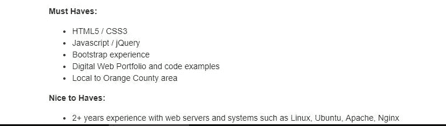
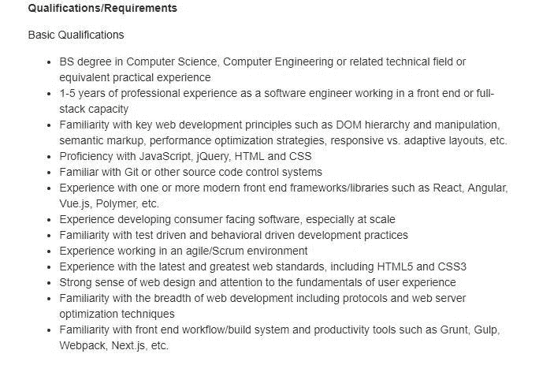

# 破坏你未来的初级和中级 JavaScript 开发人员的 8 个习惯

> 原文：<https://betterprogramming.pub/8-habits-for-beginning-and-mid-level-javascript-developers-that-sabotage-your-future-540efc1304a2>

## 现在照顾好你自己，这样你以后就不用担心了

*马库斯·斯皮斯克在 Unsplash 上拍摄的照片*

这确实是一个 JavaScript 开发人员的绝佳时机，因为他们在就业市场上的需求越来越大。框架、库等的快速一致的发布。生活在这个时代是一件幸事——尤其是有这么多东西是开源的。到了我们开始在日常生活中花费大量时间和精力处理 JavaScript 相关任务的时候了。

但是很有可能你在日常的 JavaScript 任务上投入了太多的时间和精力，结果可能会在不知不觉中给自己和自己的未来带来灾难。在过去，我已经遭受了这篇文章中列出的一些问题，所以我的目标是让*你*不要犯这些错误，这样你就不会悲惨地结束。

以下是 JavaScript 开发人员的八个习惯，它们会破坏你的未来:

# 1.使用 jQuery

jQuery 在 JavaScript 生态系统的发展中发挥了巨大的作用。

首先，JavaScript 最初只是用来运行幻灯片和可爱的小部件，如日期选择器和出现在页面中的图库。浏览器提供不同的行为是有问题的，jQuery 通过其抽象层的实现帮助标准化了事物，并处理了 DOM 操作等常见问题的所有解决方法。它有助于简化 AJAX 和跨浏览器差异的问题。

然而，问题是，今天这些问题不再像以前那样重要。jQuery 的一些最好的特性，比如 [fetch](https://developer.mozilla.org/en-US/docs/Web/API/Fetch_API) 和[选择器 api](https://flaviocopes.com/selectors-api/) ，已经被浏览器标准化了。

React 等现代库除了解决 jQuery 当前面临的问题，如状态管理之外，还解决了与 jQuery 相同的问题。

在 jQuery 中，您最终会做一些奇怪的事情，比如使用 DOM 元素作为当前状态或数据，编写复杂得离谱的代码来计算 DOM 的上一个、当前和下一个状态，此外还提供了适当转换到即将到来的状态的方法！

阅读更多关于当今人们正在使用的一些现代替代品以及它们给你的 web 应用带来的好处: [React](https://reactjs.org/) 、 [Vue](https://vuejs.org/) 和 [Angular](https://angular.io/) 。

# 2.不锻炼

*在 Unsplash 上拍摄马扎里诺照片*

在我以前的文章中，有一件事我没有真正提到，那就是保持健康。现在我不是什么专业教练或什么的，但我看着我的身体这些年来发生了变化，我亲眼目睹了如果你忽视你的健康可能会发生的一些可怕的后果。

这些经历是什么？嗯，我一直计划写一篇详细的帖子，讲述我是如何成功获得我的第一份 web 开发人员工作的。我的旅程在许多方面都是坎坷的，包括许多情感和灵感的细节，特别是对于那些自学 JavaScript 的人来说，但我在这里分享一下，仅学习 JavaScript 一项，我就在一年内增加了 32 磅。这怎么会发生在一个人身上？

如果你不锻炼，当你[体重增加](https://healthfulinspired.com/15-disturbing-things-that-can-happen-when-you-gain-weight-07-13-2018)时，你的身体可能会发生许多令人不安的事情。

其中包括:

1.  通过[改变基因表达来改变你的 DNA](https://www.sciencedaily.com/releases/2016/12/161222094841.htm)
2.  随着时间的推移，你获得的额外卡路里开始转化为脂肪
3.  增加患偏头痛的风险(包括慢性偏头痛)
4.  你的血压开始上升，因为体重增加会给你的心脏带来额外的压力

不胜枚举。

# 3.在社交上孤立自己

*帕鲁·马莱巴摄于 Pexels*

你的家人和爱人很重要。

当你在学习 JavaScript 时将自己与社会生活隔离开来，你正在破坏你的精神和身体健康，导致抑郁和焦虑的风险[增加，睡眠困难，体重减轻，感觉疲劳或缺乏动力](https://www.bupa.com.au/healthlink/mind-and-body/healthy-ageing/keeping-connected/social-life/why-your-social-life-is-more-important-than-you-think)。

# 4.不写测试

我经常看到人们跳过他们的 web 应用程序的单元测试，这完全没问题——直到一个意外的错误使应用程序崩溃。这就成了一个大问题，因为时间和金钱可能会被浪费掉。

也就是说，仅仅因为你的代码能够继续编译而没有错误，或者应用程序工作而没有控制台抱怨，这并不一定意味着应用程序可以正式使用了。

对于小型应用程序来说，没有任何类型的测试可能是好的，但是当应用程序变得越来越大，越来越难以维护时，测试开始变得越来越重要，以集成到应用程序中，因为对现有代码*的任何更改都可能破坏应用程序的另一部分*。

想要为未来的大型项目节省时间？整合测试会有很大的帮助。

# 5.学习 JavaScript 之前的框架

我知道并理解使用 React、Vue 或 Angular 等流行的库和框架立即开始开发 web 应用程序的诱惑。

我曾经说过“先学 JavaScript，再学框架！”但是我的看法有些改变了。作为一个新手，不要直接去学习这些工具，最好的方法是在学习 JavaScript 的同时*学习它们。JavaScript 生态系统的发展速度快得离谱，如果你想在市场上推销自己，你必须至少*在 React、Angular 和 Vue 等工具上有一些*经验。*

例如，我在[上搜索“ *JavaScript* ”，这是出现的第一个结果:](https://www.indeed.com/)

职位描述说他们*要求你有 jQuery 和 JavaScript* 经验。对于这家公司来说，jQuery 和 JavaScript 同等重要。

另一份工作说明要求以下“基本”要求:

我点击了四分之二的招聘信息，其中 50%不仅需要 JavaScript 知识，还需要基于 JavaScript 的工具知识。然而，我不太建议将一半时间花在 JavaScript 上，另一半时间花在自己选择的库中。这个比例应该更接近 65%的 JavaScript 和 35%的前端库或框架。

以这种方式划分时间让您仍然可以从学习“真正的”JavaScript 中受益，同时还可以学习一个流行的前端框架，以提高您在构建前端 web 应用程序方面的知识。你还会发现，在加入 React 或 Vue 等热门话题的讨论时，你会感到轻松自在。

但是，将 65%的精力放在学习真正的 JavaScript 上，而将其余的精力放在想要立即开始使用的流行工具上，这意味着什么呢？那是怎么回事？

帮助我学习 JavaScript 语言的是阅读 Kyle Simpson 的免费在线电子书“[You not Know JS](https://github.com/getify/You-Dont-Know-JS)”(阅读)和尽我最大的努力通过 [FreeCodeCamp](https://www.freecodecamp.org/) 的在线编码课程(实践)。你从两个学习角度受益。《你不了解 JS》在深入理解 JavaScript 的来龙去脉方面做得非常好，以至于这本书的随机部分至今仍在我的脑海中闪现。这在采访中对我来说意义重大！

# 6.没有早点学习干净的代码实践

编写干净的代码是每个开发人员为了称自己为专业开发人员而必须做的事情。在职业生涯的早期开始学习干净的代码实践也非常方便。你越早开始接触这些实践，你就能越早掌握编写更干净、更易维护的代码的技能。

学习如何编写更简洁的代码并不像“先学 JavaScript 再学框架”那样对以后的职业生涯有益。如果你能训练自己写干净的代码，你就不会有开始写难看的代码的经历来“学习”JavaScript 开发者的方法。你的经历会在后来看别人的丑代码而变得沮丧的时候出现。这是你的经历。

# 7.过早开始大项目

*克里斯蒂安·埃尔富特在 Unsplash*

我在职业生涯中犯的最大错误之一是从计划成为*大*的项目开始。

你会问“这有什么不对的”？

首先，如果你不是一个中高级开发人员，你很有可能无法在短时间内完成这个“大”项目。如果你没有接触过编写更干净的代码、编写测试、可扩展架构等方面的最佳实践，那么有很多事情需要考虑，尤其是对于稳定的应用程序。如果你还在起步阶段。

那么，当您过渡到中级开发阶段，并意识到您编写的许多代码需要重构，因为应用程序没有正确编写时，会发生什么呢？对于中级开发人员来说，就业市场开始变得丰富，但你还没有机会将任何好的项目放入你的投资组合中，因为你一直忙于不久前计划的这个大项目。然后，当其他开发人员在这些工作面试中夺走你的荣耀时，你开始怀疑是否值得继续做下去。我推荐的方法是从一堆小项目开始，这样你就可以把它们写在纸上了！尽快在你的投资组合中展示一些东西*，你永远不知道机会什么时候会到来。*

*过早开始大型项目的另一个问题是，如果您没有接触到最佳实践和正确的设计模式来构建您的功能，您将最终编写大量代码，您将来不得不重构或放弃这些代码。在这种情况下，最好的办法可能就是重写全部内容。你可能会选择放弃它，把当前的代码放在你的简历或文件夹中，但是他们会看着代码，做出一些不愉快的判断。*

# *8.不学习数据结构和算法*

*关于*何时*应该开始学习数据结构和算法的争论由来已久。有些人建议在开始学习 JavaScript 之前学习它们，有些人建议以后再学习。*

*我个人认为，当你踏进门的时候，学习它们并不是必须的，但是让自己接触算法是很好的，这样你就可以对计算机程序和计算有一些基本的了解。算法是任何一种计算或计算机程序不可或缺的一部分。事实上，这些计算机程序只是一堆算法与一些花哨的结构化数据结合在一起，仅此而已！*

# *结论*

*本帖到此结束！我希望你能从中得到一些东西，并在未来关注我的更多帖子！*