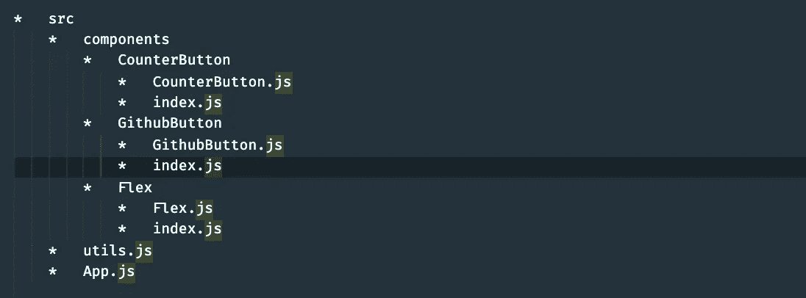
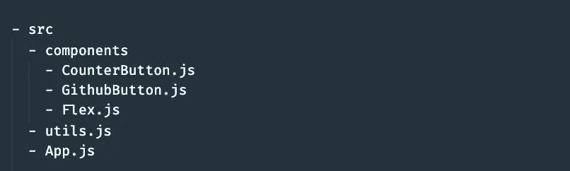
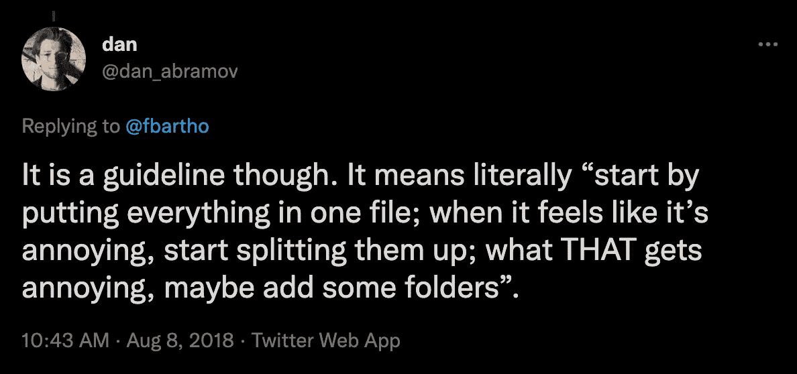
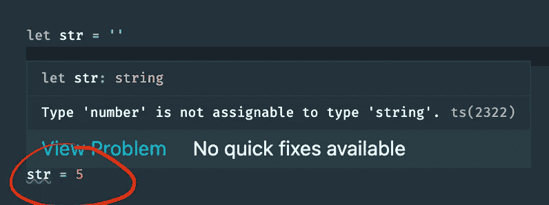
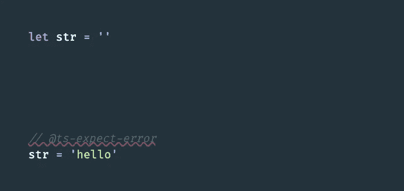

# 要避免的 8 种 JavaScript 实践——以及应该怎么做

> 原文：<https://betterprogramming.pub/8-horrifying-practices-you-really-must-not-do-in-javascript-5e9ef2a07b27>

## 用这些建议拯救你自己和你周围的人

照片由 [Unsplash](https://unsplash.com?utm_source=medium&utm_medium=referral) 上的 [Prateek Katyal](https://unsplash.com/@prateekkatyal?utm_source=medium&utm_medium=referral) 拍摄

在开发代码时，JavaScript 可能是一种非常灵活但强大的语言，但要知道我们应该避免哪些实践并不总是那么简单。

在本帖中，我们将讨论一些你应该避免的 JavaScript 实践，以免为时过晚。

这篇文章中的一些(或全部)例子*对你们中的一些人来说可能已经是旧闻了。但是当我看到人们使用这些方法时，就像这篇文章中列出的，我认为这是值得重新审视的，这样我们中的更多人(包括你)就可以在晚上睡觉了。*

事不宜迟，我们开始吧！

# 1.深度查找…无需验证

这是可以用 TypeScript 这样的工具轻松避免的实践之一，但令人惊讶的是，开发人员今天正在犯这个错误。

这是最近有人在生产中制作的一个真实场景示例:

这种做法的问题是，如果我们对一个对象进行深度查找，而其中一个对象的中间值为空，就会产生一个错误，导致应用程序崩溃，如下所示:

结果:

当我们在对象上查找深层属性时，在继续下一步之前，最好总是验证查找产生的数据类型是预期的(或者至少确保查找产生的每个值总是*或者*是预期的数据类型*或者*某个假值):

带可选链接:

# 2.过度使用你的文件夹结构

我知道当我们开始开发我们的应用程序时，特别是当我们开始使用一个像 redux 这样随时间扩展的库时，一开始就追求完美和追求卓越是很诱人的。

是的，为你的项目成为市场上的下一个最大的东西做准备是很好的，但是如果你决定休息一下或者分支到另一个项目，如果你试图在未来重新开始，你可能会让你自己(甚至其他人，如果他们会阅读你的代码的话)变得更加困难。

就拿 redux 来说吧。如果我们正在构建一个 React 应用程序，并考虑我们希望我们的文件夹结构是什么样的(同时记住一个常见的惯例是将组件分离到它们自己的文件夹中)，我们可能会得到类似于 [this](https://github.com/erikras/react-redux-universal-hot-example/tree/master/src/components) 的结果:

问题是`CounterButton`、`GithubButton`和/或`Flex`可能*永远不会*被再次改变。

如果我们快进到 4 个月后，我们的回购包含几十个文件夹中的文件夹，包含文件夹中的组件，这是不必要的复杂。我们不需要通过点击几个文件夹来寻找我们正在寻找的组件。

如果你觉得这是一个更好的方法，而且有意义，那么就去做(不是因为 reddit 上有人告诉你要这么做):

因此，它应该是简单的，并且对你目前正在进行的项目来说感觉是正确的，类似于丹·阿布拉莫夫(`redux`的创作者)所说的:

# 3.在盒子里思考

如果我们正在编写人们会阅读的代码(例如当与你的队友一起调试问题时)*不要*在盒子里思考！

我知道快速、直截了当地编写函数很有诱惑力。我承认我仍然会时不时地犯这样的错误，尽管大多数时候我都能控制住自己。

看看下面这个例子:

一切都很好，但当你仔细看看，你怎么知道什么`serviceResponse?.getCode()`会回来？如果它返回`0`呢？

在一些传统实践中，我们被告知`0`是成功的代码(尽管语言将其解释为虚假，但这是我的观点)，所以我们必须考虑仔细编写我们的实现，因为人们将无法读懂我们的思想，也无法清楚地理解代码在做什么。如果它返回`1`，或者`5`，`9`呢？在这一点上，最好不要碰代码，去找开发人员解释。

以一种更易于阅读的方式来编写代码的一个好的解决方案是将代码赋值给描述代码的常量变量，然后在我们的项目中使用它们。

这是一个有用的实践，你通常会在许多图书馆看到，例如 [twilio-video](https://github.com/twilio/twilio-video.js/blob/master/lib/util/constants.js) :

# 4.循环时的隧道视觉

虽然循环在快速完成工作时很好，但是当它们不考虑条件不满足时，它是难以置信的毁灭性的！

让我们看看下面这个例子:

这里的问题不是针对*故障条件*增加`startCount`:

这意味着 while 循环将永远不会结束，因为如果在下一个程序块增加`startCount`达到了`numComponents`，那么`startCount`将永远不会增加。

我可以理解为什么有人会忘记这一点。

首先，也许开发人员习惯于用失败案例的简单日志来处理代码(这实际上对于我们面临的大多数问题来说已经足够了),并且可能意外地认为他们的程序仍然会运行。

现在我的第二个想法是，当我们编写代码时，这通常是自然发生的，每次条件*通过*时，我们最终都会增加或更新一些变量(因为我们不需要做任何进一步的事情):

因此，可以理解前面例子中的开发者如何让*隧道预见到*通过条件的阻碍。

# 5.`@ts-ignore`

如果您已经使用了 TypeScript，并且发现自己正在使用它来忽略代码中令人讨厌的错误，请相信我，这不是应该做的事情！

TypeScript 提供了一个更强大、更安全的关键字来消除林挺错误。

通过使用`@ts-expect-error`,它的工作方式和`@ts-ignore`(或者 ESLint 中的`eslint-disable-next-line`)一样，除了当*不再认为没有它就是错误*时，它会给你一个林挺错误。

> *没有* `*@ts-expect-error*` *上一个排版错误:*

> *使用* `*@ts-expect-error*` *上一个排版错误*

> *有效时使用*`*@ts-expect-error*`*:*

那么为什么不使用`@ts-expect-error`方法呢？它保护你和你周围的人。

# 6.初始化无效值的默认参数

我在之前的一篇文章中提到过这个话题，但是这是那些令人毛骨悚然的“陷阱”之一，可以在一个阴沉的星期五愚弄一个粗心的开发者！毕竟，应用崩溃不是一个笑话——如果处理不当，任何类型的崩溃都可能导致金钱损失。

我曾经因为花了大量时间调试类似的东西而感到内疚:

在`init`内部，如果`value`最终是`falsey`，它将被初始化为`null`。

如果你和我一样，我们的直觉告诉我们，如果`value`是一个`falsey`值，默认情况下它应该被初始化为一个空的对象文字。但是当值为`falsey`时，我们的应用程序会崩溃，因为`value`是`null`。*什么*？

如果*没有值*或`undefined`被传递，默认函数参数允许命名参数用默认值初始化！

在我们的例子中，即使`null`是`falsey`，它仍然是一个值！

所以下次你设置默认值为 *null* 时，一定要三思而后行。

通常的做法是这样做:

它很短，只用一行就可以完成。

它还提供了关于函数可能收到的预期数据类型的更多信息，这是一个优点，因为您少了一个需要担心的数据类型。

# 7.`instanceof`不知何时它不起作用

我以前也是这种情况的受害者，如果你是 JavaScript 新手，你很可能不知道如果你在一个单独的执行环境(不同的浏览器上下文，全局对象等)中创建对象，那么`instanceof`将不起作用。

mdn 文档展示了这种行为在实践中的一个很好的例子:

例如，`[] instanceof window.frames[0].Array`将返回 false，因为`Array.prototype !== window.frames[0].Array.prototype`和数组继承了前者

这是要小心的，因为它不会报告任何错误，它只会默默地让条件失败并继续，使调试变得更加困难。TypeScript 不会*也不会*捕捉到这一点，所以这一次你只能靠自己了！

# 8.`async`在 forEach 中

我最近看到有人这样做，实际上关键是*不要做*，因为*你*有责任不犯这个错误。

简而言之，`async`在`forEach`调用中使用时并不像我们预期的那样:

运行这个函数只会返回一个空数组，因为它不会等待异步调用完成。它不会跳过获取，而是不会等待调用完成，所以不会返回任何结果。

本帖到此结束！我希望你发现这是有价值的，并期待在未来更多！