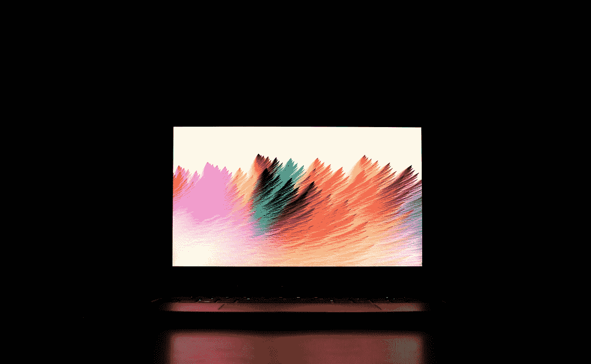
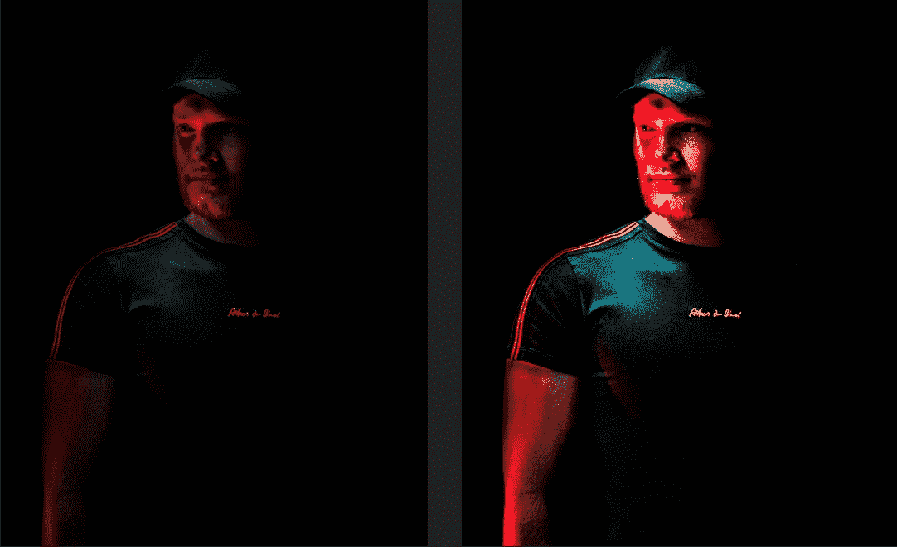
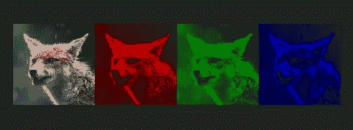
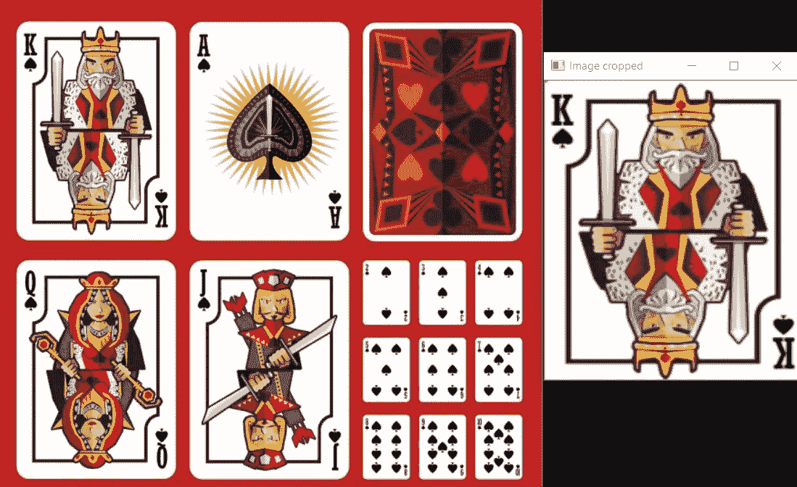
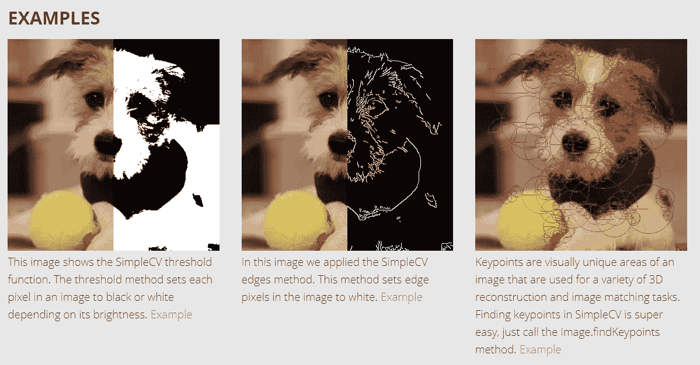
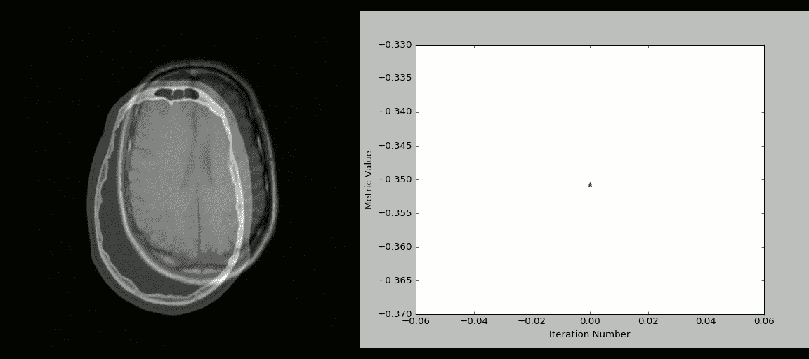

# 你必须尝试的 8 个图像处理 Python 包

> 原文：<https://betterprogramming.pub/8-image-processing-python-packages-that-you-must-try-3b0e7d69548d>

## 让我们让我们的图像看起来更好

[达维特](https://unsplash.com/@oneminch?utm_source=medium&utm_medium=referral)在 [Unsplash](https://unsplash.com?utm_source=medium&utm_medium=referral) 上的照片

Python 是世界上最常用的编程语言之一。它能够用更少的努力和更少的代码行做很多事情。它也可以用来编辑和重建图像非常容易与一些代码行。在这篇博客中，我们将看到使用 Python 处理图像的三种方法。

# 对图像处理的需求

你可能会想，“当我有 photoshop 和许多在线工具来以更漂亮的方式处理图像时，我为什么需要知道如何使用 Python 来处理图像？”

答案很简单:如果你在一个项目中工作，你需要以一种特定的方式给出一个图像，那么你需要选择包含代码的方法。同样，在计算机视觉的应用中，你需要处理图像以获得好的结果。

既然知道了学习的必要性，那就来看看有哪些方法可以做到。

# 1.枕头

Pillow 是 Python 中可用的图像处理库。它提供了许多操作图像的过程，比如调整大小、添加滤镜等等。这是 Python 中最好的图像操作之一。唯一不好的是很久没有更新了。

[使用此链接查看文档](https://pillow.readthedocs.io/en/3.1.x/index.html)。

使用此命令安装枕头:`pip install pillow`

这里有一个简单的片段来展示这个库是如何工作的。让我们使用枕头，通过增加对比度，使黑暗的图像变得美丽一点。代码如下:

原始与增强—照片由 [Unsplash](/s/photos/dark-image?utm_source=unsplash&utm_medium=referral&utm_content=creditCopyText) 上的 [Akin](https://unsplash.com/@akin?utm_source=unsplash&utm_medium=referral&utm_content=creditCopyText) 拍摄

# 2.NumPy

NumPy 代表数字 Python。这是一个 Python 库，可以帮助您处理所有类型的科学计算。它包含许多多维数组和处理它们的例程。

NumPy 是在进行任何类型的数据预处理或数据科学相关任务时要导入的第一个库。它还可以用来处理图像。NumPy 允许您根据图像的 RGB 值自定义和处理图像。使用 NumPy，我们可以很容易地操作图像的 RGB 值。

如何安装 NumPy: `pip install numpy`

让我们以使用 NumPy 更改图像的 RGB 值并对图像应用 RGB 滤镜为例。代码如下:

由[费德里科·迪迪奥摄影](https://unsplash.com/@didiofederico_photographer?utm_source=unsplash&utm_medium=referral&utm_content=creditCopyText)在 [Unsplash](/s/photos/dog-image?utm_source=unsplash&utm_medium=referral&utm_content=creditCopyText) 拍摄

# 3.Scipy

Scipy 是一个 Python 库，主要用于数学和科学计算，但也可以用于多维图像处理。这是一个非常大的库，包含许多工具。要使用图像处理工具，您只需从库中导入`scipy.ndimage`模块。

安装 Scipy 的命令:**T9`ip install scipy`**

[*这里有一个文档*](https://www.scipy.org/index.html) *的链接。*

一个使用 Scipy 模糊图像的例子。

# 4.OpenCV

OpenCV 也是一种图像处理库，可以轻松地与网络摄像头、图像和视频进行交互。它可以执行多种实时任务，最早发布于 2000 年。它因其简单性和代码可读性而出名。现在多用于人脸检测识别、物体检测等计算机视觉任务。

使用这些命令安装 OpenCV: `pip install opencv-python`

让我们使用库来裁剪图像的特定部分。代码如下:

原始图像 vs 裁剪后的图像— [**来源**](https://pub.towardsai.net/learn-everything-about-open-cv-ed485a3007f1)

# 5.简单 CV

SimpleCV 也是一个开源包，用于构建计算机视觉应用程序，如人脸检测和识别、对象检测等。它使计算机视觉任务更加简单。通过使用该软件包，您可以访问许多高性能的计算机视觉工具。代码如下:

[来源](http://simplecv.org/)

# 6.马霍塔斯

Mahotas 是 Python 的另一个计算机视觉和图像处理库。它还包含所有传统的图像处理功能，如图像过滤和调整大小等。它的速度很快，只需要最少的代码和依赖需求。

安装 Mahotas 的命令:`pip install mahotas`

这里是链接到[文档](https://mahotas.readthedocs.io/)和 [GitHub](https://github.com/luispedro/mahotas) 的一个 e [例子](https://stackoverflow.com/questions/8849869/how-do-i-find-wally-with-python)。

# 7.SimpleITK

ITK 是一个开源系统，它为开发者提供了一套用于图像分析和预处理的工具。SimpleITK 是建立在 ITK 之上的一个简化层，它旨在用于快速原型制作、教育和解释语言。它是用 C++编写的，但也可以用许多编程语言编写——包括 Python！

这里有一个使用 SimpleITK 和 Python 可视化 CT/MR 配准过程的例子。

[源代码](https://github.com/InsightSoftwareConsortium/SimpleITK-Notebooks) & [源代码](https://github.com/InsightSoftwareConsortium/SimpleITK-Notebooks/blob/master/Utilities/intro_animation.py)

# 8.pgmagick

Pgmagick 是 Python 的一个[GraphicsMagick](http://www.graphicsmagick.org/)**绑定，它提供了许多功能，如调整大小、旋转、锐化、渐变图像、绘图等等。**

**安装 pgmagick 的命令:`pip install pgmagick`**

**以下是供您使用的代码:**

****

**[来源](https://opensource.com/article/19/3/python-image-manipulation-tools)**

**感谢阅读😀！**

**我希望你能找到有价值的东西。**