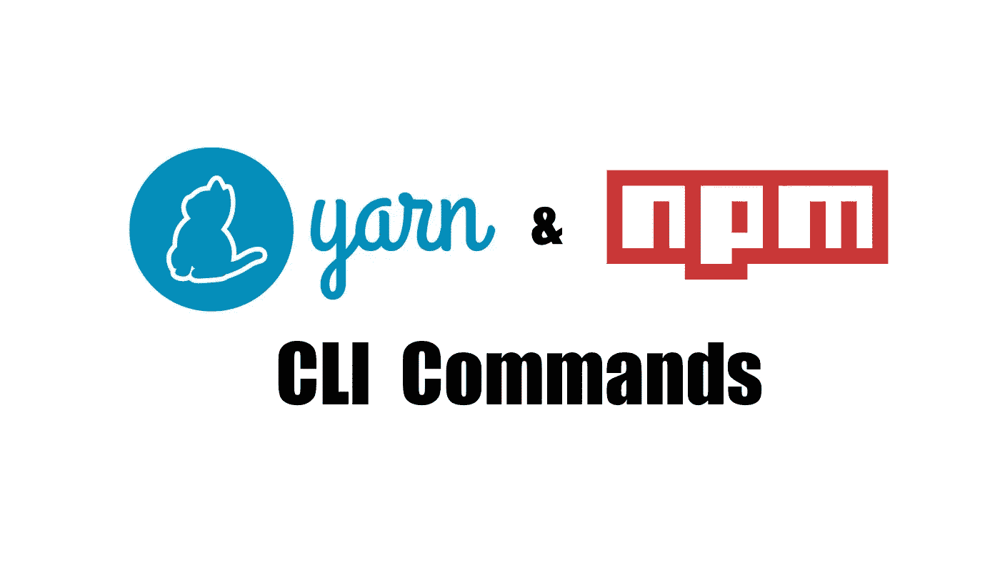
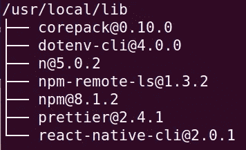
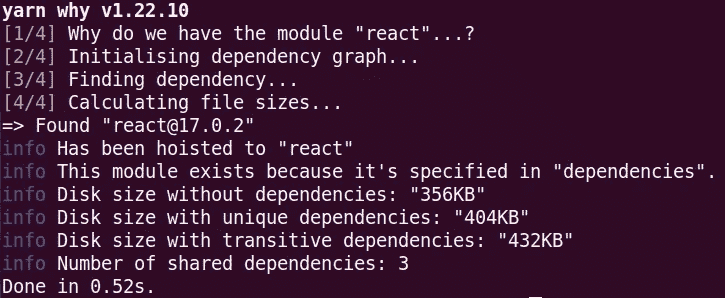
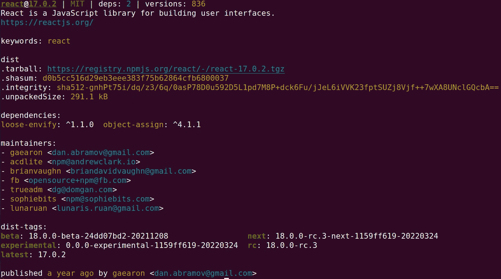
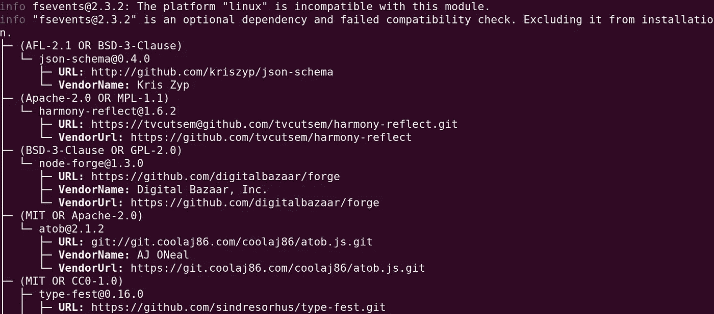
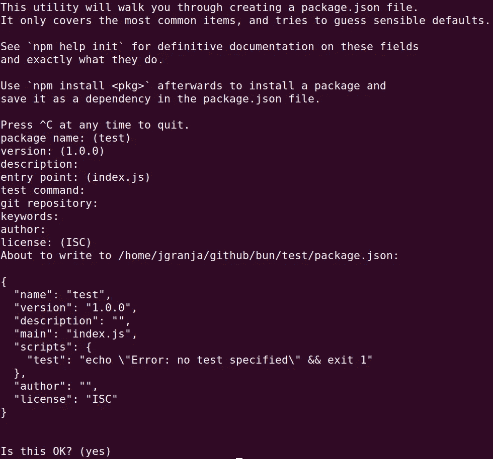

# 掌握 8 个关键的 Npm 和 Yarn 命令

> 原文：<https://betterprogramming.pub/8-key-npm-and-yarn-commands-to-master-c62d7d2aeb53>

## 掌握 npm 和 yarn CLI



作者捕获

作为 JavaScript 开发人员，我们倾向于花费大量时间管理我们的依赖关系。目前，最常用的工具是`yarn`和`npm`。所有这些都在使用`npm`库。

通过学习命令，我们可以变得更有效率。我们不需要离开 CLI 去做琐碎的任务。这两个包管理器工具都有强大的命令，可以完成几乎所有的工作。

在本文中，我们将看看可以从我们的`yarn/npm` CLI 中使用的八大高效命令。

# 1.包列表

我们可以在全球范围内安装`npm`软件包。然而，很难理解我们的机器库中安装了哪些库。我们可能想做一个清理，删除那些我们不使用的。

通过使用`list/ls`命令，我们可以检查已安装的依赖项。我们可以检查本地的和全球的。

通过了解如何使用该命令，清理将成为一项简单的任务。

## 使用

```
**yarn list** [--depth] [--pattern]**npm ls** [[<[@scope](http://twitter.com/scope)>/]<pkg> ...]**npm list** [[<[@scope](http://twitter.com/scope)>/]<pkg> ...]
```

## 例子

```
*# list all directory deps*
**npm list***# list all the global deps*
**npm list -g***# list only first level of deps*
**npm list -g --depth 0***# list the dependencies 4 levels deep*
**npm list -g --depth 4***# yarn is slightly different*
**yarn list --pattern gulp**
```

在我的机器上运行命令的示例:



作者捕获的命令

# 2.包装存在

这个命令将确定为什么安装您的软件包。是因为是直系亲属？也许其他包依赖于它？

使用这个 CLI 命令，您将很容易理解为什么您的软件包管理器要安装它。

## 使用

```
**yarn why** <query>*// both work in npm* **npm explain** <query>
**npm why** <query>
```

## 例子

```
*# using it with a package name* **npm why react***# using it with a package folder* **npm why node_modules/loadsh***# using it with a file inside a package* **npm why node_modules/html-entities/lib/index.js**
```

两个包管理器的输出略有不同。在我看来，`yarn`的输出可读性更强。

让我们看看运行`yarn why react`的输出



作者捕获的命令

# 3.包装信息

您想从一个包中提取所有信息吗？使用`npm info`，我们可以一目了然地检查所有包装信息。我们可以了解:

*   它的依赖项
*   它的维护者
*   它的所有 dist 标签
*   它的最新版本

我们可以选择信息的输出。它可以是常规文本，也可以是 JSON 格式。

## 使用

```
**yarn info** <package> [<field>]
```

## 例子

```
*# prints regular console text info* **npm info react***# print info in JSON format* **npm info react --json**
```

让我们看看`react`包的信息:



作者捕获的命令

# 4.软件包许可证

该命令将输出所有软件包许可证及其对应的 URL。这使得检查任何库的任何许可证变得容易。

## 使用

```
*# will output all the packages and it's licenses urls*
**yarn licenses list** *# this will output of the licenses text* **yarn licenses generate-disclaimer**❌ not available in npm
```



作者捕获的命令

# 5.依赖性主页

经常想要导航到包主页 URL。在`npm` CLI 中有一个命令可以做到这一点。运行此命令将打开您的默认浏览器，并导航到包中列出的主 URL。

我们不再需要导航到库的 GitHub 或 npm 存储库。

## 使用

```
**npm home react**❌ not available in yarn
```

上面的命令将打开一个浏览器，链接到 URL[https://reactjs.org/](https://reactjs.org/)，在那里我们可以找到所有我们需要的关于 React 的信息。

# 6.包过期

现在，我们有像 Dependabot 这样的好工具来帮助我们更新我们的包。然而，该工具并不完美，不推荐用于重大更新。

使用`npm outdated`命令，我们可以快速检查哪些目录依赖关系已经过期。

## 使用

```
**yarn outdated** [package...]**npm** outdated [[<@scope>/]<pkg> ...]
```

## 例子

```
*# checking the directory packages outdated* **npm outdated***# checking the global packages outdated* **npm outdated -g***# it will skip the devDependencies* **npm outdated --prod**
```


作者捕获的命令

# 7.包初始化

有一个有用的命令可以帮助我们开始一个 JavaScript `npm/yarn`项目。`init`命令会提示一个控制台向导，在那里我们会被问一些关于我们项目的问题。

该命令的输出将是一个包含整个配置的`package.json`文件。

## 使用

```
**yarn init****npm init**
```



作者捕获的命令

# 8.升级软件包

升级依赖关系是一个经常发生的过程。`npm/yarn` CLI 为这一过程提供了一种简单的方式。

我们可以通过名称来升级依赖项，或者使用一种模式来适应更广泛的依赖项列表。我们还可以通过使用`--scope`选项来升级给定范围的所有依赖项。

## 使用

```
**yarn upgrade** [package]... --latest|-L [--caret | --tilde | --exact] [--pattern]**npm** update [-g] [<pkg>...]
```

## 示例:

```
*# using pattern*
**yarn upgrade --pattern gulp***# using pattern and dependency name* **yarn upgrade left-pad --pattern "gulp|grunt"***# using the tag to indicate the dependency version we want* **yarn upgrade --latest --pattern "gulp-(match|newer)"***# using scope*
**yarn upgrade --scope @angular**
```

# 包裹

就是这样。我希望上面的命令能帮助你提高工作效率。他们非常友好，容易记住。

如果您记住了命令，但记不住选项，您可以使用 CLI help 命令。

```
# outputs help for npm command
**npm package -h**# outputs help for yarn command
**yarn package -h**
```

## ***参考文献***

[NPM CLI 文档](https://docs.npmjs.com/cli/v8/commands)

[纱线 CLI 文档](https://classic.yarnpkg.com/en/docs/cli/)