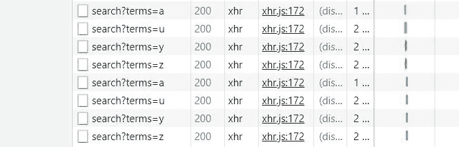
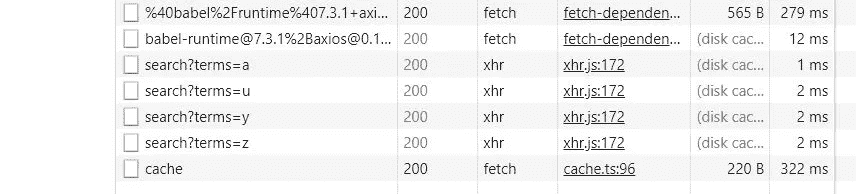
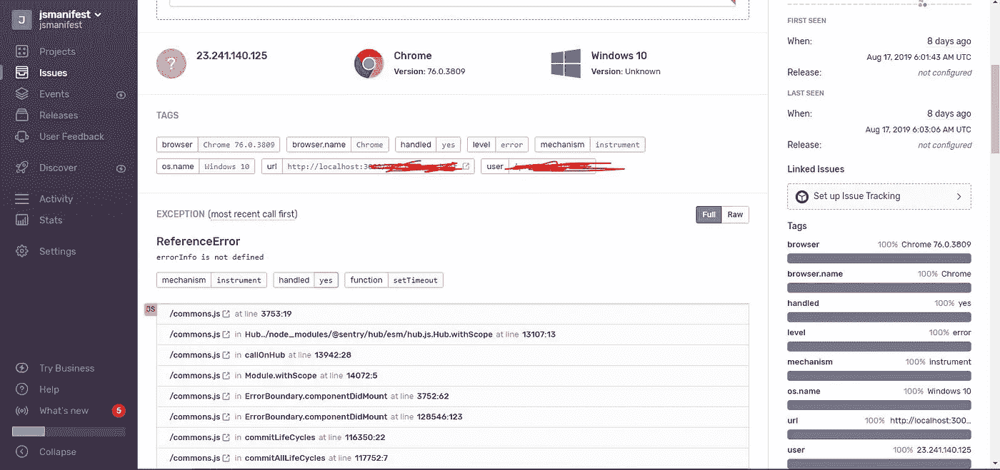

# 增强 React 应用的 8 种神奇方法

> 原文：<https://betterprogramming.pub/8-miraculous-ways-to-bolster-your-react-apps-80a5040143a3>

## 如果可以的话，让 React 做更少的工作

*照片由 Tarn Nguyen 在 Unsplash 上拍摄*

有时，当我们在 React 中构建应用程序时，我们可能会错过改进应用程序的机会，这可能是因为，当我们的应用程序刚刚*工作*并且*感觉*快时，我们容忍它是完美的。

作为开发人员，我们可能会假设，如果我们的项目的结果对我们来说是正常的，那么对用户来说也是正常的。当我们这样思考时，这可能会导致我们忽略代码中可以优化以获得更好结果的区域。

这篇文章将从八个方面来支持你的 React 应用。

# 1.热爱你们的身份

支持 React 应用的第一个方法是热爱你的身份。

重要的是要记住，你可以用`React.useMemo`包装变量和函数，因为你可以授予它们记忆自己的能力，以便 React 知道它们在未来的渲染中保持不变。

否则，如果不记住它们，它们的引用将从未来的渲染中消失。这可能会伤害他们的感情，所以你可以向他们表示你爱他们，并希望通过纪念他们来留住他们。

如果你爱他们，他们会回报你，确保他们照顾你和你的应用，帮助避免他们所处情况下的浪费操作。

例如，让我们假设我们正在制作一个定制的钩子，它接受一系列的`urls`作为参数，这样它就可以把它们累积成一个承诺数组，用`Promise.all`来解析。

一旦完成，结果将被插入到状态中并传递给`App`组件。我们的承诺列表将映射到包含四个要获取的不同 URL 的`urls`数组:

我们的任务是从这四个链接中获取数据，所以，理想情况下，应该只发出四个请求。

但是，如果我们看一看 *Chrome* 内部的*网络标签*，事实是它发出了八个请求。

这是因为`urls`参数没有*而不是*保持与之前相同的身份，因为当`App`重新呈现时，它每次都实例化一个新的数组，所以 React 将其视为一个已更改的值。

计算机程序有时认为他们可以智胜我们，并摆脱这种糟糕的行为。

为了解决这个问题，我们可以使用`React.useMemo`，这样只要包含 URL 的数组不改变，promises 数组就不会在每次渲染*时重新计算自己。*

让我们重构代码来应用这个概念:

如果我们现在运行它，它仍然会发送八个请求。这是因为，尽管我们记忆了`urls`数组，但我们也需要记忆钩子内部的`promises`变量，因为每当钩子运行时，它也会实例化自己:

我们的代码现在在运行时应该只发送四个请求。

# 2.将道具合并到孩子

有时我们会遇到这样的情况，我们想在渲染之前偷偷放入一个道具与孩子融合在一起。React 允许你查看任何 React 元素的属性，以及其他属性，比如暴露它的`key`。

我们可以用一个新的组件包装子元素，并从那里注入新的道具，或者我们可以使用这种方法合并新的道具。

例如，假设我们有一个使用`useModal`钩子的`App`组件，它通过提供`open`、`close`和`opened`这样的控件来提供一些方便的工具来管理模态。

我们希望将这些道具传递给一个`VisibilityControl`组件，因为它将在将模态数据传递给子组件之前提供额外的功能:

`VisibilityControl`确保`activated`为`true`后，才允许`opened`被其子节点正常使用。

如果在秘密路线中使用，则`VisibilityControl`提供防止未激活用户看到秘密内容的功能。

# 3.巨型减速器组合减速器

可能会有一段时间，你需要在应用程序中组合两个或更多的减速器，使一个更大的。这种方法类似于[中`combineReducers`的工作方式。](https://react-redux.js.org/)

让我们假设我们计划制作一个巨大的微服务应用程序，我们最初计划指定应用程序中的每个部分负责它们自己的上下文/状态。

但是，后来，我们想到了一个价值百万美元的应用程序，它要求各州联合成一个大州，这样我们就可以在同一个环境中管理它们。

我们有一个`authReducer.js`、`ownersReducer.js`和`frogsReducer.js`，我们希望将它们结合起来:

`authReducer.js`

`ownersReducer.js`

`frogsReducer.js`

我们将它们导入到主文件中，并在那里定义状态结构:

`App.js`

然后您可以像平常一样使用钩子，调用`dispatch`，传入匹配的`type`，以及指定的 reducer 的参数。

最重要的部分要看的是`rootReducer`:

# 4.错误报告的哨兵

当与 React 集成时，项目从 [Sentry](https://docs.sentry.io/platforms/javascript/react/) 中受益匪浅。将详细的错误报告发送到一个中心位置进行分析是一个非常重要的工具！

一旦你`npm install @sentry/browser`并为你的 React 应用程序设置好，你就可以在创建你的帐户并在你项目的仪表板中分析你的错误报告后登录 [sentry.io](https://sentry.io/) 。

这些报告非常详细，因此您将从大量信息中受益，这些信息有助于您解决错误，例如了解用户的设备、浏览器、发生错误的 URL、用户的 IP 地址、错误的堆栈跟踪、错误是否得到处理、函数名称、源代码、显示导致错误的网络操作跟踪的有用的面包屑列表、标题等等。

下面是这可能看起来像什么的截图:

你也可以让几个团队成员对不同的事情发表意见，这样就可以形成一个协作的环境。

# 5.在 window.fetch 上使用 axios

除非你不关心 Internet Explorer 用户，否则你应该*不要*为你的 React 应用程序使用`window.fetch`，因为没有一个 IE 浏览器支持`window.fetch`，除非你提供一个 polyfill。

Axios 很好地支持了 IE，同时也带来了额外的功能，比如中途取消请求。这个`window.fetch`其实适用于任何 web app，并不是专门针对 React 的。

它出现在这个列表中的原因是今天在 React 应用程序中使用`window.fetch`并不罕见。随着 React 应用程序经历传输/编译阶段，根据所配置的工具，很容易意外地认为它是传输的`window.fetch`。

# 6.监视 DOM 节点时，使用回调引用而不是对象引用

尽管`React.useRef`是附加和控制对 DOM 节点的引用的新手，但它并不总是最好的选择。

有时，您可能需要对 DOM 节点进行更多的控制，以便提供额外的功能。

例如， [React docs](https://reactjs.org/docs/hooks-faq.html#how-can-i-measure-a-dom-node) 展示了这样一种情况，您需要使用回调 ref 来确保，即使当前 ref 值发生了变化，外部的组件仍然可以得到更新通知。这就是回调引用相对于`useRef`的优势。

Material-ui 利用这个强大的概念在组件模块中附加额外的功能。最棒的是，这种行为中自然会出现清理。精彩！

# 7.`useWhyDidYouUpdate`

这是一个自定义的钩子，用来暴露使我们的组件重新呈现的变化。

有时，当像高阶组件`React.memo`这样的记忆器不够用时，你可以使用这个方便的钩子来找到你需要考虑记忆的道具:(归功于布鲁诺·莱默斯。)

你可以这样使用它:

# 8.让你的功能找到你

这将引用以前的一篇文章，因为它有点长，非常适合这篇文章。以下是内容:

让我举一个现实生活中的例子，因为我想多强调一下这个例子。

高阶函数最大的好处之一是，如果使用正确，它会为你和你周围的人节省很多时间。

在我的工作中，我们使用[React-to-stify](https://github.com/fkhadra/react-toastify)来显示通知。我们到处都用它。此外，他们还为 UX 最后一分钟的快速决策提供了绝佳的逃生通道。

我们应该如何处理这个错误？只显示一个祝酒通知！完成了。

然而，我们开始注意到，当应用程序变得越来越大，复杂程度越来越高时，我们的 Toast 通知变得过于频繁。

这很好，但是，我们没有办法防止重复。这意味着一些 Toast 通知会在屏幕上显示多次，即使它们与上面的 Toast 完全相同。

因此，我们最终利用该库提供的 API，通过使用`toast.dismiss()`的`id`来帮助删除活动的 Toast 通知。

为了解释前面的部分，在继续之前，显示我们从中导入祝酒词的文件可能是个好主意:

听我说，我知道这看起来不太吸引人。但我保证两分钟后会好的。

这是我们在一个单独的组件中用来检查之前的 Toast 是否已经在屏幕上。如果是，它将尝试移除该 Toast 并重新显示新 Toast。

这工作得很好，但是，我们在整个应用程序中有其他祝酒词需要以同样的方式修改。我们不得不仔细检查每一个显示 Toast 通知的文件来删除重复的文件。

当我们想到在 2019 年检查每一个文件时，我们立即知道这不是解决方案。因此，我们查看了`util/toast.js`文件并重构它来解决我们的问题。

这是后来的样子:

`src/util/toast.js`

最简单的解决方案是创建一个高阶函数，而不是遍历每个文件。这样做可以让我们“颠倒”角色，这样，我们就不用搜索文件，而是将祝酒词指向我们的高阶函数。

这样，文件中的代码就不会被修改或改动。它们仍然正常工作，我们获得了删除重复祝酒词的能力，最终不用去任何地方写不必要的代码。这节省了时间。

而这就是本文的结尾！我希望你觉得它有用，并期待在未来更多。