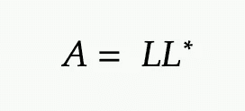

# 简化的线性代数编程的 8 个最基本的 SciPy 函数

> 原文：<https://betterprogramming.pub/8-most-essential-scipy-functions-for-linear-algebra-programming-simplified-e3c7a4db0b58>

## Python 开发者简明指南


来自 Pexels 的马頔·迪马克斯

离开。NET 开发并不是我曾经错过的事情，因为 C++并没有变得更容易。

我是在 2012 年 12 月开发 Python 的。NET 框架使用 C#和 C++。随着我在实现基于线性代数的任务时面临的挑战越来越大，我开始寻找任何软件或开源库的 Python 专用管道。输入 SciPy。

如果你想用 Python 实现线性代数运算，可以考虑从 SciPy(读作*叹 pi* )开始，它代表科学 Python。

它是一个基于 Python 的数学、科学和工程开源软件生态系统[1]，构建在 NumPy 之上。虽然它针对线性代数任务进行了优化，但这并不是它的全部功能。

我写过大量关于人工智能背景下的线性代数的文章，涉及自然语言处理、机器学习和媒体深度学习。

在本文中，我将着重于简化我认为必不可少的函数(举例说明如何使用 SciPy 实现我认为最常用的线性代数任务)。

# **1。**s**cipy . Lina LG . inv()**

当我必须分析具有多个变量的线性方程组来计算矩阵的逆矩阵时，我会使用这种方法。

从现在开始，我将在要点中包含代码的输出，记为`OUTPUT`。我将只把`numpy`作为`np`导入一次。

作者代码

我观察到当使用`linalg.inv()`中的`check_finite`参数时，如果你禁用它，系统会崩溃。`check_finite`参数允许仅识别有限数字的使用。

# 2.**scipy . linalg . solve _ Toeplitz()**

使用 Levinson 递归程序将此应用于计算 Toeplitz 矩阵。当我对求解常系数线性方程感兴趣时，我需要验证这种特定类型的矩阵。

作者代码

为了创建一个 Toeplitz 矩阵，您可以在上面看到，我只阐明了第一行和第一列，因为 SciPy 需要它们的规范。

## 3.scipy.linalg.eig()

当你有一个方阵并计算它的特征值和特征向量时，实现这个。

作者代码

这里的目标是求解系统随时间的变化，这样特征值就可以度量系统演化的速度。我通常用它来评估货币风险管理，这是一项经常性的金融工程任务，同时使用深度学习进行数据分析。

# 4.scipy.linalg.schur()

我将一个矩阵分解成一个上三角矩阵和一个酉下三角矩阵，得到舒尔分解，这有助于寻找特征值和特征向量。

作者代码

我们称`T`和`Z` : `T`为上三角矩阵，`Z`为酉矩阵。

# 5.希皮·里纳尔格·乔莱斯基()

乔莱斯基分解是一种解压缩埃尔米特正定矩阵以导出下三角矩阵的方法[3]。

作者代码

这种因式分解利用了这样一个变量，即如果`A`是一个埃尔米特正定矩阵[4]，则存在一个下三角矩阵 L，因此:



由作者创建

其中*表示共轭转置。

# 6.scipy.linalg.polar()

极分解是矩阵的因式分解，返回两个矩阵:(1)酉矩阵和(2)埃尔米特正定矩阵。

作者代码

这种方法在线性代数中是必不可少的，因为当我们想要显示每个矩阵都有一个特征向量基时，它可以跨任务应用。此外，开发它来寻找某些类型的矩阵的近似值。

每天，我在人工智能任务中使用它，如机器学习实现管道和模式识别动作。

# 7.**scipy . linalg . solve _ Sylvester()**

我们用这个来解西尔维斯特方程。在人工智能任务中(就我而言)，我用它来计算网络中节点间的最小成本路径。

作者代码

作为说明，当我构建自然语言处理实现管道或训练机器学习模型(例如，支持向量机和主成分分析)进行预测分析时，我集成该功能的用例是为了检测和纠正数据集中的错误。

# 8.莱斯利()

莱斯利矩阵显示了人口中不同年龄组之间的变化率。它最初是用来描述人类群体的。

作者代码

我用它对人口随时间的变化进行预测分析。我利用后一种信息为用户开发关于特定产品或服务的基于数据的见解(至少基于年龄组)。

# **离别的思念**

如果你对这篇文章的编辑有任何建议，或者对进一步扩展这个主题领域有什么建议，请和我分享你的想法。

另外，我经常在 Medium 上发布关于线性代数的文章。如果你想阅读更多，我推荐你阅读下面的帖子，“人工智能的线性代数:NLP 和 ML 用例简单解释”:[https://medium.com/p/c0bac7159a7f](https://medium.com/p/c0bac7159a7f)【2】。

```
Please kindly consider subscribing to my newsletter[http://pventures.substack.com](http://pventures.substack.com)
```

# *参考文献*

1.scipy。GitHub — Scipy/scipy: SciPy 库主存储库。GitHub。从[https://github.com/scipy/scipy](https://github.com/scipy/scipy)

2.蒂尔贝，阿尼尔。(2022 年 7 月 24 日)。人工智能的线性代数:NLP 和 ML 用例。https://medium.com/p/c0bac7159a7f

3.魏斯斯坦。共轭转置—来自 Wolfram MathWorld。来自 https://mathworld.wolfram.com/ConjugateTranspose.html[的](https://mathworld.wolfram.com/ConjugateTranspose.html)

4.部分埃尔米特矩阵的正定完备化。线性代数及其应用，58，109–124。[https://doi . org/10.1016/0024-3795(84)90207-6](https://doi.org/10.1016/0024-3795(84)90207-6)

5.霍恩和约翰逊(1985 年)。矩阵分析。剑桥大学出版社。[http://dx.doi.org/10.1017/cbo9780511810817](http://dx.doi.org/10.1017/cbo9780511810817)

6.求解时变系数 Sylvester 方程的递归神经网络。IEEE Xplore。来自[https://ieeexplore.ieee.org/abstract/document/1031938](https://ieeexplore.ieee.org/abstract/document/1031938)

7.莱斯利矩阵，斐波纳契数列和人口动态。[https://www . tandfonline . com/doi/ABS/10.1080/09720529 . 2016 . 1241545](https://www.tandfonline.com/doi/abs/10.1080/09720529.2016.1241545)