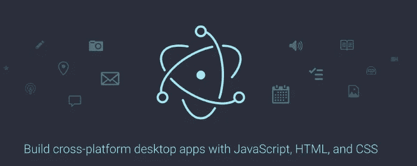
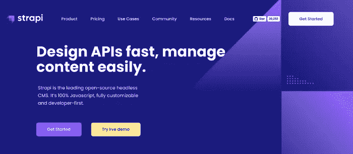
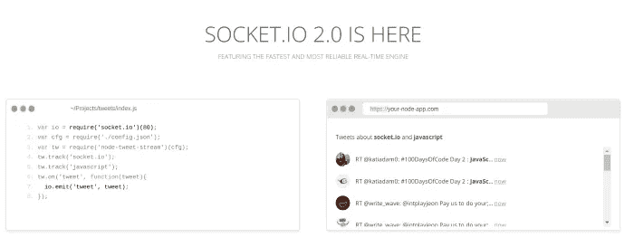
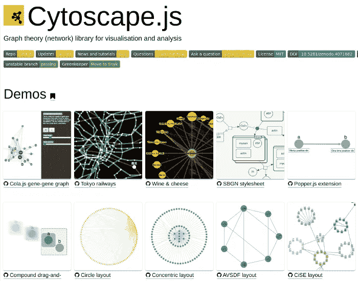
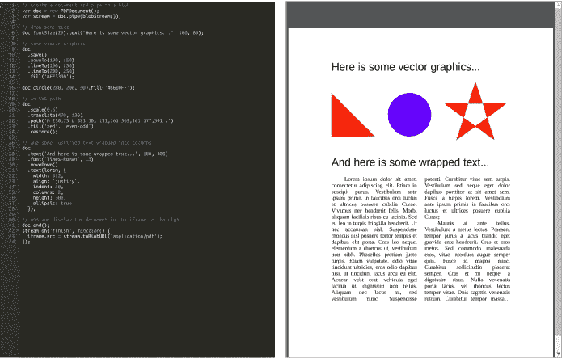
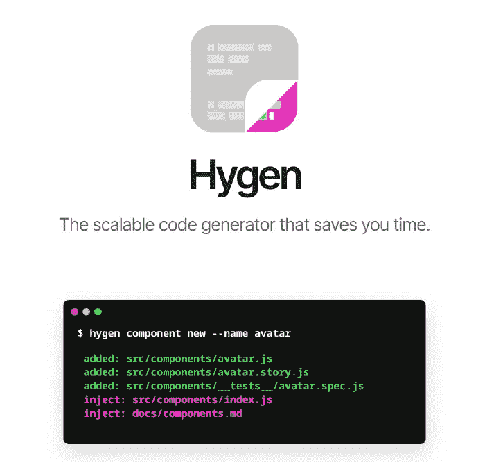
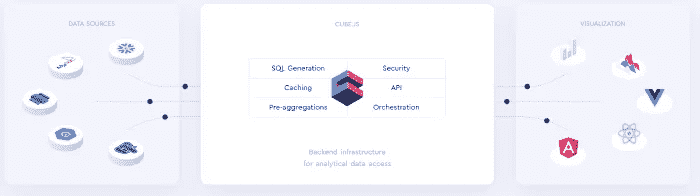
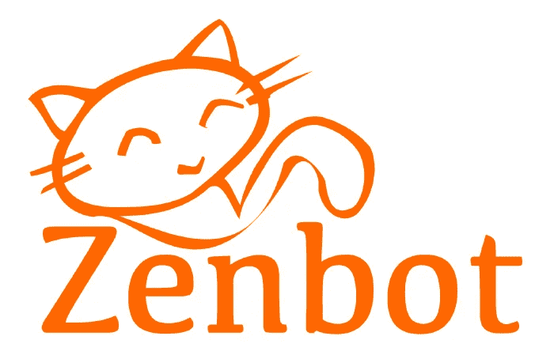

# 值得一看的 8 个 Node.js 项目

> 原文：<https://betterprogramming.pub/8-node-js-projects-worth-looking-at-32a7290fc6d6>

## 有些已知，有些有希望，都很神奇

[马特·霍华德](https://unsplash.com/@thematthoward?utm_source=unsplash&utm_medium=referral&utm_content=creditCopyText)在 [Unsplash](https://unsplash.com/s/photos/explore?utm_source=unsplash&utm_medium=referral&utm_content=creditCopyText) 上拍照

谈到开源开发，GitHub 是开发者社区的圣杯。作为一种开源语言本身，Node 正逐渐成为 GitHub 上使用最多的技术之一。所以我们决定看看 GitHub 上目前的八个趋势节点项目。

我们从这篇文章中省略了一些显而易见的选择，比如 Express、Mocha 和 ESlint。仔细阅读我们挑选的项目，看看您是否能找到一个新的开源项目来为您的某个项目做贡献或在其中使用。

# [电子](https://github.com/electron/electron)

电子主页

Electron 用于构建跨平台的桌面应用程序，这些应用程序使用了 web 开发中已经使用的技术，如 HTML、CSS 和 JavaScript。有了 Electron，你可以很容易地创建一个运行在 Windows、Linux 和 macOS 上的桌面应用程序——使用相同的代码库。

电子以 Node 和 Chromium 为核心技术。它最重要的特性，也是一些安全问题的原因，是允许应用程序访问操作系统的本机 API，而不用担心操作系统的类型。

我们今天看到的大多数流行的桌面应用程序都是使用 electronic 构建的。Visual Studio 代码、Atom、微软团队和 Slack 就是其中的一些例子。

电子目前由 GitHub 维护。它在 GitHub 上拥有 86，000 颗星，是目前最受欢迎的节点项目之一。

# [斯特拉皮](https://github.com/strapi/strapi)

Strapi 主页

Strapi 是一个无头 CMS 系统，您可以通过 api 访问它存储的内容。*这里的*是指它只关注内容的存储和交付(后端)，而不关注内容的显示方式(前端)。

您可以使用 Strapi 的用户友好的管理面板在几个小时内轻松开发 api。然后，您可以使用您喜欢的技术来构建前端，而不用担心应用程序的后端。

Strapi 提供的功能包括自动生成文档、JWT 认证和内置电子邮件系统。每当创建新的内容类型时，它都会自动生成处理 CRUD 操作的逻辑。

作为一种开发工具，Strapi 仍处于早期阶段。但如果它在 GitHub 上的受欢迎程度有任何迹象的话，开发者已经非常喜欢 Strapi 了。

# [插座。IO](https://github.com/socketio/socket.io)

插座。IO 主页

插座。IO 允许在节点服务器和客户端之间进行实时、双向和基于事件的通信。

它主要使用 websocket 技术来保持双向通信。如果服务器想在不等待客户机请求的情况下向客户机发送新接收到的信息，这是您应该使用的技术。

它支持在服务器出现故障时自动重新连接，并检测服务器和客户端之间的连接何时断开。它建立在[引擎之上。IO](https://github.com/socketio/engine.io) 库。

甚至在这个包之前，Node 已经有了实时应用程序开发语言友好的名声。然而，随着它的可用性，Node 作为一种用于实时应用程序的技术已经走到了前沿。

这个项目给你一个很好的机会去理解 websocket 协议是如何工作的。

查看我之前的文章[如何用节点和套接字构建聊天应用。IO](https://livecodestream.dev/post/2020-07-11-a-starter-guide-to-building-real-time-applications-with-nodejs/) 。

# [Cytoscape.js](https://github.com/cytoscape/cytoscape.js)

Cytoscape 主页

Cytoscape 是一个全功能的图论库，可以用来建模和可视化关系数据。例如，您可以使用这个包来建模社交网络。

它支持图论的许多用例，如有向图、无向图和复合图。它还提供了一组特性，包括构建支持平移、缩放和框选的交互式图形的能力。

Cytoscape 支持桌面和移动浏览器上的数据可视化。除了可视化数据之外，您还可以使用这个包在服务器端分析关系数据。

如果你对数据科学感兴趣，这是一个非常适合你参与的项目。

# [PDFKit](https://github.com/foliojs/pdfkit)

PDFKit 游乐场

PDFKit 是一个库，可以用来生成复杂的、多页的、可打印的 PDF 文档。它支持一系列广泛的功能。包括矢量图形、字体嵌入、图像嵌入、注释和加密。

您可以在服务器端和浏览器上使用 PDFKit。在浏览器端 PDF 生成的情况下，您必须使用另外两个名为 [Browserify](http://browserify.org/) 和 [blob-stream](https://www.npmjs.com/package/blob-stream) 的库来使包正常工作。

# [Hygen](https://github.com/jondot/hygen)

Hygen 主页

Hygen 是一个简单的代码生成器，您可以使用它来生成代码块，而不必自己编写代码块。

虽然已经讨论过代码生成器可以帮助你在更短的时间内做更多的工作，但是大多数其他代码生成器都不能像 Hygen 那样显著地提高生产率。

Hygen 对上下文有很好的理解，并且不知道程序中使用的语言。当您想要生成新的代码块时，您可以调用 Hygen 来处理普通的编码任务。

与其他语言相比，它与 Redux、React Native 和 Express 配合得非常好。这个工具已经被 Airbnb 和 Wix 等领先产品使用。

# [Cube.js](https://github.com/cube-js/cube.js/)

多维数据集主页

Cube 是一个用于构建分析性 web 应用程序的框架。大多数情况下，这些工具与商业智能或面向客户的分析相关。

它被设计成与 AWS Athena 和 Google BigQuery 等无服务器查询引擎一起工作。使用 Cube，您可以专注于创建大规模分析工具，而不必担心基础架构。

Cube 是一个模块化的框架。它提供了一组模块，每个模块只做一件事:处理转换和建模、查询和缓存、管理 API 网关以及构建 ui。

作为一个相当新的框架，Cube 是您做出开源贡献的好地方，尤其是如果您对大数据感兴趣的话。

# [Zenbot](https://github.com/DeviaVir/zenbot)

Zenbot 徽标

Zenbot 是一个命令行加密货币交易机器人。它使用 Node 和 MongoDB 作为核心技术。

用户可以根据自己的需求在机器上安装 Zenbot。Zenbot 利用人工智能不断改进其算法，能够以非常高的频率进行交易。它还内置了对其他加密货币交换程序的支持，如 GDAX、Quadriga 和北海巨妖。

向 Zenbot 投稿给你一个试验加密货币的机会，加密货币对世界来说仍然是一项新技术。

# 结论

如果你是一名节点开发人员，你将很容易在 GitHub 上发现令人兴奋的开源项目，就像本文中提到的那些项目。

这些项目中的大多数都有很好的文档记录，并为新的贡献者提供了清晰的指南。您可以访问他们的 GitHub 页面，浏览源代码，寻找为这些项目做出贡献的机会。

那么为什么要等呢？走出去，作为一名节点开发人员继续您的开源体验。

感谢阅读！