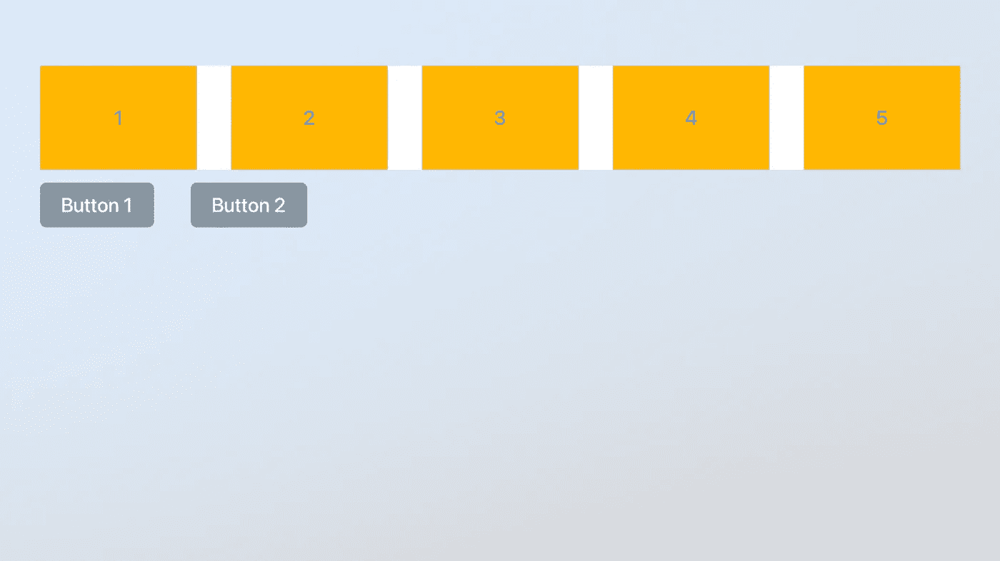
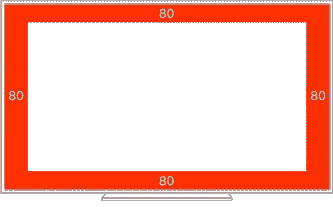
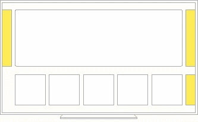
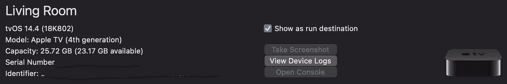

# 当我开始开发 tvOS 应用程序时，我希望有人给我 8 条建议

> 原文：<https://betterprogramming.pub/8-pieces-of-advice-i-wish-someone-gave-me-when-i-started-working-on-a-tvos-app-fe3075525782>

## 过渡到 tvOS 并不难。然而，有些事情制造了障碍

由[凯利·西克玛](https://unsplash.com/@kellysikkema?utm_source=unsplash&utm_medium=referral&utm_content=creditCopyText)在 [Unsplash](https://unsplash.com/s/photos/apple-tv?utm_source=unsplash&utm_medium=referral&utm_content=creditCopyText) 上拍摄的照片

七年前，我开始从事 iOS 开发工作。直到今年 2 月，iOS 是我开发 app 的唯一平台。过渡到 tvOS 并不难。但是，有些事情造成了问题，浪费了时间。以下是我希望有人在我开始做 tvOS 时给我的八条建议。

这里没有特别的顺序。根据你从事的项目，有些信息对你来说会更重要。而且，这些提示并不是高级功能；这些是你交付 tvOS 项目所需要的基础。

**继续阅读前的重要提示**。对于其中的许多技巧，有人可以写一整篇博文。不幸的是，你在这里找不到完整的操作方法。然而，如果关于这个话题还有更多要说的，我会留下对我有帮助的链接。如果您想了解更多信息，请查看这些内容。

# UIFocus 指南

理解苹果的 focus 引擎非常简单。您可以使用 Apple TV 的遥控器来移动可聚焦的对象。你可以上，下，左，右。这将覆盖你的 tvOS 应用中 95%以上的用例。

然而，有些情况下我们需要一些帮助。让我们看看这个例子:

Xcode 截图

您有水平的项目集合和它们下面的两个按钮。如果你的焦点在最后一项 5 上，然后你向下移动，你的焦点就不会在按钮上。要实现这样的行为，您需要使用 UIFocus 指南。

UIFocus guide 是一个库，它允许我们通过创建自定义规则将焦点重定向到任何屏幕元素。使用它非常简单。你只需要定义起点和终点以及方向。下面是一些帮助您的代码:

关于这个话题还有更多要说的。幸运的是，这些家伙已经做到了。它帮助我理解了 UIFocus 指南是如何工作的，并在项目中实现了它。上面的 addFocusGuide 方法是从那些指南中继承过来的。

# 自定义焦点

首先，你需要知道任何东西都可以通过覆盖`canBecomeFocusedProperty`来聚焦。代码如下:

但是，如果您希望在关注视图时获得一些特殊效果，则必须重写 didUpdateFocus 方法。代码如下:

`UIFocusUpdateContext`是从一个视图到另一个视图提供与特定焦点更新相关的信息的对象。使用它，我们可以确定我们是要聚焦我们的视图还是将焦点从它转移到其他地方。以下代码将有所帮助:

在`focusedStyle`和`notFocusedStyle`方法中，您将添加适当的代码。你也可以在这里添加动画。对于更高级的动画，你将使用`UIFocusAnimationCoordinator`。

要找到更多关于这个话题的信息和学习更先进的东西，请查看[这个来自大书呆子牧场的博客帖子。](https://www.bignerdranch.com/blog/10-tips-for-mastering-the-focus-engine-on-tvos/)

# 安全区域

这将是简短的，但内容丰富。与 iOS 设备不同，tvOS 安全区域的边缘在所有四个边上都有插图。

照片由[苹果的人机界面指南](https://developer.apple.com/design/human-interface-guidelines/tvos/visual-design/layout/)提供

这可能会导致表和集合的内容出现问题。如果滚动视图的内容需要移动到边缘，您必须忽略安全区域。

# 收藏视图组合布局

这项技术并不新鲜。不过，我到现在都没用过。为我感到羞耻，因为我没有更快适应它。

当我开始开发 tvOS 应用程序时，第一批任务之一就是创建一个典型的 tvOS 布局——你可以垂直和水平滚动的内容。

照片由[苹果的人机界面指南](https://developer.apple.com/design/human-interface-guidelines/tvos/visual-design/layout/)

我开始将它实现为一个表格视图，其单元格包含一个集合视图。这种方法导致了安全区域的问题。出于某种原因，桌子没有理睬他们。在修复之前，我的一个同事让我注意到了集合视图的组合布局。

> 集合视图*布局*定义了集合中内容的视觉排列。布局被设计得非常灵活，允许你为你的内容创建任何类型的安排，从简单到复杂。

我们的垂直收藏视图将有水平部分。每组只包含一个项目。代码如下:

使用它我们不必处理多个数据源，代码也更少。要了解更多关于组合布局的信息，请看这篇博文。在那里，你会找到关于这个话题你需要知道的一切。

组合布局的另一个好处是一些优秀的特性是现成的。如果你想聚焦在像网飞这样的项目上(聚焦总是在卷轴的第一个项目上)，这是相当容易的。您需要将部分的`orthogonalScrollingBehavior`设置为`groupPaging`——就这样。

最后，为了解决安全区域的问题，我们已经在上一节讨论过了，你的`UICollectionViewCompositionalLayoutConfiguration`的`contentInsetsReference`的值必须是‘none’。'

# 远程控制和装载机

我很少为应用程序定制加载器。从我开始做 iOS 开发者开始，我就用 [MBProgressHud](https://github.com/jdg/MBProgressHUD) 。所以我决定把它用在当前的项目上。我不知道的是，当你展示加载器时，你阻止了对屏幕的触摸，而不是遥控器。现在，当我们显示加载程序时，我们也关闭了视图的用户交互。下面是实现这一点的代码:

# 截屏

如果你在一个真实的设备上构建你的应用程序，并且想要截屏，去你的 Xcode，Window/Devices，和模拟器。在那里你可以选择截图。这个特性很方便，尤其是对你的 QA 团队来说。

Xcode 截图

# 记住上次聚焦的索引路径

`UICollectionViews`和`UITableViews`都有这个好用的功能。`RemembersLastFocusedIndexPath`是一个布尔值，它指示集合视图是否自动将焦点分配给最后一个获得焦点的索引路径上的项目。换句话说，如果您在从控制器导航之前关注某个单元格，那么当您返回时，该单元格也会被关注。

但是，这里有一个问题。如果您在向后导航时重新加载表格或集合，此功能将不起作用。我们无法关闭重新加载，因为该单元格包含需要更新的进度条。解决方案是只重新加载单元格。在视图模型中，我们将为重载准备一个条目和索引路径。代码如下:

并且在视图控制器中，我们会绑定`indexPathsToReload`。

我也尝试过重新加载正确的部分。那没用。因此，如果您必须重新加载并记住最后聚焦的索引路径，您应该这样做。

# 斯威夫特伊

短篇，不用了。还没准备好。

说来话长，我们在这里看到了机会。tvOS 应用程序相对简单，非常适合测试 swiftUI。我们利用这项技术启动了 tvOS 项目。然而，它有如此多的问题。使用 swiftUI 与其说是编程，不如说是黑客。像 UIFocus 指南这样的一些基本功能仍然不存在。然而，这还不是最大的问题。创建大网格是。

我们看了苹果所有关于 swiftUI 的视频，几乎复制了他们的做法。我们已经使用 lazyVStask 和 lazyHStack 实现了网格。用户体验很糟糕。由于一个未知的原因，在网格中滚动时有很多延迟。同样的代码在 iOS 上运行良好。也许有一个解决问题的方法，但是日程安排迫使我们回到 UIKit。

我非常失望，因为我们不得不放弃 swiftUI。这是学习新技术并在产品代码中使用它的绝佳机会。然而，稳定压倒了好奇。

# 结论

如果你是一个优秀的 iOS 开发者，你就不会有 tvOS 应用的问题。我希望这些建议能帮助你从 iOS 过渡到 tvOS。如果你理解了这些，你就可以开始开发更复杂的特性了。

# 作者的奖金

这里有一篇关于如何学习[漂亮代码原则](https://medium.com/flawless-app-stories/beautiful-code-principles-39420873eff8)的好文章。

编码快乐！