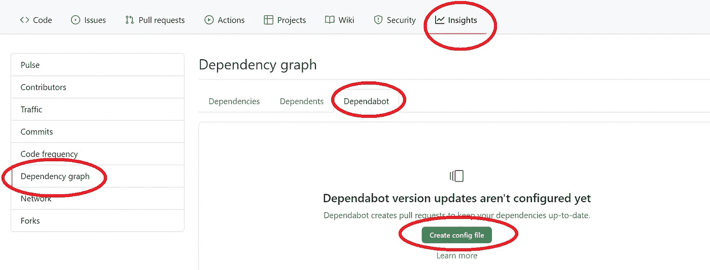
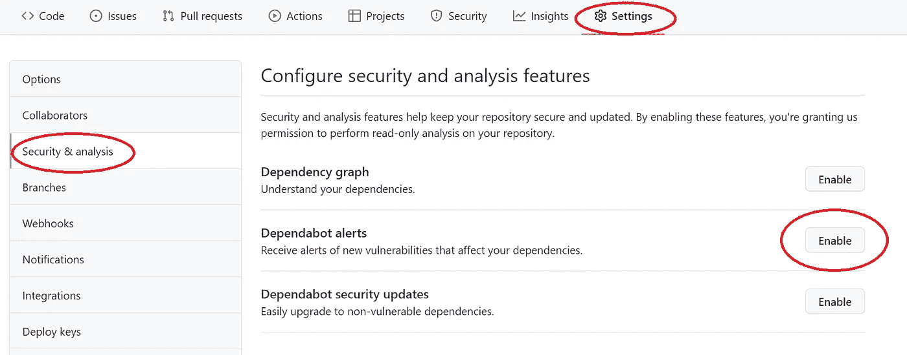
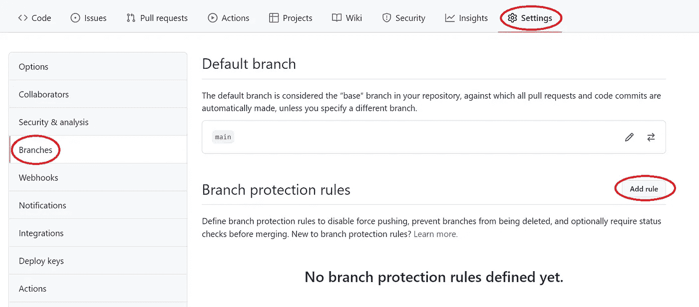
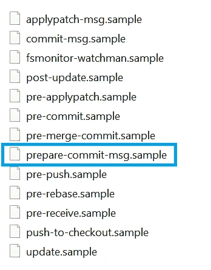

# 帮助简化开发的 9 个实用 GitHub 技巧

> 原文：<https://betterprogramming.pub/8-practical-github-tips-to-help-streamline-development-bf394079d554>

## 依赖性升级、漏洞警报等


作者的图像背景

**作为一名工程师，自动化是我们的昵称。** GitHub 是我们日常使用的工具之一。让我们探索一下 GitHub 提供的一些特性，这些特性有助于简化我们的日常开发。

```
[#1 Dependabot](#2aca)
[#2 GitHub Actions](#79a7)
[#3 Enable Alerts for Vulnerabilities](#f265)
[#4 Auto Merge](#3ee8)
[#5 Auto Assign](#ac69)
[#6 Auto Release](#aa61)
[#7 Release Notes Automation](#e11e)
#8 Enable Branch Protection
#9 Automating JIRA Ticket Number in Git Commit Messages
```

# 排名第一的依赖机器人

去年 12 月震惊网络的 Log4j 漏洞问题[CVE-2021–44228](https://nvd.nist.gov/vuln/detail/CVE-2021-44228)给我们所有人上了一课，让我们的依赖库保持最新是多么重要。

Dependabot 是技术栈的**依赖性监控**类别中的一个工具。它可以与 GitHub 无缝协作。它会检查我们的依赖文件中是否有过时的需求，并为找到的需求打开单独的 PRs。我们只是审查、合并并着手开发最新、最安全的版本。

要启用 dependent bot，请在我们的项目存储库标题下导航，单击 Insights→Dependency graph→dependent bot→创建配置文件。



“创建配置文件”窗口打开，在这里我们指定几个参数:

*   **包-生态系统:“maven”**，如果 Maven 是你的构建工具
*   **目录:“/”**，指定根目录
*   **interval:“daily”**，告诉 Dependabot 多久检查一次更新，在本例中是每天。其他值可以是“每周”(在星期一)或“每月”(每个月的第一天)。
*   **打开-拉动-请求-限制:10** ，指定请购单限制。对于更新，默认值为 5。

有关其他配置选项和值的示例，请参考 GitHub 的[依赖性更新配置选项](https://docs.github.com/en/code-security/supply-chain-security/keeping-your-dependencies-updated-automatically/configuration-options-for-dependency-updates)页面。

让我们提交这个配置文件。现在我们在项目根目录下有了一个名为`.github`的附加文件夹，其中有`dependabot.yml`。这是一次性的，一旦这个`yml`文件存在，就不需要重复这个步骤。

就在我们提交`dependabot.yml`之后，依赖机器人正在努力工作！给它几分钟时间，如果您第一次在您的项目上运行 Dependabot，您将惊讶地看到提交了多少包含依赖关系升级的 pull 请求(PRs )!

每个依赖关系升级一个 PR。如果您已经有一个 CI 管道，您的管道将准确地告诉您哪些 pr 可以安全合并，这将引入突破性的更改。如果您没有 CI 渠道，请继续阅读。

# #2 GitHub 操作

GitHub Actions 是一个 CI/CD 平台，允许我们自动化我们的构建、测试和部署管道。GitHub Actions online 上有大量的文章/指南来探索它丰富的特性。对于这个故事，我们将只关注如何利用它的 CI 来帮助 Dependabot 依赖关系的升级。

为 CI 创建工作流非常简单。点击 Actions →按关键字搜索，例如您的构建工具“Maven”→点击“Java with Maven”工作流模板中的“Configure”。GitHub Actions 提供了许多模板，我们可以根据您的项目所使用的编程语言和构建工具进行选择。

点击“Configure ”,编辑器将打开一个文件，如位于`.github/workflows`目录下的`maven.yml`,默认为模板内容。让我们根据我们的需要来定制它，在下面的示例中，我正在指导 CI 对`main`的任何推送以及对`main`的任何 PR。我们有一个`build`工作，在我们的项目上设置 Java 17 和运行`mvn clean install`的步骤。

简单的 CI 就是这样！现在提交文件，并单击“Actions”选项卡，查看我们的新 CI 管道是如何工作的。今后，所有的 Dependabot PRs 将自动通过我们的 CI 管道，这样我们就可以准确地知道哪个升级可以安全地合并到 main(如果它的版本是绿色的)，哪个升级会进行重大更改(如果它的版本是红色的)。

## **如何排除包含重大变更的升级**

对于失败的依赖机器人 PRs，我们知道升级后的库引入了突破性的变化。我们可以采取两项行动:

*   **修复我们的代码或创建技术债务 JIRA 票证**

如果修复很简单，就修复代码。如果解决问题很复杂，那就创建一张科技债 JIRA 券，以后再解决。在大多数情况下，升级后的库必须删除我们代码中正在使用的某些类，我们需要找到解决方案并更新我们的代码，然后才能升级到库的新版本。

*   **告诉 dependent bot 不要一直烦我们升级这样的库**

我们可以通过在 Dependabot 打开的 pull 请求上留下评论来与它进行交互。像`@dependabot ignore this dependency`这样的注释将关闭这个 PR，并阻止 Dependabot 为这个依赖关系创建更多的 PR。一旦代码被修复，我们就可以重新打开相同的 PR 或者手动升级库。

# #3 启用漏洞警报

dependent bot 执行扫描以检测易受攻击的依赖项，并在以下情况下发送 dependent bot 警报:

*   GitHub 咨询数据库中增加了一个新漏洞。
*   存储库的依赖关系图发生了变化。例如，当贡献者提交一个 commit 来改变它所依赖的包或版本时，或者当一个依赖项的代码改变时。

GitHub 检测*公共*仓库中易受攻击的依赖项，并默认生成依赖机器人警报。对于私有存储库，具有管理员访问权限的用户可以通过为其存储库启用依赖关系图和依赖机器人警报来启用依赖机器人警报。



启用警报后，如果检测到新的漏洞，您将在存储库的主页上看到一个黄色的大横幅。此外，根据通知设置，还会发送一封电子邮件通知您该漏洞。

# #4 自动合并

您可以通过为一个拉请求启用自动合并来提高开发速度，这样当所有的合并需求都被满足时，拉请求就会自动合并。由 Dependabot 提交的已通过 CI 管道的 pr 是自动合并的完美候选。

首先，您需要为存储库启用自动合并。在存储库名称下，单击设置→在“合并按钮”下，选择“允许自动合并”。

然后深入到 PR，选择合并方法，选择“启用自动合并”下拉菜单，然后单击合并方法，如“通过自动合并合并”。单击“启用自动合并”，然后单击“确认自动合并”。

一旦您为提取请求启用自动合并，当满足所有必需的审核且状态检查已通过时，提取请求将自动合并。

详细的逐屏说明可以在 GitHub 的[自动合并拉取请求](https://docs.github.com/en/pull-requests/collaborating-with-pull-requests/incorporating-changes-from-a-pull-request/automatically-merging-a-pull-request)页面上找到。

就我个人而言，我对 GitHub 提供的这种开箱即用的自动合并功能没有太多印象，它仍然需要导航到每个 PR 来启用和确认自动合并，太手动了。我强烈推荐一个动作，比如[GitHub Action Merge dependent bot](https://github.com/marketplace/actions/github-action-merge-dependabot)。用法非常简单，我们可以将一个“自动合并”作业附加到我们现有的 CI 工作流 yml 中，例如`maven.yml`，参见下面的片段:

我们正在通过扩展现有工作流来创建新的工作流作业`automerge` :

*   它等待`build` 任务完成(使用[需要](https://docs.github.com/en/actions/reference/workflow-syntax-for-github-actions#jobsjob_idneeds))。这个顺序很重要，因为它延迟了这个`automerge` 作业的执行，直到指定的作业成功完成。如果你有不止一个等待的任务，你可以把它们作为一个数组传递，就像`needs: [build, test].`
*   它有一个使用`fastify/github-action-merge-dependabot@v1`动作的步骤
*   它有一个有条件的`if`语句，只允许这个作业为 Dependabot 提交的 PRs 运行。
*   `GITHUB_TOKEN`秘密是 GitHub App 安装访问令牌。您可以使用这个令牌代表安装在您的存储库上的 GitHub 应用程序进行身份验证。在每个作业开始之前，GitHub 会为该作业获取一个安装访问令牌。该令牌在作业完成后过期。

完整的`maven.yml`可以在我的[GitHub repo for customer-service 微服务](https://github.com/wenqiglantz/customer-service/blob/main/.github/workflows/maven.yml)中找到。请随意查看。

# #5 自动分配

Auto Assign 是一个 Probot 应用程序，它在打开拉式请求时向拉式请求添加审阅者。安装步骤:

1.  转到[自动分配应用程序页面](https://probot.github.io/apps/auto-assign/)
2.  添加到 GitHub
3.  选择存储库
4.  在您的存储库中创建`.github/auto_assign.yml`

```
# Set to true to add reviewers to pull requests
addReviewers: true# Set to true to add assignees to pull requests
addAssignees: true# A list of reviewers to be added to pull requests (GitHub user name)
reviewers: 
  - reviewerA
  - reviewerB
  - reviewerC# A list of keywords to be skipped the process that add reviewers if pull requests include it 
skipKeywords:
  - wip# A number of reviewers added to the pull request
# Set 0 to add all the reviewers (default: 0)
numberOfReviewers: 0
```

# #6 自动发布

GitHub Marketplace 中有相当多的自动发布动作。我们将探索 [GitHub 自动发布](https://github.com/marketplace/actions/automatic-releases)。该操作通过自动上传资产、生成变更日志、处理预发布等方式简化了 GitHub 发布过程。典型的使用场景包括当标签被推送到存储库时，这个动作触发一个自动的 GitHub 发布。构建&测试您的项目后:

1.  从这个和前一个[永远看起来像](https://semver.org/)的标签之间的所有提交生成一个 changelog。
2.  生成一个新的版本，并将其与该标签相关联。
3.  上传`LICENSE.txt`和任何`jar`文件作为发布资产。

样本`tagged-relrease.yml`:

# #7 发行说明自动化

自动生成的发行说明为您的 GitHub 版本提供了手动编写发行说明的自动化替代方法。使用自动生成的发行说明，您可以快速生成一个版本内容的概述。您还可以自定义您的自动化发行说明，使用标签创建自定义类别来组织您想要包括的拉式请求，并从输出中排除某些标签和用户。

在 GitHub 的[自动生成的发布说明](https://docs.github.com/en/repositories/releasing-projects-on-github/automatically-generated-release-notes)页面可以找到关于如何自动化发布说明的详细分步指南。

# #8 启用分支保护

您可以创建一个分支保护规则，以对一个或多个分支强制执行某些工作流，例如要求对合并到受保护分支的所有提取请求进行批准审查或通过状态检查。

要添加分支规则，请导航至设置→分支→添加规则。



您可以在存储库中为特定分支、所有分支或与您指定的名称模式匹配的任何分支创建分支保护规则。例如，为了保护任何包含单词`release`的分支，您可以为`*release*`创建一个分支规则。您可以使用通配符语法`*`为存储库中所有当前和未来的分支创建一个规则。帮助我们自动化分支/合并的典型保护规则包括:

*   合并前需要一个拉请求。
*   合并前需要通过状态检查。
*   合并前指定所需的批准数量
*   推送新的提交时，取消陈旧的拉请求批准。
*   要求分支在合并前是最新的。

如果存储库有多个影响相同分支的受保护分支规则，则包含特定分支名称的规则具有最高优先级。

*注意:只有对存储库具有管理员权限的人才能管理分支保护规则。*

# #9 自动生成 Git 提交消息中的 JIRA 票号

在 git 提交消息中包含吉拉票证编号，可以通过查看相应的吉拉票证来轻松跟踪代码提交历史。然而，像任何手动过程一样，很难强迫开发人员将吉拉票号添加到他们的每一条 git 提交消息中。我们能自动化它吗？当然可以！我们来探索一下。

我们假设我们的特征分支以它们相应的吉拉票号命名。比如:

*   门票-100 英镑
*   特写/门票-100
*   门票-100-固定

我们需要确保我们的特性分支包含它们的吉拉票号，这是我们如何利用 Git hook 来自动化这个过程的关键。如果您的分支机构名称不包含您的吉拉机票号码，我们将要探讨的这一技术将不起作用。请注意，即使包括吉拉机票号码，我们对分支机构的命名也可能有所不同，请参见上面的分支机构名称示例。只要吉拉票号出现在分行名称中，我们就是好的！

## Git 挂钩

Git 挂钩是每当 Git 存储库中发生特定事件时自动运行的脚本。它们允许您定制 Git 的内部行为，并在开发生命周期的关键点触发可定制的操作。

钩子驻留在每个 Git 存储库的`.git/hooks`目录中。当您初始化存储库时，Git 会自动用示例脚本填充这个目录。如果您在`.git/hooks`中查看您的任何 Git 存储库，您会发现以下文件:



注意我突出显示了`prepare-commit-msg.sample`，是的，这就是我们要定制的文件。

## 自定义`prepare-commit-msg`挂钩

按照以下步骤定制`prepare-commit-msg`挂钩。

*   打开项目根目录下的`.git/hooks`目录。
*   用你喜欢的编辑器打开`prepare-commit-message.sample`文件。
*   删除样本样板代码。
*   如果在 Windows 上运行，将以下脚本复制并粘贴到该文件中(归功于 [johncmunson](https://gist.github.com/johncmunson/ca02a8027a923a7f4b2f662c67d6528c) )。如果您使用 Mac，请确保将第一行替换为`#!/bin/bash`
*   将文件重命名并另存为`prepare-commit-message`(删除`.sample`文件扩展名)。
*   提交测试提交消息以进行验证。

就是这样！现在，您应该看到您的提交消息前面添加了从您的分支机构名称中提取的吉拉票号。

***注意:这个解决方案一次只能用于一个存储库。如果您有多个需要处理的存储库，请确保对每个存储库重复上述步骤。***

上面提到的一些技巧的示例代码可以在我的 [GitHub 客户服务微服务库](https://github.com/wenqiglantz/customer-service/tree/main/.github)中找到。

# 参考

[https://docs . github . com/en/code-security/supply-chain-security/keeping-your-dependencies-updated-automatically/configuration-options-for-dependency-updates](https://docs.github.com/en/code-security/supply-chain-security/keeping-your-dependencies-updated-automatically/configuration-options-for-dependency-updates)

[https://docs . github . com/en/pull-requests/collaboration-with-pull-requests/incorporated-changes-from-a-pull-request/automatically-merging-a-pull-request](https://docs.github.com/en/pull-requests/collaborating-with-pull-requests/incorporating-changes-from-a-pull-request/automatically-merging-a-pull-request)

[https://docs . github . com/en/code-security/supply-chain-security/managing-vulnerability-in-your-projects-dependencies/about-alerts-for-vulnerable-dependencies](https://docs.github.com/en/code-security/supply-chain-security/managing-vulnerabilities-in-your-projects-dependencies/about-alerts-for-vulnerable-dependencies)

[https://docs . github . com/en/repositories/configuring-branches-and-merges-in-your-repository/defining-the-merge ability-of-pull-requests/managing-a-branch-protection-rule](https://docs.github.com/en/repositories/configuring-branches-and-merges-in-your-repository/defining-the-mergeability-of-pull-requests/managing-a-branch-protection-rule)

[https://github . com/market place/actions/github-action-merge-dependent bot](https://github.com/marketplace/actions/github-action-merge-dependabot)

[https://probot.github.io/apps/auto-assign/](https://probot.github.io/apps/auto-assign/)

[https://github.com/marketplace/actions/automatic-releases](https://github.com/marketplace/actions/automatic-releases)

[https://docs . github . com/en/repositories/releasing-projects-on-github/automatically-generated-release-notes](https://docs.github.com/en/repositories/releasing-projects-on-github/automatically-generated-release-notes)

[Git 钩子| Atlassian Git 教程](https://www.atlassian.com/git/tutorials/git-hooks#:~:text=Git%20hooks%20are%20scripts%20that,in%20the%20development%20life%20cycle.)

[准备-提交-消息. sh(github.com)](https://gist.github.com/johncmunson/ca02a8027a923a7f4b2f662c67d6528c)