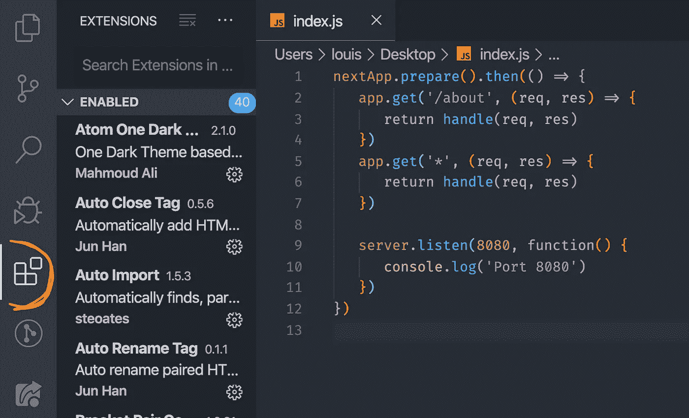
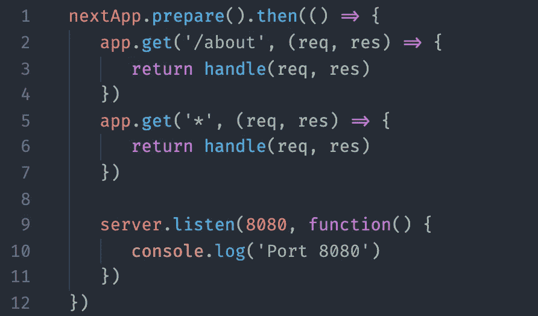
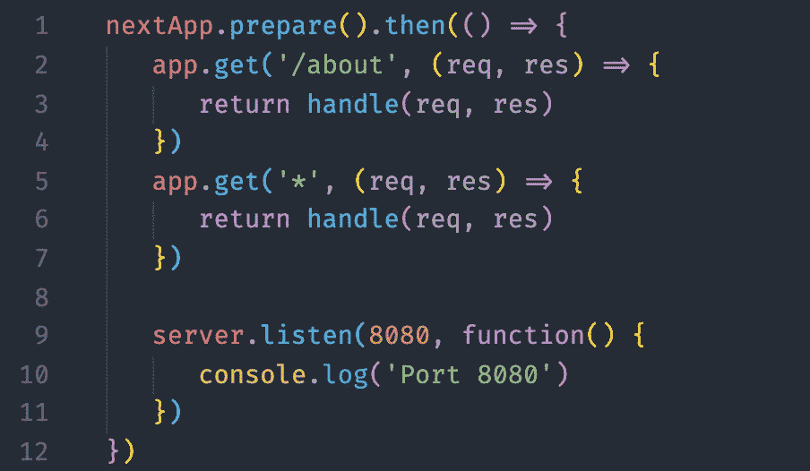
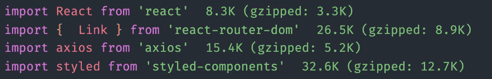
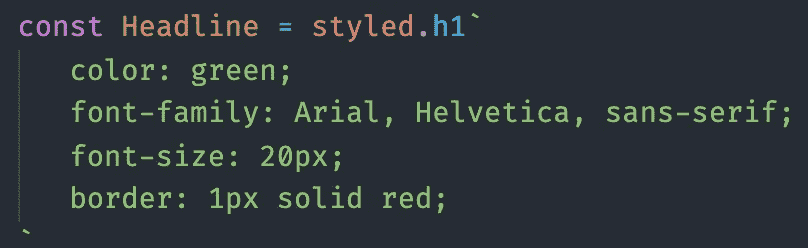
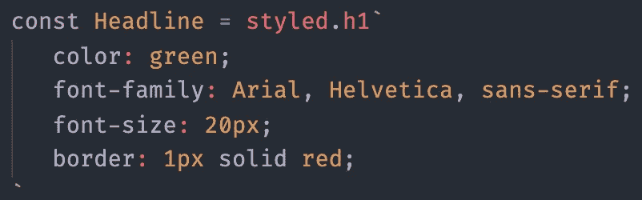

# 你可能不知道的 8 个实用 VS 代码扩展

> 原文：<https://betterprogramming.pub/8-practical-vs-code-extensions-that-you-might-not-know-about-4f5a30e45b9c>

## 括号对着色，自动关闭标签，等等


照片由[詹姆斯·奥尔](https://unsplash.com/@orrbarone?utm_source=unsplash&utm_medium=referral&utm_content=creditCopyText)在 [Unsplash](https://unsplash.com/s/photos/8?utm_source=unsplash&utm_medium=referral&utm_content=creditCopyText) 拍摄

在本文中，我将介绍一些非常酷的 Visual Studio 代码扩展。

你不会找到所有这些扩展的链接，只需复制所展示的扩展的名称，并将其输入到 VS Code 的搜索框中——我只是使用了确切的名称，以使你尽可能容易地为自己安装扩展。

# 下面是如何安装一个 VS 代码扩展

*   打开您的 Visual Studio 代码。
*   单击左侧面板中标记的按钮。
*   在“搜索扩展名”框中输入您要查找的扩展名。
*   现在您可以选择一个结果并安装它。



# **1。支架对着色机**

特别是对于大量的源代码，保持一个概览是非常重要的。所有形式的括号都不显眼，但是很危险，不管是卷的，方的，还是“正常”的圆括号。

不小心把一个错误的括号放在某个地方，由于完全混淆了哪个括号现在属于什么——并且我们已经有了一个错误消息——搜索可以开始了。

为了避免这种情况并保持概览，有一个[括号对着色程序](https://marketplace.visualstudio.com/items?itemName=CoenraadS.bracket-pair-colorizer)扩展，它对属于一起的括号进行颜色编码。



在右边，我们看到括号对着色的作用。来源:作者截图

要得到它，你只需要安装扩展，配置是完全可选的。

# 2.自动关闭标签

乍一看，对于任何使用 HTML 的人来说，这可能只是一个[扩展](https://marketplace.visualstudio.com/items?itemName=formulahendry.auto-close-tag)，但是自动关闭功能适用于所有标签，具有典型的`<XML></XML>`语法。
不管是 XML、JSX，甚至是 Vue.js 文件。

所以，这个扩展真的节省了很多时间，每个人都应该知道，或者也许你已经知道了。


来源:[官方市场网站](https://marketplace.visualstudio.com/items?itemName=formulahendry.auto-close-tag)

# 3.自动重命名标签

另一个已经相当有名的[扩展](https://marketplace.visualstudio.com/items?itemName=formulahendry.auto-rename-tag)，它的用法与刚才提到的那个类似。这也节省了很多时间，因为我们可以很容易地同时编辑相关的标签。

这个扩展也适用于 JSX、Vue、XML 等等

特别是与自动标签关闭器结合使用时，当我们输入错误，标签的两个部分都是错误的时候，它会非常强大。


来源:[官网](https://marketplace.visualstudio.com/items?itemName=formulahendry.auto-rename-tag)

# **4。进口成本**

尤其是在 web 开发领域，建议不要向您自己的 web 应用程序的最终用户交付不必要的代码。这对加载时间有不好的影响，在我们这个时代，没有人在加载网站时有耐心。



来源:作者截图

这就是为什么[进口成本](https://marketplace.visualstudio.com/items?itemName=wix.vscode-import-cost)非常便于保持概览。这个很酷的扩展甚至可以区分实际文件大小和用 [gzip](https://www.gzip.org/) 压缩后的大小。

# **5。设置同步**

大多数人在不久的将来可能不需要这个扩展，但是如果你想把你的完整的 VS 代码设置转移到一台新的计算机上， [Settings Sync](https://marketplace.visualstudio.com/items?itemName=Shan.code-settings-sync) 绝对是一个游戏改变者。

您所有的设置、主题和扩展都将作为 GitHub Gist 上传，然后可以在其他设备上使用 VS 代码来恢复完整的设置。

是的，设置有点复杂，但如果你移动它，你真的可以节省很多时间和精力。

以后谢我吧！

# **6。触摸条显示命令**

很抱歉，但是[这个](https://marketplace.visualstudio.com/items?itemName=felipe.nasc-touchbar)只适用于那些拥有带 TouchBar 的 MacBook Pro 的人——但是它仍然非常方便，我不得不展示给你看。幸运的是，许多开发人员将 MacBook Pro 作为工作工具。

这些按钮通过扩展额外显示在 TouchBar 中，从而填充了空白空间——因此您不会有任何损失。最重要的是，它看起来更酷。


来源:[官方市场网站](https://marketplace.visualstudio.com/items?itemName=blairleduc.touch-bar-display)

# 7。vs code-style-components

[Styled-components](https://www.styled-components.com/) 真的很实用。唯一的缺点是，您必须用反斜线(````)来编写伪 CSS 代码，默认情况下，VS 代码只将其解释为一个字符串，这就是为什么没有进行颜色编码的原因。

这看起来像这样:



来源:作者截图

这使得使用样式化的组件并不愉快。但是 [vscode-styled-components](https://marketplace.visualstudio.com/items?itemName=jpoissonnier.vscode-styled-components) 提供了一种补救方法，使代码看起来像这样:



来源:作者截图

# **8。现场分享**

到目前为止，微软官方唯一的扩展。然而，在使用该特性之前，您必须安装该扩展。

使用 Live Share，您可以与其他程序员实时协作，这样他们就可以修改代码，甚至可以修改您可以共享的多个文件。

还有许多其他很酷的功能，像语音聊天和共享终端。

如果想了解更多，可以登陆官方[网站](https://visualstudio.microsoft.com/en/services/live-share/?rr=https%3A%2F%2Fcode.visualstudio.com%2Fblogs%2F2017%2F11%2F15%2Flive-share)。

感谢阅读！