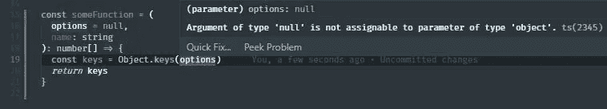

# React 中的八种做法会让你的应用程序在未来崩溃

> 原文：<https://betterprogramming.pub/8-practices-in-react-that-will-crash-your-app-in-the-future-e4c0e4529d26>

## 我在生产部门的工作经历

## 照顾好你的用户，他们也会照顾好你


**编辑**:本帖的第 ***#2*** 点已被修改，以一个读者的角度来看更容易理解(和**更恐怖**)。感谢 dev.to 上的用户发邮件给我，告诉我之前的困惑！

我们很多人都爱上了 React 库，原因有几个。创建复杂的交互式用户界面是非常容易的。最大的特点是能够在不破坏其他组件的情况下一个接一个地组装组件。

令人惊讶的是，即使是社交媒体巨头，如[脸书](https://www.facebook.com/)、 [Instagram](https://www.instagram.com/) 和 [Pinterest](https://www.pinterest.com/) 也大量使用了[它们](https://brainhub.eu/blog/10-famous-apps-using-reactjs-nowadays/)，同时用巨大的 API 如[谷歌地图](https://cloud.google.com/maps-platform/?&sign=0)创造了无缝的用户体验。

如果您目前正在使用 React 构建一个应用程序，或者正在考虑将其用于即将到来的项目，那么本教程就是为您准备的。我希望通过展示一些你应该三思而后行的代码实现，来帮助*你*踏上创建伟大的 react 应用程序的征程。

话不多说，React 中有八种做法会让你的应用程序在未来崩溃:

## 1.在 null 上声明默认参数

我在之前的一篇文章中提到过这个话题，但是这是一个令人毛骨悚然的*陷阱*，可以在一个阴沉的星期五愚弄一个粗心的开发者！毕竟，应用程序崩溃不是一个笑话——如果处理不当，任何类型的崩溃都可能导致金钱损失。

我曾经因为花费过多的时间调试类似的东西而感到内疚:

在我们的应用程序组件中，如果日期最终是`falsey`，它将被初始化为 null。

如果你和我一样，直觉告诉我们当`items`是一个`falsey`值时，默认情况下应该初始化为一个空数组。但是当`dates`为`falsey` 时，我们的应用会崩溃，因为`items` 为空。*什么*？

如果没有传递值或未定义，默认函数参数允许命名参数用默认值初始化！

在我们的例子中，即使 null 是`falsey`，它仍然是一个值！

所以下一次你设置默认值为空值时，一定要三思而后行。当空数组是值的预期类型时，可以将值初始化为空数组。

## 2.用方括号抓取属性

有时获取属性的方式可能会影响应用程序的行为。如果你想知道这是什么行为，这是应用程序崩溃。以下是使用方括号执行对象查找的示例:

这些实际上是 100%有效的用例，除了[比对象键查找](https://stackoverflow.com/questions/26353417/javascript-object-vs-array-lookup-performance/26353637)慢之外，它们没有任何问题。

无论如何，当一个非故意的问题出现时，真正的问题开始在你的应用程序中蔓延，比如一个小小的打字错误:

如果您或您的一名队友正在实现对该代码片段的一些增强，并且犯了一个小错误(例如将 *joe* 中的 *J* 大写)，结果将立即返回 *undefined* ，并且会发生崩溃:

令人毛骨悚然的是，应用程序*不会崩溃*，直到你的一部分代码试图用那个未定义的值进行属性查找！

所以与此同时，*Joe profile*(*undefined*伪装)将在你的应用中传递，没有人能够知道这个无声的未定义值正在四处蔓延，直到一段代码执行一些属性查找，就像*Joe profile . age*，因为*Joe profile*是`undefined`！

一些开发人员为避免崩溃所做的是，如果查找失败，初始化一些默认的有效返回值:

至少现在 app 不会崩溃了。这个故事的寓意是，当你用方括号符号应用查找时，总是*处理无效的查找情况！*

对于一些人来说，如果没有真实世界的例子，可能很难解释这种做法的严重性。所以我要举一个真实的例子。我将要向您展示的代码示例取自 8 个月前的一个存储库。为了保护这些代码来源的隐私，我重命名了几乎所有的变量，但是*代码的设计、语法和架构保持不变*:

*fixVideoTypeNaming* 是一个基于作为参数传入的值提取视频类型的函数。如果参数是视频*对象*，它将从`.videoType`属性中提取视频类型。如果它是一个字符串，那么调用者传入了`videoType` ，所以我们可以跳过第一步。有人发现,`videoType *.mp4*property`在应用程序的几个地方被拼错了。为了快速临时解决这个问题，使用了 *fixVideoTypeNaming* 来修补这个错别字。

现在，正如你们中的一些人可能已经猜到的，这个应用是用 [Redux](https://redux.js.org/) 构建的——因此有了语法。

为了使用这些选择器，您可以将它们导入到一个 [connect](https://react-redux.js.org/api/connect) 高阶组件中，以连接一个组件来监听该状态片段。

用户界面组件:

该组件接收特设委员会传递给它的所有道具，并根据道具提供的数据显示符合条件的信息。在一个完美的世界里，这很好。在一个不完美的世界里，这暂时不会有问题。

如果我们回到容器中，看看选择器选择它们的值的方式，我们实际上可能埋下了一颗定时炸弹，等待爆炸的机会:

在开发任何种类的应用程序时，确保更高的可信度和减少开发流程中的错误的常见做法包括在中间实施测试以确保应用程序按预期运行。

然而，就这些代码片段而言，如果它们没有被测试，没有被及早处理，应用程序*将来会崩溃。*

首先，`state.app.media.video.videoType`是*链中的四个*层级。如果另一个开发人员在被要求修复应用程序的另一部分时意外出错，导致`state.app.media.video`变成*未定义*怎么办？app 会因为无法读取未定义的`videoType`属性*而崩溃。*

此外，如果有另一个关于`videoType`的打字错误问题，而`fixVideoTypeNaming`没有更新以适应这个问题以及 *mp3* 问题，应用程序就有另一个意外崩溃的风险，除非*真实用户*遇到这个问题，否则没有人能够检测到。到那个时候，就太晚了。

假设应用程序永远不会遇到这样的错误也不是一个好的做法。请小心！

## 3.渲染时不小心检查空对象

很久以前，在有条件呈现组件的黄金时代，我曾经做过的事情是使用`Object.keys`检查数据是否已经被填充到对象中。如果有数据，那么如果条件通过，组件将继续呈现:

假设我们调用了某个 API，并在响应中的某个地方接收到了作为对象的`items`。也就是说，这一开始看起来很好。`items`的预期类型是一个对象，所以使用`Object.keys`完全没问题。毕竟，我们*确实*将`items`初始化为一个空对象，作为一种防御机制，以防出现 bug 将它转换为`falsey` 值。

但是我们不应该相信服务器总是返回相同的结构。如果`items`以后变成了数组呢？`Object.keys(items)`会不会*不崩溃*但是会返回一个类似`["0", "1", "2"]`的奇怪输出。您认为使用该数据呈现的组件会有什么反应？

但这还不是最糟糕的。该代码片段中最糟糕的部分是，如果`items`在 props 中作为一个空值被接收，那么`items` [甚至不会被初始化为您提供的默认值](https://medium.com/better-programming/10-things-not-to-do-when-building-react-applications-bc26d4f38644)！

然后*你的应用会在开始做其他事情之前崩溃*:

还是那句话，请小心！

## 4.渲染前不小心检查数组是否存在

这与第三种情况非常相似，但是数组和对象经常互换使用，所以它们应该有自己的部分。

如果你有这样的习惯:

然后确保你至少有单元测试来一直关注代码，或者在将它传递给 render 方法之前尽早正确处理`arr`，否则如果`arr`变成了*对象文字*，应用程序将会崩溃。当然，`&&`操作者会认为它是`truthy`，并试图`.map`对象文字，这将导致整个应用程序崩溃。

所以请记住这一点。把你的精力和挫折留给更大的问题吧，这些问题更值得你特别关注！；)

## 5.不使用棉绒

如果您在开发应用程序时没有使用任何类型的 linter，或者您根本不知道它们是什么，请允许我详细说明一下为什么它们在开发中有用。

我用来帮助我的开发流程的 linter 是 [ESLint](https://eslint.org/) ，这是一个众所周知的 JavaScript 林挺工具，它允许开发人员甚至不用执行代码就能发现代码中的问题。

这个工具非常有用，它可以充当你的半导师，帮助你实时纠正错误——就好像有人在指导你一样。它甚至*描述了为什么你的代码可能是糟糕的*，并建议你应该做什么！

这里有一个例子:



关于 ESLint 最酷的事情是，如果你不喜欢某些规则或者不同意其中的一些，你可以简单地禁用某些规则，这样它们就不会在你开发的时候显示为林挺警告/错误。*让自己开心就好*对吧？

## 6.呈现列表时析构

我在过去看到过一些人发生这种情况，这并不总是一个容易发现的错误。基本上，当你有一个项目列表，并且你要为列表中的每个项目渲染一堆组件时，当列表中的一个项目不是你期望的值时，将来可能会在你的应用程序中出现的错误就会发生。如果你的应用不知道如何处理值类型，它可能会崩溃。

这里有一个例子:


代码会非常好地工作。现在，让我们看看 API 调用。与其归还这个——

—如果在 API 客户端出现意外情况时，数据流的处理方式出现了问题，并且返回了这个数组，该怎么办？

你的应用会崩溃，因为它不知道如何处理:

```
Uncaught TypeError: Cannot read property 'name' of undefined
    at eval (DataList.js? [sm]:65)
    at Array.map (<anonymous>)
    at DataList (DataList.js? [sm]:64)
    at renderWithHooks (react-dom.development.js:12938)
    at updateFunctionComponent (react-dom.development.js:14627)
```

因此，为了防止应用程序崩溃，您可以在每次迭代中设置一个默认对象:

现在，您的用户不必对您的技术和专业知识做出判断，因为他们不会看到页面在他们面前崩溃:


然而，即使应用程序不再崩溃，我还是建议更进一步，处理丢失的值，比如对有类似问题的整个项目返回 null，因为它们没有任何数据。

## 7.对你将要实现的东西没有做足够的研究

在过去，我犯了一个致命的错误，那就是对我实现的搜索输入过于自信，在游戏中过早地相信我的意见。

我这么说是什么意思？嗯，我并不是对搜索输入组件*的*过于自信。组件*应该是一个简单的*任务——事实也的确如此。

整个搜索功能出现问题的真正原因是*包括查询中的字符*。

当我们将关键字作为查询发送到搜索 API 时，认为用户键入的每个键都是有效的并不总是足够的，即使他们因此而在键盘上。

只要 100%确定像这样的正则表达式完全按照预期工作，并避免遗漏任何可能导致应用程序崩溃的无效字符:

这个例子是最新的、为搜索 API 建立的正则表达式。

这是之前的情况:

如你所见，斜线`/`不见了，这导致了应用程序崩溃！如果这个字符最终通过网络被发送给一个 API，猜猜 API 认为这个 URL 会是什么？

另外，我不会 100%相信你在网上找到的例子。它们中的许多都不是经过全面测试的解决方案，而且对于正则表达式来说，大多数用例都没有真正的标准。

## 8.不限制文件输入的大小

限制用户选择的文件大小是一个很好的做法，因为大多数时候你并不真的需要一个大得离谱的文件，只要它可以以某种方式压缩而不会失去任何明显的质量损失。

但是有一个更重要的原因可以解释为什么将尺寸限制在一定范围内是一种好的做法。在我的公司，我们注意到用户过去在上传图片时偶尔会“冻结”。不是每个人都拥有外星人 17 R5，所以你必须考虑到你的用户的某些情况。

下面是一个将文件限制在 5 MB (5，000，000 字节)的示例:

你不会希望用户在应该上传文档的时候上传视频游戏！

## 结论

本帖到此结束！

将会有第二部分，因为我只看完了一半的清单——哎呀！

感谢您的阅读，并确保关注我的未来更新！7 月 4 日快乐！