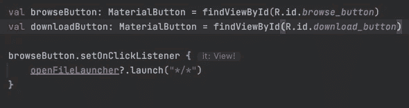
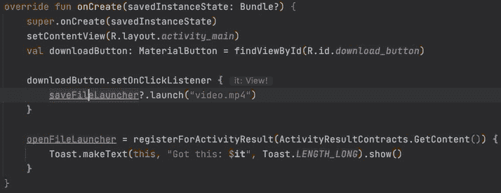
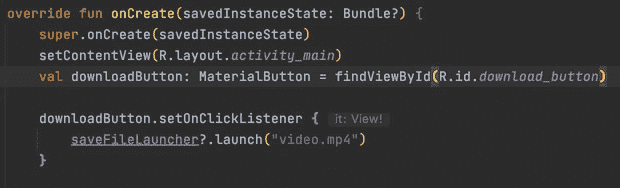
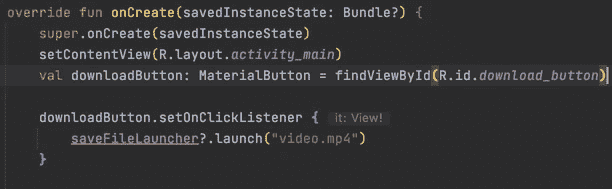
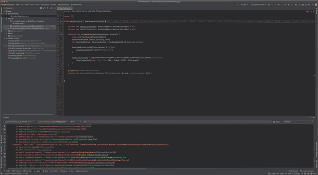
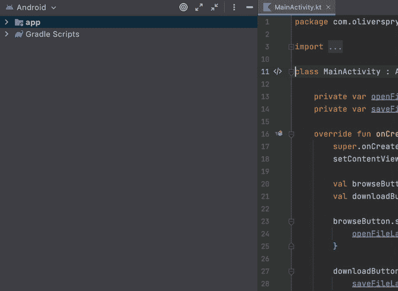

# Android 开发人员的 8 个提高生产力的 IntelliJ 捷径

> 原文：<https://betterprogramming.pub/8-productivity-boosting-intellij-shortcuts-for-android-developers-e980c62ef9fa>

## 太有用而不能忘记的捷径

不管出于什么原因，我的大脑不喜欢键盘快捷键。除了基本的剪切、复制、粘贴和全选，我似乎什么都不会。也就是说，我不可救药地无法开始征服 vi 和 vim。

然而，尽管有这种精神封锁，我知道有一些捷径，如果我不花时间学习，我会搬起石头砸自己的脚。因此，经过反复试验，我推荐使用 JetBrain ide 套件的人花时间学习以下八种快捷方式。

请记住，这些快捷键使用这些键映射:

*   Windows 使用 Windows 映射
*   Mac 使用 IntelliJ IDEA 经典映射

# 重复的行或选择:Ctrl + D，⌘ + D

消除复制和粘贴代码行，只进行微小的更改。该命令将复制现有行或高亮显示的选择。

正在复制线条和选区

# 扩展选择:Ctrl + W，⌘+ W

当您不想用鼠标突出显示某个代码块时，这个操作非常合适。按下此组合键将开始选择光标处的当前单词。再次按下它将扩展该选择，以包括当前语言标记、当前行、当前块、函数、类等。每个操作都会选择更大范围的代码。

这个操作的逆操作是 Ctrl + Shift + W 或⌘⇧W.

使用选择扩展选择功能

# 移动语句:Ctrl + Shift +向上/向下，⌘+⇧+向上/向下

需要上下移动一行或一个代码块。这个命令足够智能，可以将移动操作应用于相关代码(如果选择了一行，或者函数或代码块，如果适用的话)，并在移动代码时格式化代码，以保持演示文稿的整洁。

智能地上下移动行和代码块。

# 移动线条:Alt + Shift +向上/向下，⌥+⇧+Up/Down

类似于上面的命令，除了它不考虑上下文进行逐字移动。如果您真的只想移动一行，比如一个开始代码块的开头，而不想移动整个代码块，这样做很好。

在没有代码格式或上下文帮助的情况下上下移动一行。

您也可以通过首先突出显示代码来移动代码选择。

# 切换所有工具窗口:Ctrl + Shift + F12，⌘+⇧+F12

每当有太多的侧面板挡住去路，而你需要专注于你的代码时，这个键盘命令会隐藏所有打开的面板，只显示你的代码。如果您已经在查看代码，再次调用此命令将恢复您的面板。

快速关注您的代码，或者恢复工具窗口。

# 后退/前进:Ctrl + Alt +左/右，⌘+⌥+Left/Right

如果您正在对大型代码文件进行各种编辑，这将特别有帮助。您可以在一个地方工作，然后向后导航，让光标跳转到您之前编辑的代码部分。你不再需要记住你在哪里修改了你的代码来从先前的想法中恢复。

此操作也适用于所有选项卡。

# 创建/转到测试:Ctrl + Shift + T，⌘+⇧+T

在单元测试和实现之间切换非常简单。如果你还没有对你的代码进行单元测试，这个快捷方式将帮助你建立一个存根文件。

# 在项目视图中选择文件:Alt + F1，1；⌥+F1，1

在项目视图中直接跳转到开放代码文件有很多好处，并且是我几乎每天都会使用的。现在，有了这个组合键，你可以做得更快。

在项目视图中显示当前打开的代码文件。

# 结论

如果我要去旅行，并且只能带少数几条捷径，这些肯定是合适的。希望你会像我一样发现它们很有帮助。你每天的快捷方式组合中都包括什么？

# 喜欢你读的东西吗？

媒体上还有成千上万篇类似的文章。我是这个网站的付费会员，我完全认为这项投资是值得的。 [**点击这里加入**](https://go.oliverspryn.com/medium-membership) ，你将以你的一部分会员身份支持我的工作。

本文原载于 https://oliverspryn.com/。 [**加入我的邮件列表。**](https://go.oliverspryn.com/medium-subscribe)