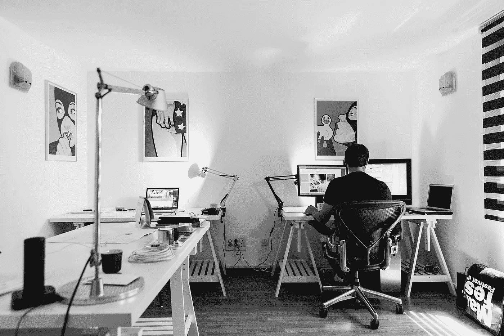
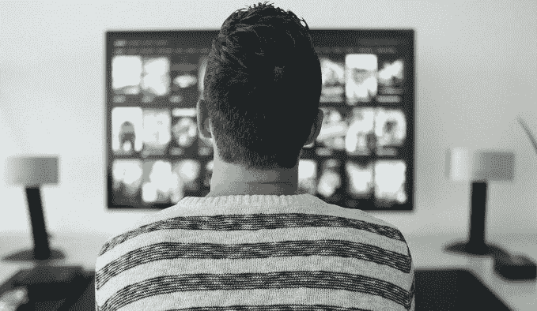
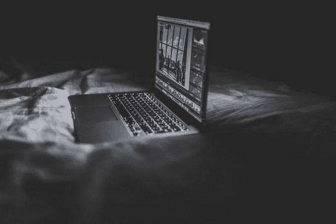
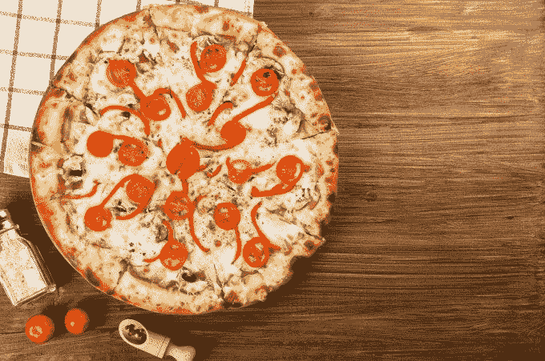
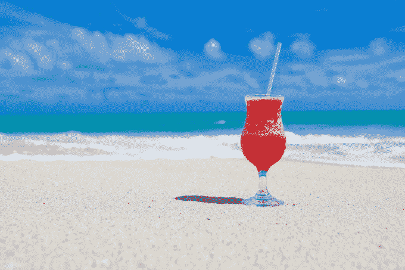
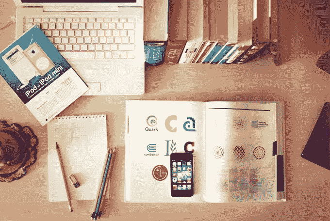

# 在家工作时的 8 个非常糟糕的建议

> 原文：<https://betterprogramming.pub/8-really-terrible-tips-when-working-from-home-9b7683d566db>

## 如何在家里工作不好

图片由来自 [Pixabay](https://pixabay.com/?utm_source=link-attribution&amp;utm_medium=referral&amp;utm_campaign=image&amp;utm_content=932926) 的 [tookapic](https://pixabay.com/users/tookapic-1386459/?utm_source=link-attribution&amp;utm_medium=referral&amp;utm_campaign=image&amp;utm_content=932926) 提供

我已经有一段时间没有发帖了，现在我决定分享一些在家工作的经验给那些现在自我孤立的人。这是一份关于在家工作的非常糟糕的建议清单。

# 取消日程安排

既然你不必出现在办公室，为什么还要麻烦呢？这终于是你可以熬到凌晨 5 点，吃完午饭就醒的时候了。当然，你的同事可能不会遵循这种风格，但那是他们的问题，真的。

图片来自[像素](https://pixabay.com/users/Pexels-2286921/?utm_source=link-attribution&amp;utm_medium=referral&amp;utm_campaign=image&amp;utm_content=1846251)来自[像素](https://pixabay.com/?utm_source=link-attribution&amp;utm_medium=referral&amp;utm_campaign=image&amp;utm_content=1846251)

同样，你也不会像以前那样富有成效，但是现在是艰难的时期，没有人期望你会如此。扔掉所有的闹钟，拉上窗帘，是时候改变你的生物钟了。

# 多任务

既然你现在呆在家里，这是多任务处理的时候了。所有这些关于人们不能一心多用的说法都是垃圾，真的。没有理由不让网飞在开会时在第二个屏幕上打开，或者在分配任务时做家务。

图片来自 [Pixabay](https://pixabay.com/?utm_source=link-attribution&amp;utm_medium=referral&amp;utm_campaign=image&amp;utm_content=3774381)

最后，没有人站在你的肩膀上来确保你没有分心，所以充分利用它，分散你的注意力！确保打开手机音量，这样你就不会错过 Instagram 上的挑战授权。

# 在床上工作

你为什么想要一个专用的工作场所？办公室在这方面并没有取得任何成功。相反，试着在你的床上或其他舒适的表面上工作。

图片由 [StockSnap](https://pixabay.com/users/StockSnap-894430/?utm_source=link-attribution&amp;utm_medium=referral&amp;utm_campaign=image&amp;utm_content=925856) 从 [Pixabay](https://pixabay.com/?utm_source=link-attribution&amp;utm_medium=referral&amp;utm_campaign=image&amp;utm_content=925856) 获取

这可以确保你将运动量保持在最低限度，并获得足够的脂肪来度过这段艰难时期。此外，这将帮助你进一步破坏你的睡眠时间表，因为你的床将不再与睡眠相关联。

# 吃得不健康

想象一下，不做饭可以节省多少时间。相反，从你的送餐服务点一些巨无霸，让拿最低工资的专业人士处理你的营养需求。

图片由[дарьяяковлева](https://pixabay.com/users/Daria-Yakovleva-3938704/?utm_source=link-attribution&amp;utm_medium=referral&amp;utm_campaign=image&amp;utm_content=2068272)发自 [Pixabay](https://pixabay.com/?utm_source=link-attribution&amp;utm_medium=referral&amp;utm_campaign=image&amp;utm_content=2068272)

既然你不动，甚至不出门，健康还有什么意义呢，对吗？这不会影响你的工作效率和精神健康，所以不用担心。

# 不要社交

关于社交距离，你不明白什么？显然，这意味着不要与任何人交流，无论是 IRL 还是在线。

图片由 [Gerd Altmann](https://pixabay.com/users/geralt-9301/?utm_source=link-attribution&amp;utm_medium=referral&amp;utm_campaign=image&amp;utm_content=4950504) 从 [Pixabay](https://pixabay.com/?utm_source=link-attribution&amp;utm_medium=referral&amp;utm_campaign=image&amp;utm_content=4950504) 拍摄

这样你就可以限制你接触所有关于冠状病毒的话题，并且对正在发生的事情浑然不觉。还有，孤独的感觉只会进一步提高你脆弱的心理健康和生产力。这意味着你没有在线聚会或会议！

# 去度假

现在，经济瘫痪，企业倒闭，犯罪率上升。显然现在不是工作的时候。休息至少一个月，让其他人想想该怎么做。

图片来自 [Pixabay](https://pixabay.com/?utm_source=link-attribution&amp;utm_medium=referral&amp;utm_campaign=image&amp;utm_content=84533) 的 [PublicDomainPictures](https://pixabay.com/users/PublicDomainPictures-14/?utm_source=link-attribution&amp;utm_medium=referral&amp;utm_campaign=image&amp;utm_content=84533)

更好的是，出国，因为现在机票太便宜了。很长一段时间都不会有那样的机会了。

# 不要学任何东西

给你的大脑增加额外的负荷可能会让你变得更聪明。当然，没有人希望这样。你可能会意识到我们现在有多糟糕，然后开始做点什么。

图片由 [Free-Photos](https://pixabay.com/photos/?utm_source=link-attribution&amp;utm_medium=referral&amp;utm_campaign=image&amp;utm_content=336634) 来自 [Pixabay](https://pixabay.com/?utm_source=link-attribution&amp;utm_medium=referral&amp;utm_campaign=image&amp;utm_content=336634)

所以在可预见的未来，把像 [LinkedIn Learning](https://www.linkedin.com/learning-login) 、 [Udemy](https://www.udemy.com) 和 [Coursera](https://www.coursera.org) 这样的网站加入你的黑名单。如果你是学生，确保不要参加任何远程讲座；它们只是浪费时间。

# 额外收获:一个真正有用的提示

做与我上面列出的完全相反的事情。显然，我是在讽刺，如果你想通过隔离，你不应该做这些事情。感谢您的阅读，请在评论中分享您应对持续疫情的方法。