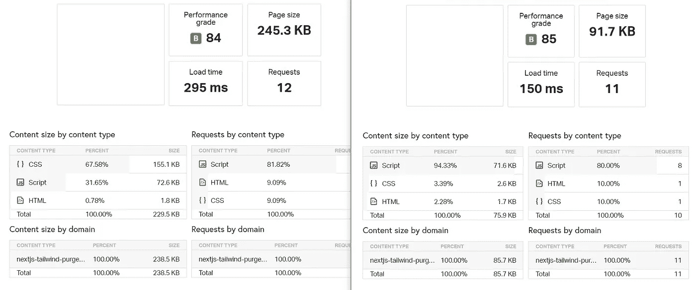

# 8 个简单的步骤:用 Tailwind CSS、Next.js 10 和 PurgeCSS 建立一个项目

> 原文：<https://betterprogramming.pub/8-simple-steps-set-up-a-project-with-tailwind-css-next-js-10-and-purgecss-c44e1104bdf0>

## 使用 PurgeCSS 创建一个 JavaScript 项目，删除未使用的样式并保持其较小


照片由[卡勒姆希尔](https://unsplash.com/photos/-QyvOa0J9Mg)在 [Unsplash](https://unsplash.com/) 拍摄。

# 为什么是 Next.js？

这是由庞大的 React 社区支持的最好的 React 框架之一。

# 为什么要用顺风 CSS？

因为这是为组件和布局构造 CSS 类的最简单、最现代的方法。

# 为什么要采购 CSS？

因为你需要让你编译的顺风 CSS 文件又轻又小。

# 设置过程

1.  让我们从一个空的 Next.js 项目开始，或者打开您已经设置好的项目:

```
npx create-next-app
# or if you use yarn
yarn create next-app
```

2.然后我们将添加顺风和 PurgeCSS。

> “PurgeCSS 通过扫描 HTML 并删除任何不使用的类来减小文件大小。我们只希望在生产中实现这一点，因为如果我们正在开发，我们希望能够在不运行构建过程的情况下使用任何 Tailwind CSS 类。”— [杰克·普林斯在媒体上](https://medium.com/better-programming/how-to-set-up-next-js-with-tailwind-css-b93ccd2d4164)

```
npm install tailwindcss
npm install -D @fullhuman/postcss-purgecss
# or if you use yarn
yarn add tailwindcss 
yarn add -D @fullhuman/postcss-purgecss
```

3.启动此命令在项目中创建一个`tailwind.config.js`:

```
npx tailwind init
```

4.如果您想在构建期间删除警告或其他消息，请用这些值替换顺风配置内容:

5.在`globals.css`文件中，添加包含注释的五行内容:

```
/* purgecss start ignore */
@tailwind  base;
@tailwind  components;
/* purgecss end ignore */
@tailwind  utilities;
```

6.在文件 pages/ `index.js`中添加一个真实的顺风组件，内容如下:

7.配置 PostCSS 以在构建期间启用 Tailwind 和 PurgeCSS 的编译。在根文件夹中创建一个`postcss.config.js`文件:

8.当您在生产中启动 Next.js 构建时，享受您的小 CSS 吧！

# PurgeCSS 真的管用吗？

为了证明它确实有效，我简单地在左边做了一个没有任何清除的版本。被清除的版本在右边:



查看未清除的在线网站[和清除的网站](https://nextjs-tailwind-purgecss-minimal-lfl4vh5p4.vercel.app/)。

# GitHub 上的示例项目

[](https://github.com/riccardogiorato/nextjs-tailwind-purgecss-minimal) [## riccardogiorato/nextjs-tail wind-purge CSS-minimal

### 这是一个用 create-next-app 引导的 Next.js 项目。首先，运行开发服务器:打开…

github.com](https://github.com/riccardogiorato/nextjs-tailwind-purgecss-minimal) 

现场版在 Vercel 上[可用。](https://nextjs-tailwind-purgecss-minimal.vercel.app/)

# 如果你想了解更多关于钩子的知识

我在开始使用 Next.js 的时候曾经亲自阅读过 **"** [**学习 React 钩子**](https://amzn.to/2UFiZ5F) **"** ，它帮助我理解 React 和 Next.js 的方法以及相关的库:

*   学习反应钩子:[https://amzn.to/2UFiZ5F](https://amzn.to/2UFiZ5F)

# **资源**

1.  [https://nextjs.org/docs#setup](https://nextjs.org/docs#setup)
2.  [https://tailwindcss.com/docs/installation](https://tailwindcss.com/docs/installation)
3.  [https://github . com/full human/purge CSS/tree/master/packages/post CSS-purge CSS](https://github.com/FullHuman/purgecss/tree/master/packages/postcss-purgecss)
4.  [https://github . com/riccardogiorato/nextjs-tailwind-purge CSS-minimal](https://github.com/riccardogiorato/nextjs-tailwind-purgecss-minimal)
5.  [https://amzn.to/2UFiZ5F](https://amzn.to/2UFiZ5F)