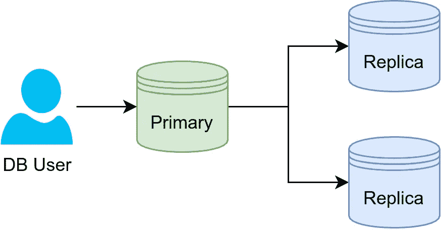
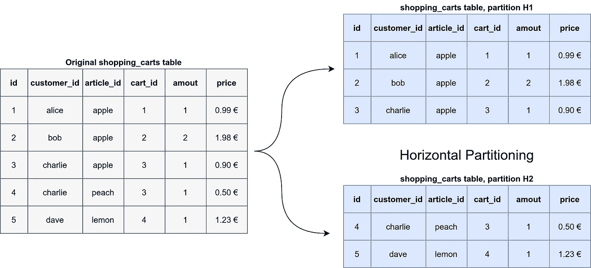
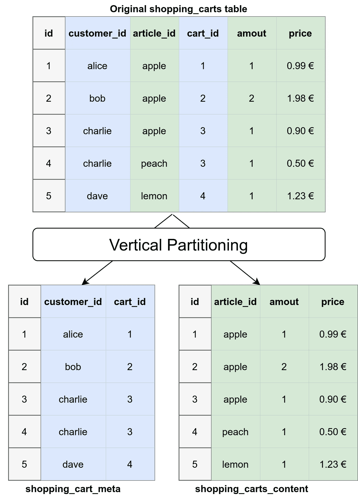
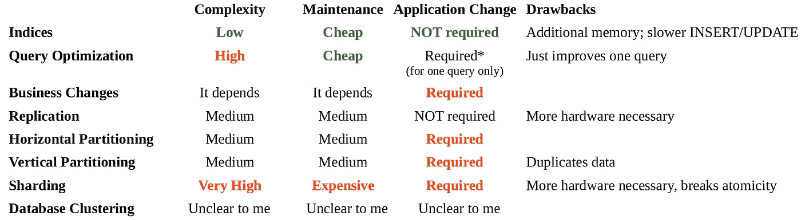

# 提高数据库速度的 8 种技术

> 原文：<https://betterprogramming.pub/8-techniques-to-speed-up-your-database-292754ff7739>

## “如果一切似乎都在掌控之中，那你走得还不够快”


Christina Morillo 的照片([原文](https://www.pexels.com/de-de/foto/frau-die-beim-tragen-des-laptops-steht-1181354/))。谢谢大家！

几乎所有面向最终用户的 web 服务都需要存储数据。几乎所有的人都将它们存储在数据库中。很多人使用关系数据库，如 PostgreSQL、MySQL/MariaDB 或 MSSQL。数据库系统非常棒，因为你可以忘记它们。它们只是为你处理数据持久性…直到它们变慢。

在本文中，您将了解垂直和水平分区、分片、复制以及其他一些加速数据库的方法之间的区别。我们走吧！

# 我们关心什么？

对于数据库系统，我们非常关心**一致性**和**可用性**。我们还需要一个交换损坏设备和连续**备份**的工作方案。

一旦满足了最低要求，我们可能会有几个性能指标:

*   简单查询的读取性能
*   复杂查询的读取性能
*   插入/更新性能

不同应用程序的工作负载有很大的不同。许多 web 应用程序只使用 [CRUD](https://en.wikipedia.org/wiki/Create,_read,_update_and_delete) ，并且偶尔使用非常简单的连接。他们需要快速读取和相对快速的写入。他们有大量的小额交易。他们有一个 [OLTP](https://en.wikipedia.org/wiki/Online_transaction_processing) 风格的工作负载。

相比之下，分析团队需要更复杂的查询。如果这些查询需要更多时间，这也是可以接受的。他们有少量复杂的选择查询。他们有着 OLAP 式的工作量。

查找单个慢速查询的一个工具是记录慢速查询( [MySQL](https://dev.mysql.com/doc/refman/5.7/en/slow-query-log.html) 、 [PostgreSQL](https://www.postgresql.org/docs/current/runtime-config-logging.html) 、 [MSSQL](https://serverfault.com/a/182686/113899) )。

# 算法改进

在许多情况下，运行在生产环境中的代码只是第一个碰巧工作的东西。对于非开发人员，想想你最近写的几封邮件。很有可能，至少有一个地方你没有花太多时间去改善你的沟通方式。代码也是如此。在好的公司里，至少会有第二个人快速浏览一下代码。但是当它看起来合理时，我们开发人员不会对每一行都进行详细描述。这意味着总会有改进的空间。

对于数据库来说，常见的改进方式有两种:添加合理的索引和查询优化。

# 1.指数

索引通过维护有效的搜索数据结构(例如， [B 树](https://en.wikipedia.org/wiki/B-tree))允许数据库更快地找到相关的行。这是按表进行的。添加索引的计算开销很大，并且必须在生产系统上执行，所以通常不经常这样做。

通过 SQL ( [MySQL](https://dev.mysql.com/doc/refman/8.0/en/create-index.html) ， [PostgreSQL](https://www.postgresql.org/docs/9.1/sql-createindex.html) )创建索引很容易:

```
CREATE INDEX arbitrary_index_name
ON your_table_name
(column1, column2);
```

添加索引可以加快数据库中的搜索速度，但会减慢 UPDATE / INSERT / DELETE 语句的速度，除非“WHERE”部分花费大量时间。

# 2.查询优化

查询优化是由数据库用户对每个查询进行的。查询可以用几种不同的方式编写，其中一些方式可能比其他方式更有效。您可能希望对数据尝试不同的查询版本，并使用解释语句。关于查询优化的一篇好文章可以在这里找到:

[](https://www.sqlshack.com/query-optimization-techniques-in-sql-server-tips-and-tricks/) [## SQL Server 中的查询优化技术:提示和技巧

### 2018 年 6 月 19 日修复错误的查询和解决性能问题可能需要数小时(或数天)的研究和…

www.sqlshack.com](https://www.sqlshack.com/query-optimization-techniques-in-sql-server-tips-and-tricks/) 

要提到的一个工具是 [sqlcheck](https://github.com/jarulraj/sqlcheck) ( [视频](https://www.youtube.com/watch?v=5vHhuuPy3FI))。它检查常见的 SQL 查询反模式，比如在一列中有多个值，而不是使用交集表或通配符选择。

查询优化主题的一个稍微不同的子类是[n+1 问题](https://levelup.gitconnected.com/raw-sql-vs-query-builder-vs-orm-eee72dbdd275#cbe8-27a45e3740e8) /编写一个循环来发送多个查询，而不是一个数据查询。

# 3.业务变化和划分

当你在发展业务时，你想取悦你的客户。如果他们要求一个小的新功能，你就试着包含进去。这可能会导致功能蔓延。UNIX 哲学表明，这个问题很久以前就已经存在了:

> "编写做一件事并把它做好的程序."——道格·麦克洛伊

类似地，按用户组划分您的 web 服务数据也是可以的。也许把它们分成区域是有意义的？我在 [AWS](https://aws.amazon.com/) 和[安全代码战士](https://www.securecodewarrior.com/)见过。也许你可以把它分成“私人客户”、“小企业客户”或“大企业客户”？也许应用程序的一部分实际上可以是自己的服务，有自己的数据库？

# 4.分身术



图片作者:马丁·托马斯

如果读取是您的问题，并且更新的一点时间延迟不是大问题，复制是一个简单的解决方案。复制不断地将数据库复制到另一台机器上。它可以加快读取速度，并充当故障转移机制。

这个想法是有一个主服务器和多个复制服务器，这些以前被称为其他名称。主服务器处理任何数据更改，而复制服务器只是复制主服务器。还有[其他拓扑](https://mariadb.com/kb/en/replication-overview/#common-replication-setups)，例如环形或星形设置。

另见: [MySQL 文档](https://dev.mysql.com/doc/refman/5.7/en/replication-solutions-switch.html)， [PostgreSQL 文档](https://www.postgresql.org/docs/9.2/runtime-config-replication.html)， [MSSQL 文档](https://docs.microsoft.com/en-US/sql/relational-databases/replication/sql-server-replication?view=sql-server-ver15)

# 5.水平分割

给定一个巨大的表，我们可以在一台机器上存储一些行，在另一台机器上存储其他行。按行分割数据的想法被称为*水平分区*。

一幅图像比许多文字更能说明问题:



水平分区的概念示例。图片由马丁·托马斯提供。

在[MySQL](https://dev.mysql.com/doc/refman/5.7/en/partitioning-range.html)/[Maria db](https://mariadb.com/kb/en/range-partitioning-type)中，简单地通过`id`进行分区是这样工作的:

```
ALTER TABLE
    shopping_carts
PARTITION BY RANGE(id)
(
    Partition p0 VALUES LESS THAN (1234),
    Partition p1 VALUES LESS THAN (4567),
    Partition p2 VALUES LESS THAN MAXVALUE
);
```

您希望数据库系统的用户仍然能够使用典型的查询来查询数据库，可能使用以下查询:

```
SELECT * FROM shopping_carts WHERE cart_id = 3
```

这里需要注意的一点是:水平分区与水平扩展完全无关！

# 6.垂直分割

我们可以按列划分，而不是按行划分大数据库。这可能会给你一种不安的感觉，因为你已经在大学里学到了规范化数据库是一个好主意。这里需要注意的重要一点是，我们讨论的是数据库设计的不同阶段。[各种数据库范式](https://en.wikipedia.org/wiki/Database_normalization)都与逻辑设计有关。在这个阶段，我们负责物理设计。

应用程序的不同部分可能不需要一行中的大多数列。因此，把它们分开是可以的。因此*垂直分割*也被称为*行分割*。

一种常见的做法是将元数据从内容中分离出来。这是一张图片:



图片作者:马丁·托马斯

这里需要注意的一点是:垂直分区与垂直扩展完全无关！

当您避免隐私或监管问题时，垂直分区会很有用。想想信用卡信息。这在逻辑上很适合其他信息，但是大多数应用程序并不需要它。你甚至可以把它放在一个完全不同的数据库中，藏在一个私有的微服务后面。

# 7.分片——将分区提升到一个新的水平

您已经看到数据可以用两种不同的方式进行分组。在同一台机器上对数据进行分区以帮助数据库更快地执行常见查询可能已经有意义了。但是如果数据库超出了 CPU 或 RAM，那么使用不同的机器可能是有意义的。

*分片*是对单个逻辑数据集进行分区，并将其分布在不同的机器上。

正如你可能猜到的，这伴随着大量的问题——因此应该是你最后的出路。例如，2010 年 10 月，Foursquare 因为一个分片问题宕机了 11 个小时。到目前为止，我还算幸运，不用处理碎片问题。

第一个明显的问题是，您的应用程序需要知道哪个碎片包含您正在寻找的数据。因此，您的应用程序逻辑可能会在所有地方受到影响。

第二个大问题是跨分片的连接。

第三个问题是如何定义碎片。为了实现真正的可伸缩性，您需要对碎片进行动态定义。拥有层级结构有助于实现这一目标。

如果你还想阅读更多关于分片的内容，我推荐金智英的精彩文章:

[](https://medium.com/@jeeyoungk/how-sharding-works-b4dec46b3f6) [## 分片的工作原理

### 这是上一篇博文《我为什么喜欢数据库》的续篇。

medium.com](https://medium.com/@jeeyoungk/how-sharding-works-b4dec46b3f6) 

数字海洋的这篇文章也很好看:

[](https://www.digitalocean.com/community/tutorials/understanding-database-sharding) [## 了解数据库分片|数字海洋

### 近年来，分片数据库受到了很多关注，但是很多人对分片数据库并没有一个清晰的理解…

www.digitalocean.com](https://www.digitalocean.com/community/tutorials/understanding-database-sharding) 

# 8.数据库聚类

我是在看[维特](https://vitess.io/)的时候偶然发现这个术语的。这个想法似乎隐藏了分片的问题，也是通过在幕后使用复制:

PostgreSQL 也有[文档，](https://www.postgresql.org/docs/9.5/creating-cluster.html) [MySQL Cluster](https://www.mysql.com/de/products/cluster/) 是另一个产品。

# 额外收获:查询缓存

如果您有一些处理很少变化的数据的大型查询，您可以尝试缓存该查询。我不确定数据库默认提供什么，但是您可以简单地为该查询放置一个键值存储。不是将查询直接发送到数据库，而是发送到微服务，微服务在键值存储中查找查询。如果不存在或者无效，它将查询真实的数据库。

缺点是你不知道你得到的数据是不是最近的。

# 大家总结一下！



# 下一步是什么？

有些主题对开发至关重要，但不是日常工作或计算机科学课程的一部分。在我们的专业软件开发系列中，您可以了解更多主题。

我正在考虑添加这类文章，所以请让我知道你对什么感兴趣:

*   团队建设
*   代码审查
*   代码部署:一篇基本 Docker 文章[已经存在，但是关于这个主题还有很多可以写的](https://makeitnew.io/docker-ab1a6bddf389)
*   基础设施即代码(IaC)
*   监控和警报

感谢您的阅读！