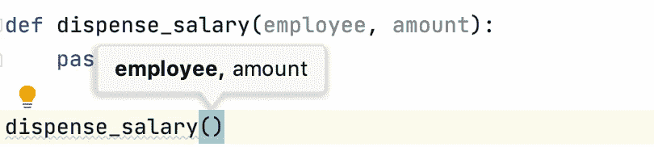
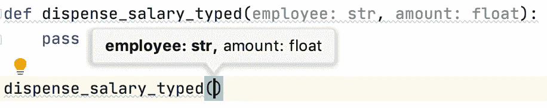

# 掌握 Python 函数参数需要知道的 8 件事

> 原文：<https://betterprogramming.pub/8-things-to-know-to-master-python-function-arguments-75ed7597463e>

## 要编写可读的 Python 函数，您只需知道


马克·马沙尔在 [Unsplash](https://unsplash.com?utm_source=medium&utm_medium=referral) 上拍摄的照片。

我们总是在项目中使用函数——不管我们的项目是关于什么的。当我们调用他人编写的函数时，我们需要理解函数签名(即，我们应该传递什么参数来获得期望的函数输出)。有时，当我们应该清楚期望的用例而不引起任何歧义时，我们需要编写函数供其他人调用。无论哪种情况，都不是最轻松的工作。

在本文中，我将提供 Python 函数中参数的全面概述。具体来说，我指的是输入参数。我希望这篇文章可以消除您在调用他人的函数或定义自己的函数时可能遇到的任何问题。

# 1.位置和关键字参数

在 Python 中，有两种输入参数:位置参数和关键字参数。根据[文档](https://docs.python.org/3.8/glossary.html):

> *关键字参数*:函数调用
> *中标识符(如`name=`)前的参数位置参数*:不是关键字参数的参数。

下面是内置`open`函数的函数签名:

```
open(*file*, *mode='r'*, *buffering=-1*, *encoding=None*, *errors=None*, *newline=None*, *closefd=True*, *opener=None*)
```

如您所见，文件参数是位置性的，而所有其他参数都是关键字，因为每个参数都有一个标识符(即关键字)。我们可以调用如下所示的函数。在该调用中，`“hello.txt”`将被设置为`file`参数，而`“w”`将被设置为`mode`参数。

```
open(**"hello.txt"**, mode=**"w"**)
```

# 2.仅关键字参数

在示例 abive 中，我们将`“w”`显式设置为适用的关键字参数。但是，在现实中，我们可以根据位置隐式设置关键字参数，如下所示:

```
open(**"hello.txt"**, **"w"**)
```

换句话说，如果我们自己定义一个函数，关键字参数可以通过它们对应的位置来设置。下面显示了一个简单的例子，与内置的`open`函数的调用一致:

关键字参数

当我们有多个关键字参数时(为了简单起见，我们的例子只包括一个关键字参数)，很难判断这些参数是否由位置设置。因此，为了明确起见，我们可以只定义关键字参数，如下所示:

仅关键字参数

*   函数签名在`multiplier`参数前包含一个星号(即星号)。这意味着在星号之后，所有的参数都必须由关键字来设置。这些参数只能通过指定关键字来设置，称为仅关键字参数。
*   与意图一致，当我们调用函数而没有为第二个参数指定关键字时，我们得到一个`TypeError`。

# 3.仅位置参数

我们刚刚学习了如何定义只有关键字的参数。你可能会想，“他们的位置论点对应的怎么样？”您的直觉是正确的——我们也可以定义仅位置参数(Python 3.8+)。

我们不使用星号，而是使用斜线符号(`/`)来表示斜线之前的所有参数都是严格位置性的。换句话说，不能通过指定它们的标识符或关键字来设置它们。以下代码片段向您展示了这种用法:

仅位置参数

*   我们定义了两个函数:`custom_sum`和`custom_sum_pos`。
*   在`custom_sum`函数中，`iterable`参数可以指定为位置参数或关键字参数。
*   然而，在`custom_sum_pos`函数中，`iterable`参数只能被指定为位置参数。如您所见，如果我们为函数调用提供标识符，它会引发一个`TypeError`。换句话说，`iterable`参数是位置唯一的，这意味着它只能通过在所需位置传递参数来设置。

需要注意的一点是，我们可以在同一个函数定义中组合使用星号和斜杠，这将导致只有位置和只有关键字的参数。注意下面的`TypeError`。这是预料中的事，因为`arg1`在斜线符号之前:

仅位置和仅关键字参数

# 4.可变数量的位置参数(*args)

函数声明中另一个有用的特性是可变数量的位置参数的定义。让我们快速看一下`print`函数的函数签名:

```
print(**objects*, *sep=' '*, *end='\n'*, *file=sys.stdout*, *flush=False*)
```

当我们使用`print`功能时，我们可以做不同的事情:

打印功能的使用

如您所见，我们可以为`print`函数传递多个对象。神奇的是，这些单独的对象被打包成一个元组，并作为一个整体分配给`objects`参数。如果您仍然感到困惑，让我们考虑下面的例子:

*参数的示例

在上面的`greet`函数中，我们包含了一个名为`*persons`的参数。根据函数调用的打印输出消息，您可以了解到多个名称确实被打包到一个元组对象中，并被发送给`persons`参数以供使用。

可变数量的位置参数是保持函数签名简洁的一个巧妙技巧，同时允许传递多个对象。

# 5.可变数量的关键字参数(**kwargs)

与`*args`(即可变数量的位置参数)相对应的是`**kwargs`，它表示可变数量的关键字参数。它的用法并不少见。看看`dict`构造函数的函数签名:

```
*class* dict(***kwarg*)
```

要使用这个构造函数，我们可以做以下事情。本质上，我们通过设置一系列关键字参数来创建字典:

词典的创建

与内置的`dict`构造函数类似，我们可以使用可变数量的关键字参数特性来定义自己的函数，如下面的代码片段所示:

**kwargs 示例

*   我们使用`**grades`来表示函数声明中关键字参数的可变数量。
*   在函数调用中，我们使用学生的名字作为标识符，传递带有成绩的学生列表。
*   从打印输出中，您可以注意到这些带有等级的名称被打包到一个字典对象中(即`grades`参数)。

# 6.默认可变参数

当我们声明 Python 函数时，我们可以为参数设置默认值。例如，前面的一个例子(`custom_sum`函数)用一个`start`值计算一个 iterable 的总和。在函数中，我们将 start 参数的默认值设置为`0`。然而，如果我们要处理一个可变的论点，这就变得更棘手了。考虑下面的例子:

可变参数:默认值

*   `append_score`函数包括一个作为列表对象的参数(`scores`)。在声明中，我们将其指定为空列表。
*   当我们在没有设置`scores`参数的情况下调用这个函数时，我们希望分数被附加到一个空列表中。第一次调用(即`append_score(98)`)时，这种情况会如期发生。然而，它不会发生第二次(即`append_scored(94)`)。
*   正如你可能注意到的，当我们没有为`scores`参数指定列表对象时，我们有相同的列表对象，如为`scores`列表显示的相同内存地址(即`id()`函数调用)。这意味着当调用不提供`scores`参数时，函数使用相同的列表对象。

原因是当我们声明`append_score`函数时，Python 已经对函数声明进行了求值，并为我们创建了 list 对象。以下代码向您展示了我们如何检索默认列表。如您所见，这个默认对象是相同的列表对象(即相同的内存地址)，如上面的函数调用所示:

可变参数的默认对象

# 7.类型注释

尽管 Python 是一种动态类型的编程语言，我们在创建变量时不需要指定对象类型，但它的版本已经包含了注释变量类型的特性。这个特性也可以用于函数参数。用法非常简单——我们可以简单地将类型放在参数名之后，同时保持其他一切不变。



参数的类型注释

*   `dispense_salary_typed`函数的参数已输入。
*   显而易见的优点是，当您使用 IDE(例如 PyCharm)编写 Python 代码时，您会得到通过指定正确的数据类型来调用函数的提示。对比见上面截图。

```
>>> def dispense_salary_typed(employee: str, amount: float):
...     pass
... 
>>> dispense_salary_typed(1, "amount")
```

*   应该注意的是，当您调用函数时，类型注释本身不会强制进行类型检查。如上所示，您仍然可以毫无问题地调用该函数。这就是我们称之为注释的原因。

# 8.参数的文档字符串

我们不必为我们定义的所有函数编写 docstrings，我相信在许多情况下代码应该很好地解释自己。但是，如果您为其他 Python 用户准备 API，最好的做法是拥有可读的文档字符串(在本例中，是您的函数的文档字符串)。因为我们讨论的是函数参数，所以我将简单地关注参数的文档字符串中应该有哪些元素。

*   第一个元素是参数的预期类型。
*   第二个要素是对论点预期用途的解释。换句话说，阐明该参数将如何在函数中使用。
*   如果参数包括一个默认值，你要把它说清楚，必要时解释默认行为。

以下代码片段显示了 Python 函数的文档字符串的一个简单示例:

参数的文档字符串

通过使用 function 对象的`__doc__`特殊方法，可以方便地检索文档字符串，如下所示:

```
>>> print(dispense_salary_typed.__doc__)
    Dispense the salary to the employee
    :param employee: str, the name of the employee
    :param amount: float, the amount of the salary (default 1000.0)
    :return: None
```

# 摘要

在本文中，我们回顾了与 Python 函数参数相关的八件事。以下是使用这些功能时的一些重点和注意事项。

*   Python 有位置参数和关键字参数，前者由位置指定，后者由关键字指定。
*   使用`*args`(可变数量的位置参数)和`**kwargs`(可变数量的关键字参数)可以方便地编写更简洁的函数签名。然而，滥用它实际上会降低代码的可读性。
*   如果参数名称很复杂，那么仅位置参数会很有用。如果您以后更新您的 API，它还有一个好处。如果您更改参数名，您的 API 不会中断，因为仅位置参数的调用不涉及调用参数名。
*   当您希望代码的用户明确了解特定意图时，仅关键字参数特别有用。您可能已经体验过，过多的位置参数会使函数调用难以阅读。因此，函数调用中只有关键字的参数可读性会更好。