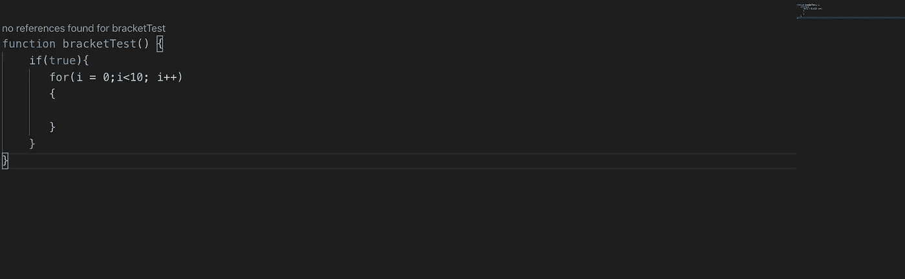
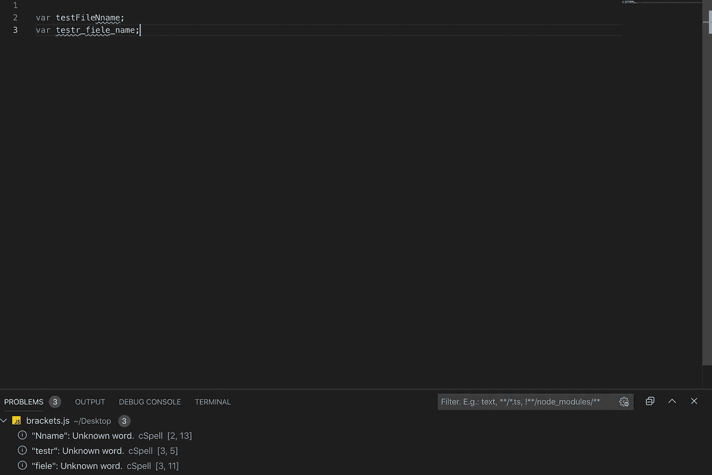
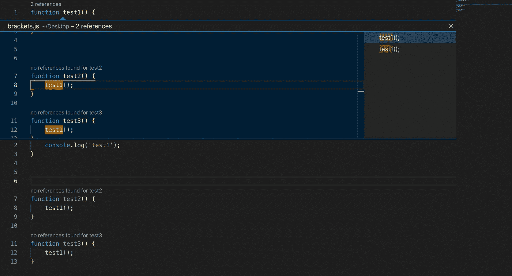
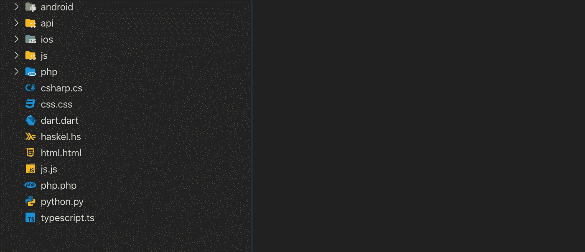
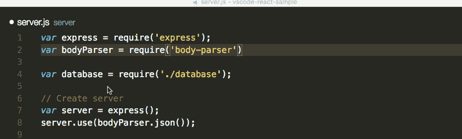
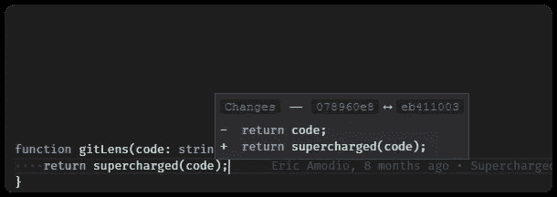
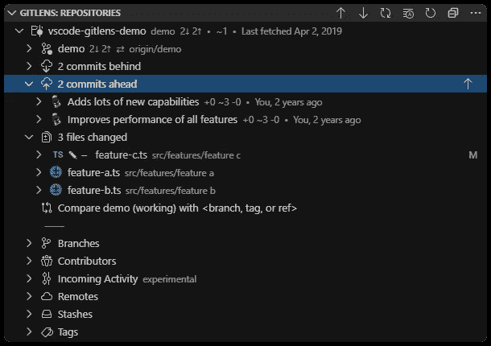
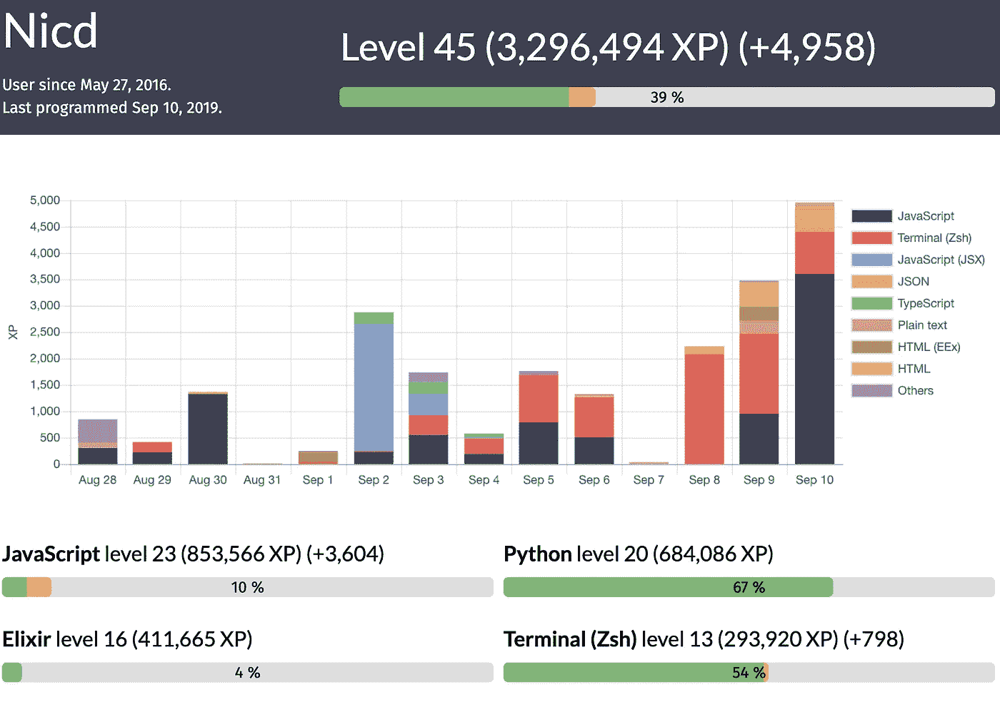

# 8 VS 代码扩展，帮助您编写更好的代码

> 原文：<https://betterprogramming.pub/8-vs-code-extensions-to-help-you-write-better-code-3f3fa56a3a52>

## 每个开发人员都应该在他们的机器上安装的扩展

背景图像—无飞溅

Visual Studio Code，或大多数人所说的 [VS Code](https://code.visualstudio.com/) ,是开发人员中使用最多的代码编辑器，全世界超过 34.9%的开发人员都在使用它。

作为一个免费、开源的跨平台代码编辑器，由一个大公司(微软)支持只会增加它的受欢迎程度。每个月，开源社区都会向市场添加扩展。这里列出了 VS 代码的八个扩展，在开发过程中可以派上用场。这里没有火箭科学—只有一些简单的工具来减轻您的工作。

# 括号对着色机

你有没有遇到过试图找出一个括号从哪里开始，块在哪里结束的情况？或者你有没有想删除一个括号却找不到它的配对？

那么，[这个](https://marketplace.visualstudio.com/items?itemName=CoenraadS.bracket-pair-colorizer)就是你的分机。用户可以定义匹配哪些字符和使用哪些颜色。这个很酷的扩展，有 220 万次下载，由科恩拉德*T5*和*开发，是每个写代码的人的必备。*

版本 2 也以更快的速度和更高的准确性发布。

颜色成对的括号

# 美化

这个是最流行的扩展之一，可以帮助你重新格式化你的代码。如果你相信干净代码原则，那么这个扩展绝对可以帮助你让你的代码看起来更整洁。

您可以自定义几乎所有的设置，如缩进大小、新行等。您还可以自定义特定语言的设置。它由 HookyQR 开发，下载量超过 400 万次。在你的 VS 代码上安装这个，用简单的键盘快捷键美化你的代码。

# 代码拼写检查器

这听起来可能有点太基础了，但是拼写检查是我们在编写代码时经常忽略的东西。

当然，几乎每个人都知道我们写的所有东西的拼写，但是当不同的编码者使用不同的风格时，很难检查每个单词。尤其是当您使用 camelCase 或 snake_case 这样的命名约定时，默认的拼写检查器可能无法时不时地发现您的错误。没有什么比在代码审查中发现拼写错误更令人尴尬的了，甚至当你把代码转给客户时也是如此。所以安全总比后悔好。

[这个](https://marketplace.visualstudio.com/items?itemName=streetsidesoftware.code-spell-checker)下载量也超过 100 万。

拼写检查突出显示每个文件中的错别字

# 铅字透镜

TypeLens 是一个非常酷的扩展，它可以让你检查一个项目中有多少个函数的引用，并且显示使用方法，而不需要你实际上进入使用它的特定文件。

在下面的例子中，你可以看到在`test()`、**、*、*、**之上，它突出显示了它在两个地方被使用。当你点击它的时候，它会弹出一个窗口，显示它的使用位置。目前，它可以在 TypeScript、JavaScript、SCSS 和更少的文件中运行。

对函数的引用

# 材料图标主题

现在[这个](https://marketplace.visualstudio.com/items?itemName=PKief.material-icon-theme)可能不是必须的，但它绝对是最酷的 VS 代码扩展之一，有 320 万次下载。

它根据最新的材料设计主题为您的文件和文件夹提供图标。它可能不会为您的代码增加任何价值，但它可以帮助您识别文件，并对编辑器的外观进行定制。

材料设计中的文件和文件夹图标

# npm 智能感知

如果你像我和世界上一半的开发人员一样是 JS 开发人员，你将每天都在使用 npm。还有什么比[更好的呢？一个扩展](https://marketplace.visualstudio.com/items?itemName=christian-kohler.npm-intellisense)，当你试图导入它们时，它向你显示建议并自动完成你的 npm 模块名。

这个扩展有超过 150 万的下载量。可能看起来很简单，但是当您试图导入一个新的或未知的 npm 包时，它确实很方便。

图片— [克里斯蒂安·科勒](https://marketplace.visualstudio.com/publishers/christian-kohler)

# 吉特朗斯

[GitLens](https://marketplace.visualstudio.com/items?itemName=eamodio.gitlens) 是对 VS 代码的“Git 增压”，就像创作者喜欢说的那样。它集成了几乎所有的 Git 功能——比如拉、推、恢复等。—集成到一个易于使用的界面中，并提供了许多有用的功能，如当前行责备、更改(差异)悬停、存储库视图等。

下载量超过 400 万次，是 VS 代码的最佳 Git 集成之一。

电流线责备

变化(差异)悬停

存储库视图

# 代码::统计数据

[Code::Stats](https://marketplace.visualstudio.com/items?itemName=riussi.code-stats-vscode) 是一个免费的状态跟踪工具，程序员可以用它来跟踪你写了多少代码。它对您在所有机器上编写的所有代码进行了简单而全面的分析。

Code::Stats 仪表板的快照