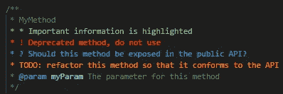
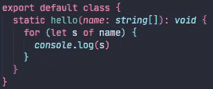
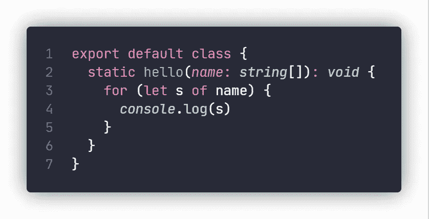
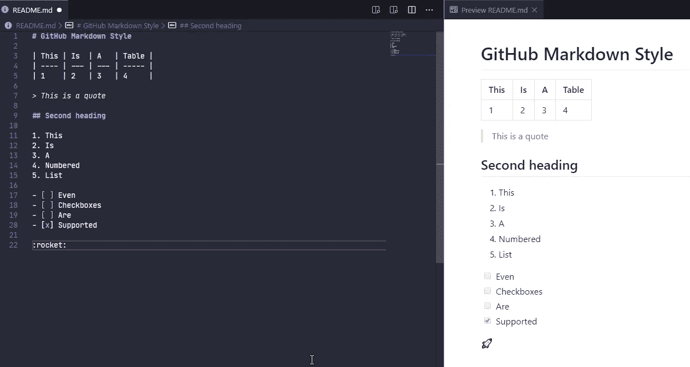
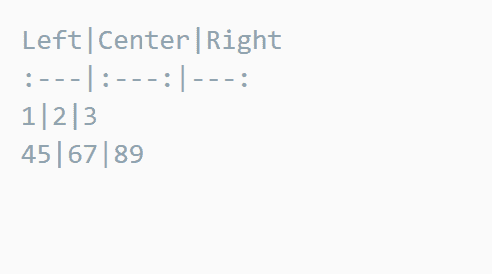
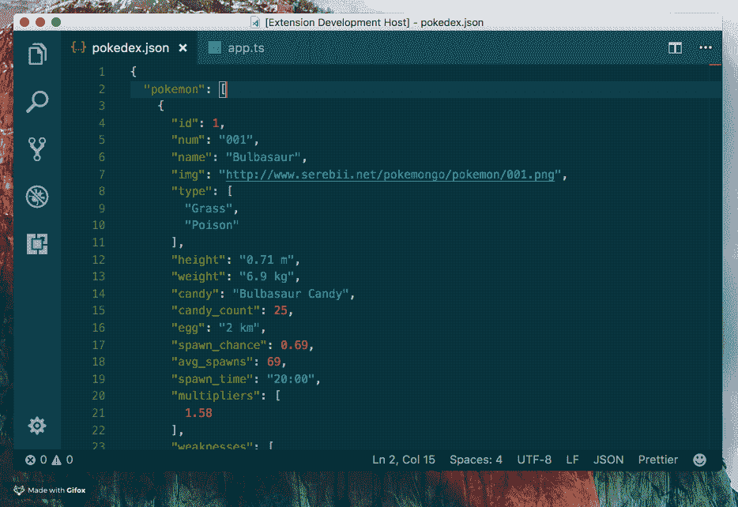
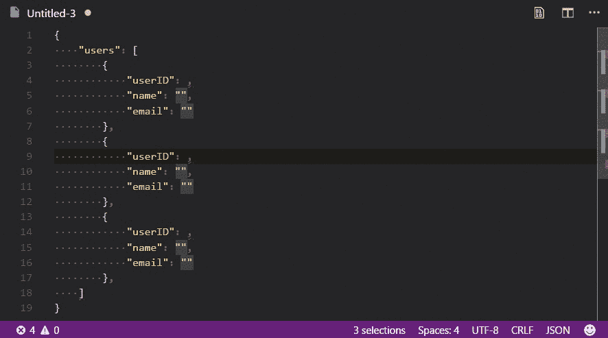

# 8 VS 你可能喜欢的代码扩展

> 原文：<https://betterprogramming.pub/8-vs-code-extensions-you-might-love-eba03d85fd4f>

## CodeSnap、GitHub Markdown 预览、将 JSON 粘贴为代码等等

肖恩·朗斯在 [Unsplash](https://unsplash.com?utm_source=medium&utm_medium=referral) 上拍摄的照片。

这个 Visual Studio 代码扩展列表将使您的编程工作流更加容易和高效。简而言之，它们将改进您编写和查看代码的方式。

# 更好的评论

[这个扩展](https://marketplace.visualstudio.com/items?itemName=aaron-bond.better-comments)将允许你在代码中编写不同种类的注释，包括:

*   警报
*   问题
*   待办事项
*   突出

这里有一个小例子，说明你的评论在将来会是什么样子:

# 括号对着色程序 2

这个扩展将把你的括号块的开始和结束都涂成相同的颜色，这将使你能够比以前更快地浏览代码！

# 代码快照

这个扩展允许你用一段代码制作一幅精美的图片。对作家相当有帮助。

这是屏幕截图的样子:

*注意:记住你不能从图片中复制代码。*

# Github 降价预览

[这个扩展](https://marketplace.visualstudio.com/items?itemName=bierner.github-markdown-preview)用 GitHub markdown 的样式覆盖了 Visual Studio 代码的标准 markdown 预览。这对经常使用开源文档的人来说确实很有用。

# 一次降价

[这个扩展](https://marketplace.visualstudio.com/items?itemName=yzhang.markdown-all-in-one)提供了非常有用的工具，可以更高效地在 Markdown 中编写文档！

它的功能太多了，无法一一列举，但如果你经常使用 Markdown，你肯定会需要它。

来源: [Visual Studio 代码](https://marketplace.visualstudio.com/items?itemName=yzhang.markdown-all-in-one)

来源: [Visual Studio 代码](https://marketplace.visualstudio.com/items?itemName=yzhang.markdown-all-in-one)

# 将 JSON 粘贴为代码

这个扩展将从剪贴板中的任何 JSON 生成工作代码。
单击一下就能从 API 响应中生成接口，这非常有用！

这支持 TypeScript、Python、Go、Ruby、C#、Java、Swift、Rust、Kotlin、C++、Flow、Objective-C、JavaScript、Elm 和 JSON Schema。

来源: [Visual Studio 代码](https://marketplace.visualstudio.com/items?itemName=quicktype.quicktype)

# 随机一切

这个扩展可以为你的代码生成各种类型的随机值。
非常适合快速占位符和填充测试代码。

来源: [Visual Studio 代码](https://marketplace.visualstudio.com/items?itemName=helixquar.randomeverything)

# 设置同步

[这个扩展](https://marketplace.visualstudio.com/items?itemName=Shan.code-settings-sync)将允许你推送你的设置和已安装的扩展、主题等。一个 GitHub gist。现在你使用的每个 VS 代码都是一样的。

例如，如果你有一台笔记本电脑和个人电脑，这是非常有用的。或者工作和私人计算机。

它同步所有扩展名和包含以下内容的完整用户文件夹:

*   设置文件
*   按键绑定文件
*   启动文件
*   片段文件夹
*   VS 代码扩展和扩展配置
*   工作区文件夹

# 结论

感谢阅读。

如果你有任何建议或喜欢的扩展应该在列表中，请在评论区告诉我们！