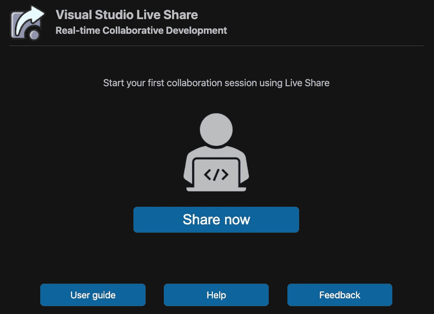
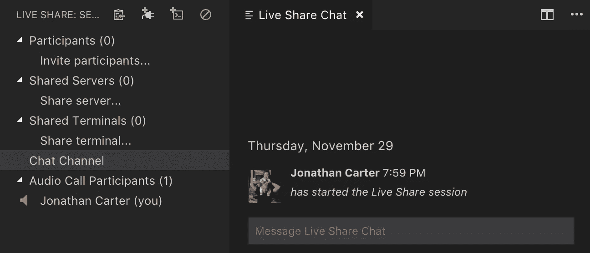
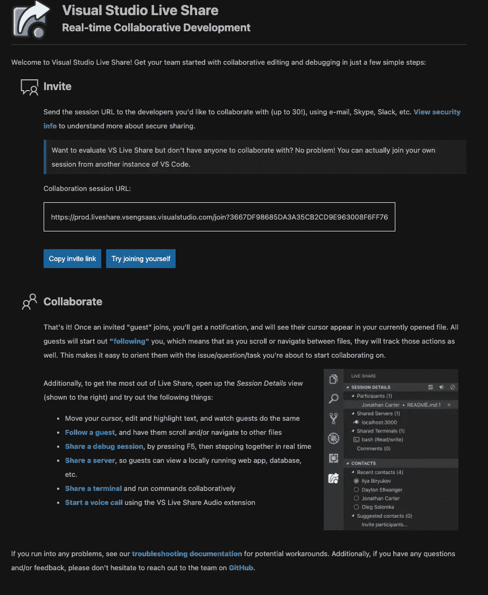
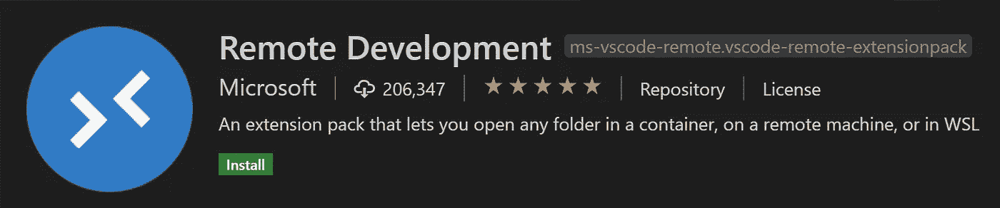
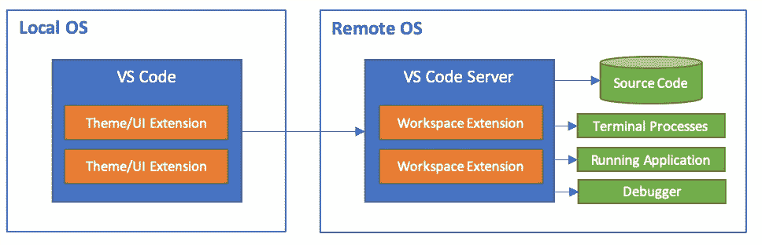
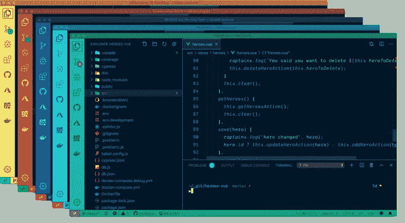
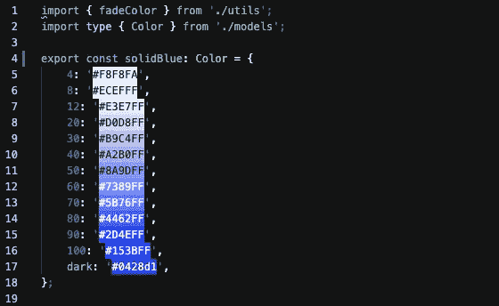

# 8 个黑仔 VS 代码插件来提高你的生产力

> 原文：<https://betterprogramming.pub/8-vs-code-plugins-to-improve-your-productivity-ee4497cebefa>

## 帮助你日常工作的必备插件

德文·扬塞·范·伦斯堡在 [Unsplash](https://unsplash.com?utm_source=medium&utm_medium=referral) 上拍摄的照片。

VS Code 是一个很棒的编辑器，自带了很多特性。这就是为什么它是最常用的 IDE 的原因之一。然而，它还有一些可以改进的地方——这就是扩展发挥作用的地方。

我不太喜欢安装很多插件。总是有让你的编辑器变慢或者在你的日常工作中引入太多魔法的风险。你仍然需要坐在驾驶座上。

这就是为什么我尽量接近原始特征。我在任何时候安装的插件都不超过十个。我尽量保持整洁。如果你安装了一些东西，你觉得它没有帮助，就删除它。这可能会分散你的注意力或影响性能。

然而，有一些非常具体的扩展将对您的生产力产生非常重要的影响。我想在这篇文章中重点讨论这些。你很可能不需要全部，因为你的工作流程可能与我的不同，但是你可能会发现一些新的有用的东西。

# 1.吉特朗斯

图片来自 [GitLens](https://gitlens.amod.io/) 。

Visual Studio 代码附带了对 Git 功能的基本支持。然而，它是非常不完整的。

GitLens 只是帮助你更好地理解代码。快速浏览谁更改了一行或代码块，为什么，什么时候。回顾历史，深入了解代码是如何发展的，以及为什么会发展。轻松探索代码库的历史和演变。它功能强大，功能丰富，高度可定制，以满足您的需求。

有其他插件旨在填补这一空白，但它们无法接近 GitLens 所提供的。你只需要一个插件，而不需要安装五个不同的插件来涵盖一切。

# 2.实时分享

作者照片。

目前，当进行结对编程时，通常的做法是通过 Zoom 或任何其他提供者共享屏幕。如果你试过，你就会知道它的缺点。有很大的改进空间。[这个插件](https://marketplace.visualstudio.com/items?itemName=MS-vsliveshare.vsliveshare)旨在填补这个空白。

这个插件可以让你远程进行结对编程。它目前支持多达 30 人。它功能齐全。你甚至不需要在缩放电话上跳了。这个插件提供了一个内置的聊天或内置的音频通话。

照片来自 [VS 代号](https://marketplace.visualstudio.com/items?itemName=MS-vsliveshare.vsliveshare)。

开始一个会话非常简单。创建会话后，您将获得一个 URL，并将其提供给同事。

作者照片。

# 3.VS 代码远程开发

[这个扩展](https://marketplace.visualstudio.com/items?itemName=ms-vscode-remote.vscode-remote-extensionpack)在物理或虚拟机上远程提供容器中的无缝开发。你不需要在服务器上运行任何东西。只需使用这个扩展对机器进行 SSH。

来自 [VS 代码](https://marketplace.visualstudio.com/items?itemName=ms-vscode-remote.vscode-remote-extensionpack)的 GIF。

这为什么有用？您可以更好地检查远程机器上的代码，或者只需要一台远程机器，在那里安装所有的开发工具并编辑代码。这意味着你可以把你的笔记本电脑变成一个客户端，让所有的资源在另一台机器上执行。然后，您就可以将所有与工作相关的代码放入沙箱，并且独立于您的个人数据。

安装在远程机器上的插件不会安装在客户端机器上。这让事情变得相当整洁。

照片来自 [VS 代号](https://code.visualstudio.com/docs/remote/remote-overview)。

一些公司甚至为他们的员工提供远程机器。他们大大降低了配置时间的成本，并且公司可以确保他们的员工拥有能够开发产品的机器。

# 4.雄孔雀

图片来自 [VS 代号](https://marketplace.visualstudio.com/items?itemName=johnpapa.vscode-peacock)。

你经常在不同的项目之间切换吗？[这个扩展](https://marketplace.visualstudio.com/items?itemName=johnpapa.vscode-peacock)将帮助你定制每个项目，这样你就可以对你当前正在做的事情有一些视觉反馈。

它有一些很好的预定义颜色，但也让你添加自己的颜色。我的最爱？“曼达洛人蓝”这么酷的名字。

# 5.括号对着色程序 2

这是一个非常简单却非常有用的扩展。它允许用颜色来识别匹配的括号。用户可以定义匹配哪些字符和使用哪些颜色。

我对默认行为非常满意，尽管它是高度可定制的。

照片来自 [VS 代号](https://marketplace.visualstudio.com/items?itemName=CoenraadS.bracket-pair-colorizer)。

# 6.彩色高光

另一个简单而[有用的工具](https://marketplace.visualstudio.com/items?itemName=naumovs.color-highlight)。它只会突出显示文档中的 CSS/web 颜色。

作者截图。

# 7.埃斯林特

[一个将 ESLint 集成到 VS 代码中的插件](https://marketplace.visualstudio.com/items?itemName=dbaeumer.vscode-eslint)。您需要安装 ESLint 来运行它，并提供一个`.eslintrc`配置文件。

它有很多值得一试的配置选项。

# 8.较美丽

一个扩展来支持更漂亮的，这是一个固执己见的代码格式化程序。它删除了所有原始样式，并确保所有输出的代码符合一致的样式。

这个工具绝对是大型项目的必备工具，这样你就可以确保代码库的可读性。因为 Prettier 是高度可配置的，所以你的团队需要做的就是同意它的配置。

您需要告诉 VS 代码`.prettierrc`配置文件在哪里，或者把它放在根文件夹中。

# 最后的想法

那些是我最喜欢的 VS 代码插件。他们是我日常工作中的好伙伴。根据你的技术水平或职责，你可能会发现一些比其他的更有用。

VS Code 是一个很棒的编辑器，它提供了很多特性，让你需要的插件越来越少。

有大量的插件。确保你不会花太多时间去寻找一个完美的。归根结底，插件只是给你一点帮助，而不是为你工作。

# 有关系的

 [## 如何用 VSCode 即时浏览 GitHub Repos

### 使用 Visual Studio 代码编辑器在一秒钟内阅读 GitHub 代码

better 编程. pub](/how-to-browse-github-repos-instantly-with-vscode-de7055480de8)  [## 您应该掌握的五大打字稿功能

### 使用这些必须知道的特性来提高您的打字稿知识

better 编程. pub](/top-5-typescript-features-you-should-master-2358db9ab3d5)