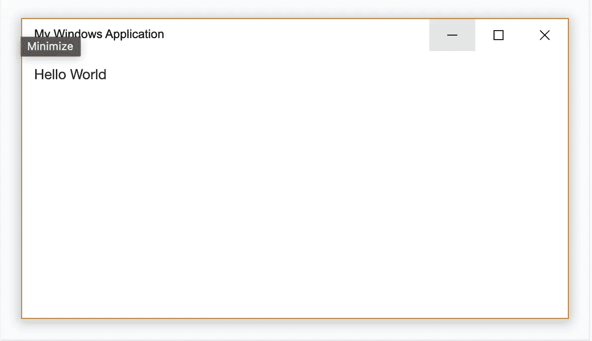
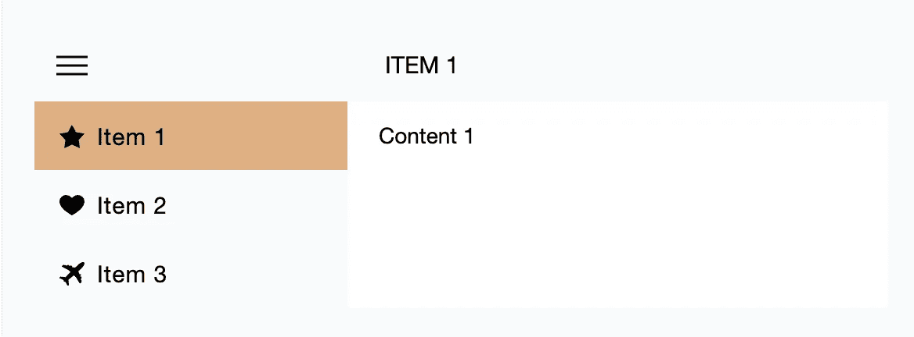
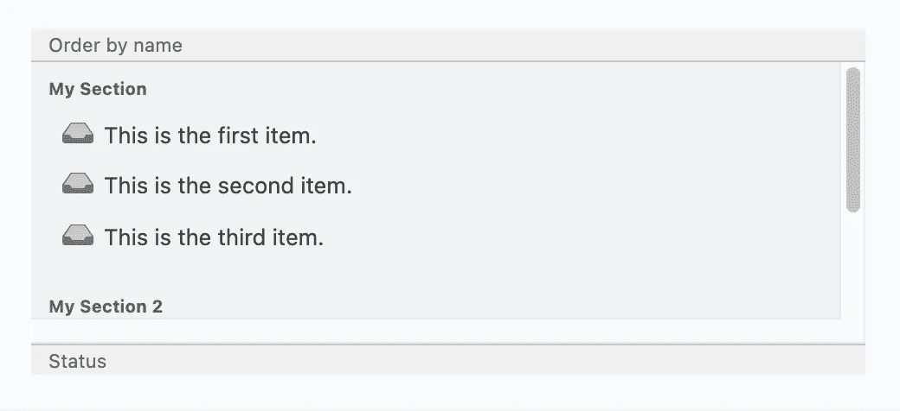
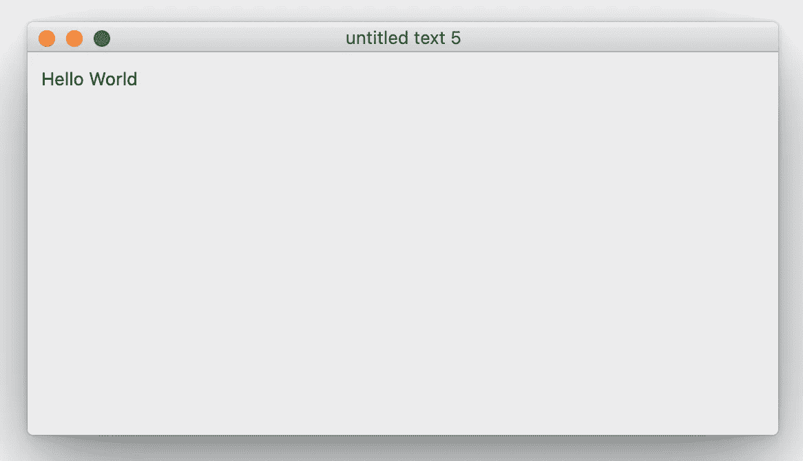
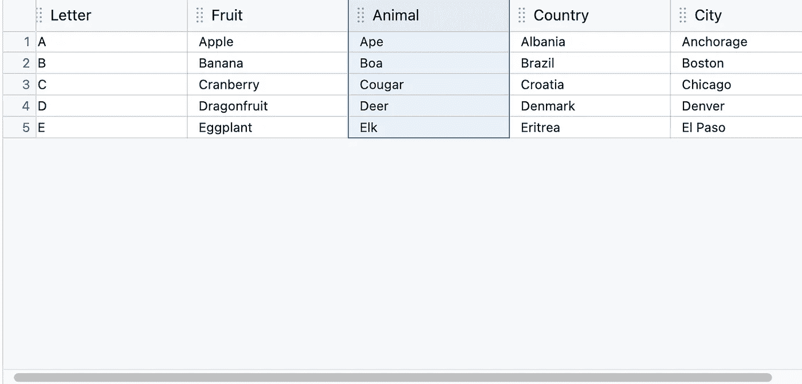
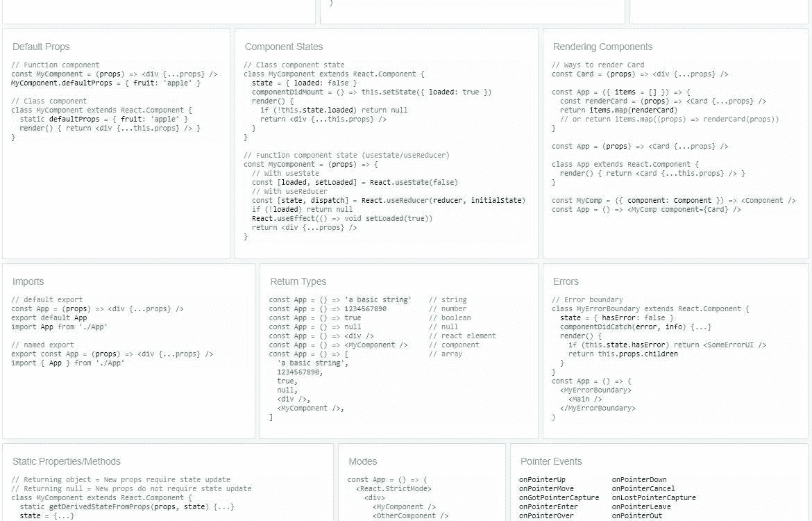
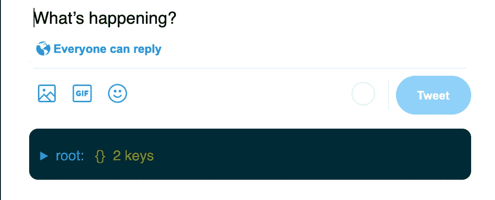
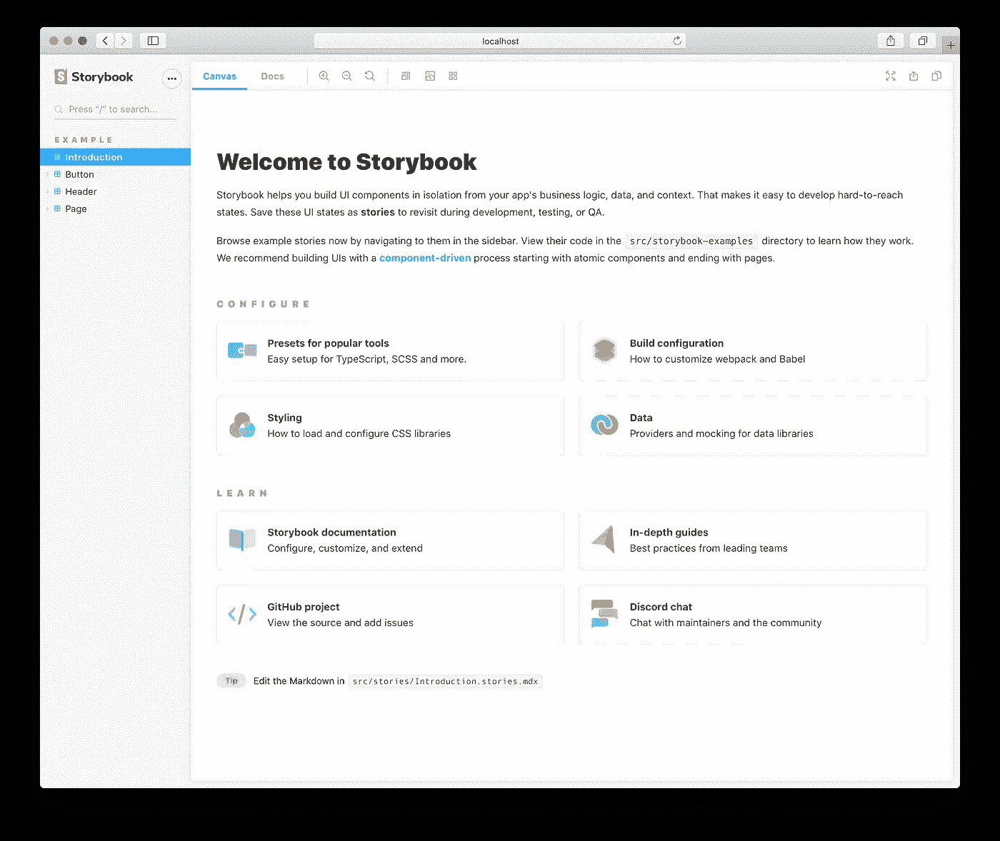

# 2022 年你可以使用 React 的 8 种方式

> 原文：<https://betterprogramming.pub/8-ways-you-can-use-react-in-2022-bedaaf428bd9>

## 活出最大反应

照片由[劳塔罗·安德烈亚尼](https://unsplash.com/@lautaroandreani?utm_source=medium&utm_medium=referral)在 [Unsplash](https://unsplash.com?utm_source=medium&utm_medium=referral) 上拍摄

在本帖中，我们将介绍 2022 年使用 React 构建应用程序的 9 种方式。这些服务包括从视频流服务到文本编辑器。

# 1.网站

列表中第一个明显的(但也是最重要的)是 web 应用程序。React.js 是 web 开发社区中最受欢迎的 JavaScript 库之一，因为它能够以声明式风格创建动态且健壮的用户界面。

React 的伟大之处在于它是不独立的，正因为如此，你可以用你想用的方式*做很多事情。*

如果您不知道适用于您的用例的一些现有技术，这里有一个快速列表，可以帮助您立即开始使用 React:

# 静态网站

*   GatsbyJS 是构建静态网站最流行的框架，非常注重 SEO。它快速、灵活，并帮助您使用 React 开发 web 应用程序。多年来，它一直在不断更新最新技术，并将最佳实践应用于不断变化的搜索引擎算法。
*   NextJS 是构建混合静态&服务器渲染 web 应用程序的最流行框架之一，它也使用 React。

# 2.命令行界面(CLI)应用

如果您曾经想使用 React 开发自己的 JavaScript 命令行应用程序，现在就可以！

ink 是一个流行的 JavaScript 库，用于在命令行上创建基于组件的用户界面。为了实现这一点，他们使用 Yoga 在终端中构建 Flexbox 布局，这样您通常会使用的大多数 CSS 属性也可以立即使用。

《盖茨比》、[《纽约时报》](https://github.com/nytimes/kyt)以及 [Twilio](https://github.com/twilio-labs/plugin-signal2020) 都在他们的项目中使用了墨水。

它有一套很棒的内置[组件](https://github.com/vadimdemedes/ink#components)以及由社区构建的[组件，随时可以使用，如果你想更进一步，你可以创建自己的 ink 组件并与 ink 社区共享！](https://github.com/vadimdemedes/ink#components)

下面是一个正在使用的墨水示例:

# 3.桌面应用程序

如果你曾经想过创建自己的桌面应用程序，有几个库也许能帮到你。

Electron 是 NodeJS 社区中用于创建本地桌面应用程序的最广泛的库之一。当你把 react 和它结合起来时，它就变成了一个强大的组合，因为它使它变得有趣和容易，同时仍然能够构建复杂的程序！

React NodeGUI 因将 React 直接引入桌面开发体验而逐渐流行起来，由 Qt5 提供支持。

如果您曾经决定走这条路，那么值得一提的是这些库中的一些，它们是上述内容的很好的伴侣:

1.  [react-desktop](https://reactdesktop.js.org/) 提供一组现成的 react 组件，目标是带来原生桌面体验，具有许多 Windows 10 和 MacOS Sierra 组件:

Windows 10:

马科斯塞拉:

1.  [react-router-dom](https://v5.reactrouter.com/web/guides/quick-start) 可以使用它的`HashRouter`组件为基于文件的环境或`BrowserRouter`为基于请求的环境路由页面。这很好，因为它允许您的用户转到他们以前访问过的步骤。
2.  [Blueprint](https://blueprintjs.com/docs/) 是另一个基于 react 的组件库，为构建桌面应用的复杂数据驱动界面提供优化组件:

# 4.视频、视频播放器和流媒体

您可以结合 GatsbyJS、NextJS 或任何其他 UI 框架来使用 react 并构建自己的应用程序，这些应用程序可以播放视频，甚至提供流畅的视频流体验。

首先，这里有一些库可以帮助您在网页上播放视频:

*   react-player 是一个 react 组件，用于播放来自各种 URL 的视频，包括文件路径、YouTube、脸书、DailyMotion 等。它是一个智能组件，加载适当的标记和外部 SDK 来播放来自不同来源的媒体。
*   [react-video-renderer](https://www.npmjs.com/package/react-video-renderer) 也是另一个播放视频的 react 组件
*   [react-video-recorder](https://github.com/fbaiodias/react-video-recorder#readme) 是一个 react 组件，可以让你录制视频。
*   [react-video-progress](https://github.com/asashay/react-video-progress#readme) 是一个 react 组件，可以帮助显示视频在其帧边界的持续时间进度:
*   [react-modal-video](https://rawgit.com/appleple/react-modal-video/master/test/) 可以帮助你在 modal 上播放视频
*   [twilio-video](https://www.twilio.com/docs/video/javascript) 允许您在应用程序中添加实时语音和视频聊天。这允许多个人加入同一个聊天室，并有类似缩放的体验。

您可以将这种体验结合起来，为您的用户创建视频点播(VOD)体验。

[AWS Elemental media convert](https://docs.aws.amazon.com/mediaconvert/index.html)通过使用高质量的视频转码技术为任何设备创建点播视频资产，可以帮助格式化和压缩您的视频，以便传送到连接的设备或电视。它使用苹果和微软开发的最新代码转换技术来实现这一点，以统一所有用户都可以使用的格式。您还必须使用 S3 创建两个桶(一个用于输入，一个用于输出)，然后使用一个函数来触发 MediaConvert 的管道以存储输出。这些视频由你连接到那个桶的 CDN 拾取，并可以由你的视频播放器流式播放。这听起来像是一个使用 react 的很酷的项目！

# 5.备忘单

由于 React 的组件特性，当使用它开发您自己的备忘单时，它是一个很好的工具。当与 drag n drop 结合使用时，它几乎是 JavaScript 中的自然之母，因为通常你会在特定的位置有特定的注释，这样你就可以充分利用它。

如果您想在 React 中开始创建备忘单，您可以查看下面的库:

是一个 react 库，目的是使用代码片段生成备忘单。它使用一个拖放 api 在代码片段之间平滑过渡，并且有超过 20 个主题来装饰你的代码片段。

# 6.文本编辑器

我敢肯定，读到这里的大多数人已经使用互联网有一段时间了，所以你肯定有过使用文本编辑器的实践经验。事实证明，创建它们并不那么简单。但是您可以在 react 中使用几个现成的库快速开始构建自己的库:

[DraftJS](https://draftjs.org/) 是由脸书团队创建的一个库，它可以让你用…你猜对了:反应！这需要一些时间来适应，但一旦你开始习惯，当你注意到进步时，它实际上会激励你继续前进。

# 7.证明文件

写文档应该简单明了。幸运的是，react 提供了一些工具，有助于以编程的方式进一步简化事情。

如果你还没看过《T4》的话，你可以去看看《docusaurus》。

Docusaurus 是一个 react 库，它提供了一个 api 来快速构建优化的网站，并帮助您将更多的精力放在内容上，而不是构建页面。它是由脸书(现在称为 Meta)的工程师开发的。您可以在 markdown 或 mdx 中编写您的内容，然后 docusaurus 将生成可以提供的静态 html 文件。将它与像 Algolia 这样的快速搜索组件结合起来，你会得到一个非常高兴的观众:)

还有 [Storybook](https://storybook.js.org/) ，这是一个很棒的 react 库，用于构建独立的用户界面组件和页面。这种方法很酷的一点是，如果您有多个组件要记录，它自然也非常适合生成文档:

# 8.移动应用

在现代技术中，移动应用程序已经成为最受欢迎和最普遍的搜索信息以及与他人交流的技术之一，因此这些天来它们风靡一时。

这在 JavaScript 社区中没有太大的不同，因为你仍然可以经常看到开发人员使用 react 开发移动应用程序。

[react-native](https://reactnative.dev/) 是另一个由 at 脸书创建的库，它可以让你在 react 中编写用于 Android 和 iOS 的原生应用。

像比特币基地、Shopify、Discord 甚至沃尔玛这样的知名公司都在开发中使用 react native。

# 结论

本帖到此结束！我希望你发现这是有价值的，并期待在未来更多！