# 9 个了不起的 Python 熊猫使用科学家应该知道的每个数据

> 原文：<https://betterprogramming.pub/9-awesome-python-pandas-usages-every-data-scientists-should-know-62911eed81e9>

## Python 熊猫的优雅用例


由[约书亚·梅奥](https://unsplash.com/@mayofi?utm_source=medium&utm_medium=referral)在 [Unsplash](https://unsplash.com?utm_source=medium&utm_medium=referral) 上拍摄的照片

在机器学习和数据科学项目的日常数据处理中，Pandas 是使用最多的 Python 库之一。像 Numpy 一样，Pandas 用许多优雅构建的方法、属性和函数统治着数据科学、机器学习和人工编程领域。在日常数据分析中，我们面临许多独特的情况，对此 Pandas 内置的 API 有许多隐藏的宝藏，可以通过简洁、优雅的代码解决我们的大多数问题。

在这篇文章中，我将分享一些简单却引人注目的技巧，它们可以让编程成为一种快乐的体验。许多这些优雅的功能使 Pandas 成为数据科学家和机器学习工程师的首选库。

我们将使用下面的数据框来解释一些概念，而其他一些例子是独立的。

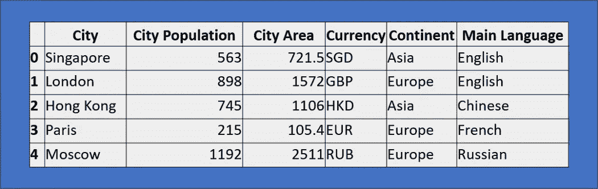

作者图片

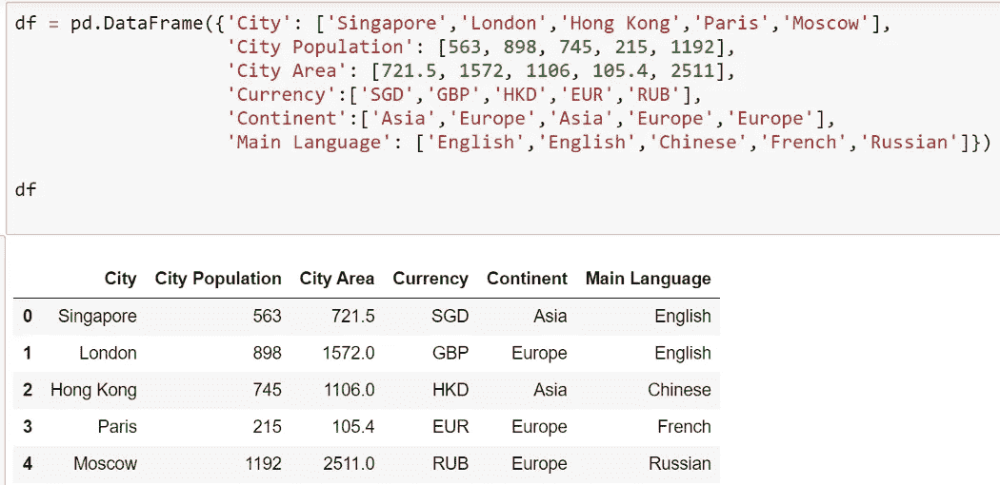

作者图片

# 1.以不同的顺序对数据进行排序

Pandas 有一个内置函数`sort_values()` ，可以用来对列或索引进行升序或降序排序。现在，很多时候我们需要以不同的顺序对每一列进行排序:一列可能是升序，下一列是降序，可能下一列又是升序。

下面的示例首先按升序对“大陆”进行排序，然后按降序对“城市人口”进行排序(第二级排序与第一级排序的值相同)。

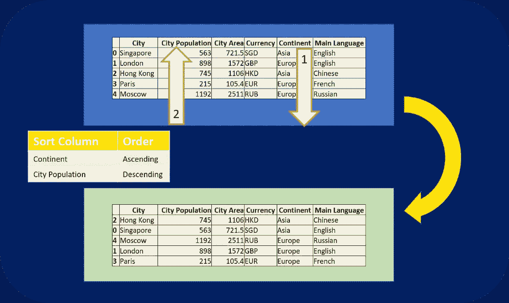

作者图片

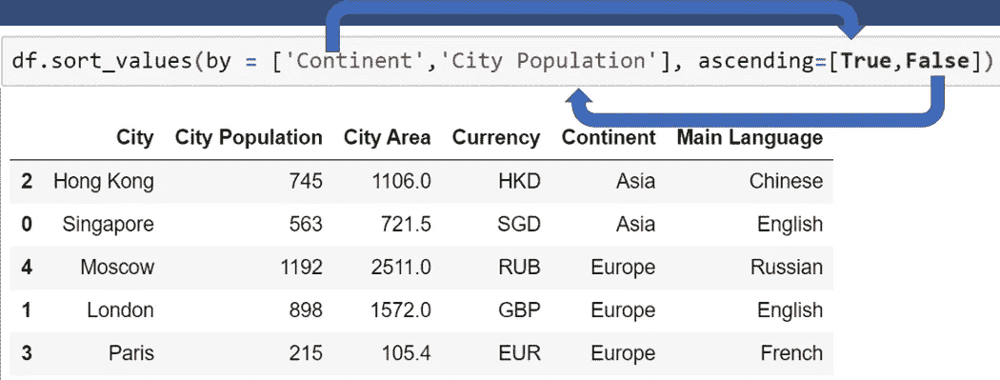

作者图片

```
df.sort_values(by = ['Continent','City Population'], ascending=[True,False])
```

类似地，我们可以进行更多级别的排序，在不同的列表中创建列名和相应顺序的列表。参考关键字“by”和“ascending”的用法，如下图所示(这两个列表中每个列名和相应排序顺序的一对一关系)。

```
df.sort_values(by = ['Continent','Main Language','City Population'], ascending=[True,False,True])
```

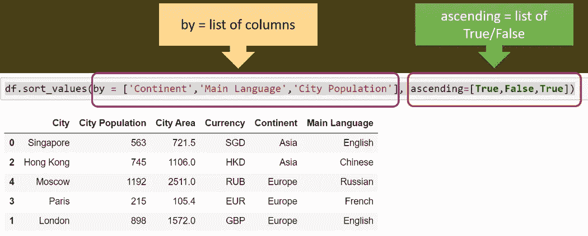

作者图片

# 2.shift()用于移动数据

假设您遇到一种情况，需要移动数据框中的所有行，或者需要在数据框中使用前一天的股票价格。也许我们想在数据集中构建最近三天的平均温度；shift()是实现所有这些目标的理想选择。

Pandas 的 shift()函数将索引移动所需的周期数。该函数采用一个称为周期的标量参数，表示所需轴的移动次数。这个函数在处理时间序列数据时很有用。我们可以使用`fill_value`来填充超出边界的值。

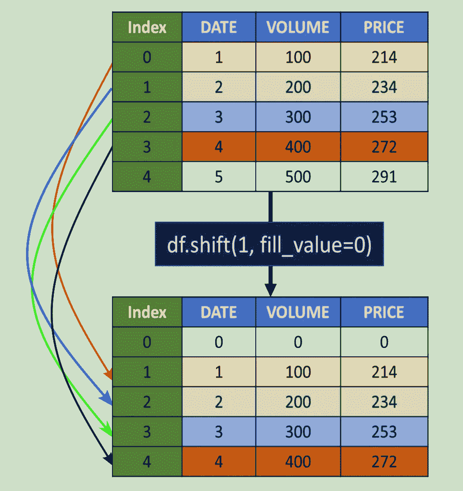

作者图片

如果我们需要将前一天的股票价格作为一个新列，我们可以使用如下所示的 shift:

我们可以很容易地计算出最近三天的平均股价，并创建一个新的特征列，如下所示:

现在，数据框将如下所示:

我们也可以向前移动，从下一个时间步或下一行获取值。

现在，数据框将如下所示:

关于选项和其他设置的更多细节，请参考 Pandas [文档](https://pandas.pydata.org/pandas-docs/stable/reference/api/pandas.Series.shift.html?highlight=shift#pandas.Series.shift)。

# 3.在特定位置添加新列

很多时候，我们需要使用 Pandas 为数据框创建一个新列。默认情况下，我们生成的任何新列都位于数据框的末尾。假设我们想要为这些城市中的每一个创建一个新的列人口密度(“城市人口”/“花旗地区”)。默认的新字段将如下所示:

```
df['Population density'] = df['City Population']/df['City Area']
```

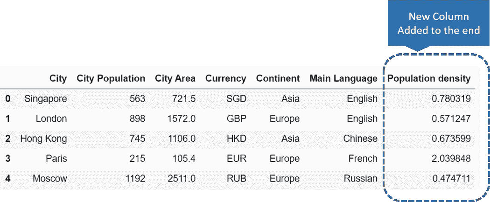

作者图片

如果我们想在一个特定的位置创建列，比如在“城市地区”和“货币”之间，我们必须使用“**insert”**函数。

```
df.insert(loc=3, column='Population density', value=(df['City Population']/df['City Area']))
```

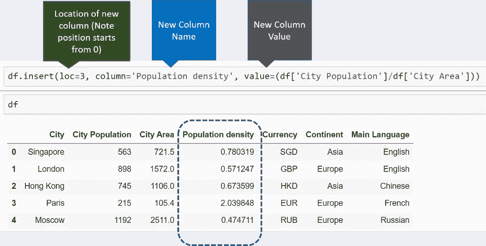

作者图片

# 4.value_counts()来查找唯一值

Pandas `value_counts()`函数返回一个包含唯一值计数的对象。生成的对象可以按降序或升序排序，通过参数控制包括或排除 NA。请参考下面显示图示视图的示例。该功能可用于 index 或 Pandas 系列。

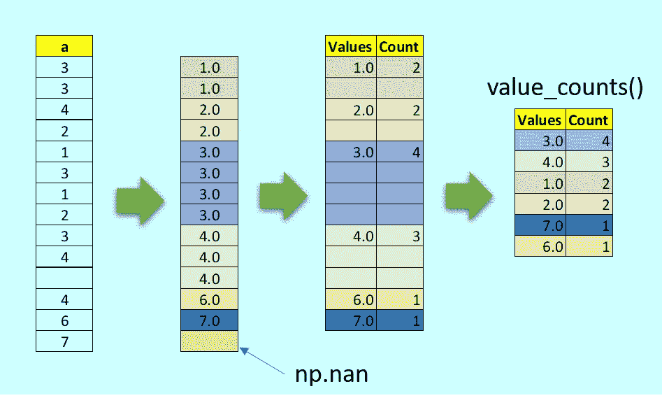

作者图片

以下是该系列的一个例子:

可以使用 bin 选项，而不是计算值的唯一幻影并将索引划分为指定数量的半开 bin。

有关选项和其他设置的更多详细信息，请参考 Pandas [文档](https://pandas.pydata.org/pandas-docs/stable/reference/api/pandas.Series.value_counts.html)。

# 5.基于数据类型选择列

在许多情况下，我们需要根据列的数据类型来选择或执行特定的操作。假设我们需要屏蔽所有浮点整数或将所有字符列转换为大写。在这种情况下，一个简单的方法是使用 Pandas 内置函数" **select_dtypes。"**它有“包含”和“排除”选项，我们可以以列表的形式给出多个选项。

首先，让我们看看我们的数据框架中有哪些数据类型；我们可以使用内置的" **dtypes。"**


作者图片

我们现在只想选择那些具有“浮点”值的列；我们可以使用如下所示的“select_dtypes ”:

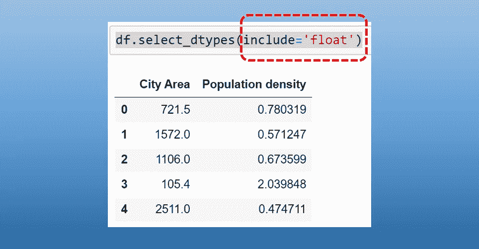

作者图片

我们还可以使用“排除”来选择所有其他被排除的数据类型。假设我们想排除所有“对象”数据类型。如果是这样的话，我们可以做如下所示:

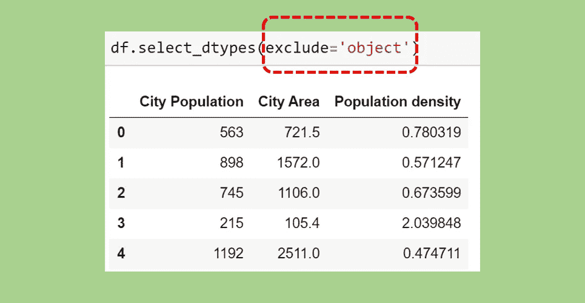

作者图片

对于多个数据类型的排除或包含，我们可以使用一个列表。我们也可以使用包含和排除组合。

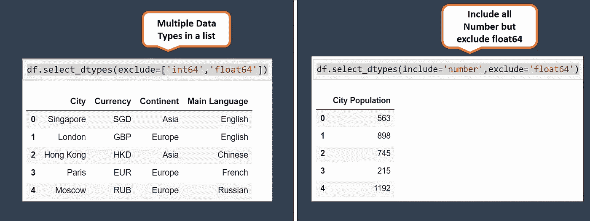

# 6.对 if-else 条件使用 mask()

mask 方法是对序列或数据帧的每个元素应用 if-then 条件。如果 Cond 为 True，则它使用 Other 中的值(默认值为 NaN ),否则将保留原始值。这个 mask()方法与 where()非常相似。

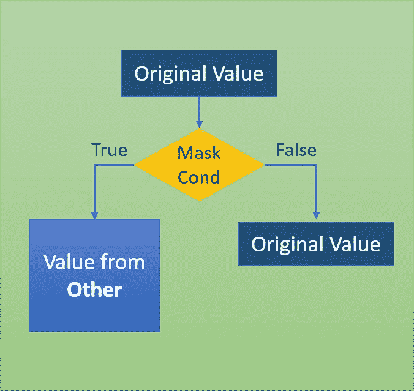

作者图片

参考下面的数据框，我们想改变所有被 2 整除的元素的符号，但没有余数。

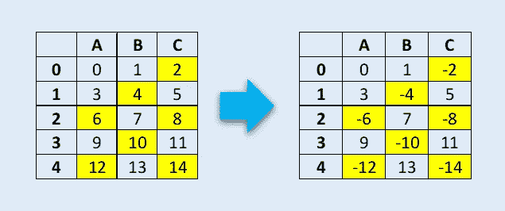

作者图片

这可以通过 mask()函数轻松实现。

关于选项和其他设置的更多细节，请参考熊猫[文档](https://pandas.pydata.org/pandas-docs/stable/reference/api/pandas.DataFrame.mask.html#pandas.DataFrame.mask)。

# 7.基于部分匹配筛选列

在我们的日常数据处理中，我们面临这样一种情况，即我们需要根据匹配的名称来查找相关的列。它不需要完全匹配，但我们可能只需要部分匹配。假设我们希望看到所有“日期”列或所有包含“金额”的列我们可以使用**过滤器的**功能。假设，在这个数据集中，我们希望找到“城市”的所有列我们必须关心匹配字符串，因为它是“区分大小写的”

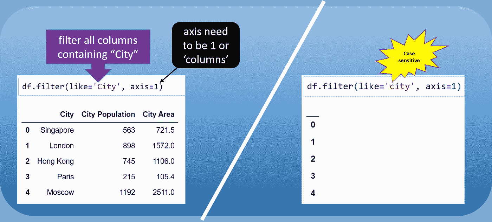

作者图片

参考下面的例子，结果是一样的。

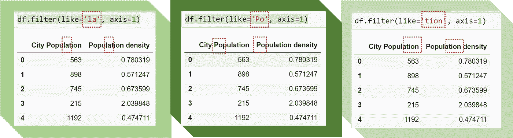

作者图片

# 8 nlargest()到上限值

在许多情况下，我们会遇到这样的情况，我们需要为一个系列或数据框找到前三名或后五名的值(就像表现最好的三名学生的总得分或三名垫底的候选人在选举中获得的总票数)。

熊猫`nlargest()`和`nsmallest()`是这类数据处理需求的最佳答案。

以下示例显示了由十个观测值组成的数据框中的三个最大高度:

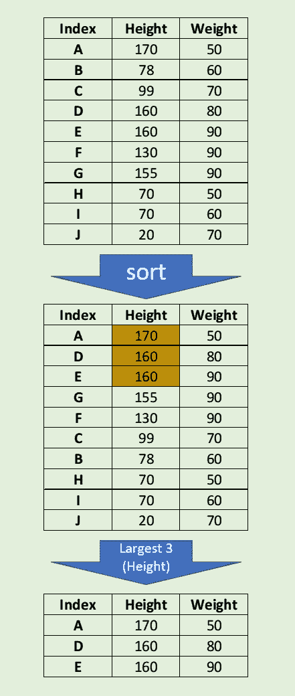

作者图片

如果出现平局，那么使用**‘first’，‘last’，‘all’，**(默认为‘first’)解决的选项很少。保留所有事件。我们将尝试在下面的例子中找到两个最大的高度。

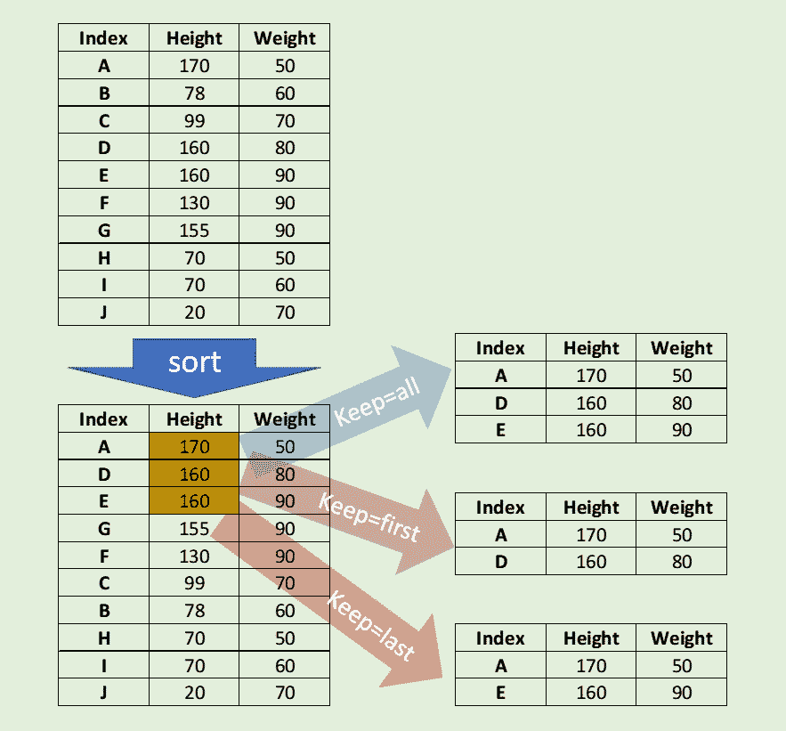

作者图片

保留最后一次出现。

保留第一个事件。

有关选项和其他设置的更多详细信息，请参考 Pandas [文档](https://pandas.pydata.org/pandas-docs/stable/reference/api/pandas.Series.nlargest.html)。

# 9.nsmallest()

`nsmallest()`也类似地工作，但是记住习语最小过滤器。参考下面的例子，我们现在使用权重来找出两个最小的权重:

有关选项和其他设置的更多详细信息，请参考 Pandas [文档](https://pandas.pydata.org/pandas-docs/stable/reference/api/pandas.Series.nsmallest.html#pandas.Series.nsmallest)。

# 最后一个音符

这些熊猫的功能不仅优雅，而且富有表现力，简单而整洁。多年来，熊猫 API 已经变得非常复杂；它提供了许多内置函数，这些函数需要许多行代码或 lambda 函数来执行所需的数据操作。我希望这篇文章对你有用。

我期待看到您的反馈或分享任何其他更简单和优雅的方法来解决这些或类似的问题。

感谢阅读。你可以在 [LinkedIn](http://www.linkedin.com/in/baijayantaroy) 上联系我。

> 只需每月 5 美元，就可以无限制地获取最鼓舞人心的内容...点击下面的链接，成为一个中等成员，支持我的写作。谢谢大家！
> [【https://baijayanta.medium.com/membership】](https://baijayanta.medium.com/membership)