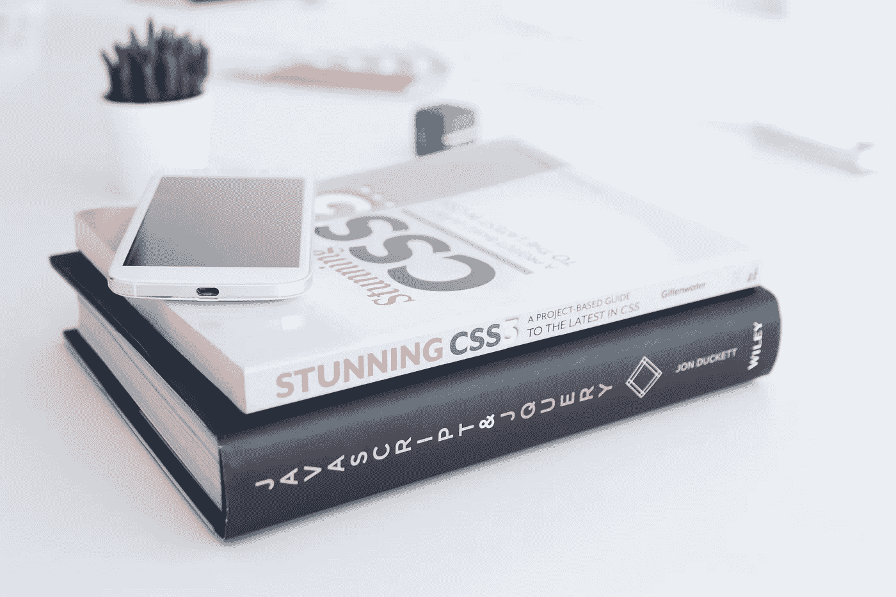
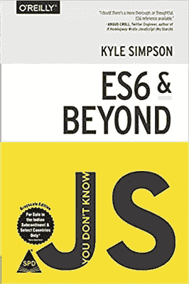
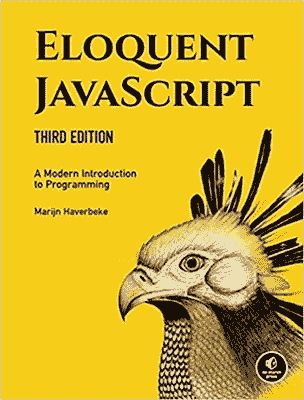
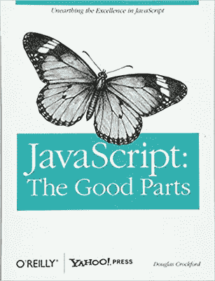
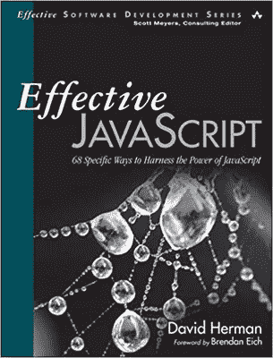
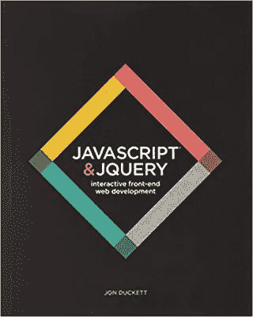
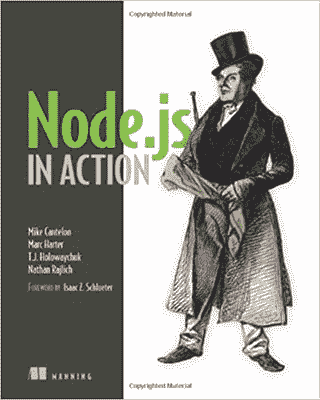
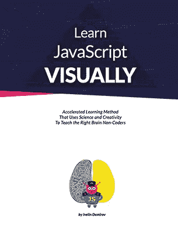

# 初学者和高级开发人员的 9 本最佳 JavaScript 书籍

> 原文：<https://betterprogramming.pub/9-best-javascript-books-for-beginners-and-advanced-developers-f44c7e4a3af8>

## 你会推荐谁读哪本书？

[KOBU 机构](https://unsplash.com/@kobuagency?utm_source=unsplash&utm_medium=referral&utm_content=creditCopyText)在 [Unsplash](https://unsplash.com/s/photos/javascript-books?utm_source=unsplash&utm_medium=referral&utm_content=creditCopyText) 上拍摄的照片

> “据我所知，JavaScript 是唯一一种人们觉得在开始使用之前不需要学习的语言。”
> 
> —道格拉斯·克洛克福特

如果你已经掌握了 HTML 和 CSS 基础知识，现在又想学习一门编程语言，那就去学 T4 JavaScript T5 吧。

JavaScript 是一种广泛使用的编程语言，也是一种著名的脚本语言。

我承认这有点难以理解，但别担心，你并不孤单。慢慢来，把注意力集中在基础上，不要认为你会一下子理解所有的事情。

不要对自己太苛刻；给自己一些时间，你会发现在这个学习旅程的最后，你会成为一名专家。

# 精心策划的 JavaScript 书籍

慢慢来，不要伤到你的大脑。

现在学习 JavaScript 有很多来源:最常见的是 web 上的在线课程；程序员经常选择这种资源，因为他们认为他们可以在更短的时间内掌握 JavaScript 知识。

我并不反对这一点，但是网络课程与书本相比还不够全面。为了详细理解每一个概念，最好阅读专门为这个领域写的书。

> 参考由知名出版物和经验丰富的作者写的书总是明智的。

在本文中，我精心挑选了一些最好的书籍，您可以将它们添加到您的学习日程中，以掌握 JavaScript。

# **1。** **你不知道 JS**

*   **作者:**凯尔·辛普森
*   **出版商:**奥莱利传媒

《你不知道的 JS》一书的封面

> " JavaScript 与 Java 的关系就像嘉年华与汽车的关系一样."
> ― **凯尔·辛普森**

凯尔·辛普森(Kyle Simpson)撰写的这一系列书籍是新手和有经验者的救星。JavaScript 是一种一开始就很难处理的语言；不管你在这个问题上获得了多少知识，总会留下一些东西。

为了帮助你填补空白，我推荐这本书系列；它全面而简洁，能够澄清你所有的疑问。

《你不知道的 JS》是为学习 JavaScript 而写的六本书的合集。每本书都带你进入更高层次的 JavaScript。第一部分处理基础知识，然后处理闭包、对象、范围和 ES2016 更改。

您将探索和理解 JavaScript 中那些经常被有经验的 JavaScript 程序员遗忘的更复杂的部分。

这一系列的六本书是:

1.开始行动了

2.类型和语法

3.ES6 及更高版本

4.异步和性能

5.这和对象原型

6.范围和结束

这些概念帮助读者习惯这种编程语言的各种高级技术方面。只有当你有 C、C++或 Java 等编程语言的知识时，才可以阅读这本书。很好的一个！

此外，这个系列的书有两个版本:

*   [第一版](https://github.com/getify/You-Dont-Know-JS/blob/1st-ed/README.md)
*   [第二版](https://github.com/getify/You-Dont-Know-JS/blob/1st-ed/README.md)

# 2.雄辩的 JavaScript:编程的现代介绍

*   **作者:**马林·哈弗贝克
*   **出版者:‖**无淀粉

《雄辩的 JavaScript:现代编程入门》一书的封面

这本书的写作方式本身就是纯粹的艺术。这本书的 USP 是大量练习的可用性。这本书配有大量的例子和练习来帮助你理清你的概念。它很容易理解，并迎合了一个好奇的野心家的所有需求。

Marijn Haverbeke 解释了 JavaScript 语言的基本结构，包括控制结构、功能、数据结构、错误修复、模块化和异步编程。最后，他教授如何使用 JavaScript 来编写程序。

本书共有 21 章，分为三个部分:

●第 1 部分涵盖了 JavaScript 的基础知识。

●第 2 部分讲述了 JavaScript 的早期，浏览器的战争，以及文档对象模型。

●第 3 部分详细讨论了 Node 的性能和速度。

# **3。JavaScript:好的部分**

*   **作者:**道格拉斯·克洛克福特
*   **出版商:**奥莱利传媒

《JavaScript:精彩部分》一书的封面

> “在 JavaScript 中，有一种美丽、优雅、极具表现力的语言被掩盖在一大堆善意和错误之下。”
> —道格拉斯·克洛克福特

这是道格拉斯·克洛克福特写的，是好奇的程序员的理想阅读资源。这可能看起来很荒谬，但是 JavaScript 还处于早期阶段，在编写时更像是浏览器中的一种微型脚本语言。

在 2004 年之前，很难在网络浏览器中看到任何真正的应用程序，因为它们对用户不友好。它们需要大量的重新加载时间，花费大量时间将数据传输到服务器，等等。最初，JavaScipt 用于生成琐碎的用户界面效果。

JavaScript 成了许多程序员的幽默之源，但事后看来，道格拉斯·克洛克福特看到了由布伦丹·艾奇创造的这种语言的潜力，并开始欣赏它。

这本书涵盖了 JavaScript 所有好的和坏的方面。有了这本书，你会学到很多东西，比如下面这些:

*   编写正确代码的方法
*   句法
*   目标
*   功能
*   遗产
*   数组
*   正则表达式

# **4。JavaScript:权威指南**

*   **作者:**大卫·弗拉纳根
*   **出版商:**奥莱利媒体

《JavaScript:权威指南》的封面

权威指南是一本关于 JavaScript 的深度书籍，作者对构建 web 应用程序非常感兴趣。

这本书从零开始教你 JavaScript。这是一本值得参考的好书。在本书的帮助下，你可以做到以下几点:

*   构建强大的 web 应用程序
*   了解详细的 API 特性和 JS 概念。

这本书有六个版本，随着每本书的发行，你都会学到新的东西。这本书的每个新版本都包含更新的功能，并配备了大量的例子和练习！

对于任何渴望在更高层次学习的人来说，这本书是正确的选择。

# 5.有效的 JavaScript:利用 JavaScript 力量的 68 种具体方法

*   **作者:**大卫·赫尔曼
*   出版商:艾迪生-卫斯理专业公司

《有效的 JavaScript:利用 JavaScript 力量的 68 种具体方法》的封面

> "对象的属性是自动暴露的，而闭包里的变量是自动隐藏的."
> 
> —大卫·赫尔曼

任何熟悉 JavaScript 并对基础知识有充分理解的人都应该参考这本书，以了解更多高级技术部分。

大卫·赫尔曼是一位经验丰富的程序员，在理解这种强大的语言和构建精确可靠的程序方面写了一本非常有效的书，取得了令人难以置信的成功。他在本书中用大量的例子展示了他的真实经历。

这个会教你以下内容:

*   为每个项目选择正确编程风格的方法。
*   它帮助您建立创建小型和大型应用程序的基础。
*   如何使用基于原型的面向对象编程

读完这篇文章，你肯定会成为一名训练有素的 JavaScript 开发人员。

# **6。** **JavaScript & JQuery:交互式前端 Web 开发**

*   **作者:**乔恩·达克特
*   出版商:威利

《JavaScript & JQuery》一书的封面

Jon Duckett 为非 IT 专业人士写了这本书。这本书直观地教会了许多读者关于 JavaScript 的知识。

在这本书的帮助下，你可以使用“JavaScript & jQuery”生成更多的交互式网页它有一个视觉丰富的格式，教你从零开始。本书包含以下部分:

*   基本编程概念
*   核心要素
*   jQuery 简介
*   如何重新创建滑块、内容过滤器等技术。

所有的概念都得到了详细的解释，并且提供了各种例子来支持这些材料。这本书的内容安排和组织得很好。

# **7。** **Node.js 在行动**

*   作者:迈克·坎特伦、马克·哈特、T.J .霍洛韦丘克和内森·拉里奇
*   **出版商:**曼宁出版公司

《Node.js 在行动》一书的封面

“Node.js in Action”是一本加载了示例的书，涵盖了 HTTP/HTTPS、使用 Socket 的实时消息传递等主题。IO，使用数据库等。它指导您学习构建生产质量的节点应用程序所需的所有技术和概念。

从安装到部署，它都是有效编写的。作者试图解释清楚每个概念，并举例说明，使概念更加坚实。

这本书非常适合学习不同于 Rails、Django 或 PHP 的东西。您将探索异步编程、数据存储，并与文件系统交互以生成非 HTTP 应用程序，如 TCP/IP 服务器。如果你是 Node 领域的新手，那么这本书是一本非常好的书！

# 8.更聪明的学习 JavaScript 的方法:新的技术辅助方法，事半功倍

*   **作者:**马克·迈尔斯
*   **出版商:**闪电源公司

《学习 JavaScript 的更聪明的方法》一书的封面

马克·迈尔斯的《学习 JavaScript 的更聪明的方法》是另一个值得一看的奇迹。根据 Mark Myers 的说法，程序员在学习 JavaScript 时经常会遇到两个问题:

*   保留
*   理解

考虑到这两个问题，作者在本书中提出了这些问题的解决方案。

它充满了基本概念，如警告、变量、字符串，以及更复杂的概念，如构造函数和原型。

各章之后是各种练习，以巩固所学知识。作者用简单易懂的英语详细解释了每个概念。我保证你会花双倍的时间来解决测试你对某个特定主题的学习的问题。

这本书的评论很棒。所以，去看看吧！

> “他使用的外行语法……让你很容易突然意识到，一个看似抽象、难以理解的概念突然变得一点也不复杂了。”—亚马逊评论人，IMHO

# **9。** **可视化学习 JavaScript】**

*   **作者:**伊夫林·德米罗夫
*   **出版者:**奈公司。

《可视化学习 JavaScript》一书的封面

这是一本专门为视觉学习者设计的书。借助视觉效果，这本书可以帮助你轻松有效地理解代码。

艾夫林写这本书是为了让视觉学习者受益，因为与左脑学习者相比，他们能记住更多的信息。这本书的插图有助于记忆触发，因为这是大脑永远不会忘记图像的趋势。这本书是美丽的插图来解释借助隐喻，类比的基础。

如果你是初学者，想学习 JavaScript 的基础知识，这本书是必读书。

# **包装完毕！**

所以，就这些了，伙计们！选择任何你想读的书，因为最终目的是扩大你的知识面。更加注重基础，一旦你明白了，就进入高级阶段。JavaScript 是一种复杂的语言，但是一旦你掌握了它，它将会给你的 web 开发职业生涯带来奇迹。

另外，请随意查看我们关于 [JavaScript 框架](https://blog.digitalogy.co/best-javascript-frameworks/)的博客。

# 了解你的作者

**克莱尔 D** 。是 Digitalogy 的内容制作者和战略家，他可以将你的内容观点转化为清晰、引人注目、简洁的文字，与读者建立强有力的联系。

在 [Linkedin](https://www.linkedin.com/in/claire-d-costa-a0379419b/) 上与我联系。