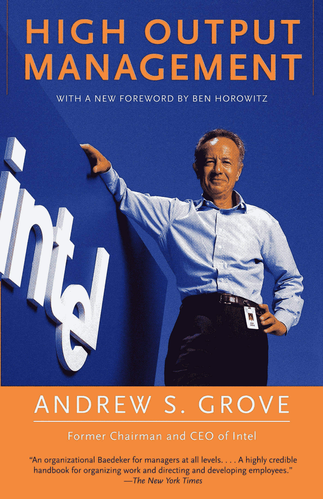
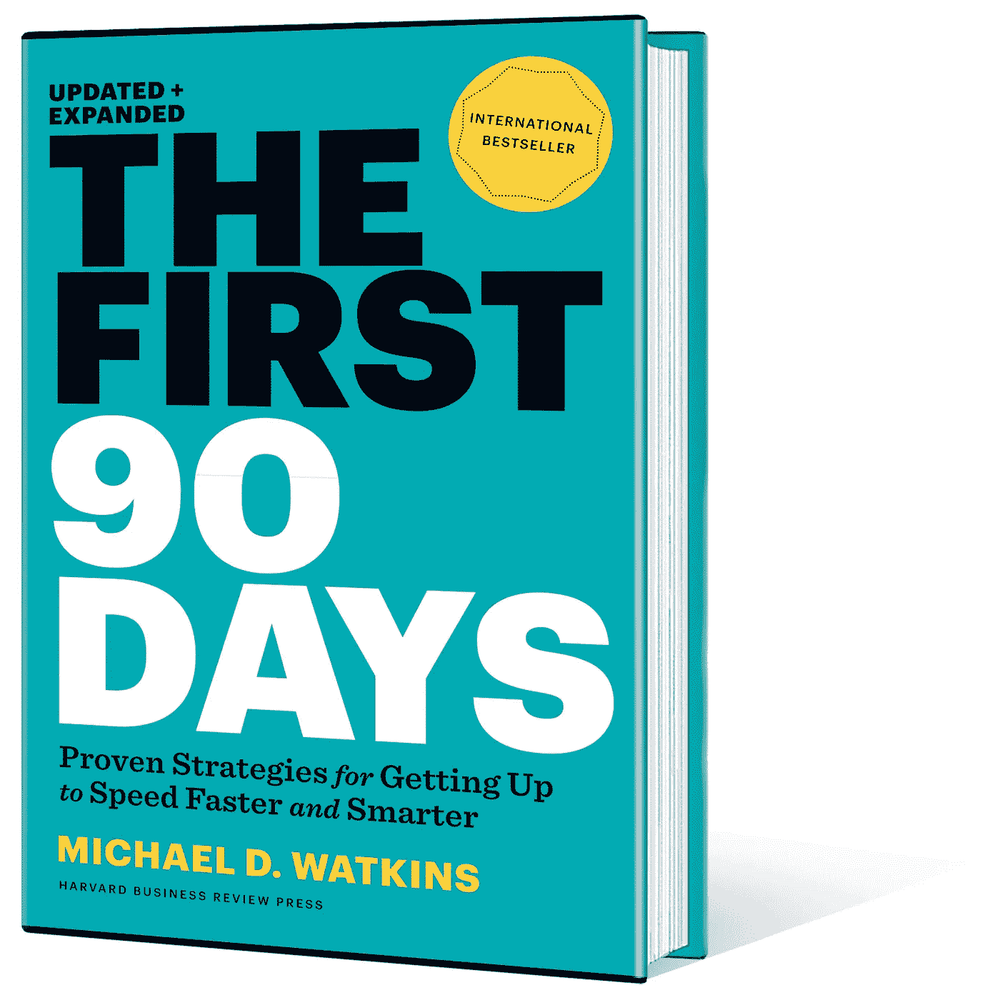
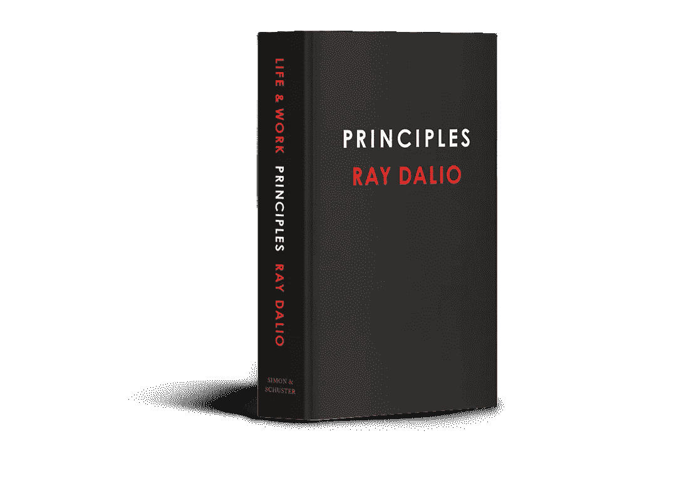
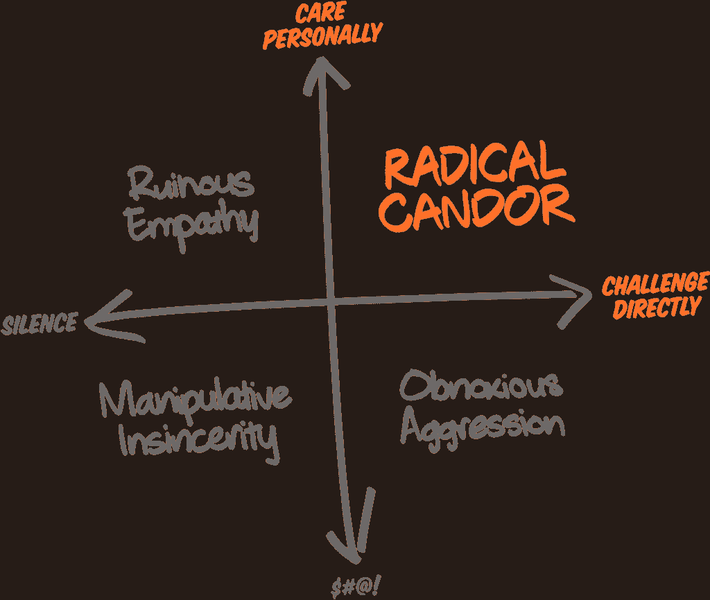

# 所有工程经理都应该读的 9 本书

> 原文：<https://betterprogramming.pub/9-books-all-engineering-managers-should-read-9a7c6719f29d>

## 无论你是第一次接触，还是想获得一些不同的视角，这些都是我职业生涯中迄今为止发现最有帮助的书

蜘蛛侠同意这个列表中的第四条。与 Raj 在 [Unsplash](https://unsplash.com?utm_source=medium&utm_medium=referral) 上的[公路旅行照片](https://unsplash.com/@roadtripwithraj?utm_source=medium&utm_medium=referral)

# 1.高产量管理

> 管理者的产出是在他们监督或影响下的组织的产出。

安德鲁·s·格罗夫在他的书中反复强调了这句格言。着眼于项目、瓶颈、创建“早餐工厂”以达到目的，《高产出管理》是我最先阅读的管理书籍之一。虽然其中一些看起来有些过时(有关于适当远程办公的讨论)，但它将永远是新经理的坚实基础。

格罗夫的书可能感觉有点晦涩，但制造管理的见解是 MBA 预科的必修课。这本书已经写了将近 40 年了，但是有时被称为“OKRs 之父”的安迪·格罗夫有很多宝贵的智慧可以分享。甚至还有一个关于“会议”以及如何充分利用会议的部分。见下图。

[来源](https://www.amazon.in/High-Output-Management-Andrew-Grove/dp/0679762884)

# 2.一个优雅的谜题

威尔·拉森的《工程管理》这本书看起来就像是一部自述，在第一次通读之后，它是一本可靠的参考资料。做一些招聘的事情？再读一遍那部分。“高产出管理”对于一般管理来说是什么，“一个优雅的难题”对于软件工程管理来说也是一样的。

一本很棒的管理书籍，尤其是对那些更有技术头脑的人来说，拉森对几乎每一种管理情况都有条不紊。与下面的“原则”类似，这是一本我用作参考指南的管理书籍，尤其是在处理新问题时。

# 3.前 90 天——迈克尔·沃特金斯

即使你被提升到当前公司的管理层，头 90 天对你的成功也非常有帮助。在我换工作的时候，这本书我至少读过或听过两遍，它仍然非常有用。

为自己创建一个 90 天的路线图似乎是显而易见的，但前 90 天会带你了解你应该专注于什么，你应该评估什么，以及如何评估你的周围环境。

如果你在面试，问问你的潜在雇主在你的头 90 天里对你有什么期望。他们可能没有完整的答案，但它会让你了解如何满足你的新直接团队、新同事和整个公司的期望。

# 4.原则—雷伊·达里奥

雷伊·达里奥的经典与其说是一本“从头到尾”的书，不如说是一本适用于所有情况的参考书。例如，第 5 章，“学习如何有效地做决策”，采用系统的方法来解决许多管理问题，尤其是那些没有定量数据的问题。

> 5.1 认识到 1)对良好决策的最大威胁是有害情绪，2)决策是一个两步走的过程(先学习再决定)。

他有一个手机应用程序，几乎每天都在 LinkedIn 上发布一条原则，所以有很多方法来消费这些信息，但我的建议是慢慢开始。检查第三部分工作原理的目录:

*   为了获得正确的文化…
*   相信彻底的真相和彻底的透明
*   培养有意义的工作和有意义的关系
*   创造一种文化，在这种文化中，犯错误是可以的，不从中吸取教训是不可接受的
*   …
*   感知问题，不容忍问题
*   诊断问题，找到问题的根源
*   设计改进你的机器来解决你的问题
*   做你打算做的事
*   使用工具和协议来决定如何完成工作

这只是书中工作原则部分的一个例子。正如我所说的，这里面有很多东西，其中一些你作为一名新经理可能还没有考虑到。

# 5.彻底的坦白

说到激进，[激进坦诚](https://www.amazon.com/Radical-Candor-Revised-Kick-Ass-Humanity/)的概念是“亲自关心，直接挑战”这是金·斯科特关于如何“如何成为一名出色的老板而又不失人性”的书通篇的口头禅。

这是你学习全方位给予反馈的指南，不管你管理谁，也不管你的同事中有谁。

> 表扬要像批评一样具体和彻底。深入细节。

Scott 在第 6 章中对管理的“原子建筑块”——指导——进行了更详细的描述。《彻底坦白》也是一本开始深入跳过 1:1 层次的罕见书籍，这个主题很少作为管理者的管理者的工具来讨论。

[来源](https://www.amazon.com/Radical-Candor-Revised-Kick-Ass-Humanity/)

金·斯科特还提出了本·霍洛维茨所谓的“sh*t 三明治”，即你把你想给某人的反馈隐藏在两个积极的项目之间。有些人认为这是一种恭维三明治，有些人则认为是“嘘嘘三明治”你看到了哪个三明治？

> 赞美和批评之间的“正确”比例的概念是危险的，因为它会导致你说一些不自然的、不真诚的或者纯粹荒谬的事情。

# 6.衡量什么是重要的

约翰·杜尔登有时被称为 OKRs 的教父，他的书“[衡量什么是重要的](https://www.amazon.com/Measure-What-Matters-Google-Foundation/dp/0525536221)”开始阐述他在组织和团队层面设定目标的观点。

Doerr 从几个不同的角度切入目标设定，他注意到一个双重节奏(组织每年一次，团队每季度一次),他说:

> 高功能团队在自上而下和自下而上的目标设定之间的创造性张力中茁壮成长。

给你一个警告，okr 在你第一次创建的时候不会很顺利。这将是一场斗争，而且可能感觉毫无意义。努力确保在你公司的学科和部门之间没有冲突，并且全面地互相利用。你们可以一起创造令人敬畏的目标和关键成果。

# 7.精益产品行动手册

我在一家代理公司初出茅庐，我无法描述我是如何获得项目 MVP 的。[精益产品行动手册](https://www.amazon.com/Lean-Product-Playbook-Innovate-Products/dp/1118960874/)能够将我的许多想法用文字表达出来，并帮助我进一步巩固我如何处理项目。

重要的是要记住，你不能把一个框架直接应用于所有的公司，但是精益产品行动手册会介绍如何实现以下目标:

*   确定你的目标客户
*   确定未得到充分满足的客户需求
*   创造成功的产品策略
*   决定您的最小可行产品(MVP)
*   设计你的 MVP 原型
*   与客户一起测试您的 MVP
*   快速迭代以实现产品与市场的契合

如果你是一个更专注于产品的经理，或者想对你的产品的发展方向有一些发言权，在你获得 MVP 之前，不要放弃大的想法。

# 8.组织行为:理论与实践

不轻松的阅读，[组织行为学](https://www.amazon.com/Organizational-Behavior-Practice-Steven-Altman-ebook/dp/B01DSRU4F2)是我在获得 MBA 学位时阅读的一本教科书。在此之前，我从未想过组织能够被如此大规模地研究。

涵盖的主题如对变化的恐惧，工作设计，组织如何处理行为问题，以及如何组织你的组织，这本书是另一个早期职业生涯的参考型书籍。在某些部分密度比锇大，这本书慢慢看，但要密切关注核心概念。

# 9.情商:为什么比智商更重要

很多时候，公司都在寻找情商高的领导者。如果你不能与你的直接下属产生共鸣，你将很难领导他们。丹尼尔·戈尔曼是情商领域的专家，虽然教授移情可能极其困难，但这本书给了你如何开始情商之旅的路线图。

# 其他我没读过但在我清单上的书

*   管理者之路——卡米尔·福涅尔
*   一个管理者的成功之道——卓君琳
*   参谋工程师——威尔·拉森

你呢，有哪些书籍帮助你形成了管理风格？外面有很多书，所以我很好奇其他人在他们的管理生涯中发现了哪些有帮助的东西。

感谢阅读。