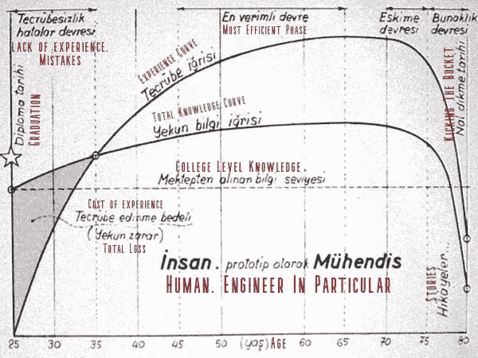
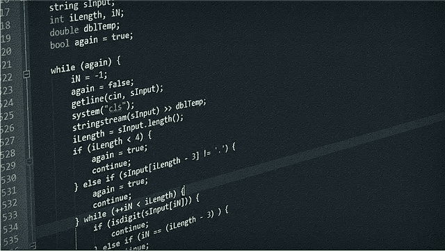
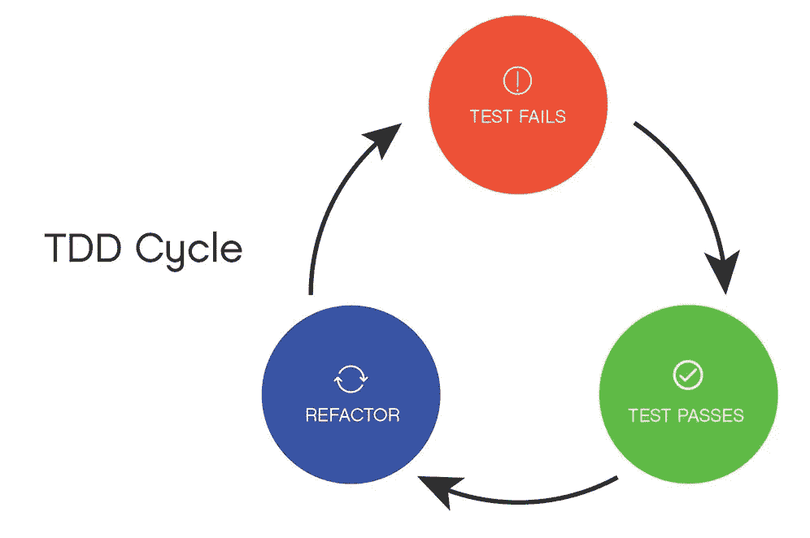

# 嵌入式软件开发人员的 9 个职业建议

> 原文：<https://betterprogramming.pub/9-carrier-tips-for-embedded-software-developers-b565c0844100>

## 这些也适用于非硬件工程师

我想通过分享 STFA 集团联合创始人 Feyzi Akkaya(一位著名的土耳其工程师)的以下伟大图表来介绍这篇文章。

Feyzi Akkaya 的工程曲线

如图所示，毕业后有很长一段时间没有经验。

这是我职业生涯的第 12 个年头，我认为我几乎与这张图和谐一致。

这 12 年已经过去了将近 10 年，而我还不知道自己是多么缺乏经验。我做了很多错事，现在我觉得我走对了。当然，我还有很长的路要走。

我写这篇文章的原因有点自私。

我想应该有一个理由和一个提醒，让我不要重复这些年来犯下的错误。

因此，我决定列出正确的习惯，并作为一篇文章发表，以定期检查，不重复同样的错误。

虽然这篇文章是针对嵌入式软件开发人员的，但我认为它也可以吸引其他软件开发人员。

# 1.不要孤立地工作

孤立是你最大的敌人！

我说的孤立是什么意思？

例如，在一个项目中，你在一个微控制器上开发软件。如果你在没有和任何人讨论的情况下开发软件，你自己准备架构，你自己选择将要使用的工具，你自己确定方法，你写的代码没有被另一个活着的灵魂看到，这意味着你被孤立了。

你应该尽快逃离这种情况。

在孤立状态下工作时，你将失去的收益如下:

*   在解决问题时，与不同视角的开发人员讨论和分析问题可以提高效率。这对你的职业生涯也更积极，因为团队成员从彼此的技术知识中受益，更快地填补他们职业生涯中的空白。
*   处理难题时你更有动力。
*   与其他开发人员一起检查您的代码可以更容易地及早发现错误。
*   共同开发迫使你使用 CI/CD、TDD、有效使用版本控制系统以及良好的文档等方法。
*   项目的延续和持续时间不会受到威胁，因为当一个团队成员离职时，至少还有一个人非常了解这项工作。

在孤立状态下工作的唯一好处是，它允许你在没有任何人干扰你的情况下尝试你想要的新技术。

# 2.寻找最佳实践

尽管在嵌入式软件中达到最佳实践相对困难，但可以说比以前容易多了。

在决定一个方法之前，你应该总是问这些问题:“我怎样才能做得最好？”，以及“以前肯定有人走过这条路”，并做一些研究或咨询更有经验的同事。

互联网是最好的资源。做这项工作的一段开源代码可能会放在 Github 上。

可以咨询 StackOverflow。

你甚至可以花很少的费用获得世界上最好的技术人员的指导(codementor.io)。

# 3.推迟编码

我知道…

你渴望开始输入你美味的意大利面条代码。

不要…

在您完全定义了需求，完全创建了架构，并与您的同事达成共识之前，不要开始这项任务。

如果马上开始写代码，会遇到的问题让你损失了很多时间，最后很可能会失望。

推迟编码——即使是在编码的时候。

例如，你会给一个变量命名吗？记住这个名字要让别人和你以后的版本去读和理解。多花点时间思考，找出其他同样情况的开发者是怎么造名字的，然后命名。

# 4.你是软件开发者还是硬件开发者？决定吧！

这种情况是我们这个行业特有的。

在长时间准备原理图、PCB 板的设计和原型制作之后，你也可以开始准备软件了。

如果你的资源有限，只有一个工程师可以做这个项目，我理解。

但是，如果这是有意识的选择，对不起，我觉得这是非常错误的。

虽然嵌入式系统工程师比传统的软件开发人员更熟悉硬件，但是硬件设计人员和嵌入式软件开发人员的工作是完全不同的。

在这两个领域平等地工作会延迟，甚至阻止你在这两个领域的专业化。快速专业化在日益激烈的竞争环境中至关重要。

因此，如果你有机会，如果你想在这些领域专攻，你应该决定:你是要做硬件还是软件开发人员？

# 5.不要触摸工作系统

我不知道你有没有见过一个软件开发人员不批评他们的前任，但我从来没有和这样的人在一起过。

我没什么不同。

前任的解题方法，方法，符号，代码风格，是否使用空格或 tab 作为缩进等。可能和你的很不一样。这并不意味着他们是错的。

假设代码包含明显的错误实践。例如，中断中的例程太长，或者使用了太多的全局变量。

那我们该怎么办？

我们现在要改代码吗？

当然不是。

重构比你想象的要严重得多。

它应该是有计划的，经过仔细设计和思考的测试，不要改变任何一行。否则，很可能产生不良后果。

# 6.学习和使用版本控制系统(VCS)

现在是 2020 年！

如果你还没有使用 VCS，我建议你尽快学习和练习。

在这篇文章中，我不会提到为什么有必要使用 VCS。你不妨在这里阅读了解更多[。](https://www.atlassian.com/git/tutorials/what-is-version-control)

最近，最受欢迎的 VCS 是 Git。我强烈建议你使用它。
从技术上来说，Git 与 SVN——另一个更受欢迎的 VCS——最重要的区别在于它是去中心化的。也就是说，远程存储库和本地存储库是相同的。这允许您在本地提交。与 SVN 不同，您不必等待中央存储库上线。

Git 最重要的非技术优势是它是通往 Github、Bitbucket、Gitlab 等中央存储库和开源软件世界的门户。

# 7.测试驱动的软件开发(TDD)

当谈到 TDD 时，来自嵌入式软件开发人员的反驳可以分为两类:

1.  我们给硬件写代码；TDD 非常费力
2.  随着时间的推移，我可以编写实际的代码，我将致力于编写测试；否则，该项目将被推迟。

我认为这些都是错误的。

在第一个论点中，有相当大的差距。是的，毕竟，我们不是为 x86 开发软件，而是为在资源、架构和外围设备方面更加狭窄的硬件开发软件。因此，在这个硬件上执行 TDD 微循环(编写测试——编写代码)将是复杂、费力和漫长的。

但是有一个关键点，做这些论证的人省略了！

对于大多数软件，我们不需要目标硬件。

您可以将软件中与硬件接触的部分从其他部分中抽象出来，并用客户机硬件替换目标硬件。

客户硬件最有可能是一台 PC。有了 PC，你将加速 TDD 微循环。

当然，有几种方法可以将目标硬件整合到 TDD 中。你可以查看[这里](https://jamesmunns.com/blog/hardware-ci-overview/)了解一下。

第二个论点乍一看似乎是合理的:“*花至少和实际代码一样多的时间来编写测试代码是荒谬的*”

这不是真的。

虽然 TDD 似乎在项目开始时减慢了速度，但是你的总开发时间比传统方法要短。这样做的原因是，在项目后期出现的代价高昂的问题可以通过 TDD 微周期很早地检测出来。

TDD 的好处可以总结如下:

1.  迫使您在开始编写代码之前详细考虑设计。
2.  它提前提供错误检测。
3.  你投入调试的时间变短了。
4.  它迫使你创建一个干净方便的界面。
5.  总的开发时间缩短，因此成本最小化。
6.  它允许您编写更易于维护的可移植代码。

在你强迫自己以一种有纪律的方式用 TDD 发展一段时间后，你会获得这个习惯，然后你就不想以任何其他方式工作了。

# 8.自动化频繁重复的工作；使用 CI/CD

在开发软件时，你可能会有重复性的工作要做。

例如，您可能希望在每次编译之前修改一些文件，在编译结束时运行测试，并处理最终的映像(例如，对其进行加密)。

您可以编写设置为在编译前后运行的脚本，并且自动运行，而不是手动重复每个步骤。

你最好至少知道一种高级语言，比如 Python、Perl 和 Ruby。

这会节省你的时间，消除出错的可能性，并保持你的积极性。

自动化的下一个阶段是 CI(持续集成)和 CD(持续部署)。CI/CD 允许所有开发人员在同一环境中自动编译、测试和调试。这有很多好处。这篇文章我就不赘述了，大家可以在这里多回顾一下[。](https://www.katalon.com/resources-center/blog/benefits-continuous-integration-delivery)

# 9.成为开源项目的积极贡献者

这是我还没做过的事。

然而，如果我刚刚开始这个职业，并且我有足够的时间，我肯定会和优秀的开发人员一起参与一个开源项目。

通过研究世界上最好的软件开发人员的代码，体验他们如何优化他们的工作，我可以学到很多东西。

# 结论

我从我的角度分享了我认为这个职业是正确的。

这些真理会随着时间而改变吗？或许…时间会证明一切。

这就是为什么我把这篇文章的原文以 markdown 格式放在[我的 Github repo](https://github.com/yahyacivelek/yahyacivelek-personal-website) 里。

我能够通过提交不断更新和查看进度。您可以打开问题并请求更改。

感谢阅读。