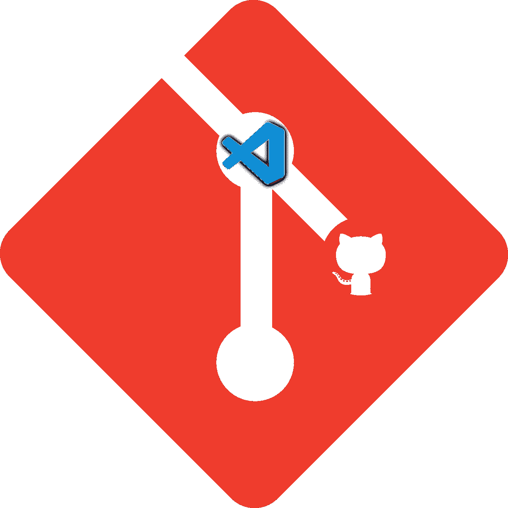
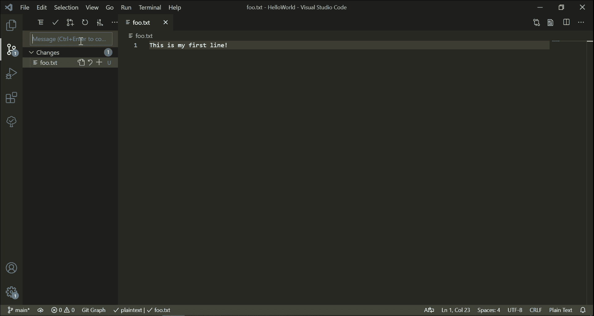
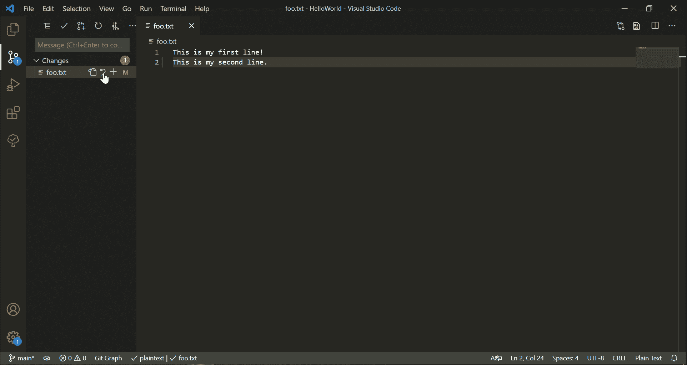
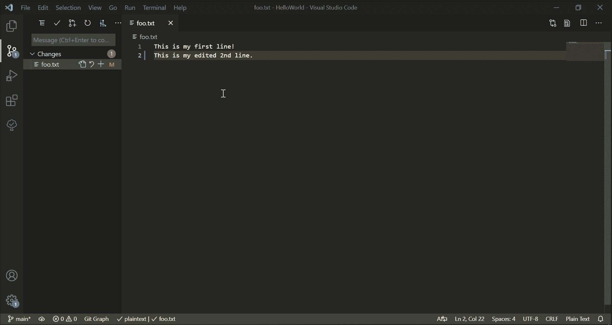
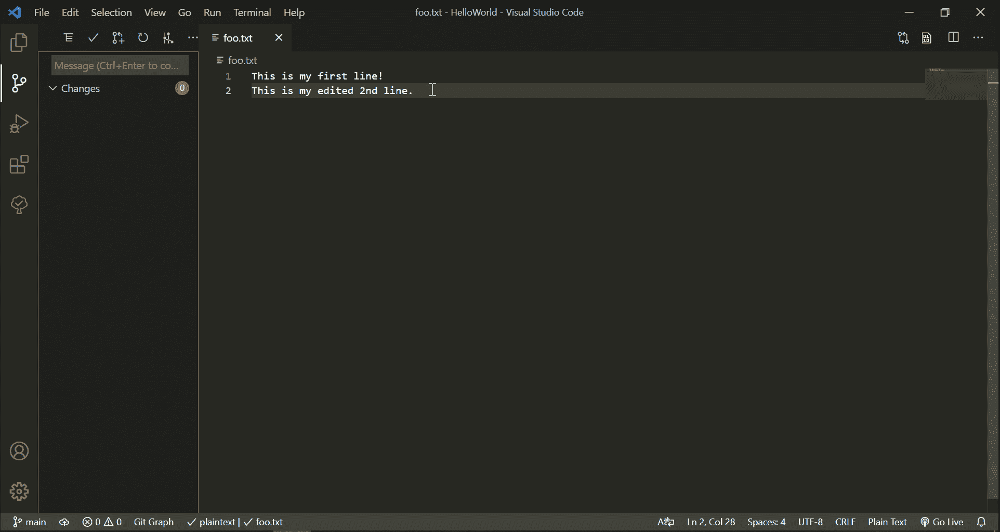
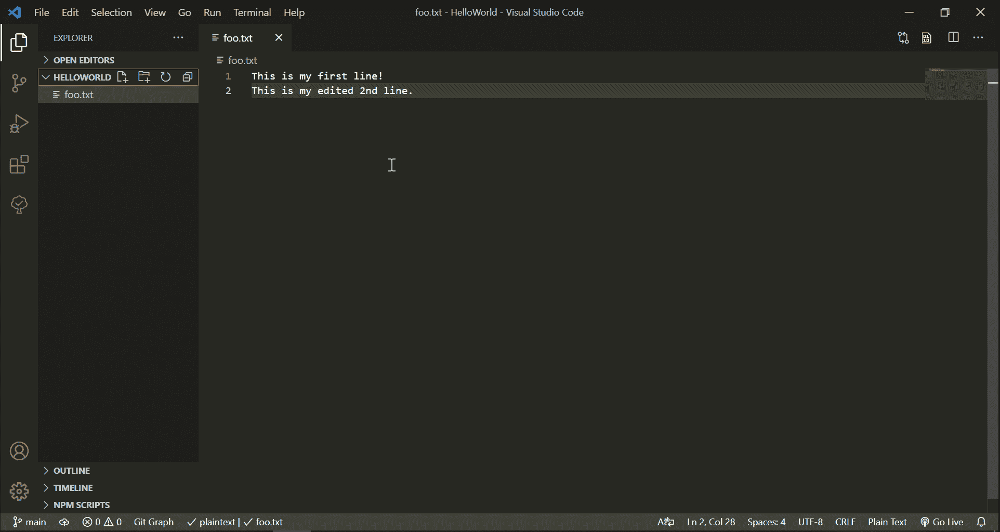
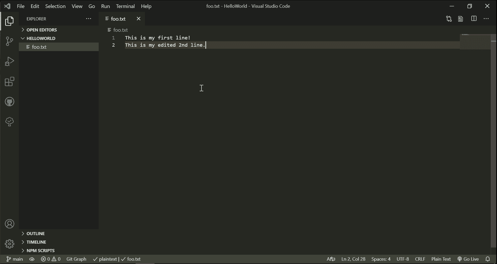
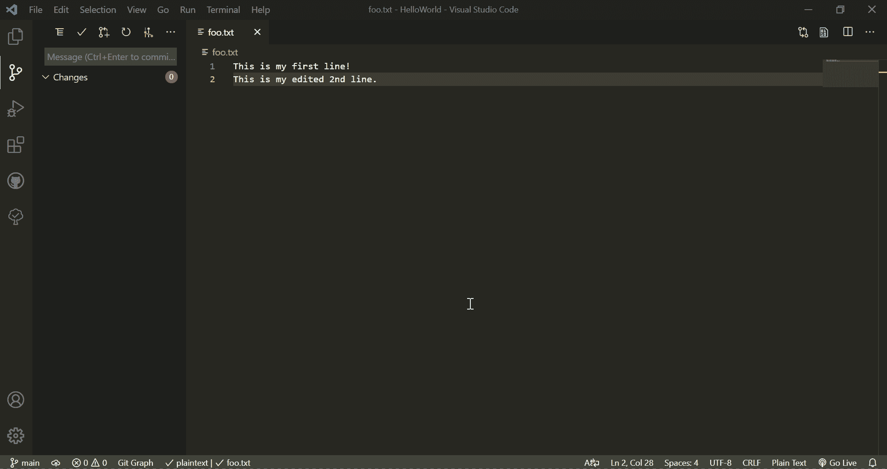
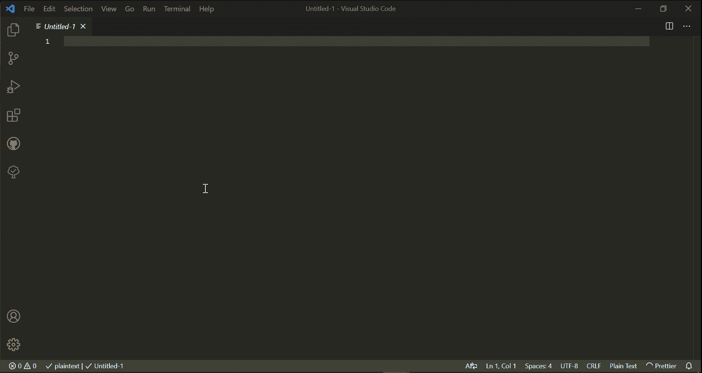

# 在 VS 代码中可以做的 9 件很酷的事情

> 原文：<https://betterprogramming.pub/9-cool-git-things-you-can-do-inside-vs-code-3b81f72ef731>

## 无需离开编辑器即可编写和管理您的代码

改编自 [Git](https://git-scm.com/downloads/logos) 、 [GitHub](https://github.com/logos) 和 [VS 代码](https://commons.wikimedia.org/wiki/File:Visual_Studio_Code_1.35_icon.svg)徽标

“不要在你吃饭的地方吐痰”这句谚语也许有些道理幸运的是，从来没有人说过，“不要在你编码的地方 Git”——这也是一件好事。自 2015 年推出以来，Visual Studio Code 风靡全球(不，不是你 WebStorm)。在其不断增长的扩展和特性中，其集成的源代码控制管理——尤其是 Git 必定是最有用的之一。

尽管我在使用 Git 时主要依赖于[命令行](/git-commands-to-live-by-349ab1fe3139)，但我已经开始越来越多地使用 VS Code 的 Git 特性。有许多 VS 代码[扩展](https://code.visualstudio.com/docs/editor/versioncontrol)提供不同的 Git 功能。在这里，我将重点关注编辑器的内置源代码控制视图，并在较小程度上关注 [GitHub 扩展](https://marketplace.visualstudio.com/items?itemName=GitHub.vscode-pull-request-github)。请务必查看最后的参考资料，以获得全面的特性列表。

源代码控制视图是大多数 Git 相关任务的首选。它不仅提供了工作区变化的实时概览，而且如果在同一个编辑器窗口中打开了多个工作区的文件，它还会显示跨多个工作区的变化。

VS Code 的 GitHub 扩展需要手动安装，并允许克隆、发布、合并和管理 PRs 等任务。

以下是我最常使用它们的一些任务，以及它们的命令行界面等价物。所有这些动作也可以通过命令调板(`Ctrl+Shift+P`)实现。

## 准备并提交

舞台变得简单。暂存文件后，单击减号按钮也可以取消暂存。

CLI-等效:`git add` **→** `git commit`

## 查看更改

提示:您可以使用右上角的三个点来切换并排或内嵌比较

CLI 等效:`git diff -- <file-path>`

## 重用提交消息

通过使用向上和向下箭头，您可以浏览以前的提交消息以节省时间

## 撤消更改

CLI-等效:`git checkout HEAD -- <file-path>`

## 比较相邻提交之间的文件更改(GitHub 扩展)

CLI-等效:`git diff <commit>~ <commit> -- <file-path>`

## 创建和切换分支

提示:VS Code 的 [Git Graph](https://marketplace.visualstudio.com/items?itemName=mhutchie.git-graph) 扩展为你的项目分支提供了一个可视化的参考，一旦安装，它将出现在源代码控制视图中

CLI 等效:`git checkout [-b] <branch>`

## 发布到 GitHub

一旦 repo 被发布到 GitHub(或者如果一个远程存储库已经链接到您的本地项目)，同样的按钮可以用来与 remote 同步变更。

## 克隆(GitHub 扩展)

当打开新的 VS 代码窗口时，该选项将出现在资源管理器视图中

CLI-等效:`git clone <remote-URL>`

## 奖励:表情符号

如果你像我一样，喜欢使用[表情符号](https://gitmoji.dev/)来给你的提交消息添加特色， [Gitmoji](https://marketplace.visualstudio.com/items?itemName=Vtrois.gitmoji-vscode) 是一个很好的扩展，它可以帮助你从 VS 代码中为你的提交选择一个匹配的表情符号，而不是仔细阅读在线[列表](https://gitmoji.dev/)。

另一方面，如果你更希望在表情符号的选择上拥有完全的灵活性，`[:emojisense:](https://marketplace.visualstudio.com/items?itemName=bierner.emojisense)`提供了自动补全功能，通常可以让使用表情符号变得轻而易举。

这只是触及表面。你可以在 VS 代码中做的其他很酷的 Git 事情包括创建问题和拉请求，隐藏，以及[更多](https://vscode.github.com/)。

我很想听听你的想法，以及你使用的任何技巧和窍门。

# 资源

*   [Visual Studio 代码 GitHub 简介|微软文档](https://docs.microsoft.com/en-us/learn/modules/introduction-to-github-visual-studio-code/)
*   [GitHub 和 Visual Studio 代码| GitHub](https://vscode.github.com/)
*   [Visual Studio 代码| VS 代码文档中的版本控制](https://code.visualstudio.com/docs/editor/versioncontrol)
*   [GitHub 请求和问题| Visual Studio 市场](https://marketplace.visualstudio.com/items?itemName=GitHub.vscode-pull-request-github)
*   [Git Graph | Visual Studio market place](https://marketplace.visualstudio.com/items?itemName=mhutchie.git-graph)
*   [git moji | Visual Studio market place](https://marketplace.visualstudio.com/items?itemName=Vtrois.gitmoji-vscode)
*   [:表情符号:| Visual Studio Marketplace](https://marketplace.visualstudio.com/items?itemName=bierner.emojisense)