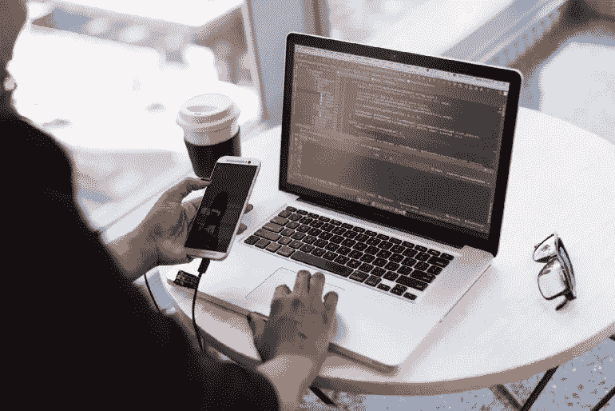
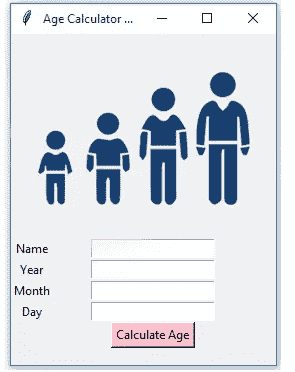
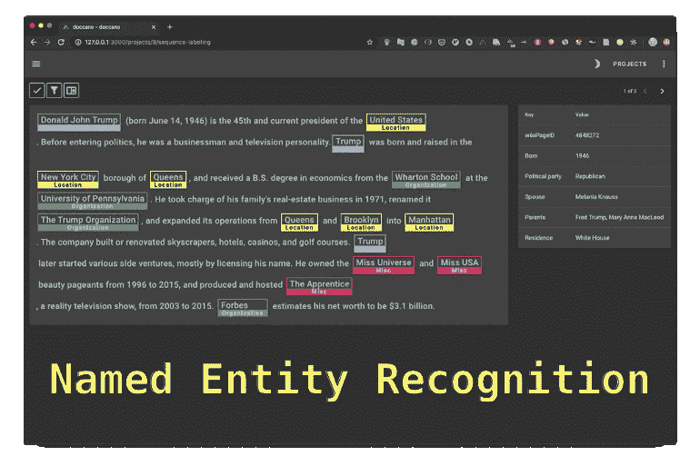

# Python 开发者的 9 个酷 Python Tkinter 项目创意

> 原文：<https://betterprogramming.pub/9-cool-python-tkinter-projects-ideas-for-python-developers-cef3c88e6e13>

## 到目前为止，你完成了多少个 Python Tkinter 项目？

照片由来自[佩克斯](https://www.pexels.com/photo/person-holding-smartphone-while-using-laptop-1181244/?utm_content=attributionCopyText&utm_medium=referral&utm_source=pexels)的[克里斯蒂娜·莫里洛](https://www.pexels.com/@divinetechygirl?utm_content=attributionCopyText&utm_medium=referral&utm_source=pexels)拍摄

[Tkinter](https://docs.python.org/3/library/tkinter.html) 是 Python 的 GUI 库，旨在帮助 Python 开发者创建具有可理解用户界面的系统程序。

Tkinter 很容易被称为 Python 事实上的标准 GUI。除了是一个开源 GUI 库之外，它还因其简单性和交互式图形用户界面而广受欢迎。

由于 Tkinter 是 Python 默认自带的，开发者可以享受大量的资源，比如书籍和代码。Tkinter 提供的另一个重要优势是其庞大的社区，当你陷入一个项目时，你可以向许多活跃用户寻求帮助。

在本文中，我们列举了一些最容易理解的 [Python 项目想法](https://towardsdatascience.com/10-cool-python-project-ideas-for-python-developers-7953047e203)，它们可以在 Tkinter 的帮助下完成。

# Python Tkinter 项目理念

如果你想学习创建 GUI，没有什么工具比 Tkinter 更能帮助你了。

就像 Python 的大多数其他 [**库**](https://towardsdatascience.com/best-python-libraries-for-every-python-developer-77daab4fa40e) **，** Tkinter 也是简单易学的。如果你精通所有的 Python 基础和面向对象编程的基础，Tkinter 对你来说很容易使用。

在这里，我们收集了一些最简单、最容易理解的 Python 项目想法，开发人员可以在 Tkinter 的帮助下完成这些想法。

# 1.年龄计算器应用程序

由作者创建

在 Tkinter 的帮助下，你可以构建的最简单的应用之一是年龄计算器应用。一旦你开发了应用程序，你需要做的就是输入你的出生日期，计算器会给你准确的年龄。

> *虽然它不是一个高级应用，但对于初级阶段的 Python 开发者来说，它仍然是一个极好的开端。*

Python 为这样的应用程序提供了一个特殊的库，称为[**【日期时间】**](https://docs.python.org/3/library/datetime.html) ，它旨在帮助进行时间和日期的操作。DateTime 模块以复杂和简单的方式转发处理日期和时间的类。

因此，在后端这个库的帮助下，通过输入一个人的出生日期，就可以很容易地找到这个人的年龄。

## **有用的资源**

 [## 使用 Python Tkinter | Pythonista Planet 的年龄计算器应用程序

### 如果你想使用 Tkinter 创建一个好看的应用程序，你来对地方了。在本文中，让我们…

pythonistaplanet.com](https://pythonistaplanet.com/age-calculator-app-using-python-tkinter/#:~:text=The%20first%20one%20is%20the,us%20to%20work%20with%20images.&text=Now,%20let%27s%20create%20a%20simple,it%20%E2%80%9CAge%20Calculator%20App%E2%80%9D)  [## Python:使用 Tkinter - GeeksforGeeks 的年龄计算器

### 先决条件:tkinter Python 简介为开发 GUI(图形用户界面)提供了多种选择…

www.geeksforgeeks.org](https://www.geeksforgeeks.org/python-age-calculator-using-tkinter/) 

# 2.文本注释工具

来源— [Doccano](https://github.com/doccano/doccano)

Tkinter 将为一个简单的文本注释工具提供用户界面，其功能可以在 Python 的帮助下进行编码。

在 Tkinter 中，您可以设计一个文本注释工具，它能够将非结构化文档转换成各种结构化格式，用于 ML 和 NLP 任务，例如命名实体识别等。

文本注释工具可以提供注释功能，例如文本分类、序列到序列任务和序列标记。

有了它，你可以创建标签数据，用于情感分析、文本摘要、命名实体识别等。

## **有用的资源**

 [## GitHub - jiesutd/YEDDA: YEDDA:一个轻量级的协作文本跨度标注工具。ACL 的代码…

### YEDDA(以前的 SUTDAnnotator)是为在文本(几乎所有语言…

github.com](https://github.com/jiesutd/YEDDA) 

# 3.井字游戏

乔恩·泰森在 [Unsplash](https://unsplash.com/?utm_source=unsplash&utm_medium=referral&utm_content=creditCopyText) 上的照片

我们都曾用笔和纸玩过井字游戏，但在 Python 和 Tkinter 的帮助下，我们现在可以在电脑上构建这个游戏。

井字游戏是双人游戏，每个人轮流标记 3x3 的格子。比赛的获胜者是第一个完成对角线的人。

在 Tkinter 的帮助下，我们需要执行以下功能来开发这个游戏:

*   **游戏界面—** 一个可以玩的合适的游戏窗口。
*   **检查赢家—** 每走一步，我们都要检查线路，看赢家。
*   **更改值—** 每次移动后，我们都需要更新用户界面才能看到。
*   **显示获胜者—** 我们需要一个显示获胜者的窗口。
*   **退出—** 我们需要一个退出游戏的函数。

这可以在 Tkinter 中快速完成，因为它有所有的库来执行井字游戏所需的功能。

## **有用的资源**

# 4.人体生命体征的实时分析

在 Python 中，这是一个非常高级的项目，但是 Tkinter 可以让它变得简单一些。该项目将要求你对 Python 及其 OpenCV 库有很好的理解。

此外，除了 OpenCV 之外，还需要以下库:

*   [NumPy:用于科学计算。图像存储在 NumPy 数组中。](https://numpy.org/)
*   [**Imutils**](https://github.com/jrosebr1/imutils)**:**处理图片。
*   [**arg parse**](https://docs.python.org/3/library/argparse.html)**:**在命令行中给出输入。

此类程序一般通过网络摄像头或传感器运行，或者您可以给出您的手动输入，Tkinter 将为其提供 UI。

然而，它是一个中级深度学习项目，一旦你学会了如何开发这样的程序，你就可以在数据科学和深度学习方面进一步超越。

# 5.测验应用程序

安妮·斯普拉特在 [Unsplash](https://unsplash.com/?utm_source=unsplash&utm_medium=referral&utm_content=creditCopyText) 上的照片

如果我们必须开发一个测验应用程序，该应用程序将需要用户在进入测验之前登录或注册。

最重要的是，在用户界面中，解决问题也需要一个持续时间时钟，一旦时钟达到极限，用户就会失去机会。

测验项目将只包含用户部分。一旦用户登录到系统，测试将开始，然后在考试结束后，用户可以自己评估答案。

在 Python 和 Tkinter 的帮助下，这样的项目只需几分钟就能设计出来。

## **有用的资源**

 [## 使用 Tkinter - GeeksforGeeks 的 Python - MCQ 问答游戏

### 先决条件:Python GUI - tkinter Python 提供了一个标准的 GUI 框架 tkinter，用于开发快速和…

www.geeksforgeeks.org](https://www.geeksforgeeks.org/python-mcq-quiz-game-using-tkinter/)  [## Python Tkinter 测验-完整教程- Python 指南

### 在本教程中，我们将学习如何使用 Python Tkinter 创建一个测验应用程序。测验应用程序用于…

pythonguides.com](https://pythonguides.com/python-tkinter-quiz/) 

# 6.在 Python 中使用 Tkinter 的科学 GUI 计算器

如今，我们可以在所有的智能手机和电脑上看到科学计算器。虽然现在开发一个简单的计算器并不需要太多的努力，但是开发一个科学计算器并不那么简单，尤其是当你不使用 Tkinter 的时候。

为了创建一个科学的 GUI 计算器，我们需要开发一个计算器界面，然后我们必须在 GUI 中添加功能。对于过去的开发人员来说，这将是一项繁重的工作，但现在在 Tkinter 和 Python 的帮助下，这只是几分钟的事情。

 [## 在 Python - GeeksforGeeks 中使用 Tkinter 的科学 GUI 计算器

### 先决条件:Python GUI - tkinter 在本文中，我们将使用 Python 创建 GUI 科学计算器。作为…

www.geeksforgeeks.org](https://www.geeksforgeeks.org/scientific-gui-calculator-using-tkinter-in-python/) 

# 7.注册和登录系统

由作者创建

注册和登录系统是每个开发者的基础。

Python 和 Tkinter 使得设计这样的系统变得容易得多，现在您还可以使用它们来创建清晰而有吸引力的图形用户界面，供登录系统显示自己。

在 Tkinter 上，您将编写代码，允许用户通过注册他们的帐户来注册您的应用程序。之后，这些用户可以通过提供注册时创建的 ID 和密码直接登录该软件。

## **有用的资源**

# 8.使用 Tkinter 的石头剪刀布游戏

Python 中石头剪子布项目的主要目标是开发一个可以随时随地在电脑上玩的游戏。

Python 的发展和对 Tkinter 更深入的介绍，现在已经让开发者在开发这类游戏时的日子变得轻松了。投影这个游戏的规则是:

*   既然石头钝化了剪刀，所以石头赢了。
*   既然纸盖石头，所以纸赢。
*   既然剪刀剪了纸，所以剪刀赢了。

正如我们已经讨论过的，Tkinter 是一个标准的 GUI 库；因此，它将使构建 GUI 应用程序变得更加容易。然而，我们将需要一个随机模块，我们的应用程序将使用它来生成随机数，从而为游戏提供基本的功能。

## **有用资源**

 [## 使用 Tkinter 的石头剪子布游戏

### Tkinter 是一个基于 Python 的库，用于创建和开发桌面用户界面和应用程序。使用…

www.tutorialspoint.com](https://www.tutorialspoint.com/rock-paper-and-scissor-game-using-tkinter)  [## 石头剪子布游戏使用 Python Tkinter | Pythonista Planet

### 让我们用 Python 的 Tkinter 库创建一个石头剪刀布游戏(石头剪刀布游戏)。我猜你…

pythonistaplanet.com](https://pythonistaplanet.com/rock-paper-scissors-game-using-python-tkinter/) 

# 9.WhatsApp Bot 应用项目

聊天机器人是企业和个人在口头或书面脚本的帮助下进行对话的软件应用程序。WhatsApp bot 应用程序就像一个聊天机器人应用程序，可以用来在 WhatsApp 上进行对话。

在 Tkinter 的帮助下和 Python 的进步，WhatsApp 聊天机器人现在可以快速创建，并输入特定的脚本，它们可以用来进行对话。

Tkinter 将为机器人提供 UI，并且可以编写机器人将用于其功能的脚本。对于用户来说，这是一个有趣的应用程序，但它需要的不仅仅是初学者的 Python 知识。

## **有用的资源**

# 更多 Python 项目想法

*   [药房管理系统](https://github.com/karunasakhalkar/Pharmacy-Management-system-using-Tkinter-and-csv)
*   [使用 Tkinter 的待办事宜应用](https://github.com/d3vilman88/TodoList-Project-GUI)
*   [使用 Tkinter 的密码管理器应用](https://github.com/SamroodAli/python-pro-day-29-30-password-manager)
*   [餐厅管理系统](https://github.com/amark23/Restaurant-Management-System-Python-)
*   [贪吃蛇游戏项目](https://github.com/Yashkulkarni205/Snake)
*   [摄氏到华氏转换器](https://github.com/Chahat08/tkinter_temp_converter)
*   [联系人应用](https://github.com/PraveenAravendan/ContactList-Application)
*   [交通信号违章检测系统](https://github.com/anmspro/Traffic-Signal-Violation-Detection-System)

# 结论

Python 的发展通常归功于其丰富而有效的库，当我们看到 Tkinter 是多么有用时，不可否认这一点。虽然，有时候，Tkinter 上制作的图形用户界面可能并不花哨，但它们总会在某些方面胜过 CLI。文章中列出的项目既有基础的，也有高级的，但是一旦你很好地掌握了 Tkinter，天空就是你的极限。

 [## 给 Python 开发者的 10 个很酷的 Python 项目想法

### 您可以使用 Python 构建的有趣想法和项目列表

towardsdatascience.com](https://towardsdatascience.com/10-cool-python-project-ideas-for-python-developers-7953047e203)