# console.log 的 9 种不同使用情形

> 原文：<https://betterprogramming.pub/9-different-use-cases-of-console-log-4d8eb6935ef7>

## 使用控制台 API 增强调试

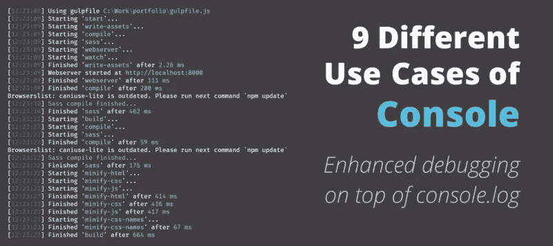

我们每个人使用`console.log`进行调试的次数都比我们愿意承认的要多。我一天多次使用它来验证我的更改，但大多数情况下只使用`console.log`。然而，控制台 API 提供的功能远不止这些——比我们大多数人所知道的更多。

我们不仅可以用它来记录日志，还可以用它来调试性能问题或者用断言来验证更改。本文收集了控制台 API 的九个不同用例，可以帮助您在`console.log`的基础上进行调试。

让我们从我们都知道的简单事情开始:日志级别。

# 1.日志级别

我们都知道并使用`console.log`，但还有其他一些级别。让我们按照严重程度的顺序，从调试开始。`debug`方法在调试日志级别向控制台输出一条消息。

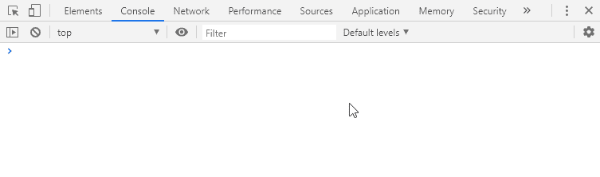

查看上面的 GIF，您已经可以看到不同的可用日志级别。默认情况下，Verbose 处于关闭状态，因此在选中它之前，您不会看到调试日志。其他三个也是如此。

下一层是 info，负责处理`console.info`。如果取消选中信息，则`console.info`和`console.log`都将被隐藏。两者是等价的。但是，警告和错误的样式会有所不同。

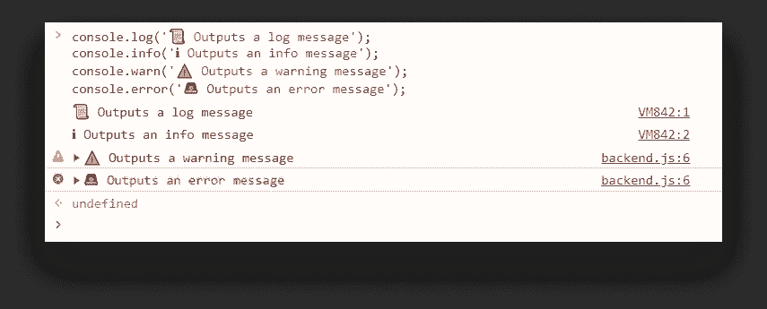

如你所见，`console.log`和`console.info`在视觉上没有区别。两者都可以用于注销一般信息。

当你的应用程序出现问题时，你应该使用`warn`,但是它仍然可以自动恢复，并且不会影响操作。而`error`应该被使用，以防它影响用户流并可能导致你的应用程序崩溃和停止。

# 2.目录和目录 Xml

如果您需要进一步的调试能力，`dir`和`dirxml`可能就是您要找的。

两者都用于显示对象的交互式列表。让我们看一些例子。假设您想要注销一个 DOM 元素的属性。显然，如果您使用`console.log`，您将获得 HTML 表示。使用`console.dirxml`时也是如此。顾名思义，它显示您指定的对象的 XML 或 HTML 表示。

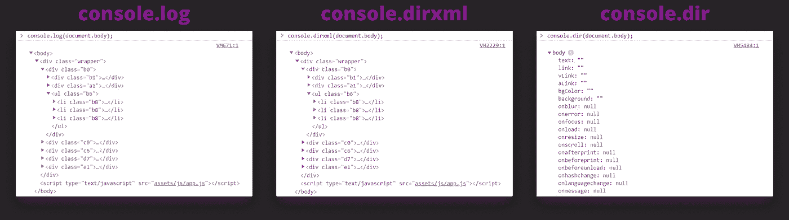

但不是用`console.dir`。从上面的例子可以看出，在这种情况下，`log`和`dirxml`是相同的。但是`console.dir`在 JavaScript 对象表示中注销主体。

还有其他一些案例吗？有一些特定的物体`log`是纤维质的。最好的例子是`regex`:

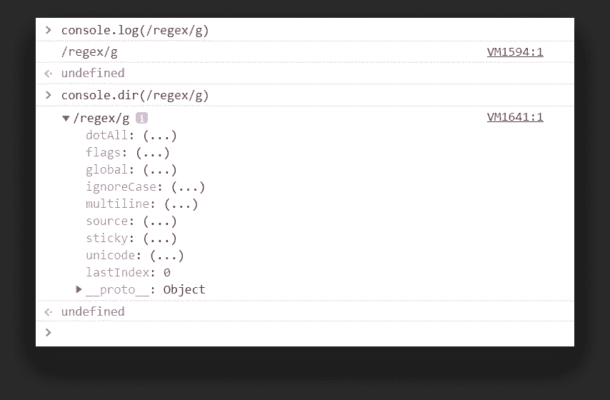

虽然`log`只输出表达式的字符串表示，但是使用`dir`我们可以获得对象的所有可用属性。

# 3.格式化

如果前面的例子仍然不能满足您的需要，您还可以使用更多的格式选项。其中一个就是`console.table`。它将传递的数据*显示在一个表格中，该数据可以是一个数组，也可以是一个对象*。

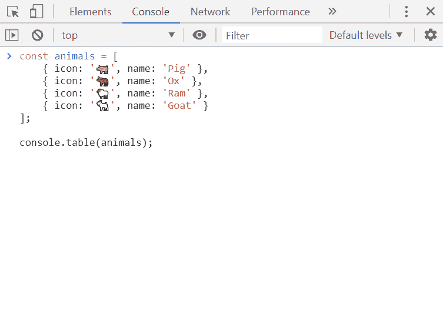

表格也可以排序

如果你想让你的消息真正脱颖而出，因为你在控制台消息的海洋中找不到你想要的，那么你可以指定 CSS 样式作为`console.log`的第二个参数。

第一个参数，也就是您想要注销的消息，必须包含`%c`。这个特殊占位符之后的所有内容都将获得样式。

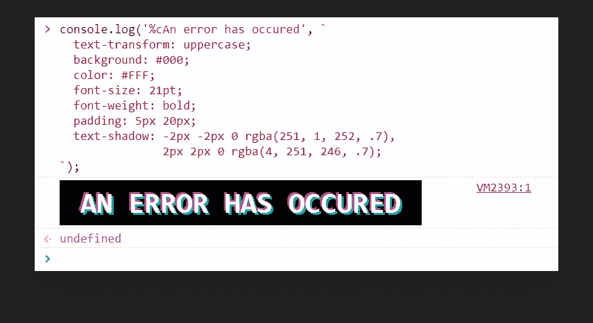

# 4.分组

说到迷失在日志中，您还可以对消息进行分组，以节省一些空间并使您的控制台更具可读性。看看下面的例子及其结果:

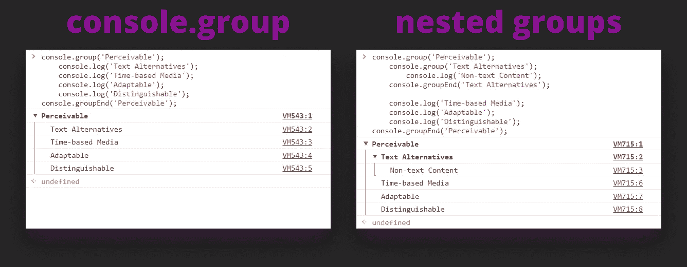

万一它让你很难阅读，你的控制台变得混乱，我们也可以使用`groupCollapsed`方法输出默认折叠的组:

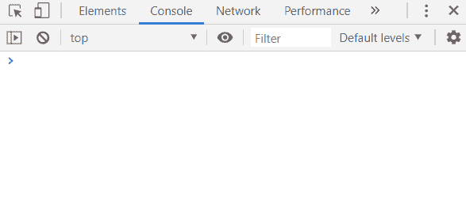

# 5.断言

既然我们已经记录了所有的东西，并且我们设法理解了我们的实现是如何工作的，那么是时候测试它们了，以确保它们按照预期的方式工作。

这就是`console.assert`的作用。它期待一个断言，如果它被评估为`false`，它将堆栈跟踪输出到控制台。

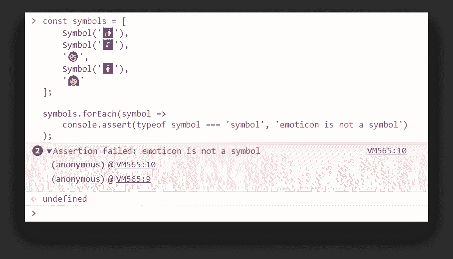

从上面的例子可以看出，数组中有两个不是符号的元素。这被断言抓住了。任何通过的东西都不会打印到控制台— *除了失败的断言*。

# 6.排除故障

我们使用断言，看看一切是如何失败的。我们需要一种调试东西的方法。出于调试目的，我们可以使用`console.trace`。它用于显示堆栈跟踪:

另外，如果您怀疑有内存问题，比如内存泄漏，您可以使用`console.memory`打印出内存使用情况。

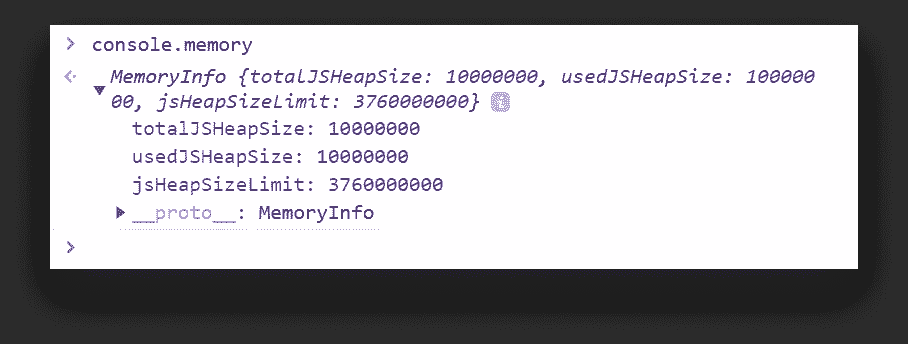

# 7.监控性能

我们已经成功调试了这个问题，现在一切似乎都很好——除了响应时间很长之外。

所以你想衡量表现。您认为这是因为您之前实现了一个 for 循环，用鸡填充页面。为了测量性能，我们可以使用`console.time`。

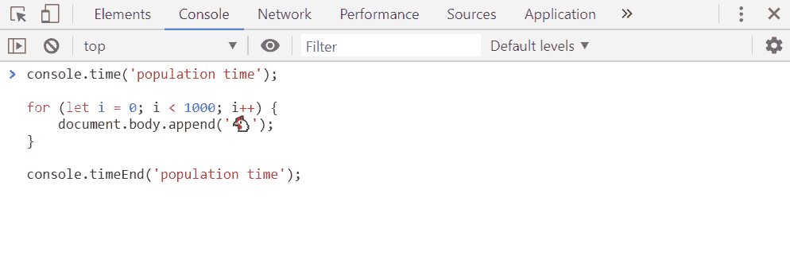

通过用一个名字调用`console.time`，然后用相同的名字和中间的操作调用`console.timeEnd`，我们可以测量循环运行所需的时间。

如果您想每隔一段时间就注销一次，您也可以使用`timeLog`。

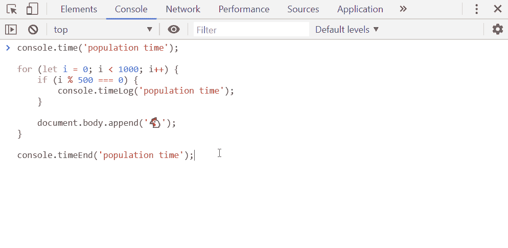

调用`timeLog`将注销当前时间值。

# 8.倒数计秒

现在我们已经到了这个列表的末尾，所以在结束之前，让我们倒数一下— *或者更确切地说是向上一点*。

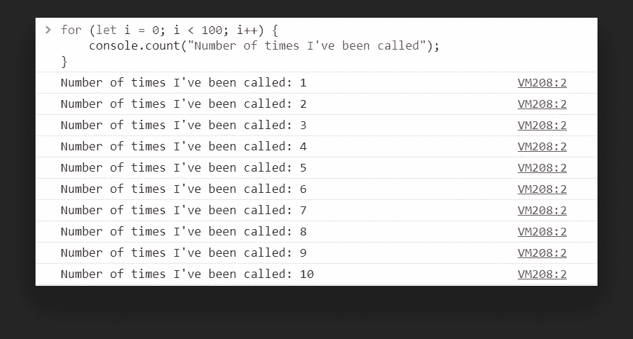

`count`需要标签作为参数。

这个标签会和它被调用的次数一起被打印出来。如果您想知道一个函数被调用了多少次或者一个组件被渲染了多少次，这是非常有用的。如果您想重新设置计数器并重新开始，可以使用`countReset`。

# 9.从新的一页开始

最后，为了放下我们到目前为止所做的一切，从头开始，让我们用`console.clear`来摆脱我们已经造成的混乱。

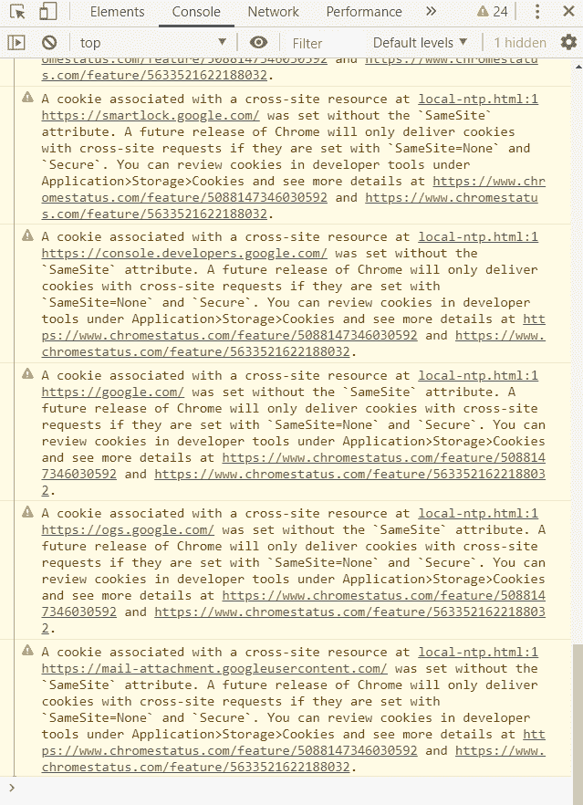

使用 console.log 清除控制台

希望你学到了新的东西。如果您已经走了这么远，谢谢您抽出时间。现在是时候休息一下，玩一个真正的游戏机了。🕹️

