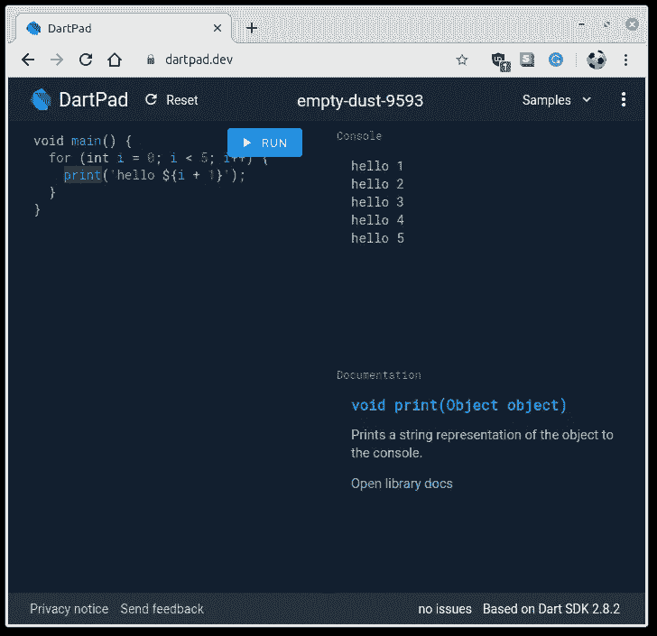

# 我喜欢 Dart 编程语言的 9 个特性

> 原文：<https://betterprogramming.pub/9-features-i-love-about-the-dart-programming-language-b16d28906e3f>

## 对于那些已经熟悉类似语言的人来说，比如 Java、Kotlin、C++和 C#


照片由 [Silvan Arnet](https://unsplash.com/@silvanarnet?utm_source=medium&utm_medium=referral) 在 [Unsplash](https://unsplash.com?utm_source=medium&utm_medium=referral) 上拍摄

Dart 主要是作为 Flutter 的编程语言而为人所知，Flutter 是 Google 的 UI 工具包，用于从单个代码库构建本地编译的移动、web 和桌面应用程序。它由谷歌开发，为构建用户界面而优化。它用于构建移动、桌面、服务器和 web 应用程序。Dart 可以编译成本机代码和 JavaScript。

如果你想跟随这篇文章，我强烈推荐你，你可以不在 [DartPad.dev](https://dartpad.dev/) 上安装任何东西。



Dartpad.dev 允许你在浏览器中体验 Dart 作者截图

# 1.缩进(和一个 Hello World)

让我们从强制性的“Hello world”开始:

```
void main() {
  print('Hello World!');
}
```

我们已经可以得出一些结论:

*   Dart 需要一个`main()`函数作为起点
*   Dart 不需要类(像 C，不像 Java)
*   Dart 按照惯例使用双字符缩进

双字符缩进使得代码更加紧凑。当你开始创建一个 Flutter 应用程序时，这真的很有帮助，因为 Flutter 应用程序是基于嵌套部件的树的。压痕的数量会很快失控。

# 2.Dart 代码很简洁

Dart 代码具有许多现代功能，可减少代码大小。从上面的例子可以看出:

*   您可以简单地引用无主体构造函数中的实例变量来自动为它们赋值。
*   字符串有类似模板的特性，允许你直接使用变量甚至类似`${age - 10}`的表达式。
*   当创建对象时，你不需要使用`new`关键字，但如果你想，你可以。
*   Dart 既支持像`main()`这样的顶级函数，也支持类方法。

# 3.类型推理

Dart 是强类型的。但是你注意到 Dart 使用类型推理了吗？我们不需要指定变量`me`和`girlfriend`的类型(`Person`)。相反，Dart 在编译时为我们推断了类型。这与其他现代语言如 Kotlin 是一致的。

# 4.最终和常量

如果你确定一个变量不会改变，你可以声明它`final`。如果你不确定——也许下周你会找到另一个女朋友——你可以用`var`。

还有一个`const` 修饰符，它有点难掌握，对值有很大的影响。

首先，最终变量可以在编译后赋值，比如存储 HTTP 请求的响应，而 const 必须在编译前已知并定义。

如果一个集合或对象是一个常量，它的完整状态在编译时是不可变的。因此，它必须从编译时可用的数据中创建。相比之下，如果一个变量是 final，则不能给它重新分配一个新对象，但仍可以更改它所指向的集合或对象。

# 5.目标

任何可以赋给变量的东西都是对象。偶数、函数、`null`都是对象。所有对象都基于一个类，并且所有对象都继承自一个名为 [Object](https://api.dart.dev/stable/2.9.1/dart-core/Object-class.html) 的基本对象。

我喜欢这样做的语言，因为它允许数字有像`isNegative`和`isOdd`这样方便的方法，产生令人愉快的代码，读起来几乎像一本好小说:

```
if (age.isNegative) {
  print("The age can not be negative, you fool!")
}
```

说到数字，Dart 只提供了两种类型的数字:整数和双精度数(64 位和有符号的)。

# 6.私人和公共

默认情况下，所有标识符都是公共的。Dart 没有 public、private 或 protected 关键字。

Dart 中的库是单个文件中的所有内容。所以库隐私意味着标识符只在定义标识符的文件中可见。要将 Dart 标识符标记为专用于其库，需要以下划线开始其名称。

# 7.表达和陈述

Dart 既有产生值的表达式，也有像`if… else`这样不产生值的语句。这与大多数其他语言没有什么不同。也是 Dart 易学的原因。Dart 中的一些常见疑点:

*   while 循环和 for 循环
*   if…else 语句
*   switch 语句
*   构造`condition ? [expression if true] : [expression if false]`
*   例外

# 8.列表、集合和地图

Dart 本身支持几种强大的数据类型:列表、集合和映射。让我们从列表开始，看一些例子来了解这些数据类型:

```
var myList = [1, 2, 3];
assert(myList.length == 3);
assert(myList[1] == 2);
var constantList = const [1, 2, 3];
constantList[1] = 1; // This causes an error!
```

集合是唯一项目的无序集合:

```
var mySet = {'john', 'eric', 'martha'};
var elements = <String>{};
elements.add('fluorine');
```

有些事情会让你痛苦:如果你忘记了集合定义上的类型注释，就像上面的`elements`一样，将会创建一个映射。这仅仅是因为地图也使用花括号，并且地图首先出现在 Dart 语言中。

映射关联任意类型的键和值。以下映射被推断为类型`Map<String, String>`:

```
var gifts = {
  'first': 'partridge',
  'second': 'turtledoves',
  'fifth': 'golden rings'
};gifts['fourth'] = 'calling birds';
```

# 9.Dart 包管理器

网站[https://pub.dev/](https://pub.dev/)包含公开可用的软件包，你可以用 Dart 的软件包管理器 pub 轻松安装。在撰写本文时，该网站包含超过两万个包，既有 Dart 包，也有 Flutter 包。

你也可以使用 pub 来安装本地下载的包或者 GitHub 上托管的包。

# 结束语

Dart 是一种现代、易学的语言。如果你熟悉 Java、C#或 Kotlin 等语言，你会有宾至如归的感觉。当你想更深入地探索时，我推荐以下一个或多个网站:

*   [飞镖语言之旅](https://dart.dev/guides/language/language-tour)
*   [飞镖语言样本](https://dart.dev/samples)
*   [有效 Dart 编程指南](https://dart.dev/guides/language/effective-dart)