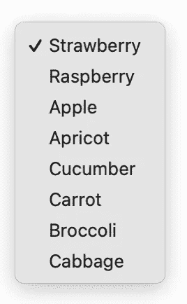
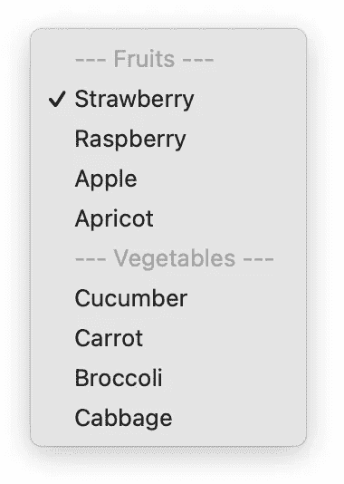
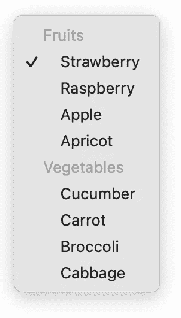
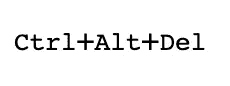
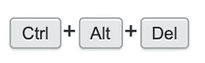
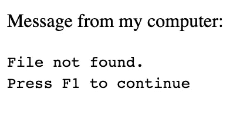
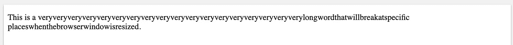
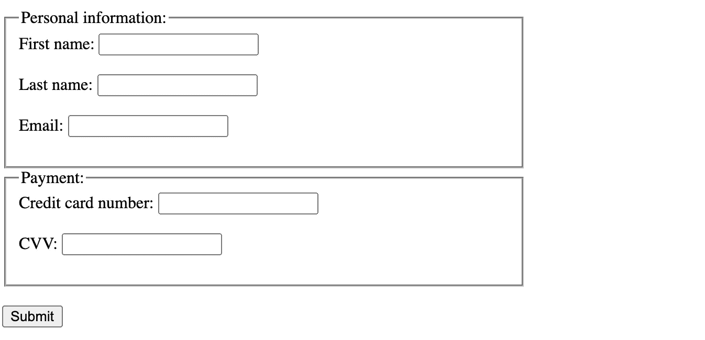
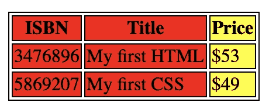
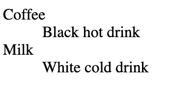

# 9 个你可能从未听说过的 HTML 特性

> 原文：<https://betterprogramming.pub/9-html-features-youve-probably-never-heard-about-90d14dc18463>

## 在几分钟内提升你的 HTML 知识

照片由[九个 koepfer](https://unsplash.com/@enka80?utm_source=unsplash&utm_medium=referral&utm_content=creditCopyText) 在 [Unsplash](/s/photos/discover?utm_source=unsplash&utm_medium=referral&utm_content=creditCopyText) 上拍摄。

作为 web 开发人员，我们使用许多不同的技术、框架和编程语言。开始使用 HTML、CSS 和 JS 可能很容易，但是掌握每一种都很难。

HTML 经常被忽视，尽管了解它的特性有很多好处。使用 HTML 特性而不是自己构建可以节省你很多时间。此外，您的标记将更加清晰，更易于用户访问。

所以让我们来看看 HTML 的九个特性，这些特性你可能从未听说过！

# 1.<optgroup>元素</optgroup>

假设您希望您的用户以某种形式从大量选项中选择一个值。为此，使用`<select>`元素创建一个下拉列表。对于每个可能的选项，您添加一个`<option>`元素。

这对于短列表来说完全没问题，但是当您有一个巨大的可用选项列表时，就会变得非常混乱。一个简单的改进方法是将相似的选项组合在一起，这样用户可以直接跳转到更相关的选项，而不是搜索所有的选项。

您对如何实现的第一个想法可能是这样的:

对于用户来说，这已经是一个很大的改进，但是我们的标记现在被用于分隔组的选项弄得乱七八糟。幸运的是，有一个更好的方法来做到这一点——即使用`<optgroup>`元素！

如您所见，我们实现了我们想要的，浏览器甚至添加了一些额外的样式，使用户更容易在列表中导航。

 [## HTML optgroup 标记

### 使用标签对相关选项进行分组:亲自尝试“标签用于对元素中的相关选项进行分组(下拉菜单…

www.w3schools.com](https://www.w3schools.com/tags/tag_optgroup.asp) 

# 2.元素

这个 HTML 元素可以稍微清理您的代码，并使以后重构资产 URL 变得更加容易。`<base>`元素需要放在页面的`<head>`元素中。该页面上的每个相对 URL，无论是用于图片还是链接，都将使用这个基本 URL。

稍后更改该 URL 将是一行代码的更改。此外，这减少了重复的代码，使您的网址更短，更容易阅读。

 [## HTML 基本标签

### 为页面上的所有链接指定默认 URL 和默认目标:亲自尝试“标签指定了基本 URL…

www.w3schools.com](https://www.w3schools.com/tags/tag_base.asp) 

# 3.`元素`

这个方便的元素可用于将一些文本标记为键盘输入——当您编写文档或技术博客帖子时，这是对标记的一个快速而简单的改进。

我建议将这个标签与一些额外的 CSS 样式结合起来，就像本例中的 Stack Overflow 一样:

`元素的默认浏览器样式`

堆栈溢出如何样式化`元素的例子`

 [## HTML kbd 标签

### 将一些文本定义为文档中的键盘输入:亲自尝试“更多“亲自尝试”示例如下。标签是…

www.w3schools.com](https://www.w3schools.com/tags/tag_kbd.asp) 

# 4.<samp>元素</samp>

这里有另一个元素可以给你的页面增加更多的语义。它用于将一些文本标记为计算机输出。示例文本的默认样式是用等宽字体显示。

类似于`<kbd>`元素，只需一点 CSS 就可以定制和改进样式。

 [## HTML samp 标签

### 将一些文本定义为文档中计算机程序的示例输出:来自我的电脑的消息:找不到文件…

www.w3schools.com](https://www.w3schools.com/tags/tag_samp.asp) 

# 5.~~和~~

这是我在这里提到的最后两个元素，以使您的标记更加清晰。它们应该用来标记文本的一部分被删除或添加。

浏览器通常会删除标记为已删除的文本，并对添加的文本加下划线，但是您可以像处理其他元素一样，使用一些自定义样式来增强这一点。

 [## HTML del 标签

### 一个删除了一部分的文本，和一个新插入的部分:我最喜欢的颜色是蓝红！自己尝试“更多”尝试一下…

www.w3schools.com](https://www.w3schools.com/tags/tag_del.asp) 

# 6.<wbr>元素

`wbr`代表*断字机会*并控制浏览器的断字行为。如果你处理的是很长的单词，并且需要以不同于浏览器默认的方式进行拆分，那么它是完美的。

 [## HTML 标签

### 有断词机会的文本:自己尝试一下”(断词机会)标签指定它在文本中的什么位置…

www.w3schools.com](https://www.w3schools.com/tags/tag_wbr.asp) 

# 7.

<fieldset>元素</fieldset>

向表单添加更多结构的一个好方法是字段集！尤其是在处理大型表单时，可以使用字段集使用户更容易了解表单的概况。

 [## HTML 字段集标记

### 将相关元素组合在一个表格中:下面的“亲自尝试”更多“亲自尝试”示例。标签用于分组…

www.w3schools.com](https://www.w3schools.com/TAGS/tag_fieldset.asp) 

# 8.元素

`<colgroup>`元素使得对表格中的一组列应用样式变得非常容易。

确保在`<table>`中定义`<colgroup>`，以及在任何`<caption>`之后和任何`<thead>`、`<tbody>`、`<tfoot>`和`<tr>`元素之前定义`<colgroup>`。

`span`属性控制要应用该组样式的列数。如果不定义任何`span`，它将默认为单列。

 [## HTML 列组标签

### 使用和标签设置三个列的背景色:亲自尝试”更多“亲自尝试”示例…

www.w3schools.com](https://www.w3schools.com/tags/tag_colgroup.asp) 

# 9.、

和

元素

这些元素可用于构建特定术语的描述列表。当你在为你的博客或书建立一个词汇表或一个参考列表时，这是非常有用的。

描述列表可能如下所示:

 [## HTML dl 标签

### 带有术语和描述的描述列表:亲自尝试”标签定义了描述列表。标签用于…

www.w3schools.com](https://www.w3schools.com/TAGS/tag_dl.asp) 

# 结论

我希望你从这篇文章中学到了一些新的东西，有一天会应用到你的项目中。感谢阅读！