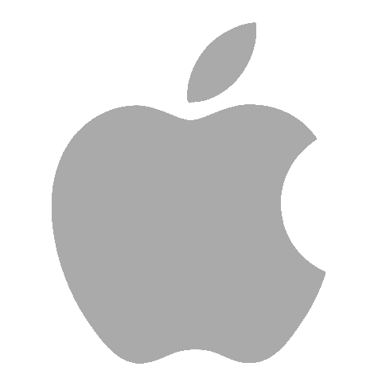
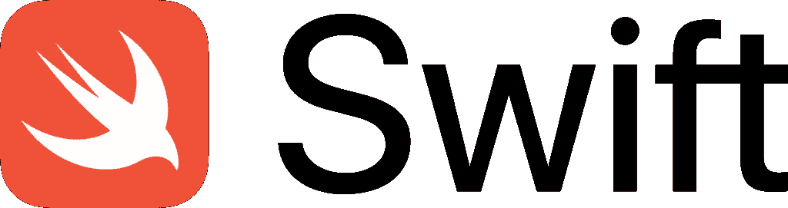
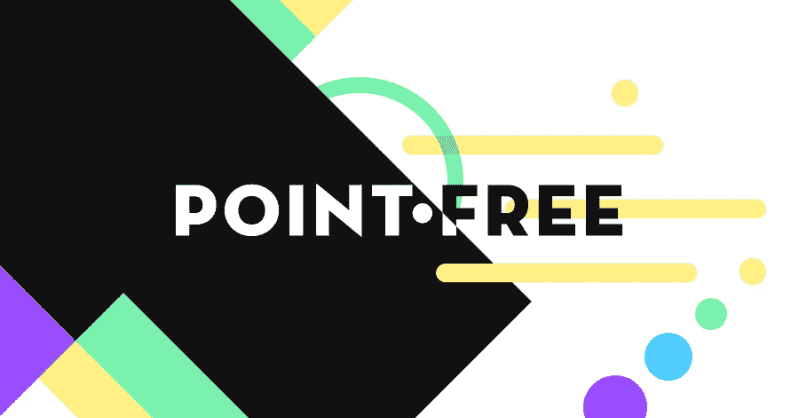
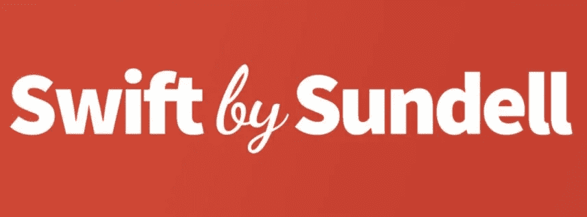
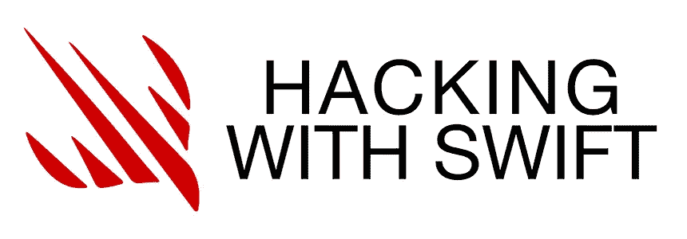
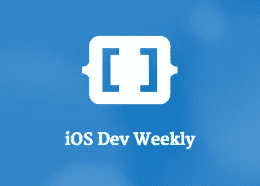
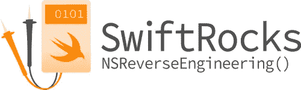

# 提高技能的 9 种 iOS 资源

> 原文：<https://betterprogramming.pub/9-ios-resources-to-improve-your-skill-79fc799253fd>

## 如何在我们最喜爱的平台上保持更新

照片由[小森正明](https://unsplash.com/@gaspanik?utm_source=medium&utm_medium=referral)在 [Unsplash](https://unsplash.com?utm_source=medium&utm_medium=referral) 上拍摄

在任何软件工程职业生涯中，学习都是不变的。新技术每天都在涌现，我们选择的平台也在定期更新。如果我们想留在游戏中，我们需要投入时间阅读，学习，并不断提高我们的知识。

今天，我想通过主要渠道来了解 iOS 世界的最新动态，尽可能让我的游戏保持最高水平。

我敢肯定，你已经知道他们中的大多数，但也许你可以找到一些隐藏的宝石！

# 网站

## 苹果

至少有一些资源是我经常从苹果官方网站上查阅的。

第一个是[开发者文档](https://developer.apple.com/documentation)。它不仅包含我们平台的文档，还包含非常丰富的教程和新闻，我们应该一直关注。例如，他们最近发布了一组新的 [SwiftUI 教程](https://developer.apple.com/tutorials/app-dev-training)。

来自苹果的第二个资源是 [WWDC 及其所有视频](https://developer.apple.com/wwdc20/)。苹果每年会与 WWDC 举行两到三次会谈，具体取决于他们要宣布什么。两个主要事件是 6 月的 WWDC，他们在那里谈论软件版本和新的 iOS 框架，并宣布新的 iOS，以及 9 月的 WWDC，他们在那里宣布新的硬件。9 月的 WWDC 也标志着新 iOS 的正式发布日期。

WWDC 网站有许多视频，涵盖了从新框架到自动化、UX 和安全等众多主题。不要小看前几年的[视频](https://developer.apple.com/videos/play/wwdc2018/223/):它们往往比最新发布的更有用。

## Swift.org

这是 [Swift 编程语言](https://swift.org/)的官方页面，他们在这里发布该语言的新版本、进化建议等等。

他们的博客非常有趣，这是我们可以用来阅读将要发布的内容的主要来源。他们经常赞助一些开源框架，如果你需要重新实现这些特性，可以节省你一些时间。

## 雷·温德里奇

当接触一项新技术时，我们会搜索如何使用它的信息。我们阅读了它的文档，但是即使在阅读之后，也不总是清楚如何使用它。仅仅通过阅读它的文档，你已经理解如何使用 [CryptoKit](https://developer.apple.com/documentation/cryptokit) 了吗？没有吗？我也没有。幸运的是，[雷·温德里希](https://www.raywenderlich.com/ios)收集了大量的教程和视频。他们中的许多人甚至被上传到了 T4 的 YouTube 频道上。

那些教程非常清晰，非常精确，有超级好看的插图和直观的讲解。我很确定你能找到几乎所有你需要的东西。他们的教程不仅限于基本主题:还有几个高级教程来涵盖最烦人的用例。

## 无点的

这是我的高级资源，比如协议见证、架构、模块化和函数式编程。 [Pointfree](https://www.pointfree.co/) 主持了许多关于 Swift 函数式编程的视频和博客[帖子，他们的](https://www.pointfree.co/blog) [GitHub](https://github.com/pointfreeco) 充满了他们在视频过程中开发的有趣的开源项目。除其他外，有以下这些:

*   [可组合架构](https://github.com/pointfreeco/swift-composable-architecture)为你的应用提供结构。
*   [快照测试](https://github.com/pointfreeco/swift-snapshot-testing)引入了新的测试水平。
*   [Swift 解析](https://github.com/pointfreeco/swift-parsing)让我们以函数的方式创建一个复杂的解析器。

# 博客

## NSHipster

这个博客包含了关于 iOS 的有趣资源，来自 Swift 和 Objective C 世界。来自 NSHipster 博客本身:“NSHipster 是 Objective-C、Swift 和 Cocoa 中被忽略的部分的日志。”

它还谈到了其他几个话题，比如如何产生新的想法 T21，干净可读的代码，以及其他与软件工程领域相关的话题。

## Sundell 的 Swift

[Swift by Sundell](https://www.swiftbysundell.com/) 包含了几种我们可以以多种方式消费的资源:有短文、长文、播客、视频等等。我很确定你可以在合适的媒体上找到你需要的任何东西。

我很喜欢他们的[提示](https://www.swiftbysundell.com/tips/#filter)格式。它通常提供可以轻松应用到您的项目中的金块知识。

## 使用 Swift 进行黑客攻击

[在这一年中，每当 Swift 发布新功能时，我都会第一个联系 Swift](https://www.hackingwithswift.com/) 黑客。Paul Hudson 做得很好[总结了新特性](https://www.hackingwithswift.com/articles/228/whats-new-in-swift-5-4)并以非常清晰直观的方式举例说明。

[藏书](https://www.hackingwithswift.com/store)也很有趣。我有机会读了他们的一些书，我觉得它们很棒。它们清晰、简单，读起来很有趣。如果你很敬业，一周左右就能看完一本书！

## iOS 开发周刊

这是一种主食。 [iOS Dev Weekly](https://iosdevweekly.com/) 是一个从时事通讯衍生而来的博客。他们的文章从语言的新特性到其他博客文章都有，他们还有一个为求职者准备的板块。

它包含了一周内发生的最有趣的事情的快速总结。对于那些没有时间跟踪所有其他资源的人来说，这是完美的。

## 雨燕石

[这个博客](https://swiftrocks.com/)由 Spotify 的软件工程师[布鲁诺·罗查](https://medium.com/u/715242f242dd?source=post_page-----79fc799253fd--------------------------------)维护。我发现他的文章非常有趣。这个博客讨论的话题从非常低级的话题到架构话题。它们都有深入的描述，并充满了例子，使他们更清楚。

如果你想学习更高级的东西，我强烈建议他的博客是我发现的最好的博客之一。

# 结论

当我想了解 iOS 世界的最新动态时，这些是我关注的主要资源。

还有很多其他的主题和资源。例如，如果你知道如何使用 Twitter，它就是一座金矿。我有几个同事跟踪不同的人，他们总是能提供一些有趣的消息。

Reddit 是另一个很好的来源，尤其是如果你关注一些特定的子主题，比如 [iOSProgramming](https://www.reddit.com/r/iOSProgramming/) 、 [Swift](https://www.reddit.com/r/swift/) 以及类似的主题。

我个人喜欢并经常使用 YouTube。我认为这个[麻省理工学院的课程](https://www.youtube.com/watch?v=HtSuA80QTyo&list=PLUl4u3cNGP61Oq3tWYp6V_F-5jb5L2iHb&ab_channel=MITOpenCourseWare)非常棒，尽管它与 iOS 并没有真正的联系。这是一门关于算法和数据结构的课程，但解释如此清晰，以至于它们让这些主题看起来微不足道。

你觉得我还缺少什么资源吗？如果是，请联系我。我将非常高兴与你讨论它们。